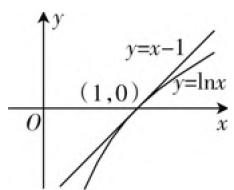

# 导数切线放缩变形及应用

——以 2020 海南卷第 22 题为例

● 陕西省旬阳第二中学 乔建元

# 一、试题再现

题目（2020年海南卷第22题）已知 $f(x) = a \cdot \mathrm{e}^{x - 1} - \ln x + \ln a$ ，若 $f(x) \geqslant 1$ ，求 $a$ 的取值范围.

分析:该题是利用导数有关知识求参数的取值范围,学生读题之后首先想到的是构造不等式,之后独立参数转化为恒成立问题,但是此题不可能独立参数,所以应该换一种角度,从学生熟悉的自然对数 $y=\ln x$ 出发,对其适当放缩以达到简化不等式的作用.下面是构造切线不等式 $\ln x\leqslant x-1$ ,之后适当对其变形,以及这些不等式的应用.

二、构造切线不等式 $\ln x\leqslant x - 1$

对数函数 $y=\ln x$ 在(1,0)处的切线为 y=x-1，由图1易知， $\ln x\leqslant x-1(x>0)$ ，构造函数求导易证上述不等式成立.

text_image

y
y=x-1
(1,0)
y=lnx
O
x

图1

# 三、切线不等式的直接应用

例1 已知函数 $f(x) = x^{2} - ax - \ln x$ ，若对任意 $x > 0, f(x) \geqslant 0$ 恒成立，求实数 $a$ 的取值范围.

解析: 易证 $\ln x \leqslant x - 1 (x > 0)$ .

当 $a \leqslant 1$ 时， $f(x) \geqslant x^2 - x - \ln x \geqslant x^2 - x - (x - 1) = (x - 1)^2 \geqslant 0$ ，满足题意；

当 $a > 1$ 时，取 $x = a, f(a) = -\ln a < 0$ ，不满足题意.

则 a 的取值范围是 $(-∞,1]$ .

分析:该题可以独立参数构造函数,然后转化函数最值的问题,但是用切线不等式 $\ln x \leqslant x - 1 (x > 0)$ 可以避免对相关函数求导,减少了计算量.

有些题还需要对切线不等式作些简单的变形.

# 四、切线不等式变式的应用

例2（2006年全国卷Ⅱ理科第20题）设函数 $f(x) = (1 + x)\cdot \ln (1 + x)$ ，若对任意 $x\geqslant 0$ ，都有 $f(x)\geqslant ax$ 成立，求 $a$ 的取值范围.

解析:原命题等价于“对任意 $x \geqslant 0, g(x) = (1 + x) \cdot \ln(1 + x) - ax \geqslant 0$ 恒成立.”

易证 $\ln x \leqslant x - 1$

将 $x$ 替换为 $\frac{1}{x}$ , 得 $\ln x \geqslant 1 - \frac{1}{x}$ ,

再将 $x$ 替换为 $x + 1$ , 得 $\ln (1 + x) \geqslant \frac{x}{x + 1}$ ,

则 $g(x)\geqslant x - ax = (1 - a)x$

当 $1 - a \geqslant 0$ ，即 $a \leqslant 1$ 时， $g(x) \geqslant x - ax = (1 - a)x \geqslant 0$ .

则 a 的取值范围为 $(-∞,1]$ .

例3（2020年海南卷第22题）已知 $f(x) = a \cdot \mathrm{e}^{x - 1} - \ln x + \ln a$ ，若 $f(x) \geqslant 1$ ，求 $a$ 的取值范围.

解析:原命题等价于对“任意 $x > 0, g(x) = a \cdot e^{x-1} - \ln x + \ln a - 1 \geqslant 0$ 恒成立.”

易证 $\ln x \leqslant x - 1$ ，其可变形为 $x \leqslant \mathrm{e}^{x - 1}$ .

当 $a \geqslant 1$ 时, $g(x) \geqslant \mathrm{e}^{x - 1} - \ln x - 1 \geqslant x - \ln x - 1 \geqslant 0$ , 满足题意;

当 $0 < a < 1$ 时，则 $g(1) = a + \ln a - 1 < a + a - 1 - 1 = 2a - 2 < 0$ ，不满足题意.

则 a 的取值范围为 $[1, +\infty)$ .

例4（2018年全国卷I文科第21题）已知函数 $f(x) = a\cdot \mathrm{e}^{x} - \ln x - 1$ ，证明：当 $a\geqslant \frac{1}{\mathrm{e}}$ 时， $f(x)\geqslant$ 0.

证明: 即证当 $a \geqslant \frac{1}{e}$ 时, $a \cdot e^{x} - \ln x - 1 \geqslant 0$ .

而 $a \cdot \mathrm{e}^{x} - \ln x - 1 \geqslant \mathrm{e}^{x - 1} - \ln x - 1$ ，则只需证 $\mathrm{e}^{x - 1} - \ln x - 1 \geqslant 0$ 即可.

易证 $\ln x \leqslant x - 1$ ，可变形为 $\mathrm{e}^{x - 1} \geqslant x, \mathrm{e}^{x - 1} - \ln x - 1 \geqslant x - \ln x - 1 \geqslant 0$ ，证毕.

分析:该题和上一题一样,为了消去 $e^{x-1}$ , 在 $\ln x \leqslant x-1$ 基础上左右两边取以 e 为底的指数, 其可变形为 $x \leqslant e^{x-1}$ .

例5 已知函数 $f(x) = a(x - 1)^2 + \ln x$ ，当 $x \geqslant 1$ 时，不等式 $f(x) \leqslant x - 1$ 恒成立，求 $a$ 的取值范围.

解析: 原命题等价于 $g(x)=a(x-1)^{2}+\ln x-(x-1)\leqslant0$ 恒成立.

由例2易知， $1 - \frac{1}{x}\leqslant \ln x\leqslant x - 1.$

当 $a \leqslant 0$ 时, $g(x) \leqslant \ln x - (x - 1) \leqslant 0$ , 满足题意;

当 $a \geqslant 1$ 时, $g(x) \geqslant (x - 1)^2 + 1 - \frac{1}{x} - (x - 1)$ $= \frac{(x - 1)^2}{x} \geqslant 0$ , 不满足题意;

当 $0 < a < 1$ 时，使得 $x > \frac{1}{a}$

则 $g(x) \geqslant a(x - 1)^2 + 1 - \frac{1}{x} - (x - 1) = \frac{(x - 1)^2(ax - 1)}{x} \geqslant 0$ ，不满足题意.

因此 a 的取值范围为 $(-∞,0]$ .

分析:该题和例2一样,在 $\ln x\leqslant x-1$ 基础上,将x替换为 $\frac{1}{x}$ 得到变式 $\ln x\geqslant1-\frac{1}{x}$ ,再将x替换为 $x+1$ ,得到变式 $\ln(1+x)\geqslant\frac{x}{x+1}$ ,目的是消去乘积 $x+1$ 来简化运算.

反思:如果一些导数压轴题函数解析式中含 $\ln x$ 和 $e^{x}$ 参数时,不要急于对函数或者构造函数求导,分析能不能对 $\ln x$ 和 $e^{x}$ 进行合理放缩,这样既可以节省做题时间,也可以从高观点的角度来感知出题人的出题意图,从而为之后的解题提供了便捷和素材.

# 五、构造两种函数，两次放缩

例6 求证: $\mathrm{e}^x > (x + 1)\ln x$ .

证明: 令 $f(x)=\mathrm{e}^{x}$ ，则 $f'(x)=\mathrm{e}^{x}$ ，

求得 $f(x)=\mathrm{e}^{x}$ 在 x=1 处的切线方程为 y=ex，

则 $\mathrm{e}^x\geqslant \mathrm{ex}$

令 $g(x)=(x+1)\ln x$ ，则 $g'(x)=\ln x+\frac{1}{x}+1$

求得 $g(x)=(x+1)\ln x$ 在 $x=\frac{1}{e}$ 处的切线方程为 $y=ex-\frac{1}{e}-2$ ,

则 $\mathrm{ex} - \frac{1}{\mathrm{e}} - 2 \geqslant (x + 1) \ln x.$

所以 $\mathrm{e}^x\geqslant \mathrm{e}x > \mathrm{e}x - \frac{1}{\mathrm{e}} -2\geqslant (x + 1)\ln x.$

例 7 求证: $e^{x}-2x\ln x-x>1$ .

证明:原不等式可变形为 $\frac{e^{x}-1}{x}>2\ln x+1.$

令 $f(x) = \frac{\mathrm{e}^x - 1}{x}$ , 则 $f'(x) = \frac{\mathrm{e}^x(x - 1) + 1}{x^2}$ ,

求得 $f(x) = \frac{\mathrm{e}^x - 1}{x}$ 在 $x = 1$ 处的切线方程为 $y = x + \mathrm{e} - 2$

则 $\frac{\mathrm{e}^x - 1}{x} \geqslant x + \mathrm{e} - 2.$

令 $g(x) = 2\ln x + 1$ ，则 $g^{\prime}(x) = \frac{2}{x}$

求得 $g(x) = 2\ln x + 1$ 在 $x = 2$ 处的切线方程为 $y = x + 2\ln 2 - 1$

则 $x + 2\ln x - 1 \geqslant 2\ln x + 1$ .

所以 $\frac{\mathrm{e}^x - 1}{x} \geqslant x + \mathrm{e} - 2 > x + 2\ln 2 - 1 \geqslant 2\ln x + 1.$

分析:如果从切线不等式和切线不等式的变式的角度出发,那么解决以上两题遇到了麻烦,所以得从切线放缩的本质出发,构造两个新函数,分别对新函数进行切线放缩,进而达到证明不等式的目的.

# 六、总结

我们在做导数求参数取值范围或解不等式证明题时,除了构造函数求导外,还可以联想到切线不等式,切线不等式的变式和在特殊点处进行切线放缩,这样可以简化解题过程,但是对学生的逻辑思维能力要求较高,所以教师在平时的教学中应该加强学生逻辑思维能力的锻炼.