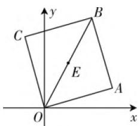
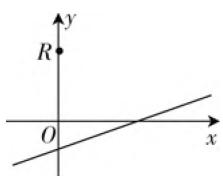

# 平几背景,解几设置,多解思维

—— 一道八省联考题的探究

● 甘肃省武威第八中学 李建瑞 叶重元

平面解析几何是在初中平面几何的基础上合理代数化的一个重要体现，两者之间联系密切，交汇融合，经常是高考命题的一个重要场景。在处理此类平面解析几何问题中，平面几何图形的特征与性质至关重要，巧妙借助相关的平面几何性质，抓住题设中平面图形特征和对应数量关系，确定点、直线、角等图形或方程，有效实现几何问题代数化，从而得到简捷而巧妙的解法。

# 一、问题呈现

问题 （2021年普通高等学校招生全国统一考试模拟演练(八省联考)数学·14)若正方形一条对角线所在直线的斜率为2,则该正方形的两条邻边所在直线的斜率分别为\_\_\_\_,\_\_\_\_.

此题以正方形这一特殊平面几何图形为背景，通过直线的斜率串联起平面几何与解析几何之间的联系，合理交汇点、直线、图形之间的位置关系、几何性质等，创新新颖，难度中等。破解的思维视角多样，可以利用三角函数思维、解析几何思维、复数思维以及平面向量思维等视角来切入，利用不同的方法来破解。

# 二、问题破解

# 思维视角(一)三角函数思维

解法 1: (三角恒等变换法) 以正方形的一个顶点为坐标原点建立如图 1 所示的平面直角坐标系, 在正方形 OABC 中, 对角线 OB 所在直线的斜率为 2，设对角线 OB 所在直线的倾斜角为 $\alpha$ ，则 $\tan\alpha=2$ ，结合正方形的性质可知，直线 OA 的倾斜角为 $\alpha-45^{\circ}$ ，直线 OC 的倾斜角为 $\alpha+45^{\circ}$ 。根据三角恒等变换公式，有 $k_{OA}=\tan(\alpha-45^{\circ})=\frac{\tan\alpha-\tan45^{\circ}}{1+\tan\alpha\tan45^{\circ}}=\frac{\tan\alpha-1}{1+\tan\alpha}=\frac{2-1}{1+2}=\frac{1}{3},k_{OC}=\tan(\alpha+45^{\circ})=\frac{\tan\alpha+\tan45^{\circ}}{1-\tan\alpha\tan45^{\circ}}=\frac{\tan\alpha+1}{1-\tan\alpha}=\frac{2+1}{1-2}=-3.$

text_image

y
C
B
E
O
x
A

图1

故填答案: $\frac{1}{3}$ ; -3.

点评:借助三角恒等变换法是破解此类问题最常见的思维方法之一,利用两角和与差的正切公式加以应用,进而求解对应直线的斜率.其实,上面的解法中只需求出一条直线的斜率即可,另一条直线的斜率的求解可借助两直线垂直时其相应的斜率互为负倒数来分析与处理.

# 思维视角(二)解析几何思维

解法2:(方程法)以正方形的一个顶点为坐标原点建立如图1所示的平面直角坐标系,在正方形OABC中,对角线OB所在直线的斜率为 $k_{OB}=2$ .设点B的坐标为 $B(2,4)$ ,则直线OB的方程为2x-y=0,OB的中点为 $E(1,2)$ .设 $A(x_{1},y_{1})$ ,则有 $k_{OB}\cdot k_{EA}=2\times\frac{y_{1}-2}{x_{1}-1}=-1$ ,整理有 $x_{1}+2y_{1}=5$ ,根据正方形的性质可知, $AE=OE=\frac{1}{2}OB=\sqrt{5}$ ,可得 $(x_{1}-1)^{2}+(y_{1}-2)^{2}=5$ ,整理有 $x_{1}^{2}+y_{1}^{2}-2(x_{1}+2y_{1})=0$ ,将 $x_{1}+2y_{1}=5$ 代入上式,可得 $x_{1}^{2}+y_{1}^{2}=10$ ,与 $x_{1}+2y_{1}=5$ 联立,解得A(3,1)或(-1,3),这里(-1,3)即为点C的坐标,结合直线的斜率公式,有 $k_{OA}=\frac{1-0}{3-0}=\frac{1}{3}$ , $k_{OC}=\frac{3-0}{-1-0}=-3$ .

故填答案: $\frac{1}{3}$ ; -3.

点评:借助方程法是破解此类问题中回归解析几何本质的思维方法之一,根据解析几何特征,设出相应的点的坐标,根据条件建立对应的方程(组),通过方程组的求解来确定对应的点的坐标,为进一步的分析与求解指明方向.只是方程法求解对等式的恒等变形和代数运算能力有较高的要求.

# 思维视角(三)平面向量思维

解法 3: (法向量法) 以正方形的一个顶点为坐标原点建立如图 1 所示的平面直角坐标系, 在正方形

OABC 中, 对角线 OB 所在直线的斜率为 $k_{OB}=2$ , 则直线 OB 的方程为 2x-y=0, 设该正方形的两条邻边所在直线的方程为 $ax+by=0$ , 则两直线的法向量分别为 $\boldsymbol{n}_{1}=(a,b),\boldsymbol{n}_{2}=(2,-1)$ , 设两直线的夹角为 $\theta$ , 则 $\cos\theta=\frac{\boldsymbol{n}_{1}\cdot\boldsymbol{n}_{2}}{|\boldsymbol{n}_{1}||\boldsymbol{n}_{2}|}=\frac{|2a-b|}{\sqrt{5}\cdot\sqrt{a^{2}+b^{2}}}=\frac{\sqrt{2}}{2}$ , 整理有 $3a^{2}-8ab-3b^{2}=0$ , 即 $(a-3b)(3a+b)=0$ , 亦即 a=3b 或 $3a+b=0$ , 所以该正方形的两条邻边所在直线的斜率分别为 $-3,\frac{1}{3}$ .

故填答案: $\frac{1}{3}$ ; -3.

点评:借助平面向量的法向量法是破解此类问题的另一种特殊的思维方法,根据正方形中边与角的特殊性质,设出该正方形的两条邻边所在直线的方程,结合已知直线OB的方程,分别确定对应的法向量,利用两直线的夹角建立向量关系式,进而确定对应参数之间的关系式,结合斜率公式确定对应的斜率即可.平面向量的法向量法是实现数学知识之间的交汇与转化的另一种重要方法技巧,也是知识应用的另一大体现.

# 三、变式拓展

探究 1: 保留正方形的几何特征, 在平面直角坐标系背景中, 给出正方形的一条边所在的直线方程, 以及正方形的中心坐标, 进而加以变形与拓展.

变式1:(2020年秋季上海市重点高中期中考试题)如图2,已知正方形的一条边AB所在直线为x-3y-1=0,正方形的中心为 $R(0,1)$ .

text_image

R
y
O
x

图2

(1) 求该正方形的面积；

(2) 求该正方形的两条对角线所在直线的一般式方程.

解析:(1)由题意可得,中心 $R(0,1)$ 到直线AB:x-3y-1=0的距离 $d=\frac{|0-3-1|}{\sqrt{1+9}}=\frac{2\sqrt{10}}{5}$ ,所以正方形的面积 $S=(2d)^{2}=\frac{32}{5}$ .

(2) 设对角线所在直线的方程为 $a(x - 0) + b(y - 1) = 0$ ，而边 $AB$ 所在的直线方程为 $x - 3y - 1 = 0$ ，则两直线的法向量分别为 $\pmb{n}_1 = (a, b), \pmb{n}_2 = (1, -3)$ ，设两直线的夹角为 $\theta$ ，则 $\cos \theta = \frac{\pmb{n}_1 \cdot \pmb{n}_2}{|\pmb{n}_1||\pmb{n}_2|} =$

$\frac{|a-3b|}{\sqrt{10}\cdot\sqrt{a^{2}+b^{2}}}=\frac{\sqrt{2}}{2}$ ，整理有 $2a^{2}+3ab-2b^{2}=0$ ，
即 $(2a-b)(a+2b)=0$ ，亦即b=2a或 $a+2b=0$ ，
所以两条对角线分别为 $x+2y-2=0$ 或 $2x-y+1=0$ .

探究 2: 保留正方形的几何特征, 在平面直角坐标系背景中, 给出正方形中的两个顶点, 在不同条件下探求对应的直线方程, 进而加以变形与拓展.

变式2:在平面直角坐标系 $xOy$ 中,已知点 $M(0,-1)$ 和 $N(2,5)$ .

(1) 若 M, N 是正方形一条边上的两个顶点, 求这个正方形过顶点 M 的两条边所在直线的方程;

(2) 若 $M, N$ 是正方形一条对角线上的两个顶点，求这个正方形另外一条对角线所在直线的方程及其端点的坐标.

解析:(1)由于 $M(0,-1)$ 和 $N(2,5)$ ，则 $k_{MN}=\frac{5+1}{2-0}=3$ ，则直线 MN 的方程为 $y+1=3x$ ，则与直线 MN 垂直的直线的斜率为 $-\frac{1}{k_{MN}}=-\frac{1}{3}$ ，对应的直线方程为 $y+1=-\frac{1}{3}x$ ，整理可得所求两条直线的方程分别为 $3x-y-1=0$ 和 $x+3y+3=0$ 。

(2) 由(1)知, 直线 $MN$ 的方程为 $3x - y - 1 = 0$ , 另外一条对角线的斜率为 $k' = -\frac{1}{3}$ . 设 $MN$ 中点为 $G(1,2)$ , 则另一条对角线过 $G$ 点, 即 $y - 2 = -\frac{1}{3}(x - 1)$ , 整理得 $x + 3y - 7 = 0$ . 设另外两个端点坐标分别为 $A(x_1, y_1), B(x_2, y_2)$ , 则知点 $A$ 在直线 $x + 3y - 7 = 0$ 上, 则有 $x_1 + 3y_1 - 7 = 0$ , ① 且 $|GM|^2 = |GA|^2$ ,

即 $(0 - 1)^{2} + (-1 - 2)^{2} = (x_{1} - 1)^{2} + (y_{1} - 2)^{2}$ . ②

联立 ① 和 ②, 解得 $\left\{ \begin{array}{l} x_{1} = -2, \\ y_{1} = 3 \end{array} \right.$ 或 $\left\{ \begin{array}{l} x_{1} = 4, \\ y_{1} = 1, \end{array} \right.$ 即另外两个端点为 $(-2,3)$ 与 $(4,1)$ .

# 四、解后反思

在解决一些涉及平面几何的解析几何问题时,要充分挖掘平面几何图形的几何性质,借助平面几何图形的平几性质,实现解几问题的直观化,多一些几何直观,少一些代数运算,合理融合,实现“形”与“数”有机结合,从而可以迅速获得解题途径,减少解析几何问题的运算量,有效拓展解题思路,简化思维步骤,优化解题过程,提升数学能力,培养核心素养. W