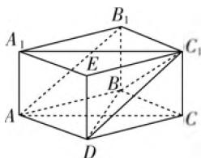

# 扭转乾坤,化归与转化

# - 江苏省海门中学 樊陈卫

著名的数学家, 莫斯科大学教授 C. A. 雅洁卡娅在一次《什么叫解题》的演讲时指出: “解题就是把要解的题转化为已经解过的题.” 确定数学的解题过程, 就是一个从未知到已知、从复杂到简单的化归与转化的过程. 而化归与转化思想正是实现把未知解的问题转化到在已有知识范围内可解的问题的一种非常基本的重要思想方法, 是高考中解决数学问题的一类常见的思维方式, 其实质就是把不熟悉的问题转化成熟悉问题的数学思想, 即把数学中待解决或未解决的问题, 通过化归与转化, 呈现“柳暗花明”的新格局, 陌生问题熟悉化, 从而使得问题得以圆满解决.

# 一、在不等式中的应用

不等式中的化归与转化思想主要体现在不等式的求解、证明或应用中，将所求不等式整体变形，将高次转化为低次，即主元变换，这样容易找到解决问题的突破口，避开复杂运算，从而把问题简化.

例 1 （2017 年北京卷文科第 11 题）已知 $x \geqslant 0$ ， $y \geqslant 0$ ，且 $x + y = 1$ ，则 $x^{2} + y^{2}$ 的取值范围是 \_\_\_\_.

分析:根据条件 $x+y=1$ ,把问题转化为含有一个字母的二次函数问题,利用限定条件的二次函数的图象与性质来确定相应的取值范围问题.

解析:由已知可得 y=1-x，则有 $x^{2}+y^{2}=x^{2}+(1-x)^{2}=2x^{2}-2x+1=2\left(x-\frac{1}{2}\right)^{2}+\frac{1}{2},x\in[0,1]$ ，则当 x=0 或 1 时， $x^{2}+y^{2}$ 取得最大值 1；当 $x=\frac{1}{2}$ 时， $x^{2}+y^{2}$ 取得最小值 $\frac{1}{2}$ ，综上分析， $x^{2}+y^{2}$ 的取值范围是 $\left[\frac{1}{2},1\right]$ .

故填答案: $\left[\frac{1}{2},1\right]$ .

点评:通过化归与转化,把含有多元的数学问题转化为一元的数学问题,利用函数的图象与性质来解决相应的数学问题.此类函数、不等式问题的化归与转化思维是解决问题中比较常见的思维方式,往往可以化陌生为熟悉、复杂为简单、抽象为具体,使运算或推理可以顺利地进行.

# 二、在三角函数中的应用

化归与转化思想在三角函数中经常出现,主要表现在三角函数的相关公式的转化,如切割化弦、统一角、统一函数名称、换元等手段处理求值(域)、最值、比较大小等问题的转化与应用.

例2（2017年全国卷Ⅱ理科第14题）函数 $f(x) = \sin^2 x + \sqrt{3}\cos x - \frac{3}{4}\left(x\in \left[0,\frac{\pi}{2}\right]\right)$ 的最大值是

分析:先结合同角三角函数基本关系式加以转化为同名三角函数关系式,通过配方,利用限制条件并结合二次函数的图象与性质来确定最值问题.

解析:由于 $f(x)=\sin^{2}x+\sqrt{3}\cos x-\frac{3}{4}=-\cos^{2}x+\sqrt{3}\cos x+\frac{1}{4}=-\left(\cos x-\frac{\sqrt{3}}{2}\right)^{2}+1$ ，而 $x\in\left[0,\frac{\pi}{2}\right]$ ，则 $\cos x\in[0,1]$ ，故当 $\cos x=\frac{\sqrt{3}}{2}$ ，即 $x=\frac{\pi}{6}$ 时， $f(x)_{\max}=f\left(\frac{\pi}{6}\right)=1$ .

故填答案:1.

点评:熟练运用相关的三角函数公式实施转化是解决这类问题的关键,常将条件与结论结合在一起寻求思路.特别在三角函数的求值问题中,经常通过切割化弦、异角化同角、异名化同名、角的变换等方式的化归与转化,构建已知与求解之间的关系,寻找对应的突破口,实现三角函数求值.

# 三、在解三角形中的应用

三角形中的边与角的转化过程就较好地体现了化归与转化思想. 在解三角形问题时, 经常根据题目条件, 把相应的边(或角)转化为与之对应的角(或边)的关系式问题, 进而结合相关的条件加以分析与求解.

例 3 （2017 年全国卷Ⅱ文科第 16 题）△ABC 的内角 A, B, C 的对边分别为 a, b, c，若 $2b \cos B = a \cos C + c \cos A$ ，则 B = \_\_\_\_.

分析:根据题目条件结合余弦定理加以转化,通过整理对应的关系式并再次利用余弦定理加以对比,得到 $\cos B$ 的值,进而求解角 B 的大小.

解析:由 $2b\cos B=a\cos C+c\cos A$ 并结合余弦定理可得 $2b\times\frac{a^{2}+c^{2}-b^{2}}{2ac}=a\times\frac{a^{2}+b^{2}-c^{2}}{2ab}+c\times\frac{b^{2}+c^{2}-a^{2}}{2bc}$ ，整理有 $a^{2}+c^{2}-b^{2}=ac$ ，而由余弦定理可得 $a^{2}+c^{2}-b^{2}=2ac\cos B$ ，可得 $2ac\cos B=ac$ ，即 $\cos B=\frac{1}{2}$ 。又 $0<B<\pi$ ，可得 $B=\frac{\pi}{3}$ 。

故填答案: $\frac{\pi}{3}$ .

点评:解决本题的关键是以余弦定理为切入点,通过建立相应的方程来达到转化与求解的目的.在解决三角形问题中,借助条件中的关系式结构来合理选择正弦定理或余弦定理,若出现角度的正弦值(或余弦值)就对应选择正弦定理(或余弦定理),加以合理化归与转化.

# 四、在立体几何中的应用

立体几何中的化归与转化思想主要是空间问题向平面问题的转化, 空间线面的转化, 涉及位置关系的转化、降维转化、割补转化、等积转化以及抽象向具体转化等.

例 4 （2017 年全国卷Ⅱ 理科第 10 题）已知直三棱柱 $ABC-A_{1}B_{1}C_{1}$ 中， $\angle ABC=120^{\circ}, AB=2, BC=CC_{1}=1$ ，则异面直线 $AB_{1}$ 与 $BC_{1}$ 所成角的余弦值为（）.

A. $\frac{\sqrt{3}}{2}$

B. $\frac{\sqrt{15}}{5}$

C. $\frac{\sqrt{10}}{5}$

D. $\frac{\sqrt{3}}{3}$

分析:根据异面直线 $AB_{1}$ 与 $BC_{1}$ 所成角的转化,可以通过补形法,也可以利用异面直线的定义加以转化,把对应的异面直线转化为一个三角形内的角,利用解三角形来处理即可.

解析:根据题目条件,把两个相同的直三棱锥的侧面重合,从而组合成一个全新的四棱柱,如图2所示,则知 $AB_{1} \parallel DC_{1}$ ,根据定义可知,异面直线 $AB_{1}$ 与 $BC_{1}$ 所成的角就是 $DC_{1}$ 与 $BC_{1}$ 所成的角，即为 $\angle BC_{1}D$ 。由题可得 $|AB_{1}| = \sqrt{2^{2} + 1^{2}} = \sqrt{5}, |BC_{1}| = \sqrt{1^{2} + 1^{2}} = \sqrt{2}, |BD| = \sqrt{1^{2} + 2^{2} - 2 \times 1 \times 2 \times \cos 60^{\circ}} = \sqrt{3}$ ，利用余弦定理可得 $\cos \angle BC_{1}D = \frac{5 + 2 - 3}{2 \times \sqrt{5} \times \sqrt{2}} = \frac{\sqrt{10}}{5}$ .

text_image

A₁
B₁
E
C₁
B′
A
D
C

图2

故选 B.

点评:求解此类异面直线所成的角问题时,往往通过补形处理,借助特殊的空间几何体(正方体、长方形、平行六面体等)的图形与性质来合理数形直观,巧妙转化,有效实现构造异面直线所成的角的目的.完整地进行补形是破解此类问题成功的关键所在.

# 五、在圆锥曲线中的应用

圆锥曲线中的化归与转化思想主要用于解决圆锥曲线的相关定义、直线与椭圆的位置关系等问题，此时，若进行合理化归与转化，有时可使计算简化，过程简单，收到非常良好的效果.

例 5 （2017年全国卷Ⅰ文科第12题）设A,B是椭圆 $C:\frac{x^{2}}{3}+\frac{y^{2}}{m}=1$ 长轴的两个端点，若C上存在点M满足 $\angle AMB=120^{\circ}$ ，则m的取值范围是（）.

A. $(0,1] \cup [9, +\infty)$

B. $(0, \sqrt{3}] \cup [9, +\infty)$

C. $(0,1] \cup [4, +\infty)$

D. $(0, \sqrt{3}] \cup [4, +\infty)$

分析:根据题目条件,根据 C 上存在点 M 满足 $\angle AMB=120^{\circ}$ 加以转化为对应参数 a,b 的比值关系,并借助图形直观建立相应的不等式来求解对应的参数取值范围.

解析: 当 0 < m < 3 时, 焦点在 x 轴上, 要使 C 上存在点 M 满足 $\angle AMB = 120^{\circ}$ , 则 $\frac{a}{b} \geqslant \tan 60^{\circ} = \sqrt{3}$ , 即 $\frac{\sqrt{3}}{\sqrt{m}} \geqslant \sqrt{3}$ , 得 $0 < m \leqslant 1$ ; 当 m > 3 时, 焦点在 y 轴上, 要使 C 上存在点 M 满足 $\angle AMB = 120^{\circ}$ , 则 $\frac{a}{b} \geqslant \tan 60^{\circ} = \sqrt{3}$ , 即 $\frac{\sqrt{m}}{\sqrt{3}} \geqslant \sqrt{3}$ , 得 $m \geqslant 9$ .

综合可得 m 的取值范围为 $(0,1] \cup [9,+\infty)$ .

故选A.

点评:通过圆锥曲线中相关条件的化归与转化,把有关角度问题转化为圆锥曲线中的参数的比值问题,独辟蹊径,优化解题过程,有效避开抽象、复杂的运算,降低解题难度,起到事半功倍的效果.

化归与转化思想作为数学中的基本思想方法之一,可以实现从一种情形转化到另一种情形,特别是从陌生到熟悉、从复杂到简单、从抽象到具体等相关方面的化归与转化,实现有效思维,在解决问题过程中选择恰当的方法进行变换、转化并归结到某个或某些已经解决或比较容易解决的问题上,最终解决原问题.解题的过程实际上就是化归与转化思想应用的过程.W