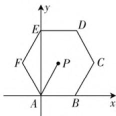
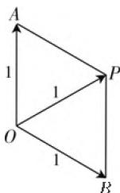

# 数学视角切入 核心素养引领

# ● 江苏省宜兴市第二高级中学 蒋丽

新高考数学坚决落实“立德树人”的根本任务，全面贯彻高考评价体系的要求，推动人才培养的改革创新，逐渐增强数学考试的基础性、方向性、综合性、应用性、时代性、科学性、探究性和开放性等，正确把握高考数学命题与高中数学课程标准、数学核心素养等之间的关系，借助数学的眼光、数学的思维、数学的语言等视角切入，核心素养引领，充分发挥高考数学对中学数学教育教学的正确导向作用。

# 一、用数学的眼光观察世界——数学抽象、直观想象

# 1. 数学抽象

借助数学抽象,获得数学概念和规则,提出数学命题和模型,形成数学方法与思想,认识数学结构与体系.

例 1 （2020 年高考数学全国卷Ⅲ 理科第 11 题）设双曲线 $C: \frac{x^{2}}{a^{2}} - \frac{y^{2}}{b^{2}} = 1 (a > 0, b > 0)$ 的左、右焦点分别为 $F_{1}, F_{2}$ ，离心率为 $\sqrt{5}$ . P 是 C 上一点，且 $F_{1}P \perp F_{2}P$ . 若 $\triangle PF_{1}F_{2}$ 的面积为 4，则 $a = (\quad)$ .

A.1

B. 2

C. 4

D. 8

解析:利用双曲线的焦点三角形面积公式,可得 $S_{\triangle PF_{1}F_{2}}=\frac{b^{2}}{\tan\frac{\theta}{2}}=\frac{b^{2}}{\tan45^{\circ}}=b^{2}=4$ ,由于双曲线C的离心率为 $\sqrt{5}$ ,可得 $e=\frac{c}{a}=\sqrt{1+\frac{b^{2}}{a^{2}}}=\sqrt{1+\frac{4}{a^{2}}}=\sqrt{5}$ ,解得a=1.

故选A.

点评:借助数学抽象,根据双曲线的焦点三角形面积公式 $S_{\triangle PF_{1}F_{2}}=\frac{b^{2}}{\tan\frac{\theta}{2}}$ (其中 $\angle F_{1}PF_{2}=\theta$ ) 来直接

应用,形成有心圆锥曲线的焦点三角形相关的数学方法和思想,大大降低代数运算的成本,起到事半功倍之效.

# 2. 直观想象

借助直观想象,建立形与数的联系,利用几何图形描述问题,借助几何直观理解问题,运用空间想象认识事物,构建数学问题的直观模型解决问题.

例 2 （2020 年高考数学新高考卷 I（山东卷）第 7 题）已知 P 是边长为 2 的正六边形 ABCDEF 内的一点，则 $\overrightarrow{AP} \cdot \overrightarrow{AB}$ 的取值范围是（）.

A. $(-2,6)$

B. $(-6,2)$

C. $(-2,4)$

D. $(-4,6)$

解析:如图1所示,取A为坐标原点,AB所在直线为x轴建立平面直角坐标系,则 $A(0,0),B(2,0),C(3,\sqrt{3}),F(-1,\sqrt{3})$ ,设 $P(x,y)$ ,则 $\overrightarrow{AP}=(x,$ $y), \overrightarrow{AB} = (2,0)$ , 且 $-1 < x < 3$ , 所以 $\overrightarrow{AP} \cdot \overrightarrow{AB} = (x, y) \cdot (2,0) = 2x \in (-2,6)$ .

text_image

y
E
D
F
P
C
A
B
x

图1

故选A.

点评:合理借助建系法,直观想象,建立数与形之间的联系,可以把复杂的平面向量的数量积问题“数”化,借助对应点的坐标的确定,通过对应向量的坐标表示,利用平面向量的数量积公式的转化,借助参数的取值范围来有效确定数量积的取值范围问题.

# 二、用数学的思维分析世界——逻辑推理、数学运算

# 3. 逻辑推理

借助逻辑推理,发现和提出命题,掌握推理的基本形式和规则,探索和表述论证的过程,构建命题体系,表达与交流等.

例3（2020年高考数学全国卷Ⅱ文科第12题）若 $2^{x} - 2^{y} < 3^{-x} - 3^{-y}$ ，则（ ）.

A. $\ln (y - x + 1) > 0$

B. $\ln (y - x + 1) <   0$

C. $\ln |x - y| > 0$

D. $\ln |x - y| < 0$

解析:由 $2^{x}-2^{y}<3^{-x}-3^{-y}$ ，可得 $2^{x}-3^{-x}<2^{y}-3^{-y}$ ，构造函数 $f(t)=2^{t}-3^{-t}$ 。由于函数 $y=2^{x}$ 为 R上的增函数，函数 $y = 3^{-x}$ 为 $\mathbf{R}$ 上的减函数，则函数 $f(t) = 2^t - 3^{-t}$ 为 $\mathbf{R}$ 上的增函数，则有 $x < y$ ，那么 $y - x > 0$ ，即 $y - x + 1 > 1$ ，可知 $\ln (y - x + 1) > 0$ 则选项A正确，选项B错误。又 $|x - y|$ 与1的大小无法确定，故选项C、D无法确定。

故选A.

点评:借助逻辑推理的应用,通过函数的构造,利用指数函数、复合函数的单调性来综合,结合指数式的大小关系来确定参数值的大小关系,并结合对数运算来判断对数值的正负取值情况,很好考查推理论证能力与数学运算能力等.

# 4. 数学运算

借助数学运算,理解运算对象,掌握运算法则,探究运算思想,设计运算程序等.

例 4 （2020 年高考数学浙江卷第 13 题）已知 $\tan\theta=2$ , 则 $\cos2\theta=$ \_\_\_\_; $\tan\left(\theta-\frac{\pi}{4}\right)=$ \_\_\_\_.

解析:由于 $\tan\theta=2$ ,

结合二倍角公式可得 $\cos 2\theta = \cos^2\theta -\sin^2\theta =$ $\frac{\cos^2\theta - \sin^2\theta}{\cos^2\theta + \sin^2\theta} = \frac{1 - \tan^2\theta}{1 + \tan^2\theta} = \frac{1 - 2^2}{1 + 2^2} = -\frac{3}{5}.$

结合两角差的正切公式可得 $\tan \left(\theta -\frac{\pi}{4}\right) =$ $\frac{\tan\theta - 1}{1 + \tan\theta} = \frac{2 - 1}{1 + 2} = \frac{1}{3}.$

故填答案： $-\frac{3}{5};\frac{1}{3}.$

点评:三角恒等变换公式是数学运算中灵活多变的一个知识点,公式众多,运算技巧性强.以上问题中综合了二倍角公式、两角差的正切公式等,借助三角公式的应用来合理数学运算,正确转化,巧妙求解.

# 三、用数学的语言表达世界——数学建模、数据分析

# 5. 数学建模

借助数学建模,发现和提出问题,建立和求解模型,检验和完善模型等.

例 5 （2020 年高考数学全国卷 I 理科第 14 题）设 a, b 为单位向量，且 $\left|a + b\right| = 1$ ，则 $\left|a - b\right| =$ \_\_\_\_.

解析:由于 a, b 为单位向量,且 $\left|a + b\right| = 1$ , 如图 2, 在平面内, 设向量 a, b, $a + b$ 所对应的点分别为 A, B, P (起点均为坐标原点 O), 根据平面向量以及线性运算的几何意义可知, $\left|a + b\right|$ 和 $\left|a - b\right|$ 是以平面向量 $\overrightarrow{OA}$ 和 $\overrightarrow{OB}$ 为两邻边的平行四边形的两条对角线的长，由于 $|a| = |b| = |a + b| = 1$ ，则知平行四边形OAPB是边长为1，一条对角线为1的菱形，所以该菱形的另一条对角线长为 $|a - b| = \sqrt{3}$

故填答案: $\sqrt{3}$ .

点评: 几何意义法是破解平面向

  
图2

量、复数等问题中的常见思维方式之一，也是数学建模的重要体现。通过几何意义法的应用，结合平面几何图形的几何特征，合理数学建模，可以用来解决平面向量或复数中的相关问题，抓住平面向量或复数中的相关知识的几何意义，从几何意义的角度出发，回归本质，数形结合，直观想象，可以直观形象地处理相关问题。

# 6. 数据分析

借助数据分析,收集数据提取信息,利用图表展示数据,构建模型分析数据,解释数据获取知识等.

例 6 （2020年高考数学全国Ⅱ卷理科第3题，文科第4题）在新冠肺炎疫情防控期间，某超市开通网上销售业务，每天能完成1200份订单的配货，由于订单量大幅增加，导致订单积压。为解决困难，许多志愿者踊跃报名参加配货工作。已知该超市某日积压500份订单未配货，预计第二天的新订单超过1600份的概率为0.05，志愿者每人每天能完成50份订单的配货，为使第二天完成积压订单及当日订单的配货的概率不小于0.95，则至少需要志愿者（）。

A. 10 名

B. 18 名

C. 24 名

D. 32 名

解析:由题意知,超市第二天能完成1200份订单的配货,若没有志愿者帮忙,则超市第二天共会积压超过 $500+(1600-1200)=900$ 份订单的概率为0.05,因此要使第二天完成积压订单及当日订单的配货的概率不小于0.95,至少需要志愿者 $\frac{900}{50}=18$ (名).

故选 B.

点评:结合阅读与理解,合理进行数据分析,归纳与总结出题目的内涵,合理构建数学模型,结合相应的数学知识来分析与处理相应的问题,实现获取新知识、探究新问题的能力与目的.

新高考数学通过贯彻指导思想,把握改革精神,创新试题设计,优化试卷结构,通过数学的眼光、数学的思维、数学的语言等视角切入,有效落实数学核心素养的培养,推进高考综合创新改革,引导中学数学教学与学习等. F