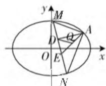
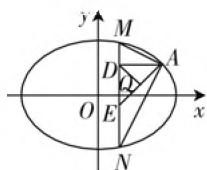

# 爱恨交加,定值永存

—— 高考中的解几问题

# 山东省邹平市第一中学 刘朋

解析几何的定值问题是历年高考数学命题中的常见题型与热门题型，更是高考中解析几何问题考查的一个重点难点，是备受各方关注的焦点之一。解析几何的定值问题体现了“动”与“静”、“变”与“定”、变量与定值等之间的和谐统一，有效体现解析几何中相关知识的综合与交汇。此类问题综合性与趣味性强，背景创新新颖，内容丰富多变，经常把函数、不等式、平面向量等其他知识与解析几何融为一体，充分考查考生的综合能力与应变能力。

# 一、线段长度定值问题

例 1 （2020 年高考数学新高考卷 I（山东卷）第 22 题）已知椭圆 $C: \frac{x^{2}}{a^{2}} + \frac{y^{2}}{b^{2}} = 1 (a > b > 0)$ 的离心率为 $\frac{\sqrt{2}}{2}$ ，且过点 A(2,1).

(1) 求 $C$ 的方程；  
(2) 点 $M, N$ 在 $C$ 上, 且 $AM \perp AN, AD \perp MN$ , $D$ 为垂足, 证明: 存在定点 $Q$ , 使得 $|DQ|$ 为定值.

分析:(1)根据条件建立关系式来确定相应的参数值,进而求解椭圆的方程;(2)根据直线MN的斜率是否存在加以分类讨论,利用直线与椭圆的方程的联立,通过函数与方程思维的化归与转化,结合韦达定理的转化与应用,借助直线垂直所对应的向量的数量积为0来建立关系式,进而确定参数之间的关系,得以判断直线MN过定点,利用直角三角形的性质,斜边中点到直角顶点的距离为斜边长度的一半来确定定值,进而利用中点坐标公式来确定定点即可.

解析:(1)由题意可得 $\left\{\begin{aligned}\frac{c}{a}&=\frac{\sqrt{2}}{2},\\\frac{4}{a^{2}}+\frac{1}{b^{2}}&=1,\\a^{2}&=b^{2}+c^{2},\end{aligned}\right.$ 解得 $a^{2}=6,$ $b^{2}=c^{2}=3$ , 故椭圆 C 的方程为 $\frac{x^{2}}{6}+\frac{y^{2}}{3}=1$ .

(2) 设点 $M(x_{1}, y_{1}), N(x_{2}, y_{2})$ .

因为 $AM \perp AN$ ，则有 $\overrightarrow{AM} \cdot \overrightarrow{AN} = 0$ ，即 $(x_{1}-2)(x_{2}-2) + (y_{1}-1)(y_{2}-1) = 0.$ ①

（i）当直线MN的斜率存在时，设方程为 $y = kx + m$ ，如图1，代入椭圆 $C$ 的方程 $\frac{x^2}{6} +\frac{y^2}{3} = 1$ ，消去 $y$ 并整理可得 $(1 + 2k^{2})x^{2} + 4kmx + 2m^{2} - 6 = 0$ ，则有 $x_{1}$ $+x_{2} = -\frac{4km}{1 + 2k^{2}},x_{1}x_{2} = \frac{2m^{2} - 6}{1 + 2k^{2}}.$ ②

结合 $y_{1} = kx_{1} + m, y_{2} = kx_{2} + m$ ，代入①并整理可得 $(1 + k^{2})x_{1}x_{2} + (km - k - 2)(x_{1} + x_{2}) + m^{2} - 2m + 5 = 0$ ，将②代入，可得 $(1 + k^{2})\cdot \frac{2m^{2} - 6}{1 + 2k^{2}} + (km - k - 2)\left(-\frac{4km}{1 + 2k^{2}}\right) + m^{2} - 2m + 5 = 0$ ，整理化简有 $(2k + 3m + 1)(2k + m - 1) = 0$ ，而点 $A(2,1)$ 不在直线MN上，则 $2k + m - 1 \neq 0$ ，可得 $2k + 3m + 1 = 0$ ，于是直线MN的方程为 $y = k\left(x - \frac{2}{3}\right) - \frac{1}{3}$ ，此时 $k \neq 1$ ，所以直线MN过定点 $E\left(\frac{2}{3}, - \frac{1}{3}\right)$ .

  
图1

  
图2

（ii）当直线 $MN$ 的斜率不存在时，可得 $N(x_{1}, - y_{1})$ ，如图2，代入①可得 $(x_{1} - 2)^{2} + 1 - y_{1}^{2} = 0$ ，结合 $\frac{x_1^2}{6} +\frac{y_1^2}{3} = 1$ ，解得 $x_{1} = 2$ （舍去）或 $x_{1} = \frac{2}{3}$ ，此时直线 $MN$ 也过定点 $E\left(\frac{2}{3}, - \frac{1}{3}\right)$

由于 $|AE|$ 为定值，且 $\triangle ADE$ 为直角三角形，AE为斜边，所以线段AE的中点Q满足 $|DQ|$ 为定值：线段 $AE$ 长度的一半 $\frac{1}{2} \cdot \sqrt{\left(2 - \frac{2}{3}\right)^2 + \left(1 + \frac{1}{3}\right)^2} = \frac{2\sqrt{2}}{3}$ , 由于 $A(2,1), E\left(\frac{2}{3}, -\frac{1}{3}\right)$ , 故由中点坐标公式可得 $Q\left(\frac{4}{3}, \frac{1}{3}\right)$ , 故存在定点 $Q\left(\frac{4}{3}, \frac{1}{3}\right)$ , 使得 $|DQ|$ 为定值.

点评: 解决此类解析几何中的线段长度定值问题, 一般运算量大, 要注意函数与方程、数形结合、分类讨论等思想方法的灵活运用. 在处理涉及解析几何中的线段长度为定值的问题时, 可以直接计算推理求出定值, 也可以先通过特定位置猜测结论后再进行一般性证明.

# 二、面积定值问题

例2 已知 $F$ 是双曲线 $C: \frac{x^2}{a^2} - \frac{y^2}{b^2} = 1 (a > 0, b > 0)$ 的一个焦点，点 $P$ 在 $C$ 上， $O$ 为坐标原点。若 $|OP| = |OF|$ ，试问： $\triangle OPF$ 的面积是否为定值？如果是，请给予证明；如果不是，请说明理由。

分析:根据双曲线的对称性,取点 P 的其中一个象限的情况加以分析,结合双曲线的定义以及直角三角形的性质建立相应的关系式,再利用三角形的面积公式得以确定定值问题.

解析:依题意,设 F 为左焦点, $F_{2}$ 为右焦点,由 $|OP|=|OF|$ , 结合对称性, 可知点 P 有四个位置, 但 $\triangle OPF$ 的面积是一样的, 不失一般性, 取点 P 在第一象限, 由于 $|OP|=|OF|=|OF_{2}|=c$ , 可得 $PF \perp PF_{2}$ . 设 $|PF|=m, |PF_{2}|=n$ , 根据双曲线的定义可得 m-n=2a, 又由于 $m^{2}+n^{2}=(2c)^{2}=4c^{2}$ , 可得 $(m-n)^{2}+2mn=4c^{2}$ , 整理可得 $mn=2(c^{2}-a^{2})=2b^{2}$ , 所以 $\triangle OPF$ 的面积 $S=\frac{1}{2}S_{\triangle PFF_{2}}=\frac{1}{2}\times\frac{1}{2}|PF|\cdot|PF_{2}|=\frac{1}{4}mn=\frac{1}{4}\times2b^{2}=\frac{1}{2}b^{2}$ , 为定值.

点评:其实,以上的定值问题就是一道2019年高考真题的结论.

(2019年高考数学全国卷Ⅲ文科第10题)已知F是双曲线 $C:\frac{x^{2}}{4}-\frac{y^{2}}{5}=1$ 的一个焦点,点P在C上,O为坐标原点.若 $|OP|=|OF|$ ,则 $\triangle OPF$ 的面积为().

A. $\frac{3}{2}$

B. $\frac{5}{2}$

C. $\frac{7}{2}$

D. $\frac{9}{2}$

结合例题中的定值结论可以很快得出答案：

$\triangle OPF$ 的面积 $S = \frac{1}{2} b^2 = \frac{5}{2}$ .

故选B.

# 三、运算关系式定值问题

例 3 （2019 年高考数学全国卷 I 文科第 21 题）已知点 A, B 关于坐标原点 O 对称， $|AB|=4,\odot M$ 过点 A, B 且与直线 $x+2=0$ 相切.

(1) 若 $A$ 在直线 $x + y = 0$ 上, 求 $\odot M$ 的半径;

(2) 是否存在定点 $P$ , 使得当 $A$ 运动时, $|MA| - |MP|$ 为定值? 并说明理由.

分析:设出点M的坐标,结合题目条件以及圆的性质,借助勾股定理的转化与应用确定点M的轨迹方程,(1)利用点在已知直线上确定点M满足的条件,联立方程来求解,进而得以确定圆的半径;(2)利用抛物线的方程并结合其定义与几何性质,通过合理的转化与化归来确定满足条件的定点及对应的定值即可.

解析: 设 $M(x, y)$ ，结合 $\odot M$ 与直线 $x + 2 = 0$ 相切，可知 $\odot M$ 的半径为 $r = |x + 2|$ 。由 $|AB| = 4$ 可得 $|AO| = 2$ ，根据圆的性质可得 $\overrightarrow{MO} \perp \overrightarrow{AO}$ ，结合勾股定理有 $|\overrightarrow{MO}|^{2} + |\overrightarrow{AO}|^{2} = x^{2} + y^{2} + 4 = r^{2} = (x + 2)^{2}$ ，化简可得点 M 的轨迹方程为 $y^{2} = 4x$ 。

(1) 由于 A 在直线 x + y = 0 上，且 A, B 关于坐标原点 O 对称，则知点 M 在直线 y = x 上，那么将 y = x 代入 $y^{2} = 4x$ ，可得 $x^{2} = 4x$ ，解得 x = 0 或 x = 4。

所以 $\odot M$ 的半径 r=2 或 r=6.

(2) 存在定点 $P(1,0)$ , 使得 $|MA| - |MP|$ 为定值. 理由如下:

由于 $y^{2} = 4x$ 是以点 $P(1,0)$ 为焦点，以直线 $x = -1$ 为准线的抛物线，则有 $|MP| = x + 1$ ，而结合抛物线的定义有 $|MA| - |MP| = r - |MP| = x + 2 - (x + 1) = 1$ ，所以存在满足条件的定点 $P(1,0)$ .

点评: 涉及解析几何中的关系式定值问题, 经常以和、差、积、商等运算加以合理组合, 涉及线段的长度、平面图形的面积等元素, 破解时可以采取数形结合思想, 抓住曲线的定义、几何意义等加以合理转化, 利用函数、方程、不等式等工具, 从而得以正确破解.

总之,研究与探索解析几何的定值问题,进而得以发现解析几何中相互元素(包括点、直线、圆、圆锥曲线等)之间的联系,挖掘内在规律,提升思维深度,提高解题效率,加强对相关知识的正确理解与深入掌握,对提升数学解题能力与应用能力,以及增强解题效益和培养数学核心素养等方面都有效益. W