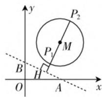
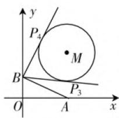
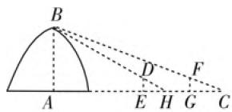
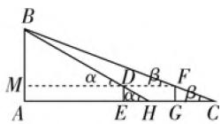
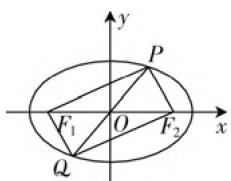
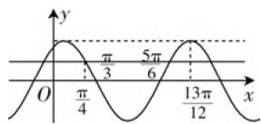

# 用数形结合思想巧解 2021 年高考数学试题\*

# - 四川省内江师范学院数学与信息科学学院 王韵西 赵思林

“数”和“形”作为数学的主要研究对象(载体)，是数学思想产生的重要源泉。涉及“数”与“形”的数学思想即通常所说的“数形结合思想”，是数学中的核心思想方法，在数学中占有重要地位。“数形结合思想”是对“数”和“形”及其关系(转化，结合)的本质认识，是解析决数学问题的基本策略和基本方法。因此，历年的高考数学试题都非常重视对“数形结合思想”的考查。数形结合思想的运用主要有三种路径：一是“数”化“形”，即“以形助数”；二是“形”化“数”，即“以数解形”；三是“数”“形”结合。研究2021年高考数学试题发现，数形结合思想对解答2021年一些高考数学试题具有直观、精准、简洁、巧妙等特点。

# 一、以形助数，直观简洁

例1（2021年新高考I卷第11题）已知 $P$ 在圆 $(x - 5)^{2} + (y - 5)^{2} = 16$ 上，点 $A(4,0),B(0,2)$ ，则（ ）.

A. 点 $P$ 到直线 $AB$ 的距离小于 10  
B. 点 $P$ 到直线 $AB$ 的距离大于 2  
C. 当 $\angle PBA$ 最小时, $|PB| = 3\sqrt{2}$   
D. 当 $\angle PBA$ 最大时， $|PB| = 3\sqrt{2}$

解析:如图1,记条件中圆心为M,P到直线AB的距离d满足: $P_{1}H\leqslant d\leqslant P_{2}H$ .

又 $l_{AB}: x + 2y - 4 = 0$

所以 $MH = \frac{|5 + 5\times 2 - 4|}{\sqrt{1^2 + 2^2}} = \frac{11}{\sqrt{5}}.$

所以 $P_{1}H=\frac{11}{\sqrt{5}}-4, P_{2}H=\frac{11}{\sqrt{5}}+4.$

所以 $d \in \left[\frac{11}{\sqrt{5}} - 4, \frac{11}{\sqrt{5}} + 4\right]$ .

$$
\text { 又 } \frac {1 1}{\sqrt {5}} - 4 <   2, \frac {1 1}{\sqrt {5}} + 4 <   1 0,
$$

所以 A 正确, B 错误.

text_image

y
P₂
P₁ M
B H
O A x

图1

text_image

y
P₄
M
B
P₃
O
A
x

图2

如图 2, P 在圆 M 上, 作 $BP_{3}, BP_{4}$ 切圆 M 于 $P_{3}, P_{4}$ , 则 $\angle PBA$ 在 $P_{3}$ 处最小, $P_{4}$ 处最大.

$$
\begin{array}{l} \text {又} B P _ {3} = B P _ {4} = \sqrt {B M ^ {2} - 4 ^ {2}} \\ = \sqrt {5 ^ {2} + (5 - 2) ^ {2} - 4 ^ {2}} = 3 \sqrt {2}. \\ \end{array}
$$

所以 CD 正确.

故选 ACD.

# 二、以数解形，精密准确

例 2 （2021 年全国乙卷第 9 题）魏晋时期刘辉撰写的《海岛算经》是关于测量的数学著作，其中第一题是测量海岛的高，如图 3，点 E, H, G 在水平线 AC 上，DE 和 FG 是两个垂直于水平面且等高的测量标杆的高度，称为“表高”，EG 称为“表距”，GC 和 EH 都称为“表目距”，GC 和 EH 的差称为“表目距的差”，则海盗的高 AB = ( ).

A. $\frac{\text{表高} \times \text{表距}}{\text{表目距的差}} + \text{表高}$

B. $\frac{表高\times 表距}{表目距的差}-表高$

C. $\frac{\text{表高} \times \text{表距}}{\text{表目距的差}} + \text{表距}$

D. $\frac{\text{表高} \times \text{表距}}{\text{表目距的差}} - \text{表距}$

解析: 连接 DF 交 AB 于 M, 如图 4, 则 $AB = AM + BM$ .

text_image

B
A
D
F
E H G C

图3

  
图4

记 $\angle BDM = \alpha, \angle BFM = \beta$ ，则 $\frac{MB}{\tan \beta} - \frac{MB}{\tan \alpha} = MF - MD = DF.$

而 $\tan \beta = \frac{FG}{GC},\tan \alpha = \frac{ED}{EH},$

所以 $\frac{MB}{\tan\beta} -\frac{MB}{\tan\alpha} = MB\left(\frac{1}{\tan\beta} -\frac{1}{\tan\alpha}\right)$

$$
= M B \cdot \left(\frac {F G}{G C} - \frac {E D}{E H}\right) = M B \cdot \frac {G C - E H}{E D}.
$$

因此, $MB=\frac{ED\cdot DF}{GC-EH}=\frac{表高\times 表距}{表目距的差}.$

从而, $AB=\frac{表高\times 表距}{表目距的差}+表高.$

故选A.

点评:本题以中国古代著名数学家刘辉撰写的《海岛算经》为背景,用数学史的方式渗透数学文化,激发爱国情怀.本题的难度只相当于初中学生解决三角问题的难度.

# 三、数形结合，互帮互助

# 1. 无形画形

例3（2021年全国甲卷第15题）已知 $F_{1}$ ， $F_{2}$ 是椭圆 $C: \frac{x^{2}}{16} + \frac{y^{2}}{4} = 1$ 的两个焦点， $P, Q$ 为 $C$ 上关于坐标原点对称的两点，且 $|PQ| = |F_{1}F_{2}|$ ，则四边形 $PF_{1}QF_{2}$ 的面积为 \_\_\_\_.

解析: 由题意, 先作出草图, 如图 5 所示.

因为 P, Q 为 C 上关于坐标原点对称的两点，且 $\left|PQ\right|=\left|F_{1}F_{2}\right|$ ，所以四边形 $PF_{1}QF_{2}$ 是矩形.

text_image

y
P
F₁ O F₂ x
Q

图5

又椭圆的焦点三角形 $PF_{1}F_{2}$ 的面积为 $S = b^{2}\tan \frac{\angle F_{1}PF_{2}}{2}$ ，所以 $S_{PF_1QF_2} = 2S_{\triangle PF_1F_2} = 2b^2\tan 45^\circ = 8.$

点评:本题由题意及图形看出“四边形 $PF_{1}QF_{2}$ 是矩形”至关重要.而直接利用椭圆的焦点三角形面积 $S=b^{2}\tan\frac{\angle F_{1}PF_{2}}{2}$ 可极大地减少运算量.

# 2. 有形补形

例4（2021年全国甲卷第16题）已知函数 $f(x) = 2\cos (\omega x + \varphi)$ 的部分图象如图6所示，则满足条件 $\left[f(x) - f\left(-\frac{7\pi}{4}\right)\right]\left[f(x) - f\left(\frac{4\pi}{3}\right)\right] > 0$ 的最小整数 $x$ 为

line

| x | y |
|---|---|
| 0 | 0 |
| π/4 | π/4 |
| 3/6 | 3/6 |
| 5π/6 | 5π/6 |
| 13π/12 | 13π/12 |

图6

解析:由图6可知, $f(x)$ 的最小正周期为 $T=\frac{4}{3}$ $\times\left(\frac{13}{12}\pi-\frac{\pi}{3}\right)=\pi$ ,所以 $\omega=2$ .

因为 $f\left(\frac{13\pi}{12}\right) = 2$ ，所以 $2\cos \left(\frac{13\pi}{6} + \varphi\right) = 2 \Rightarrow \varphi = \frac{\pi}{6} + 2k\pi, k \in \mathbf{Z}$ ，所以 $f(x) = 2\cos \left(2x - \frac{\pi}{6}\right)$ ，所以 $f\left(\frac{4\pi}{3}\right) = f\left(\frac{\pi}{3}\right) = 0, f\left(-\frac{\pi}{4}\right) = f\left(\frac{\pi}{4}\right) = 2\cos \left(\frac{\pi}{2} - \frac{\pi}{6}\right) = 1$ ，所以 $[f(x) - 1][f(x)] > 0$ ，则 $f(x) < 0$ 或 $f(x) > 1$ 。

根据图象可知, 满足 $f(x) > 1$ 的离 y 轴最近的正数区间为 $\left(0, \frac{\pi}{4}\right)$ ，无整数解； $f(x) < 0$ 的离 y 轴最近的正数区间为 $\left(\frac{\pi}{3}, \frac{5\pi}{6}\right)$ ，最小整数为 2.

点评:本题既需“算”又用“形”,才能充分体现数形结合的直观性与精密性.

# 3. 无形想形(不画出图形)

例5（2021年全国乙卷11题）设 $B$ 是椭圆 $C: \frac{x^2}{a^2} + \frac{y^2}{b^2} = 1 (a > b > 0)$ 的上顶点，若 $C$ 上的任意一点 $P$ 都满足 $|PB| \leqslant 2b$ ，则 $C$ 的离心率的取值范围是（ ）.

A. $\left[\frac{\sqrt{2}}{2},1\right)$ B. $\left[\frac{1}{2},1\right)$ C. $\left(0,\frac{\sqrt{2}}{2}\right]$ D. $\left(0,\frac{1}{2}\right]$

解析:由题意知,点 $B(0,b)$ .

设 $P(x_0, y_0)$ ，则 $\frac{x_0^2}{a^2} + \frac{y_0^2}{b^2} = 1 \Rightarrow x_0^2 = a^2\left(1 - \frac{y_0^2}{b^2}\right)$ .

(下转第55页)

原理的内容和应用场景混淆,因此教师在分别讲授完上述两部分知识后,需要对两个原理进行简单的区分.学生能够清晰知道在哪种应用场景下使用何种原理,随后教师可结合类似于下文实际案例,让学生动手体验运算,掌握其应用过程.

例 4 今有 6 个人组成的旅游团, 其中 4 名为成年人, 2 名为小孩, 该旅游团旅行活动中安排了乘坐缆车游览的活动, 现有三辆不同的缆车可供选择, 每辆缆车最多可乘坐 3 人, 为了安全起见, 小孩乘坐缆车必须要大人陪同, 则不同的乘车方式有( )种.

A. 204

B. 288

C. 348

D. 396

分析: 分乘坐 3 辆缆车和乘坐两辆缆车讨论, ① 乘坐 3 辆缆车, 则 4 个大人被分成 2,1,1 三组按分步原理计算方法数即可, ② 若乘坐两辆缆车, 则 4 个人大人被分成 2,2 或者 3,1 两组, 然后按照计数原理处理, 最后将两类相加即可.

解析:(1) 若 6 人乘坐 3 辆缆车, 则将 4 个大人分成 2,1,1 三组有 $C_{4}^{2}=6$ 种方法, 然后将三组排到三个缆车有 $A_{3}^{3}=6$ 种方法, 再将两个小孩排到三个缆车有 $3\times3-1=8$ 种方法, 所以共有 $6\times6\times8=288$ 种方法.

(2) 若 6 人乘坐 2 辆缆车:

① 两个小孩不在一块: 则大人分成 2,2 两组方法共有 $C_{4}^{2}A_{2}^{2}=3$ 种方法, 将两组排到两辆缆车有 6 种方法, 再将两个小孩排到两辆缆车有 2 种方法, 故共有 $3 \times 6 \times 2 = 36$ 种方法.  
② 两个小孩在一块: 则大人分成 3,1 两组, 分组方法为 $C_{4}^{3}=4$ 种方法, 小孩加入 1 人的组有 1 种方法, 再将两组从 3 辆缆车中选两辆排入有 6 种方法, 故共

有 $4 \times 1 \times 6 = 24$ 种方法.

综上所述:共有 $288+36+24=348$ 种方法.

点评:本题不仅考查了计数原理,还考查排列数公式,组合数公式,但是学生在作答本题时,容易漏掉一些情况,分类要注意.本题难度较大,综合性较强.

例 5 某次元旦晚会上共有8个节目,其中2个为歌曲演唱,3个是舞蹈类节目,3个曲艺节目.

(1) 两个歌曲节目分别放在开头和结尾的编排方式有几种；  
(2)2个歌曲节目互不相邻.

解析:(1) 开头安排歌唱节目有 $A_{2}^{2}$ 种排法, 然后后面的节目单编排其他节目有 $A_{6}^{6}$ 种排法, 因此共有 $A_{2}^{2}A_{6}^{6}=1440$ 种排法.  
(2) 先将除了歌曲节目以外的节目进行编排, 有 $\mathrm{A}_{6}^{6}$ 种排法, 再从剩余的位置编排两个唱歌节目, 有 $\mathrm{A}_{7}^{2}$ 种插入方法, 因此 $\mathrm{A}_{7}^{2} \mathrm{~A}_{6}^{6} = 30240$ 种排法.

点评:本题的背景和学生实际生活经验距离较近,因此可以引起学生的兴趣.学生在解题过程中,理解清楚编排位置和节目的关系,结合所学的两种原理即可正确作答.

综上所述,按照课程标准要求,要求学生能够掌握概念,能够使用两种原理解决实际问题,重点在于理解两原理的区别和联系.本部分知识的解题策略关键在于学生对于概念的理解,那么就需要教师在平时授课中认真进行教学设计,结合了“新课标”的思想,采用先建构数学基础,让学生充分发挥主观能动性,在已掌握的概念基础上,思考问题,尝试解决新问题,教师在这个过程中发挥引导作用.W

# (上接第53页)

从而 $|PB|^{2}=x_{0}^{2}+(y_{0}-b)^{2}=-\frac{c^{2}}{b^{2}}y_{0}^{2}-2by_{0}+a^{2}+b^{2},y\in[-b,b]$ ，所以当 $y_{0}=-b$ 时， $|PB|^{2}$ 最大.

因此抛物线的对称轴满足 $y_0 = -\frac{b^3}{c^2} \leqslant -b$ ，所以 $b^2 \geqslant c^2, a^2 - c^2 \geqslant c^2$ ，所以 $e = \frac{c}{a} \leqslant \frac{\sqrt{2}}{2}$ ，即 $e \in \left(0, \frac{\sqrt{2}}{2}\right]$ .

故选C.

点评:本题解答中关于 $y_{0}$ 的二次函数 $f(y_{0}) = -\frac{c^{2}}{b^{2}}y_{0}^{2} - 2by_{0} + a^{2} + b^{2}, y_{0} \in [-b, b]$ 的图象不需画出,仅需想象,即可解题.

数形结合思想是关于数学中两大研究对象“数”“形”的思想，是基本而又十分重要的数学思想，是理解数学、应用数学、发现数学的指导思想，是探求解题思路和解决疑难问题的基本工具。在教学中应长期渗透数形结合思想，让学生在学习数学、内化数学、活用数学、探究数学和发现数学的各个环节上培养数形结合意识，掌握数形结合方法（即“数”化“形”，“形”化“数”，“数”“形”结合），欣赏数形结合之美。W