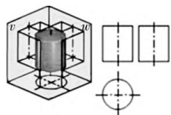
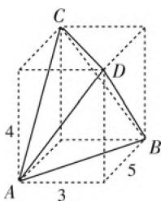
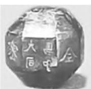
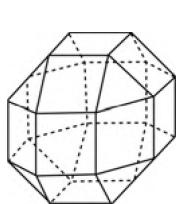
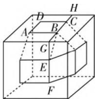
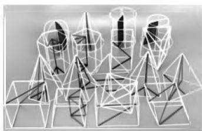

# 立体模型在高中立体几何教学中的运用探究

● 江苏省苏州市吴江区汾湖高级中学 夏正勇

高中立体几何一直是高考中的重点考查内容,在这个板块的学习过程当中,研究对象是立体模型.本篇文章我们将从理念建设、立体模型巧用、自制模型等角度出发分别加以讲解和分析.

# 一、前言

立体的几何模型是高中数学教育不可忽视的一个教育板块，对立体几何进行教育教学可以帮助学生建立起良好的推理能力和论证能力，使得他们更加具有想象力，对图形观察能力也能有所培养。高中几何教育过程中涉及丰富的数学知识，这些知识点非常的抽象，没有那么具体，对于学生的空间想象能力提出了更高的要求。如果他们不能够很好地学习和掌握，就很难学好高中立体几何部分的内容，而立体模型是一个很好的工具，将它更好地运用到高中数学教育教学过程中去，可以使得抽象的知识变得更加形象具体、直观，让学生学起来不再那么困难，使学习效果能够得到增强，所以说在开展高中数学教育教学过程当中需要合理运用好各项几何模型，更好地开展课堂教育活动。

# 二、树立模型理念，扎实理论基础

在当前的几何部分的教育教学过程中, 高中老师往往是采用口口相传的方式来教育. 教学口述的方式有利也有弊, 需要结合教材的各项具体内容来展开教学. 有些老师在教育过程中采用的方法并不死板, 他们选择了多媒体的教育方式, 但是也并没能很好地将立体化的模型展示出来, 在实际教育过程中还面临着许多需要解决的问题. 目前形势下, 立体几何教育教学的效果也并不好, 各类调查研究向我们展示出各项弊端, 多媒体教育教学过程中也收到了一些效果, 但是这些效果并不足以解决所有问题, 需要加强和改进. 为什么我们要更好地贯彻利用好立体模型呢? 那是因为立体模型的合理运用可以使得教学内容变得不再那么抽象, 更加具体化, 在展示过程中也能更加生动和形象, 使得学生能够更加直观地观察和了解相关的立体几何知识. 所以说我们要更好地利用立体模型这一教学工具,帮助学生更好地理解和掌握相关的知识,帮助学生更好地解决这类问题,提升教育教学质量.高中数学老师必须及时转变教育教学观念,树立起良好的模型观念,展开几何教学活动,夯实理论基础,增强教育教学效果.比如,在讲解空间几何三视图这部分内容的时候,如果采用单一的教学模式,仅仅采用多媒体技术的话,能够向学生展示出一系列丰富多彩的几何图形,但是并不能充分调动学生的学习兴趣,在观看图片的过程中学生有可能会感受到疲劳,他们的思维并没有得到合理的利用和发挥.在这一过程中这些丰富的教学素材可能被忽略,数学老师将这些几何图片展示完毕之后,这一课堂教学在学生看来就已经结束了,他们头脑中并没有留下什么深刻的印象,甚至可能会出现提笔忘字的现象,这些现象会使得老师后来的立体几何教学效果较差.

如果我们采用了如图1所示的立体模型来开展课堂教学，通过几何画板做出各类模型，让学生操作模型旋转观看，让学生感知不同面的视角图形，可以使得学生观察得到的

text_image

Technical diagram showing a 3D cube with internal cylinder and cross-sections, including dimension labels v and w.

图1

知识更加直观,通过观察这些立体模型可以减轻抽象的感觉,使得学生易于接受,使得他们对于立体几何图形三视图等各方面的一些知识有更加深刻的理解和想象.

# 三、巧用立体模型，提高解题质量

高中阶段是学生高速发展的阶段,在这一阶段涉及的主要立体几何模型由以下两种基本模型组成.第一种就是三棱锥模型,第二种就是正方体模型,我们现在就对这两个可能涉及的具体模型进行简要的分析探究.

首先,我们涉及的是三棱锥模型的具体应用,三棱锥是立体几何教学过程中不可忽视的重要教学内容.在高中阶段的几何教学过程中出现的频次也比较高,主要体现在以下几个方面,首先很多的数学几何模型, 它们是以三棱锥为基础来提出问题, 设置相关题目的. 另一方面, 有一些类型的三棱锥可以作为解答高中几何问题的重要解题策略. 比如, 图2中的立方体就可以通过两个三棱锥来解答, 然后根据题干中隐含的边角等公式进行三棱锥面积的计算, 可以利用好这些三棱锥来解决其他相关的线面关系等高中几何问题, 这些大量的数学问题都可以通过三棱锥的利用得到简化, 所以说三棱锥是学生必须要掌握的一个几何模型. 掌握它才能够更好地解决其他的相关问题. 我们可以根据三棱锥的相关特性来分析计算, 确保学生的解题效率能够在合理利用三棱锥的基础上得到提高, 我们还可以从三棱锥的侧棱与底面所成的夹角相等这一特征出发, 需要学生能够加以掌握的. 此外涉及其他数学问题时也可以论证模型, 根据特征来解决其他相关的问题, 可以使得解题更加高效和简便, 此外, 我们还可以通过三棱锥侧面与底面所成的二面角相等这一特征, 来解决一些其他的相关问题. 真实的模型让学生验证这一结论的产生过程, 深化学生对于理论的掌握和理解, 就算忘记, 以后也能够分析得到, 提高解决问题的各项效率.

text_image

C
D
4
A
3
5
B

图2

正方体模型是很早就接触过的模型,但在高中几何教育教学过程中有了更加广泛的运用,它本身是一个对称的立方体,可以通过观察和了解掌握.正方体模型的各类性质和平行六面体和柱体、圆形相似,我们也可以把它看为正方体的实际延伸.我们可以从立方体的各个特征出发来进行观察活动,所以当学生掌握到立方体模型应用原则和方法的时候,就能够更好地提高解决问题的效率.

text_image

Geometric diagram of a cube with labeled vertices and internal planes, used for spatial geometry problems.

图3

例如，在2019年数学理科全国卷Ⅱ中关于金石文化的题目(图3所示)解答时就应该采用立体模型进行解题.根据题目信息可以得到如图3所示的立体模型，然后推知半正面体的面应该有26个，因此可以设棱长 $AB = BE = x.$ 延长 $CB,FE$ ，可得交点为 $G$ ，再延长BC交正方体模型于 $H.$ 根据半正多面体的特性，找到对称性不难，可得 $\triangle BGE$ 是等腰直角三角形.进而可得,所以 $BG=GE=CH=\frac{\sqrt{2}}{2}x$ , 所以 $GH=2\times\frac{\sqrt{2}}{2}x+x=(\sqrt{2}+1)x=1$ , 所以 $x=\frac{1}{\sqrt{2}+1}=\sqrt{2}-1$ .

由此可见，在当前形势之下的涉及的高中数学考试和考查过程有很大一部分是在正方体模型的背景基础之上来分析解答的，所以说高中数学必须利用好正方体模型，开展各项教育教学活动，使得学生的立体思维能够得到加强，帮助他们提升解决立体几何问题的能力.

# 四、自制实体立体模型，增强教学效果

教育教学过程当中,学生可以让老师帮助他们进行立体化模型构建的操作,也可以帮助他们更好地发挥出自身的能动性,使他们的兴趣能

natural_image

Abstract geometric wireframe structure composed of interconnected cubes and cylinders (no text or symbols)

图4

够得到充分的调动, 自主开展探究和学习活动, 帮助开展各类教育教学活动. 通过以上的内容我们可以发现, 有些数学老师能够很好地利用多媒体技术来讲解空间几何问题, 不仅仅是通过一些 ppt 上面的粗略的色彩文字来展示, 学生能够掌握得更好, 并不是短暂地观看一些图片, 那样是无法形成深刻印象的, 学习效果也会很差, 缺乏科学和合理性, 但是在课堂教学的时候, 如果能够让学生制定出一些实体的立体几何模型. 制作完成的过程也能够使他们印象更加深刻, 在课堂上他们也能够观察自己制作或者展现出来的一些实体立体模型加深课堂内容的印象, 了解立体几何三视图的具体形状, 使得学习更加轻松愉悦. 比如, 笔者在教学前就在淘宝上买了一套立体几何教学模型, 如图 4 所示, 学生也进行了组合探索, 激发了学习兴趣.

高中数学教育过程中,我们需要一些手段加强素质教育改革进程,有效提升教育教学策略,特别是在面对一些几何问题的求解过程当中,我们可以改革高中数学教育教学过程中的一些实际操作,使得学生能够有更加深刻的理解,让学生能够更好地学习,教师在创设这些模型的时候也要大胆,将实践付诸行动,引导学生积极制作和利用各类几何模型帮助学生提高他们的解题效率,也不断加深他们的印象,让他们能够更好地利用到未来的解题过程中去,使他们的学业能够再上一个台阶. W