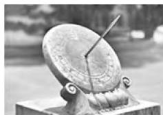
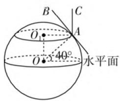
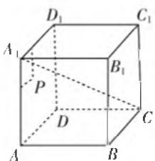
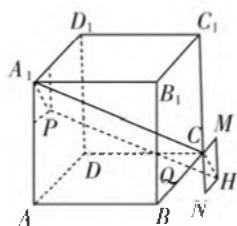
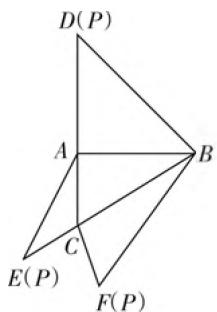
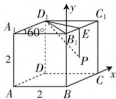
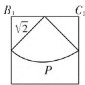

# 立几巧创新,高考新面孔

# ● 安徽省合肥市第九中学 殷春生

立体几何问题一直是历年高考数学试卷中比较常见的基本考点之一，高考试卷中一般占20多分，以“2+1”（两个小题，一个大题）的考查形式为主，也是新高考中充分体现在“知识点交汇处”这一指导精神命题的一大场所，备受各方关注。特别地，2020年高考数学试卷中，立体几何问题的考查出现了一些全新的面孔，试卷通过创新设置，形式新颖，很好考查数学知识与数学能力，要引起我们的高度重视。

# 一、数学文化设置

例 1 （2020 年高考数学新高考卷 I（山东卷）第 4 题）日晷是中国古代用来测定时间的仪器，利用与晷面垂直的晷针投射到晷面的影子来测定时间。把地球看成一个球（球心记

natural_image

Close-up of a weathered metal sundial with a pointed blade and base, set against a blurred outdoor background (no text or symbols visible)

图1

为 $O$ )，地球上一点 $A$ 的纬度是指 $OA$ 与地球赤道所在平面所成角，点 $A$ 处的水平面是指过点 $A$ 且与 $OA$ 垂直的平面.在点 $A$ 处放置一个日晷，若晷面与赤道所在平面平行，点 $A$ 处的纬度为北纬 $40^{\circ}$ ，则晷针与点 $A$ 处的水平面所成角为（ ）.

A. $20^{\circ}$

B. $40^{\circ}$

C. $50^{\circ}$

D. $90^{\circ}$

分析:通过数学文化的阅读理解,建立空间图形,结合条件转化北纬度数为相关角的度数问题,进而通过空间想象,利用水平面与直线垂直的关系加以转化,进而确定对应的角度问题.

解:如图2所示, $\odot O$ 所在平面为地球赤道所在平面,而点A处的日晷的晷面所在的平面为 $\odot O_{1}$ 所在平面,由于点A处的纬度为北纬 $40^{\circ}$ ,数形结合可知, $\angle OAO_{1}=40^{\circ}$ .又由于点A处的水平面与OA垂

text_image

B
O₁
40°
水平面
A
C
O

图2

直，晷针 $AC$ 与 $\odot O_1$ 所在的平面垂直，则 $\angle CAB = \angle OAO_{1} = 40^{\circ}$ ，数形结合可知，晷针 $AC$ 所在的直线与点 $A$ 处的水平面所成的线面角为 $40^{\circ}$ .故选B.

点评:数学文化已经悄然进入高考数学命题中,立体几何中的数学文化问题也是高考命题的一个主要阵地.破解涉及立体几何中的数学文化问题的基本步骤:阅读题目——理解题意——数学模型——空间想象——问题解决——联系实际,结合相应的数学知识加以综合与应用,联系实际,灵活应用.

# 二、空间位置判断

例 2 （2020 年高考数学上海卷第 15 题）在棱长为 10 的正方体 ABCD— $A_{1}B_{1}C_{1}D_{1}$ 中，P 为左侧面 $ADD_{1}A_{1}$ 上一点，已知点 P 到 $A_{1}D_{1}$ 的距离为 3，点 P 到 $AA_{1}$ 的距离为 2，则过点 P 且与 $A_{1}C$ 平行的直线交正方体于 P，Q 两点，则 Q 点所在的平面是（）.

A. $AA_{1}B_{1}B$

B. $BB_{1}C_{1}C$

C. $CC_{1}D_{1}D$

D. ABCD

text_image

D₁
C₁
A₁
P
B₁
D
C
A
B

图3

text_image

D₁
C₁
A₁
B₁
P
C
M
D
Q
H
A
B
N

图4

分析：在正方体中构造辅助线，确定四边形 $A_{1}PHC$ 为平行四边形，进而构造过点P且与 $A_{1}C$ 平行的直线，利用空间几何体的性质得以确定点Q所在的平面，得以判断空间位置.

解: 延长 BC 至 M 点, 使得 CM=2, 延长 $C_{1}C$ 至 N 点, 使得 CN=3, 以 C, M, N 为顶点作矩形, 记矩形的另外一个顶点为 H, 连接 $A_{1}P$ , PH, HC, 则易得四边形 $A_{1}PHC$ 为平行四边形. 因为点 P 在平面 $AA_{1}D_{1}D$ 内, 点 H 在平面 $BB_{1}C_{1}C$ 内, 且点 P 在平面 ABCD 的上方, 点 H 在平面 ABCD 下方, 所以线段 PH 必定会和平面 ABCD 相交, 即点 Q 在平面 ABCD 内.

故选D.

点评:空间位置判断是立体几何中的一个基本知识点,也是一大难点,历年高考数学试题中较少涉及.2020年高考数学试卷中多次出现此类问题,2020年高考数学全国卷Ⅲ理科第19题的点在平面内的证明也是空间位置判断的一个典例,回归基础,重视难点,要引起高度重视.

# 三、图形巧妙折叠

例 3 （2020 年高考数学全国卷 I 理科第 16 题）如图 5，在三棱锥 P-ABC 的平面展开图中， $AC=1,AB=AD=\sqrt{3},AB\perp AC,AB\perp AD,\angle CAE=30^{\circ}$ ，则 $\cos\angle FCB=$ \_\_\_\_.

分析:结合折叠关系,通过立体几何还原平面几何,在不同三角形中结合勾股定理或余弦定理确定相应的边长,利用空间几何体与平面展开图之间的图形推理,建立相应的边长关系,再利用余弦定理加以求解即可.

text_image

D(P)
A
B
C
E(P)
F(P)

图5

解析:由于 $AB \perp AC, AC = 1, AB = \sqrt{3}$ ，结合勾股定理可得 $BC = \sqrt{AC^{2} + AB^{2}} = 2$ ，同理得 $BD = \sqrt{6}$ ，则 $BF = BD = \sqrt{6}$ 。在 $\triangle ACE$ 中，AC = 1, AE = AD = $\sqrt{3}$ , $\angle CAE = 30^{\circ}$ ，结合余弦定理可得 $CE^{2} = AC^{2} + AE^{2} - 2AC \cdot AE\cos 30^{\circ} = 1$ ，则 CF = CE = 1。

在 $\triangle BCF$ 中， $BC = 2, BF = \sqrt{6}, CF = 1$ ，结合余弦定理可得 $\cos \angle FCB = \frac{CF^2 + BC^2 - BF^2}{2CF \cdot BC} = -\frac{1}{4}$ .

故填答案: $-\frac{1}{4}$ .

点评:折叠问题是高考中空间立体几何部分比较创新的一类问题,结合平面几何的折叠与立体几何的构建,将相应的平面几何图形折叠成空间立体几何图形,合理确定平面几何图形折叠成空间立体几何前后的不变量与改变量,实际应用,巧妙转化,从而加以推理与运算.

# 四、空间轨迹问题

例 4 （2020 年高考数学新高考卷 I（山东卷）第 16 题）已知直四棱柱 ABCD— $A_{1}B_{1}C_{1}D_{1}$ 的棱长均为 $2, \angle BAD = 60^{\circ}$ . 以 $D_{1}$ 为球心， $\sqrt{5}$ 为半径的球面与侧面 $BCC_{1}B_{1}$ 的交线长为 \_\_\_\_.

分析:通过“立体几何+平面几何”进行综合分析,在侧面 $BCC_{1}B_{1}$ 上建立对应的平面直角坐标系,结合余弦定理以及勾股定理的应用,进而得到侧面 $BCC_{1}B_{1}$ 与球面的交线上的点 P 的轨迹方程,进一步利用平面几何的相关知识来确定弧长所对应的圆心角大小,再结合弧长公式即可用来求解交线长问题.

解析:由题目条件,直四棱柱 $ABCD-A_{1}B_{1}C_{1}D_{1}$ 的棱长为2,且 $\angle BAD=60^{\circ}$ ,那么可得 $\triangle B_{1}C_{1}D_{1}$ 是边长为2的等边三角形,且上、下底面均是菱形,建立相应的平面直角坐标系,如图6所示.设点P为侧面 $BCC_{1}B_{1}$ 与球面的交线上的点,设 $P(x,y)$ ,结合余弦定理有 $D_{1}E^{2}=D_{1}B_{1}^{2}+x^{2}-2\cdot D_{1}B_{1}\cdot x\cdot\cos60^{\circ}=x^{2}-2x+4$ ,由题意可知 $D_{1}P=\sqrt{5}$ ,可得 $D_{1}P^{2}=5=x^{2}-2x+4+(2-y)^{2}$ ,整理有 $(x-1)^{2}+(y-2)^{2}=2$ ,则点P在侧面 $BCC_{1}B_{1}$ 上的轨迹是以线段 $B_{1}C_{1}$ 的中点E为圆心,半径为 $\sqrt{2}$ 的圆弧,结合平面几何的相关知识,可以确定弧长所对应的圆心角为 $90^{\circ}=\frac{\pi}{2}$ ,则以 $D_{1}$ 为球心, $\sqrt{5}$ 为半径的球面与侧面 $BCC_{1}B_{1}$ 的交线长度为 $\frac{1}{4}\times2\sqrt{2}\pi=\frac{\sqrt{2}\pi}{2}$ .

故填答案: $\frac{\sqrt{2}\pi}{2}$ .

text_image

A₁
60°
2
D₁
y
C₁
B₁
E
P
D
x
A
2
B
C

图6

  
图7

点评:以空间为背景的轨迹问题是高考命题的一大趋势,符合高考命题指导思想,内涵丰富,立意深远,动静结合,可以用来探究立体几何中的很多相关的轨迹问题,结合轨迹判断、轨迹长度、轨迹体积以及轨迹综合问题等来实例剖析,旨在探索题型规律,揭示解题方法.

此类立体几何的创新交汇的新面孔问题,可以以立体几何为问题背景,合理设置与融合进众多相关的数学知识、数学文化、数学能力等,实现数学知识、数学能力的交汇与联系,越来越受到新高考数学命题者的青睐与热衷,能充分体现知识体系的融会贯通,达到数学解题能力与数学应用能力的全面提升,真正拓展数学知识,发散数学思维,提升数学能力,培养核心素养.