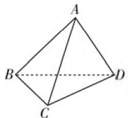
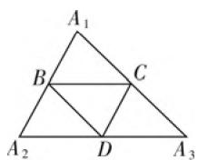
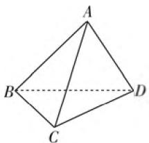
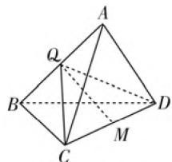
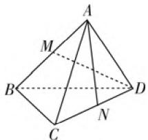
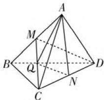

# 谈高中数学解题中的降维思维\*

# ● 福建省泉州市德化第一中学 周明墩

所谓“降维思维”是指应用数学方法，将高维的数学问题降为低维，从而达到简化解决数学问题的思维模式。“降维思维”在数学的各领域都有应用，主要涉及降空间维度、降元、降次、降标准等，尤其在解决立体几何、解析几何等问题中更为常用。“我们要教人，不但要教人知其然，而且要教人知其所以然。”本文就“降维思维”进行一些深入的探讨，意在引导读者知晓“降维”的“所以然”。

# 一、展截移旋降维巧解立体几何题

立体几何研究三维空间问题,考查空间想象能力,很多学生因为空间想象力不足而倍感立体几何学习吃力,解题不易.其实许多立体几何问题都可以通过展、截、移、旋等方法进行巧妙降维,把三维空间的问题降为二维平面的问题来解答,从而化陌生为熟悉,降低解题切入的难度.本文以四面体为背景,对展、截、移、旋等立体几何降维方法阐述如下:

# 1. 展——化空间几何体为平面图形

“展”就是将立体图形的各个面(或部分面)展开成平面图形(尤其是几何体的侧面展开图),然后研究元素间的关系,使问题变得简单明了,易于解决.

例 1 四面体 ABCD 中, 分别以 B, C, D 三点为顶点的三面角之和均为 $\pi$ (如图 1). 求证: 此四面体的三组对棱分别相等.

natural_image

Geometric diagram of a tetrahedron with vertices labeled A, B, C, D (no text or symbols beyond labels)

图 1

  
图2

分析: 将四面体的侧面展开至同一平面, 将问题放在平面内处理, 以达到降维的效果, 方便问题的解决.

证明: 将四面体的三个侧面展开至与平面 BCD 共面, 顶点 A 分别展至 $A_{1}, A_{2}, A_{3}$ 的位置(如图 2).

因为 $\angle ABC + \angle ABD + \angle CBD = \pi$ ，即 $\angle A_{1}BC + \angle A_{2}BD + \angle CBD = \pi$ ，所以点 $A_{1},B,A_{2}$ 共线，且点 $B$ 是 $A_{1}A_{2}$ 的中点.同理点 $C$ 是 $A_{1}A_{3}$ 的中点，点 $D$ 是 $A_{2}A_{3}$ 的中点，所以 $CD\parallel A_1B$ ，即 $CD = AB.$ 同理， $AC$ $= BD,AD = BC$ ，即四面体ABCD三组对棱分别相等

评析:本例如果没有将侧面展开,很难找到解题的突破口.通过“展”,将三维空间转化为二维平面,从而更易找到解决问题的方法.

# 2. 截——在空间几何体中找一个平面

“截”就是取或作空间图形在适当位置的一个截面,然后在这个截面内研究各元素间的关系,使空间问题转化为平面问题.

例 2 在四面体 ABCD 中(如图 3), AB = a, 其他各棱长为 b, 求该四面体的体积.

natural_image

Geometric diagram of a tetrahedron with vertices labeled A, B, C, D (no text or symbols beyond labels)

图3

text_image

Geometric diagram of a tetrahedron with labeled vertices and internal points, used for spatial geometry problems.

图 4

分析:本例中四面体 ABCD 底面的高不易求,若取 AB 的中点 Q,作截面 QCD,易得 $AB \perp$ 平面 QCD,则求四面体的体积就避开难求的高,而只需求截面 $\triangle QCD$ 的面积,从而达到降维的目的.

解:取 AB 的中点 Q, 作截面 QCD(如图 4). 因为 AC = BC, AD = BD, 所以 $AB \perp CQ, AB \perp DQ$ . 因为 $CQ \cap DQ = Q, CQ \subset$ 平面 CDQ, $DQ \subset$ 平面 CDQ, 所以 $AB \perp$ 平面 CDQ. 因为 AC = BC = AD = BD = b, AB = a, 所以 $CQ = DQ = \frac{1}{2} \sqrt{4b^{2} - a^{2}}$ . 所以 $\triangle CDQ$

中 $CD$ 边上的高 $QM = \frac{1}{2}\sqrt{3b^2 - a^2}$ ，则 $S_{\triangle CDQ} = \frac{1}{4} b$ $\sqrt{3b^2 - a^2}$ .所以 $V_{\text{四面体ABCD}} = \frac{1}{3}\times \frac{1}{4} ab\sqrt{3b^2 - a^2} =$ $\frac{1}{12} ab\sqrt{3b^2 - a^2}.$

评析:本例过AB的中点Q,作截面QCD,从而将三维空间中不易求的三棱锥底面的高,转化为二维平面内易求的面积问题,这是典型的作截面降维的例子.本例还可以取CD中点M作截面AMB,也可达到同样降维的效果.

# 3. 移——通过平移化异面为共面

“移”即平移, 就是将部分图形平移到适当的位置, 将原来不共面的元素集中到一个平面或几个平面内, 用平面几何知识进行研究, 从而将三维转化为二维, 起到化陌生为熟悉, 化抽象为直观的效果.

例3 如图5, 点 $M, N$ 分别是正四面体ABCD一组对棱 $AB$ 和 $CD$ 的中点. 求异面直线 $AN, DM$ 所成角的余弦值.

text_image

A
M
B
D
C
N

图 5

text_image

Geometric diagram of a pyramid with labeled vertices and internal points, used for spatial geometry problems.

图6

分析: 求异面直线所成角的主要方法, 就是通过平移得到两异面直线所成的角, 再在相应的平面内用解三角形的方法求该角的余弦值.

解:如图6,连接CM,取CM的中点Q,连接NQ,AQ.由平面几何知识可得 $NQ\parallel DM$ ,所以 $\angle ANQ$ 是异面直线AN,DM所成的角.设正四面体ABCD的棱长为1,应用平面几何知识可求得CM=DM=AN= $\frac{\sqrt{3}}{2}$ ,则 $QN=\frac{1}{2}DM=\frac{\sqrt{3}}{4}$ , $AQ=\sqrt{AM^{2}+MQ^{2}}=\sqrt{\left(\frac{1}{2}\right)^{2}+\left(\frac{\sqrt{3}}{4}\right)^{2}}=\frac{\sqrt{7}}{4}$ ,所以在 $\triangle ANQ$ 中,由余弦定理得 $\cos \angle ANQ = \frac{\left(\frac{\sqrt{3}}{4}\right)^2 + \left(\frac{\sqrt{3}}{2}\right)^2 - \left(\frac{\sqrt{7}}{4}\right)^2}{2 \times \frac{\sqrt{3}}{4} \times \frac{\sqrt{3}}{2}} = \frac{2}{3}$ . 故所求异面直线 AN, DM 所成角的余弦值为 $\frac{2}{3}$ .

评析:平移或作平行线把三维空间降至二维平面内求解或证明是求异面直线所成角、证明平行等的常用方法.

# 二、化归转化二降一巧解圆锥曲线与向量交汇题

在函数、方程等的问题中我们也经常通过整体代换等化归转化，将二维的问题降为一维的问题，从而简化解答过程，降低解题难度。例如圆锥曲线与向量的交汇综合题，可以应用向量的坐标运算进行降维，把二维的平面直角坐标系中的问题降为一维的数轴上的问题。

例4 设双曲线 $C: \frac{x^2}{a^2} - y^2 = 1 (a > 0)$ 与直线 $l: x + y = 1$ 相交于两个不同的点 $A, B$ , 直线 $l$ 与 $y$ 轴交于点 $P$ , 且 $\overrightarrow{PA} = \frac{5}{12}\overrightarrow{PB}$ , 求 $a$ 的值.

分析:设A,B两点的坐标,将向量表达式转化为坐标表达式,再利用韦达定理,通过解方程组求a的值.

解: 设 $A(x_{1}, y_{1})$ , $B(x_{2}, y_{2})$ , $P(0, 1)$ ，因为 $\overrightarrow{PA} = \frac{5}{12}\overrightarrow{PB}$ ，则 $(x_{1}, y_{1} - 1) = \frac{5}{12}(x_{2}, y_{2} - 1)$ , $x_{1} = \frac{5}{12}x_{2}$ . 联立 $\left\{\begin{aligned} x + y &= 1, \\ \frac{x^{2}}{a^{2}} - y^{2} &= 1, \end{aligned}\right.$ 消去 y 并整理得 $(1 - a^{2})x^{2} + 2a^{2}x - 2a^{2} = 0$ . （\*）由 A, B 是不同的两点，得 $\left\{\begin{aligned} 1 - a^{2} & \neq 0, \\ 4a^{4} + 8a^{2}(1 - a^{2}) & > 0, \end{aligned}\right.$ 得到 $0 < a < \sqrt{2}$ 且 $a \neq 1$ ，而 $x_{1} + x_{2} = -\frac{2a^{2}}{1 - a^{2}}$ , $x_{1}x_{2} = -\frac{2a^{2}}{1 - a^{2}}$ ，即 $\frac{17}{12}x_{2} = -\frac{2a^{2}}{1 - a^{2}}$ ，且 $\frac{5}{12}x_{2}^{2} = -\frac{2a^{2}}{1 - a^{2}}$ ，得 $x_{2} = \frac{17}{5} - \frac{2a^{2}}{1 - a^{2}} = \frac{289}{60}$ ，解得 $a = \pm\frac{17}{13}$ ，所以 $a = \frac{17}{13}$ .

“培养和教育人和种花木一样，首先要认识花木的特点，区别不同情况给予施肥、浇水和培养教育……”其实数学解题也是如此，首先必须掌握题目的特点，然后选择解题思维，前面涉及的立体几何、解析几何相关问题就是如此。当然可以用降维思维解题的数学问题并不止于此，还有诸如涉及高次函数、关系式复杂的函数（方程）、统计学中非线性回归等问题，都具备用降次、降元切入解题的特点。从广义上说，降次、降元也属降维的范畴，可视为典型的降维思维等等。任何一种思维的形成都始于问题，成于思考，用于实践，是创新性思维方式，针对那些用一般方法难以解决的高维度问题，不妨考虑“降维”解决。

# 参考文献：

[1] 季峰. 升维思考, 降维解题——例谈高考数学中的“高观点”试题[J]. 中学数学(上), 2021(3). W