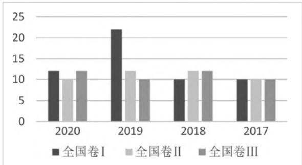
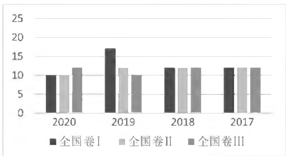
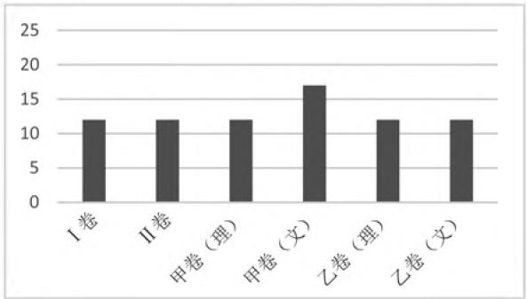

# 近五年高考数列题型分析及教学建议

# ● 湖北大学数学与统计学院 宁羽杰 王卫华

# 一、课标要求

2017年版课标对数列的要求:通过实际案例,了解数列的概念和表示方法(列表、图象、通项公式),了解数列是一种特殊的函数,理解等差(比)数列的概念和通项公式的意义;探索并掌握等差(比)数列的前n项和公式,并理解通项公式与求和公式的关系;在实际情境中辨别出等差(比)数列,并解决问题;体会等差数列与一元一次函数、等比数列与指数型函数之间的关系.

# 二、试题展现

# (一) 数列基本量

等差(比)数列包含五个基本量 $a_1, a_n, d(q), n, S_n$ ，在解题时常用列方程组或待定系数法得到关键量—— $a_1, d(q)$ ，进而求解其他未知量。其次，认真审题，了解题目需要求解的具体基本量，仔细观察与分析量与量之间的联系，灵活运用数列的性质与定理，从而进行简便运算。

例 1 （2017 年全国卷 I，理 4）记 $S_{n}$ 为等差数列 $\{a_{n}\}$ 的前 n 项和。如果 $a_{4} + a_{5} = 24, S_{6} = 48$ ，那么 $\{a_{n}\}$ 的公差为（）。

A.1

B. 2

C. 4

D. 8

# (二) 数列通项

# 1. 公式法

等差(比)数列的通项公式 $\{a_{n}\}$ 通常由首项 $a_{1}$ 与公差d(公比q)决定,那么根据题意中两个已知条件列方程组即可求得基本量,从而得到通项.其次,需要牢记数列通项公式:等差数列对应 $a_{n}=a_{1}+(n-1)d$ ,等比数列对应 $a_{n}=a_{1}q^{n-1}$ .

例2（2019年全国卷I，理9）记 $S_{n}$ 为等差数列 $\{a_n\}$ 的前 $\pmb{n}$ 项和.已知 $S_{4} = 0,a_{5} = 5$ ，则（ ）.

A. $a_{n} = 2n - 5$

B. $a_{n} = 3n - 10$

C. $S_{n} = 2n^{2} - 8n$

D. $S_{n} = \frac{1}{2} n^{2} - 2n$

# 2. 分类讨论法

分类讨论法即前 n 项和法，在解决该类题型时，利用 $a_{n}$ 与 $S_{n}$ 之间的关系： $a_{n}=\left\{\begin{aligned}&S_{1},n=1,\\ &S_{n}-S_{n-1},n\geqslant2.\end{aligned}\right.$

根据已知条件计算、化简，进而求出通项公式 $\{a_{n}\}$ ，最后再根据实际情况决定是否将 $n = 1$ 与 $n \geqslant 2$ 两种情况进行合并.

例3（2021年全国卷Ⅱ，理19）记 $S_{n}$ 为数列 $\{a_{n}\}$ 的前 $n$ 项和， $b_{n}$ 为数列 $\{S_n\}$ 的前 $n$ 项积，已知 $\frac{2}{S_n} +\frac{1}{b_n} = 2.$

(1) 证明: 数列 $\{b_{n}\}$ 是等差数列;  
(2) 求 $\{a_{n}\}$ 的通项公式.

# (三) 数列求和

# 1. 公式法

等差数列的前 $n$ 项和公式为 $S_{n} = \frac{n(a_{1} + a_{n})}{2}$ 或 $S_{n} = na_{1} + \frac{n(n - 1)d}{2}$ ，在解题时需要根据已知条件选择合适的公式。若已知首项、末项与项数，则选择前者，若已知首项、公差与项数，则选择后者；其次，等比数列的前 $n$ 项和公式为 $S_{n} = \left\{ \begin{array}{l}na_{1},q = 1,\\ \frac{a_{1}(1 - q^{n})}{1 - q},q\neq 1. \end{array} \right.$

在解题时注意需要对 q 进行分类讨论.

# 2. 裂项相消法

裂项相消法通常将数列中的某一项拆分成作差的两项,在进行运算时,将大多数互为相反数的项抵消,剩下首尾相对应的一些项,从而进行化简,大大地减少运算量.使用该方法求和时,应留意在运算时哪些项被消掉、哪些项被保留,切不可以漏掉未被消去的项.其中,高考真题中大多考查通项为分式的情形,以下便是常见的裂项公式:

(1) $\frac{1}{n(n + k)} = \frac{1}{k}\left(\frac{1}{n} - \frac{1}{n + k}\right)$ ;   
(2) $\frac{1}{(2n - 1)(2n + 1)} = \frac{1}{2}\left(\frac{1}{2n - 1} -\frac{1}{2n + 1}\right)$   
(3) $\frac{1}{n(n + 1)(n + 2)} = \frac{1}{2}\left[\left(\frac{1}{n(n + 1)} -\frac{1}{(n + 1)(n + 2)}\right)\right]$

$$
= \frac {1}{2} \left[ \left(\frac {1}{n} - \frac {1}{n + 1}\right) - \left(\frac {1}{n + 1} - \frac {1}{n + 2}\right) \right];
$$

(4) $\frac{1}{\sqrt{n + k} + \sqrt{n}} = \frac{1}{k} (\sqrt{n + k} - \sqrt{n})$ ;

(5) $\log_a\left(1 + \frac{1}{n}\right) = \log_a(n + 1) - \log_a n.$

例4（2017年全国卷Ⅱ，理15）等差数列 $\{a_{n}\}$ 的前 $n$ 项和为 $S_{n}, a_{3} = 3, S_{4} = 10$ ，则 $\sum_{k=1}^{n} \frac{1}{S_{k}} =$ \_\_\_\_.

# 3. 错位相减法

如果存在一个数列 $\{a_{n}b_{n}\}$ , 其中 $\{a_{n}\}$ 是公差为 $d$ 的等差数列, $\{b_{n}\}$ 是公比为 $q (q \neq 1)$ 的等比数列. 针对这类题目, 通用方法:

设 $S_{n}=a_{1}b_{1}+a_{2}b_{2}+\cdots+a_{n}b_{n},(*)$

那么 $qS_{n}=a_{1}b_{2}+a_{2}b_{3}+\cdots+a_{n-1}b_{n}+a_{n}b_{n+1}.$ ( $^{*}$ $^{*}$ )

$(*)-(**)$ , 得 $(1-q)S_{n}=a_{1}b_{1}+d(b_{2}+b_{3}+\cdots+b_{n})-a_{n}b_{n+1}$ , 进而两边相除 $1-q$ , 便能得到所需的和.

例 5 （2020 年全国卷 I，理 17）设 $\{a_{n}\}$ 是 q 不为 1 的等比数列，其中 $a_{1}$ 是 $a_{2}, a_{3}$ 的等差中项.

(1) 求 $\{a_{n}\}$ 的公比；  
(2) 若 $a_1 = 1$ , 求数列 $\{na_n\}$ 的前 $n$ 项和.

# 4. 分组求和法

根据数列通项的特点,将数列分成若干个能独立求和的数列分别求和.

# (四) 数列综合题

随着教育改革的不断推进,高考数学试题越来越注重数学学科的六大核心素养.针对数列这一知识点,它的试题特点在数列与其他知识点的融合上得以体现.数列既可以考查简单的公式、性质的运用,同时也可以和数学文化、二次函数、不等式等相结合,大大提高试题的难度,综合考查考生各方面的能力.

# 1. 数列与数学文化

例 6 （2020 年全国卷Ⅱ，理 4）北京天坛的圜丘坛为古代祭天的场所，分上中下三层。上层中心有一块圆形石板（称为天心石），环绕天心石砌 9 块扇面形石板构成第一环，向外每环依次增加 9 块。下一层的第一环比上一层的最后一环多9块，向外每环依次也增加9块。已知每层环数相同，且下层比中层多729块，则三层共有扇面形石板(不含天心石)( )。

natural_image

Black-and-white photo of a large circular architectural structure with tiered seating and a central figure, surrounded by trees (no visible text or symbols)

图1

A. 3699 块 B. 3474 块 C. 3402 块 D. 3339 块

# 2. 数列与二次函数

例 7 （2018 年全国卷 II，文 17）记 $S_{n}$ 为等差数列 $\{a_{n}\}$ 的前 n 项和，已知 $a_{1} = -7, S_{3} = -15$ .

(1) 求 $\{a_{n}\}$ 的通项公式；

(2) 求 $S_{n}$ , 并求 $S_{n}$ 的最小值.

# 3. 数列与不等式

例8（2019年全国卷I，文18）记 $S_{n}$ 为等差数列 $\{a_{n}\}$ 的前 $n$ 项和.已知 $S_{9} = -a_{5}$

(1) 若 $a_{3} = 4$ ，求 $\{a_{n}\}$ 的通项公式；  
(2) 若 $a_1 > 0$ , 求使 $S_n \geqslant a_n$ 的 $n$ 的取值范围.

# 三、分析总结

本文分别收录了30套全国高考数学试卷，包含2017－2020年新课标卷(分文理)24套，2021年新高考Ⅰ卷、Ⅱ卷、全国甲乙卷(分文理)6套.

总览这30套试卷,其考查的知识点充分体现新课标对高中生“四基”培养的重视.它不仅注重知识和方法的基础性,即数列的概念、性质、基本量的运算以及多种不同的求和方法,同时也注重考查高中生综合运用、举一反三的能力,即数列与其他知识点相结合的综合题.

(1) 自 2017 年的新课标卷开始, 数列每年的考查形式较为固定, 大多为三种情况: ① 两个客观题, 分值占 10 分; ② 一个解答题, 分值占 12 分; ③ 一个简答题、一个客观题, 分值占 17 分, 考查题型大多为前两种, 偶尔也考查过三道题, 如 2019 年的新课标 I 卷(理). 因此全国高考卷对数列知识点的考查分值总和大多在 10-12 分, 占整张试卷的 6%-8%, 2021 年新高考全国卷亦是如此, 具体情况如下:

bar

| Year | 全国卷Ⅰ | 全国卷Ⅱ | 全国卷Ⅲ |
|---|---|---|---|
| 2020 | 12 | 10 | 12 |
| 2019 | 22 | 12 | 10 |
| 2018 | 10 | 12 | 12 |
| 2017 | 10 | 10 | 10 |

图 2 2017－2020 年新课标卷(理)

bar

| Year | 全国卷Ⅰ | 全国卷Ⅱ | 全国卷Ⅲ |
|---|---|---|---|
| 2020 | 10 | 10 | 12 |
| 2019 | 17 | 12 | 10 |
| 2018 | 12 | 12 | 12 |
| 2017 | 12 | 12 | 12 |

图 3 2017－2020 年新课标卷(文)

bar

| 类别 | 数值 |
|---|---|
| I卷 | 12 |
| II卷 | 12 |
| 甲卷（理） | 12 |
| 甲卷（文） | 17 |
| 乙卷（理） | 12 |
| 乙卷（文） | 12 |

图 4 2021 年新高考全国卷

(2) 选择题的题号位置通常在前 8 题以内, 考查的内容大多为等差(比)数列的概念、性质、通项公式与求和, 难度不大, 运用基本的公式便能较快解决问题, 这充分体现出考纲对该部分知识能力的要求层次一一掌握.  
(3) 解答题的题号位置通常在第 17 题, 即大题的第 1 题, 这意味着题目难度不高, 考生容易拿分. 其考查内容大多为: 第 (1) 问求数列的通项公式, 第 (2) 问利用裂项相消法、错位相减法等方法对数列进行求和. 唯一特殊的就是 2019 年新课标 I 卷 (理) 解答题第 21 题, 它把离散型随机变量及其分布列与递推数列结合在一起考查, 综合性、创新性较强, 考生对该命题不适应, 从而不能正确作答.  
(4) 数列的考查难度有难有易, 既可以放在选择题前 8 题内, 填空题前 2 题内或解答题第 1 题, 注重数列的基础知识点. 同时, 数列也可以与函数、不等式、概率等进行结合, 放在选择题、填空题最后一题压轴考查, 使试卷难度增大.

# 四、全国高考数列试题考情预测

2021年八个省市举行首次“3+1+2”新高考模式，所以新高考卷的考查题型与以往大不相同，但是针对数列这一考点，考查题型、考查知识点、考查分值并未出现明显变化，仍比较基础，主要考查数列的相关基础概念与应用，未出现数列与其他知识点相结合的综合题。因此，本文综合以上汇总分析，对未来的高考数列试题进行一些初步推测：

(1) 数列的概念、性质、通项公式与前 n 项和公式的基本运用与计算, 难度较小, 十分基础.  
(2) 数列解答题考查形式通常为: 第(1)问求数列的通项公式, 第(2)问利用裂项相消法、错位相减法等

方法对数列进行求和或是与数列概念、性质相关的简单证明.

(3) 数列与数学文化、二次函数、不等式等其他知识点相结合的综合题,难度较大、创新性较强.

# 五、复习建议

# 1. 注重数列概念的引入与形成

教师在讲授数列的概念时,可以先介绍一下数列的发展史,以故事或情境的形式导入,使学生对数列知识产生较大的兴趣,同时引入与数学文化相关的高考数列题,使学生迅速明白数列概念的重要性,并从思想上有较高的意识.此外,学习概念要能够掌握它的本质属性,即数列本质上就是定义在正整数集上的离散的函数,因此在学习过程中,教师可以将两者结合起来一同讲解,使学生理解更加深刻.

# 2. 注重数列公式、性质的推导

数学公式、性质反映数学对象与数学概念之间的关系, 这些关系一部分可以直接观察分析或者计算测量得来, 另一部分则需要理论推导. 在数列这一章中, 等差(比)数列的 $a_{n}$ 与 $S_{n}$ 都是推导得来的. 综合分析目前的高考数列题, 它的题型越来越灵活, 常常与其他知识点综合一起考查, 虽然题目实际难度不大, 但是由于经过层层包装, 学生很难窥探其根本, 因此学生十分有必要掌握公式的推导过程, 知其所以然.

# 3. 强化基本运算, 总结解题方法

数列的学习避免不了有大量的计算,为了减少学生由于计算错误而失分,教师应该做好带头作用,在教学时注意培养学生认真审题的良好习惯,在计算时注意每一个步骤的准确性.同时,也不可忽视数列试题所涉及到的运算技巧.在大量的习题练习后,教师可以通过自行传授或课堂上交流讨论的方式,让学生逐渐掌握运算技巧,并有效地运用到试题中.

# 4. 以函数的观点看数列,体会数学的整体性

由于数列是特殊的函数,所以在数列这一章学习中,教师要有意识地引导学生将数列纳入到函数这一大的体系中,将两者结合一并理解.例如,数列的通项公式对应函数解析式,数列的规律性对应函数变量之间的关系.如此一来,利用函数的观点去学习数列,学生不仅可以从多个角度认识与理解数列的相关知识,而且也加深对函数的概念与思想方法的领悟,认识到数学是一个整体,体会到数学的魅力与有趣.F