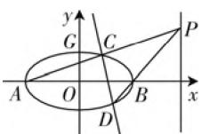
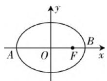
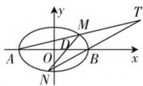

# 高考撞衫,题源揭秘,规律总结

—— 以一道高考题为例

# ● 江苏省宜兴市和桥高级中学 李清芳 朱丹霞

历年典型的高考试题具有很好的引领与指导作用，吸引着众多教师和教研员的学习、引用、模仿、改编与整合等，也吸引着高考试题命题者的眼光，产生一些“高考撞衫”试题，呈现出一些非常不错的创新“产品”。此类“高考撞衫”试题具有典型突出、考点明确、知识融合、立意突出、引人注目等特点，具有很好的选拔性与区分度。同时，这类创新“产品”，既有继承又有发展，是一线数学教师教学与学生学习中一个不可多得的好平台，值得我们细细品味，认真学习，总结规律，深入探究，拓展提升。

# 一、真题在线

高考真题:(2020年高考数学全国卷Ⅰ理科第20题,文科第21题)已知A,B分别为椭圆 $E:\frac{x^{2}}{a^{2}}+y^{2}=1(a>1)$ 的左、右顶点,G为E的上顶点, $\overrightarrow{AG}\cdot\overrightarrow{GB}=8,P$ 为直线x=6上的动点,PA与E的另一交点为C,PB与E的另一交点为D.

(1) 求 $E$ 的方程；  
(2) 证明: 直线 CD 过定点.

此题以平面直角坐标系中相关的点、直线、椭圆为问题背景，结合平面向量的数量积关系式来确定对应的椭圆方程，在此基础上，借助定直线上的动点的“动”、产生的新直线的“动”、以及动直线所过定点的“静”这一系列的动静结合的元素，来构造一幅完美和谐、辩证统一的美妙“画卷”。

# 二、真题解析

解析:(1)由题设得 $A(-a,0),B(a,0),G(0,1)$ ，则 $\overrightarrow{AG}=(a,1),\overrightarrow{GB}=(a,-1)$ 。由 $\overrightarrow{AG}\cdot\overrightarrow{GB}=8$ 得 $a^{2}-1=8$ ，即a=3，所以椭圆E的方程为 $\frac{x^{2}}{9}+y^{2}=$

  
图1

1.

(2) 解法 1: (官方标答——设线法) 设 $C(x_{1}, y_{1}), D(x_{2}, y_{2}), P(6, t)$ , 若 $t \neq 0$ , 设直线 $CD$ 的方程为 $x = my + n$ . 由题意可知, $-3 < n < 3$ , 由于直线 $PA$ 的方程为 $y = \frac{t}{9}(x + 3)$ , 所以 $y_{1} = \frac{t}{9}(x_{1} + 3)$ ; 直线 $PB$ 的方程为 $y = \frac{t}{3}(x - 3)$ , 所以 $y_{2} = \frac{t}{3}(x_{2} - 3)$ , 可得 $3y_{1}(x_{2} - 3) = y_{2}(x_{1} + 3)$ . 由于 $\frac{x_{2}^{2}}{9} + y_{2}^{2} = 1$ , 故 $y_{2}^{2} = -\frac{(x_{2} + 3)(x_{2} - 3)}{9}$ , 可得 $27y_{1}y_{2} = -(x_{1} + 3)(x_{2} + 3)$ , 即 $(m^{2} + 27)y_{1}y_{2} + m(n + 3)(y_{1} + y_{2}) + (n + 3)^{2} = 0$ . ① 将 $x = my + n$ 代入 $\frac{x^{2}}{9} + y^{2} = 1$ , 得 $(m^{2} + 9)y^{2} + 2mn y + n^{2} - 9 = 0$ , 所以 $y_{1} + y_{2} = -\frac{2mn}{m^{2} + 9}$ , $y_{1}y_{2} = \frac{n^{2} - 9}{m^{2} + 9}$ , 代入 ① 式得 $(m^{2} + 27)(n^{2} - 9) - 2m^{2}n(n + 3) + (n + 3)^{2}(m^{2} + 9) = 0$ , 整理有 $2n^{2} + 3n - 9 = 0$ , 解得 $n = -3$ (舍去) 或 $n = \frac{3}{2}$ , 故直线 $CD$ 的方程为 $x = my + \frac{3}{2}$ , 即直线 $CD$ 过定点 $\left(\frac{3}{2}, 0\right)$ . 若 $t = 0$ , 则直线 $CD$ 的方程为 $y = 0$ , 过点 $\left(\frac{3}{2}, 0\right)$ .

综上，直线 $CD$ 过定点 $\left(\frac{3}{2}, 0\right)$ .

# 三、一题多解

对于以上 2020 年高考真题中(2)的证明,除了设出直线方程这一待定系数法外,还有其他一些不错的技巧与方法,也可以很好来分析与证明直线过定点问题.下面给出两种具有代表性的破解方法.

解法2:(设点法)设 $P(6,t)$ ，则直线PA的方程为$y=\frac{t}{9}(x+3)$ ，与椭圆 $E:\frac{x^{2}}{9}+y^{2}=1$ 联立，消元整理可得 $(t^{2}+9)x^{2}+6t^{2}x+9t^{2}-81=0$ ，解得x=-3（舍去）或 $x=-\frac{3(t^{2}-9)}{t^{2}+9}$ ，代入 $y=\frac{i}{9}(x+3)$ 可得 $y=\frac{6t}{t^{2}+9}$ ，即 $C\left(-\frac{3(t^{2}-9)}{t^{2}+9},\frac{6t}{t^{2}+9}\right)$ .

同理可得 $D\left(\frac{3(t^2 - 1)}{t^2 + 1}, -\frac{2t}{t^2 + 1}\right)$ ，所以直线 $CD$ 的方程为 $y + \frac{2t}{t^2 + 1} = \frac{\frac{6t}{t^2 + 9} + \frac{2t}{t^2 + 1}}{-\frac{3(t^2 - 9)}{t^2 + 9} - \frac{3(t^2 - 1)}{t^2 + 1}} \cdot (x - \frac{3(t^2 - 1)}{t^2 + 1})$ ，整理可得 $y = \frac{4t}{3(3 - t^2)} x - \frac{2t}{3 - t^2} = \frac{4t}{3(3 - t^2)} (x - \frac{3}{2})$ ，故直线 $CD$ 过定点 $\left(\frac{3}{2}, 0\right)$ .

# 四、题源揭秘

高考真题: (2010 年高考数学江苏卷第 18 题) 在平面直角坐标系 xOy 中, 如图 2, 已知椭圆 $\frac{x^{2}}{9} + \frac{y^{2}}{5} = 1$ 的左、右顶点为 A, B, 右焦点为 F. 设过点 $T(t, m)$ 的直线 TA, TB 与椭圆分别交于点 $M(x_{1}, y_{1}), N(x_{2}, y_{2})$ ，其中 m > 0, $y_{1} > 0$ , $y_{2} < 0$ .

  
图2

(1) 设动点 P 满足 $PF^{2}-PB^{2}=4$ ，求点 P 的轨迹；  
(2) 设 $x_{1} = 2, x_{2} = \frac{1}{3}$ , 求点 $T$ 的坐标;  
(3) 设 t=9，求证：直线 MN 必过 x 轴上的一定点（其坐标与 m 无关）.

解析：(1) 设点 $P(x, y)$ ，则 $F(2, 0), B(3, 0), A(-3, 0)$ . 由 $PF^2 - PB^2 = 4$ ，得 $(x - 2)^2 + y^2 - [(x - 3)^2 + y^2] = 4$ ，化简得 $x = \frac{9}{2}$ .

故所求点 P 的轨迹为直线 $x=\frac{9}{2}$ .

(2) 将 $x_{1}=2, x_{2}=\frac{1}{3}$ 分别代入椭圆方程，以及 $y_{1}>0, y_{2}<0$ ，得 $M\left(2, \frac{5}{3}\right), N\left(\frac{1}{3}, -\frac{20}{9}\right)$ ，直线 MTA 方程为 $\frac{y-0}{\frac{5}{3}-0}=\frac{x+3}{2+3}$ ，即 $y=\frac{1}{3}x+1$ ，直线 NTB 方程

为 $\frac{y-0}{-\frac{20}{9}-0}=\frac{x-3}{\frac{1}{3}-3}$ ，即 $y=\frac{5}{6}x-\frac{5}{2}$ 。联立方程组，解得 $\left\{\begin{aligned}x=7,\\ y=\frac{10}{3}\end{aligned}\right.$ 所以点T的坐标为 $\left(7,\frac{10}{3}\right)$ 。

(3) 点 T 的坐标为 $(9, m)$ ，直线 MTA 方程为 $\frac{y-0}{m-0} = \frac{x+3}{9+3}$ ，即 $y = \frac{m}{12}(x+3)$ ，直线 NTB 方程为 $\frac{y-0}{m-0} = \frac{x-3}{9-3}$ ，即 $y = \frac{m}{6}(x-3)$ .

  
图3

分别与椭圆 $\frac{x^2}{9} +\frac{y^2}{5} = 1$ 联立方程组，同时考虑到 $x_{1}\neq -3,x_{2}\neq 3,$ 解得 $M\left(\frac{3(80 - m^2)}{80 + m^2},\frac{40m}{80 + m^2}\right),$ $N\left(\frac{3(m^2 - 20)}{20 + m^2}, - \frac{20m}{20 + m^2}\right).$

若 $x_{1} = x_{2}$ ，则由 $\frac{3(80 - m^2)}{80 + m^2} = \frac{3(m^2 - 20)}{20 + m^2}$ 及 $m > 0$ ，得 $m = 2\sqrt{10}$ ，此时直线 $MN$ 的方程为 $x = 1$ ，过点 $D(1,0)$

若 $x_{1} \neq x_{2}$ , 则 $m \neq 2\sqrt{10}$ , 直线 $MD$ 的斜率 $k_{MD}$ $= \frac{\frac{40m}{80 + m^2}}{\frac{3(80 - m^2)}{80 + m^2} - 1} = \frac{10m}{40 - m^2}$ , 直线 $ND$ 的斜率 $k_{ND} =$

$\frac{-\frac{20m}{20+m^{2}}}{\frac{3(m^{2}-20)}{20+m^{2}}-1}=\frac{10m}{40-m^{2}}$ ，得 $k_{MD}=k_{ND}$ ，所以直线MN过D点.

因此，直线 $MN$ 必过 $x$ 轴上的点(1,0).

# 五、解后反思

充分挖掘与提炼一些非常具有代表性的典型高考真题,其充分展示数学教材、考试大纲与人才选拔目标的有机综合,合理品味其数学知识、数学思想方法和数学能力等相关方面的有机融合,把握实质,融会贯通,掌握方法,真正形成系统有效的数学知识体系与思维方法,全面提升知识的理解与掌握程度,产生有效解题,避免“题海战术”,有效学习,系统归纳,形成体系,提升能力,培养素养.