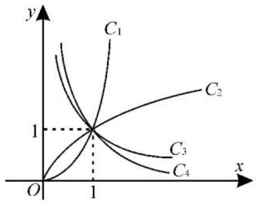

# 函数的概念与性质常见典型考题赏析

■张文伟 $^{1}$ 李卿 $^{2}$

# 题型 1: 求函数的定义域与函数的求值

求函数的定义域应关注两点:要明确使各函数表达式有意义的条件是什么,如分式的分母不为0,偶次根式的被开方数非负, $y=x^{0}$ 要求 $x\neq0$ ;当一个函数由两个或两个以上代数式的和、差、积、商的形式构成时,定义域是使得各式子都有意义的公共部分的集合。函数求值的两种方法:已知 $f(x)$ 的表达式,只需用a替换表达式中的x即得 $f(a)$ 的值;已知 $f(x)$ 与 $g(x)$ ,求 $f[g(a)]$ 的值,应遵循由里往外的原则。

例 1 (1) 函数 $f(x)=\sqrt{x(x-1)}-\frac{1}{\sqrt{x}}$ 的定义域为 \_\_\_\_。

(2)已知函数 $f(x)=x+\frac{1}{x}$ ，则 $f(2)=$ \_\_\_\_；当 $a\neq-1$ 时， $f(a+1)=$ \_\_\_\_。

解:(1)要使函数 $f(x)$ 有意义,需满足 $\left\{\begin{aligned}x(x-1)&\geqslant0,\\ x&>0,\end{aligned}\right.$ 解得 $x\geqslant1$ , 所以函数 $f(x)$ 的定义域为 $[1,+\infty)$ 。

(2) $f(2)=2+\frac{1}{2}=\frac{5}{2}$ 。

当 $a \neq -1$ 时， $a + 1 \neq 0$ ，所以 $f(a + 1) = a + 1 + \frac{1}{a + 1}$ 。

跟踪训练 1: 若函数 $f(x)=\frac{x^{2}}{1+x^{2}}$ , $g(x)=\sqrt{x}$ ，则 $f[g(a)]$ 的值为 \_\_\_\_。

提示:由题意知 $g(a)=\sqrt{a}$ ，则 $f[g(a)]=f(\sqrt{a})=\frac{(\sqrt{a})^{2}}{1+(\sqrt{a})^{2}}=\frac{a}{1+a}$ 。

# 题型 2: 求抽象函数的定义域

已知函数 $f(x)$ 的定义域为 $[a, b]$ ，求 $f[g(x)]$ 的定义域时，不等式 $a \leqslant g(x) \leqslant b$ 的解集即为定义域。已知 $f[g(x)]$ 的定义域为 $[c, d]$ ，求 $f(x)$ 的定义域时，求出 $g(x)$ 在 $[c, d]$ 上的范围（值域）即为定义域。

例 2 （1）函数 $y = f(x)$ 的定义域是 $[-1, 3]$ ，则 $f(2x + 1)$ 的定义域为 \_\_\_\_。

(2) 若函数 $y = f(3x + 1)$ 的定义域为 $[-2, 4]$ ，则 $y = f(x)$ 的定义域是（）。

A. $\left[-1,1\right]$

B. $\left[-5,13\right]$

C. $\left[-5,1\right]$

D. $\left[-1,13\right]$

解:(1)令 $-1\leqslant2x+1\leqslant3$ , 解得 $-1\leqslant x\leqslant1$ , 所以 $f(2x+1)$ 的定义域为 $[-1,1]$ 。

(2)由题意知 $-2 \leqslant x \leqslant 4$ ，所以 $-5 \leqslant 3x + 1 \leqslant 13$ ，所以函数 $y = f(x)$ 的定义域是 $[-5, 13]$ 。应选 B。

跟踪训练 2: 已知函数 $f(x-1)$ 的定义域为 $\{x \mid -2 \leqslant x \leqslant 3\}$ ，则函数 $f(2x+1)$ 的定义域为 \_\_\_\_。

提示:由函数 $y=f(x-1)$ 的定义域为 $\{x\mid-2\leqslant x\leqslant3\}$ ，可得 $-2\leqslant x\leqslant3$ ，所以 $-3\leqslant x-1\leqslant2$ ，即函数 $f(x)$ 的定义域为 $\{x\mid-3\leqslant x\leqslant2\}$ 。由函数 $f(2x+1)$ ，可得 $-3\leqslant2x+1\leqslant2$ ，解得 $-2\leqslant x\leqslant\frac{1}{2}$ ，即函数 $f(2x+1)$ 的定义域为 $\left\{x\mid-2\leqslant x\leqslant\frac{1}{2}\right\}$ 。

# 题型 3: 求简单函数的值域

求函数值域的四种方法: 观察法, 对于一些比较简单的函数, 其值域可通过观察得到; 配方法, 此方法是求“二次函数类”的值域的基本方法; 分离常数法, 此方法主要针对有理分式, 即将有理分式转化为“反比例函数类”的形式, 便于求值域; 换元法, 对于一些无理函数 (如 $y = ax \pm b \pm \sqrt{cx \pm d}$ ), 通过换元把它们转化为有理函数, 然后利用有理函数求值域的方法, 间接地求出原函数的值域。

例3 求下列函数的值域。

(1) $y=\sqrt{x}-1$ ; (2) $y=x^{2}-4x+6$ , $x\in[1,5]$ ; (3) $y=x^{4}+2x^{2}+3$ ; (4) $y=\frac{3x+2}{x-1}$ .

解:(1)因为 $\sqrt{x}\geqslant0$ ,所以 $\sqrt{x}-1\geqslant-1$ ,
所以 $y=\sqrt{x}-1$ 的值域为 $[-1,+\infty)$ 。

(2)配方得 $y=(x-2)^{2}+2$ 。因为 $x\in[1,5]$ ，所以 $2\leqslant y\leqslant11$ ，即所求函数的值域为 $[2,11]$ 。

(3) 令 $x^{2} = t, t \geqslant 0$ ，则 $g(t) = t^{2} + 2t + 3 = (t + 1)^{2} + 2$ 。由 $t \geqslant 0$ ，可得 $(t + 1)^{2} \geqslant 1$ ，所以 $g(t) \geqslant 3$ ，所以所求函数的值域为 $[3, +\infty)$ 。

(4) 因为 $y=\frac{3x+2}{x-1}=\frac{3(x-1)+5}{x-1}=3+\frac{5}{x-1}\neq3$ ，所以所求函数的值域为 $(-∞,3)∪(3,+∞)$ 。

跟踪训练 3: 求下列函数的值域。

(1) $y = 2x + 1, x \in \{1, 2, 3, 4, 5\}$ ; (2) $y = x^2 + 2x + 3$ ; (3) $y = x + 2\sqrt{x - 1}$ .

提示:(1)由 $y=2x+1$ , 且 $x\in\{1,2,3,4,5\}$ , 可得 $y\in\{3,5,7,9,11\}$ , 所以所求函数的值域为 $\{3,5,7,9,11\}$ 。

(2) $y = x^{2} + 2x + 3 = (x + 1)^{2} + 2$ 。由 $(x + 1)^{2} \geqslant 0$ ，可得 $(x + 1)^{2} + 2 \geqslant 2$ ，所以所求函数的值域为 $[2, +\infty)$ 。

(3) 令 $t = \sqrt{x - 1} (t \geqslant 0)$ , 则 $x = t^2 + 1$ , $g(t) = t^2 + 1 + 2t = (t + 1)^2$ 。由 $t \geqslant 0$ , 可得 $g(t) = (t + 1)^2 \geqslant 1$ , 所以所求函数的值域为 $[1, +\infty)$ 。

# 题型 4: 分段函数的求值(或范围)

分段函数求值的方法与步骤: 先确定要求值的自变量属于哪一段区间; 然后代入该段的解析式求值, 当出现 $f[f(x_{0})]$ 的形式时, 应从内到外依次求值。已知分段函数的函数值求对应的自变量的值, 可分段利用函数解析式求得自变量的值, 但应注意检验函数解析式的适用范围, 也可先判断每一段上的函数值的范围, 确定解析式再求解。若分段函数的自变量含参数, 则要考虑自变量整体的取值属于哪个区间, 根据对应的解析式整体代入, 转化为方程或不等式求解。

例 4 已知函数 $f(x)=\left\{\begin{aligned}x+1,x&\leqslant-2,\\ 3x+5,-2&<x<2,\\ 2x-1,x&\geqslant2.\end{aligned}\right.$

(1) 求 $f(-5), f(1), f\left[f\left(-\frac{5}{2}\right)\right]$ 。

(2) 若 $f(a^{2}+2) \geqslant a+4$ ，求实数 a 的取值范围。

解:(1)由 $-5\in(-\infty,-2]$ , $1\in(-2,2),-\frac{5}{2}\in(-\infty,-2]$ ，可得 $f(-5)=-5+1=-4,f(1)=3\times1+5=8,f\left[f\left(-\frac{5}{2}\right)\right]=f\left(-\frac{5}{2}+1\right)=f\left(-\frac{3}{2}\right)=3\times\left(-\frac{3}{2}\right)+5=\frac{1}{2}$ 。

(2) 因为 $a^{2} + 2 \geqslant 2$ ，所以 $f(a^{2} + 2) = 2(a^{2} + 2) - 1 = 2a^{2} + 3$ ，所以不等式 $f(a^{2} + 2) \geqslant a + 4$ 可转化为 $2a^{2} - a - 1 \geqslant 0$ ，解得 $a \geqslant 1$ 或 $a \leqslant -\frac{1}{2}$ ，即实数 a 的取值范围是 $(-∞, -\frac{1}{2}] ∪ [1, +∞)$ 。

跟踪训练 4: (1) 已知函数 $f(x)=\left\{\begin{aligned}x-2,x&<2,\\ f(x-1),&x\geqslant2,\end{aligned}\right.$ 则 $f(2)$ 等于()。

A.-1 B.0 C.1 D.2

（2）已知函数 $f(x) = \left\{ \begin{array}{l} \frac{1}{2} x + 1, x \leqslant 0, \\ -(x - 1)^2, x > 0, \end{array} \right.$ 使 $f(x) \geqslant -1$ 成立的 $x$ 取值范围是\_\_\_\_。

提示:(1)由题意得 $f(2)=f(2-1)=f(1)=1-2=-1$ 。应选 A。

(2) 当 $x \leqslant 0$ 时，由 $f(x) \geqslant -1$ ，可得 $\frac{1}{2}x + 1 \geqslant -1$ ，解得 $x \in [-4, 0]$ ；当 x > 0 时，由 $f(x) \geqslant -1$ ，可得 $-(x - 1)^{2} \geqslant -1$ ，解得 $x \in (0, 2]$ 。综上得 x 的取值范围是 $[-4, 2]$ 。

# 题型 5: 函数单调性的简单应用

已知函数解析式求参数,可利用函数单调性确定参数满足的条件;当函数 $f(x)$ 的解析式未知求参数时,可利用函数单调性的定义和性质,将符号“f”去掉,列出关于自变量的不等式(组)求解,此时应注意函数的定义域。

例 5 （1）若函数 $f(x) = -x^{2} - 2 (a + 1)x + 3$ 在区间 $(-∞, 3]$ 上单调递增，则实数 a 的取值范围是 \_\_\_\_。

（2）已知函数 $f(x) = \left\{ \begin{array}{l}(3a - 1)x + 4a, x < 1,\\ -ax, x \geqslant 1 \end{array} \right.$ 是定义在 $\mathbf{R}$ 上的减函数，则 $a$ 的取值范围为

解:(1)因为函数 $f(x)=-x^{2}-2(a+1)x+3=-(x+a+1)^{2}+(a+1)^{2}+3$ ，所以函数 $f(x)$ 的单调递增区间为 $(-∞,-a-1]$ 。因为 $f(x)$ 在 $(-∞,3]$ 上单调递增，所以 $3≤-a-1$ ，解得 $a≤-4$ ，即实数 a 的取值范围为 $(-∞,-4]$ 。

(2) 因为 $f(x)$ 是定义在 R 上的减函数，
所以 $\left\{\begin{aligned}&3a-1<0,\\ &-a<0,\\ &(3a-1)\times1+4a\geqslant-a\times1,\end{aligned}\right.$ 解得 $\frac{1}{8}\leqslant$ $a<\frac{1}{3}$ ，即实数 a 的取值范围为 $\left[\frac{1}{8},\frac{1}{3}\right)$ 。

跟踪训练 5: 已知 $f(2x-3) > f(5x-6)$ ，若 $f(x)$ 是 $(-∞, +∞)$ 上的增函数，则实数 x 的取值范围为 \_\_\_\_；若 $f(x)$ 是定义在 $(0, +∞)$ 上的减函数，则实数 x 的取值范围为 \_\_\_\_。

提示:已知 $f(x)$ 在 $(-∞,+∞)$ 上是增函数,且 $f(2x-3)>f(5x-6)$ ,可得 2x-3>5x-6,即 x<1,所以实数 x 的取值范围为 $(-∞,1)$ 。

已知 $f(x)$ 是定义在 $(0, +\infty)$ 上的减函数，则 $\left\{\begin{aligned}&2x-3>0,\\ &5x-6>0,\\ &2x-3<5x-6,\end{aligned}\right.$ 解得 $x>\frac{3}{2}$ ，所以实数 x 的取值范围为 $\left(\frac{3}{2}, +\infty\right)$ 。

# 题型 6: 利用函数的单调性求函数的最值

利用单调性求最值的一般步骤: 判断函数的单调性; 利用单调性求出最值。函数的最值与单调性的关系: 若函数 $f(x)$ 在闭区间 $[a, b]$ 上单调递减, 则 $f(x)$ 在 $[a, b]$ 上的最大值为 $f(a)$ , 最小值为 $f(b)$ ; 若函数 $f(x)$ 在闭区间 $[a, b]$ 上单调递增, 则 $f(x)$ 在 $[a, b]$ 上的最大值为 $f(b)$ , 最小值为 $f(a)$ ; 求最值时一定要注意所给区间的开闭, 若是开区间, 则不一定有最大(小)值。

例6 已知函数 $f(x) = \frac{3}{2x - 1}$ 。

(1) 证明: 函数 $f(x)$ 在 $\left(\frac{1}{2}, +\infty\right)$ 上单调递减。

(2) 求函数 $f(x)$ 在 $[1, 5]$ 上的最值。

解:(1)设 $x_{1}, x_{2}$ 是区间 $\left(\frac{1}{2}, +\infty\right)$ 上的任意两个实数, 且 $x_{2} > x_{1} > \frac{1}{2}$ , 则 $f(x_{1}) - f(x_{2}) = \frac{3}{2x_{1} - 1} - \frac{3}{2x_{2} - 1} = \frac{6(x_{2} - x_{1})}{(2x_{1} - 1)(2x_{2} - 1)}$ 。因为 $x_{2} > x_{1} > \frac{1}{2}$ , 所以 $x_{2} - x_{1} > 0$ , 且 $(2x_{1} - 1)(2x_{2} - 1) > 0$ , 所以 $f(x_{1}) - f(x_{2}) > 0$ , 即 $f(x_{1}) > f(x_{2})$ , 所以函数 $f(x) = \frac{3}{2x - 1}$ 在区间 $\left(\frac{1}{2}, +\infty\right)$ 上单调递减。

(2)由(1)知函数 $f(x)$ 在 $[1,5]$ 上单调递减, 所以 $f(x)=\frac{3}{2x-1}$ 在区间 $[1,5]$ 上的两个端点处分别取得最大值与最小值, 即最大值为 $f(1)=3$ , 最小值为 $f(5)=\frac{1}{3}$ 。

跟踪训练6:已知函数 $f(x)=\frac{2x+1}{x+1}$ 。

(1) 判断 $f(x)$ 在区间 $(-1, +\infty)$ 上的单调性，并用定义证明你的结论。
(2) 求 $f(x)$ 在区间 $[2, 4]$ 上的最大值和最小值。

提示:(1) $f(x)=\frac{2x+1}{x+1}=\frac{2x+2-1}{x+1}=$ $2-\frac{1}{x+1}$ ，则 $f(x)$ 在 $(-1,+\infty)$ 上单调递增。

证明如下： $\forall x_{1}, x_{2} \in (-1, +\infty)$ ，且 $x_{1} < x_{2}$ ，则 $x_{1} - x_{2} < 0$ ， $f(x_{1}) - f(x_{2}) = \left(2 - \frac{1}{x_{1} + 1}\right) - \left(2 - \frac{1}{x_{2} + 1}\right) = \frac{x_{1} - x_{2}}{(x_{1} + 1)(x_{2} + 1)} < 0$ ，即 $f(x_{1}) < f(x_{2})$ ，所以 $f(x)$ 在 $(-1, +\infty)$ 上单调递增。

(2)由(1)得 $f(x)$ 在区间 $[2,4]$ 上单调递增, 所以 $f(x)_{\max}=f(4)=2-\frac{1}{4+1}=\frac{9}{5}$ , $f(x)_{\min}=f(2)=2-\frac{1}{2+1}=\frac{5}{3}$ , 所以 $f(x)$ 在区间 $[2,4]$ 上的最大值为 $\frac{9}{5}$ , 最小值为 $\frac{5}{3}$ 。

# 题型 7: 利用函数的奇偶性求值

求函数解析式中参数的值, 可根据 $f(-x) = -f(x)$ 或 $f(-x) = f(x)$ ，利用待定系数法求解。若定义域含有参数，则根据定义域关于原点对称，利用区间端点值的和为 0 求参数的值。

例 7 （1）若函数 $f(x)=ax^{2}+bx+3a+b$ 是偶函数，定义域为 $[a-1,2a]$ ，则 a=\_\_\_\_，b=\_\_\_\_。

(2)已知函数 $f(x)=x^{7}-ax^{5}+bx^{3}+cx+2$ ，若 $f(-3)=-3$ ，则 $f(3)=$ \_\_\_\_。

解:(1)因为偶函数的定义域关于原点对称,所以 $a-1+2a=0$ , 解得 $a=\frac{1}{3}$ 。

函数 $f(x)=\frac{1}{3}x^{2}+bx+b+1$ 为二次函数，结合偶函数图像的特征，易得 b=0。

(2) 令 $g(x) = x^7 - ax^5 + bx^3 + cx$ ，则 $g(x)$ 是奇函数，所以 $f(-3) = g(-3) + 2 = -g(3) + 2$ 。

因为 $f(-3)=-3$ ，所以 $g(3)=5$ 。又因为 $f(3)=g(3)+2$ ，所以 $f(3)=5+2=7$ 。

跟踪训练 7: (1) 已知函数 $f(x)=ax^{2}+2x$ 是奇函数，则 $f(1)=$ \_\_\_\_。

(2)已知函数 $f(x)=\frac{(x+1)(x+a)}{x}$ 为奇函数,则 a=\_\_\_\_。

提示:(1)由奇函数的定义得 $f(-x)+f(x)=0$ ，即 $a(-x)^{2}+2(-x)+ax^{2}+2x=2ax^{2}=0$ 。此式对 $\forall x\in R$ 恒成立，所以 a=0，所以 $f(x)=2x$ ，所以 $f(1)=2$ 。

(2) 因为函数 $f(x)$ 为奇函数, 所以 $f(-x) = -f(x)$ , 即 $\frac{(-x + 1)(-x + a)}{-x} = -\frac{(x + 1)(x + a)}{x}$ 。显然 $x \neq 0$ , 整理得 $x^2 - (a + 1)x + a = x^2 + (a + 1)x + a$ , 所以 $2(a + 1)x = 0$ , 所以 $a + 1 = 0$ , 即 $a = -1$ 。

# 题型 8: 利用函数的奇偶性与单调性比较大小

若自变量在同一个单调区间上,直接利用函数的单调性比较大小;若自变量不在同一个单调区间上,可利用函数的奇偶性把自

变量转化到同一个单调区间上,然后利用单调性比较大小。

例 8 已知 $f(x)$ 是奇函数, 且在区间 $[0, +\infty)$ 上单调递增, 则 $f(-0.5), f(-1), f(0)$ 的大小关系是()。

A. $f(-0.5) < f(0) < f(-1)$

B. $f(-1) < f(-0.5) < f(0)$

C. $f(0) < f(-0.5) < f(-1)$

D. $f(-1) < f(0) < f(-0.5)$

解:由函数 $f(x)$ 为奇函数,且 $f(x)$ 在区间 $[0,+\infty)$ 上单调递增,可得 $f(x)$ 在 R 上单调递增。因为 -1<0.5<0,所以 $f(-1)<f(-0.5)<f(0)$ 。应选 B。

跟踪训练8:设函数 $f(x)$ 的定义域为 R, 对于任意实数 x, 总有 $f(-x)=f(x)$ , 当 $x\in[0,+\infty)$ 时, $f(x)$ 单调递增, 则 $f(-2)$ , $f(\pi)$ , $f(-3)$ 的大小关系是()。

A. $f(\pi) > f(-3) > f(-2)$

B. $f(\pi) > f(-2) > f(-3)$

C. $f(\pi) < f(-3) < f(-2)$

D. $f(\pi) < f(-2) < f(-3)$

提示:(方法1)由题意知 $f(x)$ 为偶函数, 则 $f(-2)=f(2)$ , $f(-3)=f(3)$ 。当 $x\in[0,+\infty)$ 时, 函数 $f(x)$ 单调递增, 且 $2<3<\pi$ , 所以 $f(2)<f(3)<f(\pi)$ , 即 $f(\pi)>f(-3)>f(-2)$ 。应选 A。

(方法 2)由偶函数与单调性的关系可知, 当 $x \in [0, +\infty)$ 时, $f(x)$ 单调递增, 当 $x \in (-\infty, 0]$ 时, $f(x)$ 单调递减, 故其图像的几何特征是自变量的绝对值越小, 其函数值越小。因为 $|-2| < |-3| < \pi$ , 所以 $f(\pi) > f(-3) > f(-2)$ 。应选 A。

# 题型 9: 利用函数的单调性与奇偶性解不等式

将所给的不等式转化为两个函数值的大小关系,利用奇偶性得出区间上的单调性,然后利用单调性“脱去”函数的对应法则“f”,最后转化为解不等式问题。

例 9 设定义在 $[-2,2]$ 上的奇函数 $f(x)$ 在区间 $[0,2]$ 上单调递减，若 $f(1-m)<f(m)$ ，求实数 m 的取值范围。

解: 因为 $f(x)$ 是奇函数且 $f(x)$ 在 $[0,2]$ 上单调递减,所以 $f(x)$ 在 $[-2,2]$ 上单调递减,所以不等式 $f(1-m)<f(m)$ 等价于 $\left\{\begin{aligned}&1-m>m,\\ &-2\leqslant m\leqslant2,\quad 解得 -1\leqslant m<\frac{1}{2},\\ &-2\leqslant1-m\leqslant2,\end{aligned}\right.$ 数 m 的取值范围为 $\left[-1,\frac{1}{2}\right)$ 。

跟踪训练 9: 已知 $f(x)$ 是定义在 R 上的偶函数, 且在区间 $(-∞,0)$ 上单调递增。若 $f(-3)=0$ , 则 $\frac{f(x)}{x}<0$ 的解集为 \_\_\_\_。

提示: 因为 $f(x)$ 是定义在 R 上的偶函数, 且在区间 $(-∞,0)$ 上单调递增, 所以 $f(x)$ 在区间 $(0,+\infty)$ 上单调递减, 所以 $f(3)=f(-3)=0$ 。当 x>0 时, 由 $f(x)<0=f(3)$ , 解得 x>3; 当 x<0 时, 由 $f(x)>0=f(-3)$ , 解得 -3<x<0。故所求的解集为 $\{x|-3<x<0$ 或 $x>3\}$ 。

# 题型 10: 幂函数的图像与性质

对于幂函数 $y=x^{\alpha}$ ( $\alpha$ 是常数)，由于 $\alpha$ 的取值不同，因此相应幂函数的单调性和奇偶性也不同。比较幂值大小的两种基本方法：直接法，当幂的指数相同时，可直接利用幂函数的单调性比较大小；转化法，当幂的指数不同时，可转化为相同的幂指数，再利用单调性比较大小。

例 10 图 1 中的曲线是幂函数 $y = x^{n}$ 在第一象限内的图像, 已知 n 取 $\pm 2, \pm \frac{1}{2}$ 四个值, 则对应于曲线 $C_{1}, C_{2}, C_{3}, C_{4}$ 的 n 依次为( )。

text_image

y
C₁
C₂
1
O
1
x
C₃
C₄

图 1

A. $-2, -\frac{1}{2}, \frac{1}{2}, 2$

B. $2, \frac{1}{2}, -\frac{1}{2}, -2$

C. $-\frac{1}{2},-2,2,\frac{1}{2}$

D. $2, \frac{1}{2}, -2, -\frac{1}{2}$

解:由幂函数 $y=x^{n}$ 的性质,结合在第一象限内的图像可知,当 n>0 时,n 越大, $y=x^{n}$ 递增速度越快,故曲线 $C_{1}$ 的 n=2,曲线 $C_{2}$ 的 $n=\frac{1}{2}$ 。当 n<0 时, $|n|$ 越大,曲线越陡峭,所以曲线 $C_{3}$ 的 $n=-\frac{1}{2}$ ,曲线 $C_{4}$ 的 n=-2。应选 B。

跟踪训练 10: (1) 比较下列各组数中两个数的大小。

① $\left(\frac{2}{5}\right)^{0.3}$ 与 $\left(\frac{1}{3}\right)^{0.3}$ ; ② $\left(-\frac{2}{3}\right)^{-1}$ 与 $\left(-\frac{3}{5}\right)^{-1}$ ; ③ $\left(\frac{\sqrt{2}}{2}\right)^{-\frac{1}{2}}$ 与 $\sqrt{5}^{\frac{1}{4}}$ 。

(2)已知幂函数 $f(x)=(m^{2}-2m+1)\cdot x^{m-\frac{3}{2}}$ 的图像过点(4,2)。①求 $f(x)$ 的解析式；②判断函数 $f(x)$ 的单调性，并进行证明；③若 $f(a+1)>f(2a-3)$ ，求实数 a 的取值范围。

提示:(1)①幂函数 $y=x^{0.3}$ 在 $(0,+\infty)$ 上是增函数,且 $\frac{2}{5}>\frac{1}{3}$ ,所以 $\left(\frac{2}{5}\right)^{0.3}>\left(\frac{1}{3}\right)^{0.3}$ 。

②幂函数 $y=x^{-1}$ 在 $(-∞,0)$ 上是减函数，且 $-\frac{2}{3}<-\frac{3}{5}$ ，所以 $\left(-\frac{2}{3}\right)^{-1}>\left(-\frac{3}{5}\right)^{-1}$ 。

③ $\left(\frac{\sqrt{2}}{2}\right)^{-\frac{1}{2}} = \sqrt{2}^{\frac{1}{2}} = 2^{\frac{1}{4}}$ 。因为幂函数 $y = x^{\frac{1}{4}}$ 在 $(0, +\infty)$ 上单调递增，且 $2 < \sqrt{5}$ ，所以 $2^{\frac{1}{4}} < \sqrt{5}^{\frac{1}{4}}$ ，即 $\left(\frac{\sqrt{2}}{2}\right)^{-\frac{1}{2}} < \sqrt{5}^{\frac{1}{4}}$ 。

(2)①因为 $f(x) = (m^2 - 2m + 1)x^{m - \frac{3}{2}}$ 为幂函数，所以 $m^2 - 2m + 1 = 1$ ，解得 $m = 2$ 或 $m = 0$ 。当 $m = 2$ 时， $f(x) = x^{\frac{1}{2}}$ ，其图像过点(4,2)；当 $m = 0$ 时， $f(x) = x^{-\frac{3}{2}}$ ，其图像不过点(4,2)，不符合题意。综上得 $f(x) = x^{\frac{1}{2}}$ 。

② $f(x)=x^{\frac{1}{2}}$ 在 $[0,+\infty)$ 上为增函数。

设 $x_{1}, x_{2} \in [0, +\infty)$ ，且 $x_{1} < x_{2}$ ，则 $f(x_{1}) - f(x_{2}) = \sqrt{x_{1}} - \sqrt{x_{2}} = \frac{x_{1} - x_{2}}{\sqrt{x_{1}} + \sqrt{x_{2}}}$ 。

因为 $0 \leqslant x_{1} < x_{2}, \frac{x_{1} - x_{2}}{\sqrt{x_{1}} + \sqrt{x_{2}}} < 0$ ，所以 $f(x_{1}) - f(x_{2}) < 0$ ，所以 $f(x_{1}) < f(x_{2})$ ，所以函数 $f(x)$ 在 $[0, +\infty)$ 上为增函数。

③已知函数 $f(x)$ 在 $[0, +\infty)$ 上为增函数，由 $f(a + 1) > f(2a - 3)$ ，可得 $\left\{ \begin{array}{l} a + 1 > 2a - 3, \\ 2a - 3 \geqslant 0, \\ a + 1 \geqslant 0, \end{array} \right.$ 解得 $\frac{3}{2} \leqslant a < 4$ ，所以实数 $a$ 的取值范围为 $\left[\frac{3}{2}, 4\right)$ 。

# 题型 11:二次函数模型的应用

解决这类问题,可利用配方法、判别式法、换元法,以及函数的单调性等方法求最值,从而解决实际问题中的利润最大、用料最省等问题,但要注意取得最值时的自变量与实际意义是否相符。

例 11 某水果批发商销售每箱进价为40元的苹果,假设每箱售价不得低于50元且不得高于55元。市场调查发现,若每箱以50元的价格销售,平均每天销售90箱,价格每提高1元,平均每天少销售3箱。

(1)求平均每天的销售量 y(箱)与销售单价 x(元/箱)之间的函数关系式。  
(2)求该批发商平均每天的销售利润 w (元)与销售单价 x (元/箱)之间的函数关系式。  
(3)当每箱苹果的售价为多少元时,可以获得最大利润?最大利润是多少?

解:(1)根据题意得 $y=90-3(x-50)$ ，化简得 $y=-3x+240(50\leqslant x\leqslant55,x\in\mathbb{N})$ 。

(2)因为该批发商平均每天的销售利润 $=$ 平均每天的销售量 $\times$ 每箱销售利润，所以 $w = (x - 40)(-3x + 240) = -3x^{2} + 360x-$ 9600(50≤x≤55,x∈N)。

(3) 因为 $w = -3x^{2} + 360x - 9600 = -3(x - 60)^{2} + 1200$ ，所以当 x < 60 时，w 随 x 的增大而增大。又 $50 \leqslant x \leqslant 55, x \in N$ ，所以当 x = 55 时，w 有最大值，其最大值为 1125。

所以当每箱苹果的售价为 55 元时, 可以获得最大利润, 且最大利润为 1125 元。

跟踪训练 11: 据市场分析, 某海鲜加工公司当月产量在 10 t 至 25 t 时, 月总成本

y(万元)可以看成月产量 $x(t)$ 的二次函数。当月产量为 10 t 时，月总成本为 20 万元；当月产量为 15 t 时，月总成本最低为 17.5 万元，为二次函数的顶点。

(1) 写出月总成本 $y$ (万元) 关于月产量 $x(t)$ 的函数关系式。  
(2)已知该产品销售价为每吨1.6万元,那么月产量为多少时,可获最大利润?

提示:(1)由(15,17.5)为二次函数的顶点,可设 $y=a(x-15)^{2}+17.5(a\neq0)$ 。将 x=10,y=20 代入上式得 $20=25a+17.5$ , 解得 $a=\frac{1}{10}$ 。所以函数 $y=\frac{1}{10}(x-15)^{2}+17.5(10\leqslant x\leqslant25)$ 。

(2) 设最大利润为 $Q(x)$ , 则 $Q(x) = 1.6x - y = 1.6x - \left[\frac{1}{10}(x - 15)^2 + 17.5\right] = -\frac{1}{10}(x - 23)^2 + 12.9 (10 \leqslant x \leqslant 25)$ 。所以当月产量为 $23\mathrm{t}$ 时, 可获最大利润 12.9 万元。

# 题型 12: 函数图像的对称性

函数图像关于直线对称,如表 1 所示。

表 1

<table><tr><td>y=f(x)在定义域内恒满足的条件</td><td>y=f(x)的图像的对称轴</td></tr><tr><td>f(a+x)=f(a-x)</td><td>直线x=a</td></tr><tr><td>f(x)=f(a-x)</td><td>直线x=a/2</td></tr><tr><td>f(a+x)=f(b-x)</td><td>直线x=a+b/2</td></tr></table>

函数图像关于点对称,如表 2 所示。

表 2

<table><tr><td>y=f(x)在定义域内恒满足的条件</td><td>y=f(x)的图像的对称中心</td></tr><tr><td>f(a-x)=-f(a+x)</td><td>(a,0)</td></tr><tr><td>f(x)=-f(a-x)</td><td>(a/2,0)</td></tr><tr><td>f(a+x)=-f(b-x)</td><td>(a+b/2,0)</td></tr><tr><td>f(a+x)+f(b-x)=c</td><td>(a+b/2,c/2)</td></tr></table>

友情提示: 若函数 $f(x+a)$ 是偶函数, 则函数 $f(x)$ 关于 x=a 对称; 若函数 $f(x+a)$

是奇函数,则函数 $f(x)$ 关于点 $(a,0)$ 对称。

例 12 已知定义在 R 上的偶函数 $y = f(x)$ ，其图像关于点 $\left(\frac{1}{2}, 0\right)$ 对称，且当 $x \in [0, 1]$ 时， $f(x) = -x + \frac{1}{2}$ ，则 $f\left(\frac{3}{2}\right)$ 等于（）。

A. -1

B. 0

C. 1

D. $\frac{3}{2}$

解:由 $y=f(x)$ 的图像关于点 $\left(\frac{1}{2},0\right)$ 对称, 可得 $f\left(\frac{1}{2}+x\right)+f\left(\frac{1}{2}-x\right)=0$ , 所以 $f(1+x)+f(-x)=0$ 。由 $y=f(x)$ 为偶函数, 可得 $f(-x)=f(x)$ , 所以 $f(1+x)+f(x)=0$ , 即 $f(1+x)=-f(x)$ , 所以 $f\left(\frac{3}{2}\right)=f\left(1+\frac{1}{2}\right)=-f\left(\frac{1}{2}\right)=\frac{1}{2}-\frac{1}{2}=0$ 。应选 B。

跟踪训练 12: 若函数 $f(x)$ 在 $(0,2)$ 上单调递增, 函数 $f(x+2)$ 是偶函数, 则下列结论正确的是()。

A. $f(1) <   f\left(\frac{5}{2}\right) <   f\left(\frac{7}{2}\right)$

B. $f\left(\frac{7}{2}\right) <   f(1) <   f\left(\frac{5}{2}\right)$

C. $f\left(\frac{7}{2}\right) <   f\left(\frac{5}{2}\right) <   f(1)$

D. $f\left(\frac{5}{2}\right) <   f(1) <   f\left(\frac{7}{2}\right)$

提示: 由 $f(x+2)$ 是偶函数, 可得 $f(2-x)=f(2+x)$ , 所以函数 $f(x)$ 的图像关于直线 x=2 对称, 所以 $f\left(\frac{5}{2}\right)=f\left(\frac{3}{2}\right)$ , $f\left(\frac{7}{2}\right)=f\left(\frac{1}{2}\right)$ 。因为 $f(x)$ 在 $(0,2)$ 上单调递增, 且 $\frac{1}{2}<1<\frac{3}{2}$ , 所以 $f\left(\frac{1}{2}\right)<f(1)<f\left(\frac{3}{2}\right)$ , 所以 $f\left(\frac{7}{2}\right)<f(1)<f\left(\frac{5}{2}\right)$ 。应选 B。

# 题型 13: 函数性质的综合应用

解答这类问题,要熟练掌握函数的奇偶性、单调性的性质及变形,灵活应用解题技巧进行化简、求值及证明,但要特别注意函数的定义域。

例 13 已知函数 $f(x)=\frac{ax+b}{1+x^{2}}$ 是定义
在 $(-1,1)$ 上的奇函数，且 $f\left(\frac{1}{2}\right)=\frac{2}{5}$ 。

(1) 确定函数 $f(x)$ 的解析式。

(2)用定义法证明 $f(x)$ 在 $(-1,1)$ 上是增函数。

(3) 解不等式 $f(t-1)+f(t)<0$ 。

解:(1)根据题意得 $\left\{\begin{aligned}f(0)&=0,\\ f\left(\frac{1}{2}\right)&=\frac{2}{5},\end{aligned}\right.$ 所以 $\left\{\begin{aligned}&\frac{a\times0+b}{1+0^{2}}=0,\\&\frac{a}{2}+b\\&\frac{1}{1+\frac{1}{4}}=\frac{2}{5},\end{aligned}\right.$ 解得 $\left\{\begin{aligned}a&=1,\\ b&=0,\end{aligned}\right.$ 所以函数 $f(x)=$ $\frac{x}{1+x^{2}},x\in(-1,1)$ 。

(2)任取 $x_{1}, x_{2} \in (-1, 1)$ , 且 $x_{1} < x_{2}$ , 则 $f(x_{1}) - f(x_{2}) = \frac{x_{1}}{1 + x_{1}^{2}} - \frac{x_{2}}{1 + x_{2}^{2}} = \frac{(x_{1} - x_{2})(1 - x_{1}x_{2})}{(1 + x_{1}^{2})(1 + x_{2}^{2})}$ 。因为 $-1 < x_{1} < x_{2} < 1$ , 所以 $x_{1} - x_{2} < 0, 1 + x_{1}^{2} > 0, 1 + x_{2}^{2} > 0, 1 - x_{1}x_{2} > 0$ , 所以 $f(x_{1}) - f(x_{2}) < 0$ , 即 $f(x_{1}) < f(x_{2})$ , 所以 $f(x)$ 在 $(-1, 1)$ 上是增函数。

(3) 易得 $f(t-1) < -f(t) = f(-t)$ 。因为函数 $f(x)$ 在 $(-1,1)$ 上是增函数，所以 $\left\{\begin{aligned}-1<t-1<1,\\ -1<-t<1,\end{aligned}\right.$ 解得 $0<t<\frac{1}{2}$ ，所以所求不 $t-1<-t,$ 等式的解集为 $\left\{t\mid0<t<\frac{1}{2}\right\}$ 。

跟踪训练 13: 已知函数 $f(x)$ 的定义域为 $(-2, 2)$ ，函数 $g(x) = f(x - 1) + f(3 - 2x)$ 。

(1) 求函数 $g(x)$ 的定义域。

(2) 若 $f(x)$ 为奇函数, 且在定义域上是减函数, 求不等式 $g(x) \leqslant 0$ 的解集。

提示:(1)由题意知 $\left\{\begin{aligned}-2<x-1<2,\\ -2<3-2x<2,\end{aligned}\right.$ 解得 $\left\{\begin{aligned}-1<x<3,\\ \frac{1}{2}<x<\frac{5}{2},\end{aligned}\right.$ 即 $\frac{1}{2}<x<\frac{5}{2}$ ，所以函数

$g(x)$ 的定义域为 $\left(\frac{1}{2}, \frac{5}{2}\right)$ 。

(2) 由 $g(x) \leqslant 0$ ，可得 $f(x - 1) + f(3 - 2x) \leqslant 0$ ，所以 $f(x - 1) \leqslant -f(3 - 2x)$ 。因为 $f(x)$ 为奇函数，所以 $f(x - 1) \leqslant f(2x - 3)$ 。

又 $f(x)$ 在 $(-2, 2)$ 上是减函数，所以 $\left\{ \begin{array}{l} x - 1 \geqslant 2x - 3, \\ \frac{1}{2} < x < \frac{5}{2}, \end{array} \right.$ 解得 $\frac{1}{2} < x \leqslant 2$ ，所以不等式 $g(x) \leqslant 0$ 的解集为 $\left(\frac{1}{2}, 2\right]$ 。

# 题型 14: 对钩函数的图像与性质

函数 $f(x) = x + \frac{a}{x} (a \neq 0)$ 的单调性: 当 $a > 0$ 时, 在区间 $(- \infty, -\sqrt{a})$ 和 $(\sqrt{a}, +\infty)$ 上单调递增, 在区间 $[- \sqrt{a}, 0)$ 和 $(0, \sqrt{a}]$ 上单调递减; 当 $a < 0$ 时, 在区间 $(- \infty, 0)$ 和 $(0, +\infty)$ 上单调递增。求对钩函数的最值, 可以利用函数的单调性及图像求最值, 也可以利用基本不等式求最值。

例14 已知函数 $f(x) = x + \frac{1}{x}$ 。

(1) $x\in[1,3]$ , $f(x)$ 的最小值是\_\_\_\_。

(2) $x\in\left[\frac{1}{2},3\right]$ , $f(x)$ 的值域为\_\_\_\_。

(3) $x\in\left[-\frac{1}{2},0\right)\cup(0,3],f(x)$ 的值域为\_\_\_\_。

解:(1)因为 $f(x)$ 在 $[1,3]$ 上单调递增, 所以 $f(x)$ 的最小值为 $f(1)=2$ 。

(2) 因为函数 $f(x)$ 在 $\left[\frac{1}{2}, 1\right]$ 上单调递减，在 $[1,3]$ 上单调递增，所以最小值为 $f(1) = 2$ 。因为 $f\left(\frac{1}{2}\right) = \frac{5}{2} < \frac{10}{3} = f(3)$ ，所以最大值为 $f(3) = \frac{10}{3}$ ，所以函数 $f(x)$ 在 $\left[\frac{1}{2}, 3\right]$ 上的值域为 $\left[2, \frac{10}{3}\right]$ 。

(3)已知 $x\in \left[-\frac{1}{2},0\right)\cup (0,3]$ 。

因为函数 $f(x)$ 在 $\left[-\frac{1}{2}, 0\right)$ 上单调递减，且 $f\left(-\frac{1}{2}\right) = -\frac{5}{2}$ ，所以 $f(x)$ 在 $\left[-\frac{1}{2}, 0\right)$

0）上的值域是 $\left(-\infty,-\frac{5}{2}\right]$ 。

又 $f(x)$ 在 $(0,3] = (0,1]\cup [1,3]$ 上先单调递减，然后单调递增，且在 $f(1)$ 处取得最小值 $f(1) = 2$ ，所以 $f(x)$ 在 $(0,3]$ 上的值域是 $[2, + \infty)$ 。

故 $f(x)$ 在 $\left[-\frac{1}{2},0\right)\cup (0,3]$ 上的值域为 $\left(-\infty , - \frac{5}{2}\right]\cup [2, + \infty)$ 。

跟踪训练 14: 已知函数 $f(x)=\frac{x^{2}-2x+a}{x}$ 。

(1) 当 a=4 时, 求函数 $f(x)$ 在 $x\in(0,+\infty)$ 上的最小值。

(2) 当 a > 0 时, 求函数 $f(x)$ 在 $[2, +\infty)$ 上的最小值。

提示:(1) 当 a=4 时, 函数 $f(x)=\frac{x^{2}-2x+4}{x}=x+\frac{4}{x}-2$ 。当 $x\in(0,+\infty)$ 时, $f(x)=x+\frac{4}{x}-2\geqslant2\sqrt{x\cdot\frac{4}{x}}-2=2$ , 当且仅当 $x=\frac{4}{x}$ , 即 x=2 时等号成立, 所以 $f(x)$ 的最小值为 2。

(2) 函数 $f(x)=x+\frac{a}{x}-2$ 。

由对钩函数的图像与性质可知, 函数 $f(x)$ 在 $(0, \sqrt{a})$ 上单调递减, 在 $(\sqrt{a}, +\infty)$ 上单调递增。

当 $0 < a \leqslant 4$ 时， $0 < \sqrt{a} \leqslant 2$ ，函数 $f(x)$ 在 $[2, +\infty)$ 上单调递增，则 $f(x)_{\min} = f(2) = \frac{a}{2}$ ；当 $a > 4$ 时， $\sqrt{a} > 2$ ，函数 $f(x)$ 在 $[2, \sqrt{a}]$ 上单调递减，在 $[\sqrt{a}, +\infty)$ 上单调递增，则 $f(x)_{\min} = f(\sqrt{a}) = 2\sqrt{a} - 2$ 。

设 $f(x)$ 的最小值为 $g(a)$ ，即 $f(x)_{\min} = g(a)$ ，则 $g(a) = \begin{cases} \frac{a}{2}, & 0 < a \leqslant 4, \\ 2\sqrt{a} - 2, & a > 4. \end{cases}$

作者单位:1. 河南省开封高级中学

2. 深圳市富源学校

(责任编辑 郭正华)