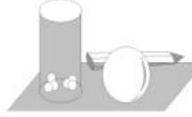

# 函数的概念与性质核心考点强化训练

# ■刘中亮(特级教师)

# 一、选择题

1. 若函数 $y = f(3x - 1)$ 的定义域是[1,3], 则函数 $y = f(x)$ 的定义域是（ ）。

A. $[1,3]$

B. $[2,4]$

C. $[2,8]$

D. $[3,9]$

2. 已知函数 $f(x) = \left\{ \begin{array}{l} x^2 + 2ax + 3, x \leqslant 1, \\ ax + 1, x > 1 \end{array} \right.$ 是定义在 $\mathbf{R}$ 上的减函数，则 $a$ 的取值范围是（ ）。

A. $\left[-3,-1\right]$

B. $(-∞,-1]$

C. $\left[-1,0\right)$

D. $\left[-2,0\right)$

3. 定义在 $(0, +\infty)$ 上的函数 $f(x)$ 满足 $\frac{x_1 f(x_1) - x_2 f(x_2)}{x_1 - x_2} < 0$ ，且 $f(2) = 4$ ，则不等式 $f(x) - \frac{8}{x} > 0$ 的解集为（ ）。

A. $(4,+\infty)$

B. $(0,4)$

C. $(0,2)$

D. $(2,+\infty)$

4. 设函数 $f(x)$ 的定义域为 R，则“函数 $y = |f(x)|$ 的图像关于 y 轴对称”是“函数 $f(x)$ 为奇函数”的（）。

A. 充分不必要条件

B. 必要不充分条件

C. 充要条件

D. 既不充分也不必要条件

5. 设 $f(x)$ 是定义域为 $\mathbf{R}$ 的奇函数, 且 $f(1 + x) = f(-x)$ , 若 $f\left(-\frac{1}{3}\right) = \frac{1}{3}$ , 则 $f\left(\frac{5}{3}\right) = (\quad)$ 。

A. $-\frac{5}{3}$

B. $-\frac{1}{3}$

C. $\frac{1}{3}$

D. $\frac{5}{3}$

6. 已知函数 $f(x) = x^{2} - 4x + 5$ 在 $[m, n]$ 上的值域是 $[1, 10]$ ，则 n - m 的最大值是（）。

A. 3

B. 6

C. 4

D. 8

7. 已知函数 $f(x)$ 的定义域是 $(0, +\infty)$ ，且满足 $f(xy) = f(x) + f(y), f\left(\frac{1}{2}\right) = 1$ ，如果对于任意 $x, y \in (0, +\infty)$ ，且 $x < y$ ，都有 $f(x) > f(y)$ ，那么不等式 $f(-x) + f(3 - x) \geqslant -2$ 的解集为（ ）。

A. $\left[-4,0\right)$

B. $[-1,0)$

C. $(-∞,0]$

D. $[-1, 4]$

8. 已知函数 $f(x)$ 在区间(0,2)上单调递减，且函数 $y = f(x + 2)$ 是偶函数，那么函数 $f(x)()$ 。

A. 在区间(2,4)上单调递减

B. 在区间(2,4)上单调递增

C. 在区间 $(-2,0)$ 上单调递减

D. 在区间 $(-2,0)$ 上单调递增

9. 已知偶函数 $f(x)$ 在区间 $[0, +\infty)$ 上单调递增，且图像经过点 $(-1, 0)$ 和 $(3, 5)$ ，则当 $x \in [-3, -1]$ 时，函数 $f(x)$ 的值域是（）。

A. $[0,5]$

B. $\left[-1,5\right]$

C. $[1,3]$

D. $[3,5]$

10. 若定义在 $\mathbf{R}$ 上的函数 $f(x)$ 满足: 对任意 $x_{1}, x_{2} \in \mathbf{R}$ , 有 $f(x_{1} + x_{2}) = f(x_{1}) + f(x_{2}) + 1$ , 则下列说法一定正确的是 ( )。

A. $f(x) - 1$ 为奇函数

B. $f(x)-1$ 为偶函数

C. $f(x)+1$ 为奇函数

D. $f(x) + 1$ 为偶函数

11. 如果奇函数 $f(x)$ 在区间 $[-3, -1]$ 上单调递增且有最大值 5，那么函数 $f(x)$ 在区间 $[1, 3]$ 上（）。

A. 单调递增且最小值为 -5

B. 单调递增且最大值为 -5

C. 单调递减且最小值为 -5

D. 单调递减且最大值为 -5

12. 若奇函数 $f(x)$ 在 $(-∞,0)$ 上的解析式为 $f(x)=x(1+x)$ ，则 $f(x)$ 在 $(0,+∞)$ 上有（）。

A. 最大值 $-\frac{1}{4}$

B. 最大值 $\frac{1}{4}$

C. 最小值 $-\frac{1}{4}$

D. 最小值 $\frac{1}{4}$

13. 已知函数 $f(x) = ax^3 + bx + 1 (ab \neq 0)$ ，若 $f(2025) = k$ ，则 $f(-2025)$ 等于（）。

A. $k$

B. -k

C. 1-k

D. 2-k

14.(多选题)下列函数中,既是偶函数又在 $(0,+\infty)$ 上单调递增的函数是()。

A. y = x

B. $y = |x| + 1$

C. $y = x^{\frac{2}{3}}$

D. $y = -\frac{1}{x}$

15.(多选题)函数 $f(x)$ 是定义在 R 上的奇函数,下列命题中正确的是()。

A. $f(0)=0$

B. 若 $f(x)$ 在 $[0, +\infty)$ 上有最小值 -1，则 $f(x)$ 在 $(-∞, 0]$ 上有最大值 1

C. 若 $f(x)$ 在 $[1, +\infty)$ 上单调递增，则 $f(x)$ 在 $(- \infty, -1]$ 上单调递减

D. 若 $x > 0, f(x) = x^2 - 2x$ ，则当 $x < 0$ 时， $f(x) = -x^2 - 2x$

16.(多选题)对于定义域为 D 的函数 $y=f(x)$ ，若同时满足：① $f(x)$ 在 D 内单调递增或单调递减，② 存在区间 $[a,b]\subseteq D$ ，使 $f(x)$ 在 $[a,b]$ 上的值域为 $[a,b]$ ，则把 $y=f(x)(x\in D)$ 称为闭函数。下列结论正确的是（）。

A. 函数 $y = x^{2} + 1$ 是闭函数

B. 函数 $y = -x^{3}$ 是闭函数

C. 函数 $y=\frac{x}{x+1}$ 是闭函数

D. 当 k = -2 时, $y = k + \sqrt{x + 2}$ 是闭函数

17.(多选题)若函数 $f(x)$ 是定义域为 R 的偶函数,且该函数图像与 x 轴的交点有 3 个,则下列说法正确的是()。

A. 3 个交点的横坐标之和为 0

B.3个交点的横坐标之和不是定值，与

函数解析式有关

C. $f(0)=0$

D. $f(0)$ 的值与函数解析式有关

18.(多选题)已知定义在R上的奇函数 $f(x)$ 为减函数,偶函数 $g(x)$ 在区间 $[0,+\infty)$ 上的图像与 $f(x)$ 的图像重合,设 $a>b>0$ ,则下列不等式中成立的是()。

A. $f(b) - f(-a) <   g(a) - g(-b)$

B. $f(b)-f(-a) > g(a)-g(-b)$

C. $f(a) + f(-b) <   g(b) - g(-a)$

D. $f(a) + f(-b) > g(b) - g(-a)$

19.(多选题)已知函数 $y=\frac{3}{x}$ ，则下列结论中正确的是()。

A. 其图像经过点(3,1)

B. 其图像分别位于第一、三象限

C. 当 x > 0 时, y 随 x 的增大而减小

D. 当 $x > 1$ 时, $y > 3$

20.(多选题)下列函数中,满足对任意 $x_{1},x_{2}\in(1,+\infty)$ ,有 $\frac{f(x_{1})-f(x_{2})}{x_{1}-x_{2}}<0$ 的是()。

A. $f(x) = x + \frac{1}{x}$

B. $f(x) = \frac{3}{1 - x}$

C. $f(x) = 1 + \frac{1}{x}$

D. $f(x) = -x - \frac{1}{x}$

# 二、填空题

21. 设 $f(x)$ 是定义域为 R 的奇函数, 且 $f(2 + x) = f(-x)$ 。若 $f(-3) = 3$ , 则 $f(-1) = \_\_\_$ 。

22. 已知函数 $f(x)$ 是 $\mathbf{R}$ 上的奇函数, 函数 $f(x)$ 在 $(0, +\infty)$ 上单调递减, 且 $f(-5) = 0$ , 则不等式 $(x - 3)f(x) > 0$ 的解集是 \_\_\_\_。

23. 已知幂函数 $f(x)=(m^{2}-5m+7)\cdot x^{m}$ 是 R 上的增函数，则 m 的值为 \_\_\_\_。

24. 已知图像连续不断的函数 $f(x)$ 是定义域为 $[-4, 4]$ 的偶函数, 若对任意的 $x_{1}, x_{2} \in (0, 4]$ , 当 $x_{1} < x_{2}$ 时, 总有 $\frac{f(x_{1})}{x_{2}} - \frac{f(x_{2})}{x_{1}} > 0$ , 则满足不等式 $(a + 2)f(a + 2) < (1 - a) \cdot f(1 - a)$ 的 $a$ 的取值范围为 \_\_\_\_。

25. 已知函数 $f(x)=\left\{\begin{aligned}x^{2}+2x, & x\geqslant0,\\ x^{2}-2x, & x<0,\end{aligned}\right.$ 若$f(x-1)<f(2x+1)$ ，则 x 的取值范围为 \_\_\_\_。

26. 若 $f(x)=(m-1)x^{2}+6mx+2$ 是偶函数，则 $f(0), f(1), f(-2)$ 从小到大的排列是 \_\_\_\_。

27. 已知偶函数 $f(x)$ 在 $[0, +\infty)$ 上单调递减，且 $f(2) = 0$ ，若 $f(x - 1) > 0$ ，则 $x$ 的取值范围是 \_\_\_\_。

# 三、解答题

28. 已知函数 $f(x) = \frac{x^2 + a}{x} (a \in \mathbf{R})$ ，且 $f(1) = 5$ 。

(1)求 $a$ 的值。

(2) 判断 $f(x)$ 在区间 $(0, 2)$ 上的单调性，并用单调性的定义证明你的判断。

29. 已知 $f(x)$ 是定义在 $(-1, 1)$ 上的奇函数，且 $f(x)$ 在 $(-1, 1)$ 上是减函数，解不等式 $f(1 - x) + f(1 - 2x) < 0$ 。

30. 已知函数 $f(x)$ 是一次函数, 且满足 $f(x - 1) + f(x) = 2x - 1$ 。

(1)求 $f(x)$ 的解析式。

(2) 判断函数 $g(x)=\frac{f(x)}{f(x)-1}$ 在 $(1, +\infty)$ 上的单调性，并用函数单调性的定义给予证明。

31. 已知二次函数 $f(x)$ 的最小值为 1，且 $f(0) = f(2) = 3$ 。

(1) 求 $f(x)$ 的解析式。

(2) 若 $f(x)$ 在区间 $[2a, a+1]$ 上不单调，求实数 a 的取值范围。

(3)在区间 $[-1,1]$ 上， $y=f(x)$ 的图像恒在 $y=2x+2m+1$ 的图像上方，试确定实数m的取值范围。

32. 已知 $y = f(x)$ 是定义在 $\mathbf{R}$ 上的奇函数，当 $x \leqslant 0$ 时， $f(x) = x^2 + 2x$ 。

(1)求函数 $f(x)$ 在 $\mathbf{R}$ 上的解析式。

(2) 若函数 $f(x)$ 在区间 $[-1, m - 1]$ 上单调递增，求实数 $m$ 的取值范围。

33. 已知函数 $f(x) = 2x^{2} - 2ax + 3$ 。

(1) 当 $a = 2$ 时, 求函数 $f(x)$ 在区间 $[-1, 2]$ 上的值域。

(2) 若函数 $f(x)$ 在区间 $[-1, 1]$ 上的最

小值为 $g(a)$ ，求 $g(a)$ 。

34. 设 $a, b \in \mathbb{R}$ , 若函数 $f(x)$ 定义域内的任意一个实数 $x$ 都满足 $f(x) + f(2a - x) = 2b$ , 则函数 $f(x)$ 的图像关于点 $(a, b)$ 对称。反之, 若函数 $f(x)$ 的图像关于点 $(a, b)$ 对称, 则函数 $f(x)$ 定义域内的任意一个实数 $x$ 都满足 $f(x) + f(2a - x) = 2b$ 。已知函数 $g(x) = \frac{5x + 3}{x + 1}$ 。

(1) 证明: 函数 $g(x)$ 的图像关于点 $(-1, 5)$ 对称。

(2)已知函数 $h(x)$ 的图像关于点 $(1,2)$ 对称，当 $x \in [0,1]$ 时， $h(x) = x^2 - mx + m + 1$ 。若对任意的 $x_1 \in [0,2]$ ，总存在 $x_2 \in \left[-\frac{2}{3}, 1\right]$ ，使得 $h(x_1) = g(x_2)$ 成立，求实数 $m$ 的取值范围。

35. 已知函数 $f(x) = \frac{ax + b}{9 - x^2}$ 是定义在 $(-3, 3)$ 上的奇函数，且 $f(1) = \frac{1}{4}$ 。

(1)求实数 $a$ 和 $b$ 的值。

(2) 判断函数 $f(x)$ 在 $(-3, 3)$ 上的单调性，并证明你的结论。

(3) 若 $f(t^{2}-1)+f(1-4t)<0$ ，求 t 的取值范围。

# 参考答案与提示

# 一、选择题

1. 提示: 因为函数 $y = f(3x - 1)$ 的定义域是 [1, 3], 所以 $1 \leqslant x \leqslant 3, 2 \leqslant 3x - 1 \leqslant 8$ , 则函数 $y = f(x)$ 的定义域是 [2, 8]。应选 C。

2. 提示: 因为函数 $f(x)$ 是定义在 R 上

的减函数，所以 $\left\{ \begin{array}{l} -\frac{2a}{2} \geqslant 1, \\ a < 0, \\ 1^2 + 2a + 3 \geqslant a + 1, \end{array} \right.$ 解得 $-3 \leqslant a \leqslant -1$ 。应选A。

3. 提示: 由题意设函数 $g(x) = xf(x)$ 。

由题设知 $\frac{x_1f(x_1) - x_2f(x_2)}{x_1 - x_2} < 0$ ，所以 $\frac{g(x_1) - g(x_2)}{x_1 - x_2} < 0$ ，所以函数 $g(x)$ 是减函

数。不等式 $f(x) - \frac{8}{x} > 0$ ，即 $\frac{x f(x) - 8}{x} > 0$ ，因为 $x \in (0, +\infty)$ ，所以此不等式等价于 $xf(x) - 8 > 0$ ，即 $xf(x) > 8$ ，也即 $g(x) > 8$ 。又 $f(2) = 4$ ，所以 $g(2) = 2f(2) = 8$ ，所以 $g(x) > g(2)$ 的解集为 $(0, 2)$ ，所以不等式 $xf(x) > 8$ 的解集为 $(0, 2)$ 。应选 C。

4. 提示: 取 $f(x)=3$ , 则 $y=|f(x)|=3$ , 其图像关于 y 轴对称, 这时函数 $f(x)$ 不是奇函数, 即充分性不成立。若函数 $f(x)$ 为奇函数, 则 $|f(-x)|=|-f(x)|=|f(x)|$ , 即 $y=|f(x)|$ 是偶函数, 其图像关于 y 轴对称, 即必要性成立。因此“函数 $y=|f(x)|$ 的图像关于 y 轴对称”是“函数 $f(x)$ 为奇函数”的必要不充分条件。应选 B。

5. 提示: 由题意得 $f(-x) = -f(x)$ , 所以 $f(1 + x) = f(-x) = -f(x)$ , 所以 $f(2 + x) = f(x)$ 。因为 $f\left(-\frac{1}{3}\right) = \frac{1}{3}$ , 所以 $f\left(\frac{5}{3}\right) = f\left(2 - \frac{1}{3}\right) = f\left(-\frac{1}{3}\right) = \frac{1}{3}$ 。应选 C。

6. 提示: $f(x) = x^{2} - 4x + 5 = (x - 2)^{2} + 1$ 。因为函数 $f(x)$ 在 $[m, n]$ 上的值域为 $[1, 10]$ , 所以要取到最小值 1, 需满足 $2 \in [m, n]$ 。令 $f(x) = 10$ , 可得 $x = -1$ 或 $x = 5$ , 所以当 $n = 5, m = -1$ 时, $n - m$ 取得最大值 6。应选 B。

7. 提示: 令 $x = y = 1$ , 可得 $f(1) = 2f(1)$ , 所以 $f(1) = 0$ 。令 $x = \frac{1}{2}, y = 2$ , 可得 $f(1) = f(2) + f\left(\frac{1}{2}\right)$ , 所以 $f(2) = -1$ 。令 $x = y = 2$ , 可得 $f(4) = 2f(2) = -2$ 。由 $f(-x) + f(3 - x) \geqslant -2$ , 可得 $f(x^2 - 3x) \geqslant f(4)$ 。因为函数 $f(x)$ 的定义域是 $(0, +\infty)$ , 且对于任意 $x, y \in (0, +\infty), x < y$ , 都有 $f(x) > f(y)$ , 所以 $f(x)$ 在 $(0, +\infty)$ 上

单调递减。据上可得 $\left\{\begin{aligned}-x&>0,\\3-x&>0,\end{aligned}\right.$ 解得-1 $x^{2}-3x\leqslant4,$ $\leqslant x<0$ ，所以不等式 $f(-x)+f(3-x)\geqslant-2$ 的解集为 $[-1,0)$ 。应选 B。

8. 提示: 因为函数 $y = f(x + 2)$ 是偶函

数,所以函数 $y=f(x+2)$ 的图像关于 y 轴对称,所以函数 $y=f(x)$ 的图像关于直线 x=2 对称。又因为函数 $f(x)$ 在 $(0,2)$ 上单调递减,所以函数 $f(x)$ 在 $(2,4)$ 上单调递增。应选 B。

9. 提示: 因为偶函数 $f(x)$ 在区间 $[0, +\infty)$ 上单调递增, 所以函数 $f(x)$ 在 $[-3, -1]$ 上单调递减, 且 $f(-3) = f(3) = 5$ , $f(-1) = 0$ , 所以当 $x \in [-3, -1]$ 时, 函数 $f(x)$ 的值域为 $[0, 5]$ 。应选 A。

10. 提示：对任意 $x_{1}, x_{2} \in \mathbb{R}$ ，有 $f(x_{1} + x_{2}) = f(x_{1}) + f(x_{2}) + 1$ 。令 $x_{1} = x_{2} = 0$ ，可得 $f(0) = -1$ 。令 $x_{1} = x, x_{2} = -x$ ，可得 $f(0) = f(x) + f(-x) + 1$ ，所以 $f(x) + 1 = -f(-x) - 1 = -[f(-x) + 1]$ ，所以 $f(x) + 1$ 为奇函数。应选 C。

11. 提示: 因为 $f(x)$ 为奇函数, 所以 $f(x)$ 在 $[1,3]$ 上的单调性与在 $[-3,-1]$ 上的单调性一致, 所以 $f(x)$ 在区间 $[1,3]$ 上单调递增。又 $f(x)$ 在区间 $[-3,-1]$ 上有最大值 5, 所以 $f(x)$ 在区间 $[1,3]$ 上有最小值 -5。应选 A。

12. 提示: (方法 1) 当 x<0 时, $f(x)=x^{2}+x=\left(x+\frac{1}{2}\right)^{2}-\frac{1}{4}$ , 所以 $f(x)$ 有最小值 $-\frac{1}{4}$ 。因为 $f(x)$ 是奇函数, 所以当 x>0 时, $f(x)$ 有最大值 $\frac{1}{4}$ 。应选 B。

（方法2）设 $x > 0$ ，则 $-x < 0$ ，所以 $f(-x) = -x(1 - x)$ 。又 $f(-x) =$ $-f(x)$ ，所以 $f(x) = x(1 - x) = -x^2 +x =$ $-\left(x - \frac{1}{2}\right)^2 +\frac{1}{4} (x > 0)$ ，所以当 $x > 0$ 时， $f(x)$ 有最大值 $\frac{1}{4}$ 。应选B。

13. 提示: (方法 1) 令 $g(x) = ax^3 + bx$ ( $ab \neq 0$ ), 则 $g(x)$ 是奇函数, 所以 $f(-2025) = g(-2025) + 1 = -g(2025) + 1$ 。因为 $f(2025) = k$ , 所以 $g(2025) = k - 1$ , 所以 $f(-2025) = -(k - 1) + 1 = 2 - k$ 。应选 D。

(方法2)因为 $f(-x) + f(x) = -ax^3 - bx + 1 + ax^3 +bx + 1 = 2$ ，所以 $f(-2025) +$ $f(2025) = 2$ 。又因为 $f(2025) = k$ ，所以 $f(-2025) = 2 - k$ 。应选D。

14. 提示: 对于 A, y = x 是奇函数, 不符合题意。对于 B, $y = |x| + 1$ 是偶函数, 在 $(0, +\infty)$ 上单调递增, 符合题意。对于 C, $y = x^{\frac{2}{3}}$ 是偶函数, 在 $(0, +\infty)$ 上单调递增, 符合题意。对于 D, $y = -\frac{1}{x}$ 是奇函数, 不符合题意。应选 BC。

15. 提示: 对于 A, 函数 $f(x)$ 是定义在 R 上的奇函数, 则 $f(0)=0$ , A 正确。对于 B, 若 $f(x)$ 在 $[0, +\infty)$ 上有最小值 -1, 即当 $x \geqslant 0$ 时, $f(x) \geqslant -1$ , 则当 $-x \leqslant 0$ 时, $f(-x) = -f(x) \leqslant 1$ , 即 $f(x)$ 在 $(-∞, 0]$ 上有最大值 1, B 正确。对于 C, 奇函数在对应的区间上单调性相同, 若 $f(x)$ 在 $[1, +∞)$ 上单调递增, 则 $f(x)$ 在 $(-∞, -1]$ 上单调递增, C 错误。对于 D, 设 x < 0, 则 -x > 0, 所以 $f(-x) = (-x)^2 - 2(-x) = x^2 + 2x$ , 则 $f(x) = -f(-x) = -(x^2 + 2x) = -x^2 - 2x$ , D 正确。应选 ABD。

16. 提示: 因为 $y = x^{2} + 1$ 在定义域 R 上不是单调函数, 所以函数 $y = x^{2} + 1$ 不是闭函数, A 错误。 $y = -x^{3}$ 在定义域上是减函数, 若 $y = -x^{3}$ 是闭函数, 则存在区间 $[a, b]$ , 使得函数的值域为 $[a, b]$ , 即 $\left\{\begin{aligned}b &= -a^{3}, \\ a &= -b^{3}, \\ b &= a,\end{aligned}\right.$ , 解得

$\left\{ \begin{array}{l}a = -1,\\ b = 1, \end{array} \right.$ 所以存在区间 $[-1,1]$ ，使 $y = -x^{3}$ 在[-1,1]上的值域为[-1,1],B正确。 $y =$ $\frac{x}{x + 1} = 1 - \frac{1}{x + 1}$ 在 $(-\infty , - 1)$ 上单调递增，

在 $(-1,+\infty)$ 上单调递增，函数在定义域上不单调，所以该函数不是闭函数，C错误。 $y=k+\sqrt{x+2}$ 在定义域 $[-2,+\infty)$ 上单调递增，若 $y=k+\sqrt{x+2}$ 是闭函数，则存在区间 $[a,b]$ ，使函数的值域为 $[a,b]$ ，即满足 $\left\{\begin{aligned}a&=k+\sqrt{a+2},\\ b&=k+\sqrt{b+2},\end{aligned}\right.$ 所以a,b为方程 $x=k+$

$\sqrt{x + 2}$ 的两个实数根。当 $k = -2$ 时，可得

$x=-2+\sqrt{x+2}$ ，整理得 $x^{2}+3x+2=0$ ，解得x=-2或x=-1，所以存在区间 $[-2,-1]\subseteq[-2,+\infty)$ ，使 $y=-2+\sqrt{x+2}$ 的值域为 $[-2,-1]$ ，所以 $y=-2+\sqrt{x+2}$ 是闭函数，D正确。应选BD。

17. 提示: 函数 $f(x)$ 是定义域为 R 的偶函数, 其图像关于 y 轴对称, 所以当函数图像与 x 轴的交点有 3 个时, 必有一个交点是坐标原点, 即 $(0,0)$ , 另两个交点关于 y 轴对称, 即交点为 $(x_{0},0)$ 和 $(-x_{0},0)$ , 所以 3 个交点的横坐标之和为 0, 且 $f(0)=0$ , A, C 正确, B, D 错误。应选 AC。

18. 提示: 由题意得函数 $f(x)$ 为 $\mathbf{R}$ 上的奇函数, 且为减函数, 偶函数 $g(x)$ 在区间 $[0, +\infty)$ 上的图像与 $f(x)$ 的图像重合。因为 $a > b > 0$ , 所以 $f(a) < f(b) < 0$ , $f(a) = g(a)$ , $f(b) = g(b)$ 。对于 $\mathrm{A}, f(b) - f(-a) < g(a) - g(-b) \Leftrightarrow f(b) + f(a) - g(a) + g(b) = 2f(b) < 0$ , A 正确。对于 B, 由 A 的分析知 B 错误。对于 C, $f(a) + f(-b) < g(b) - g(-a) \Leftrightarrow f(a) - f(b) - g(b) + g(a) = 2[f(a) - f(b)] < 0$ , 这与 $f(a) < f(b)$ 符合, C 正确。对于 D, 由 C 的分析知 D 错误。应选 AC。

19. 提示: 已知反比例函数 $y = \frac{3}{x}$ ，当 x = 3 时，y = 1，A 正确。因为 $y = \frac{3}{x}$ 的分子大于 0，所以图像在第一、三象限，B 正确。反比例函数在第一、三象限上单调递减，C 正确。因为在 $(0, +\infty)$ 上， $y = \frac{3}{x}$ 单调递减，所以当 x > 1 时，0 < y < 3，D 错误。应选 ABC。

20. 提示: 对任意 $x_{1}, x_{2} \in (1, +\infty)$ ，有 $\frac{f(x_{1}) - f(x_{2})}{x_{1} - x_{2}} < 0$ ，则函数 $f(x)$ 在区间 $(1, +\infty)$ 上单调递减。对于 A, $f(x) = x + \frac{1}{x}$ ，由对钩函数的图像知此函数在 $(1, +\infty)$ 上单调递增，A 不满足题意。对于 B, $f(x) = \frac{3}{1 - x}$ ，根据复合函数的单调性知此函数在区间 $(1, +\infty)$ 上单调递增，B 不满足题意。对于 C, $f(x)=1+\frac{1}{x}$ ，此函数在区间 $(1,+\infty)$ 上单调递减，C 满足题意。对于 D, $f(x)=-x-\frac{1}{x}$ ，显然此函数在区间 $(1,+\infty)$ 上单调递减，D 满足题意。应选 CD。

# 二、填空题

21. 提示: 因为 $f(2+x)=f(-x)$ ，所以 $f(-1)=f(3)$ 。又因为 $f(x)$ 是定义域为 R 的奇函数，且 $f(-3)=3$ ，所以 $f(-1)=f(3)=-f(-3)=-3$ 。

22. 提示: 根据题意得函数 $f(x)$ 是 R 上的奇函数, 且 $f(-5)=0$ , 所以 $f(5)=-f(-5)=0$ 。函数 $f(x)$ 在 $(0,+\infty)$ 上单调递减, 则在区间 $(0,5)$ 上, $f(x)>0$ , 在区间 $(5,+\infty)$ 上, $f(x)<0$ 。又 $f(x)$ 为奇函数, 所以在区间 $(-5,0)$ 上, $f(x)<0$ , 在区间 $(-∞,-5)$ 上, $f(x)>0$ 。由不等式 $(x-3)\cdot f(x)>0$ , 可得 $\left\{\begin{aligned}x-3&>0,\\ f(x)&>0\end{aligned}\right.$ 或 $\left\{\begin{aligned}x-3&<0,\\ f(x)&<0,\end{aligned}\right.$ 解得 3<x<5 或 -5<x<0, 所以不等式的解集为 $(-5,0)\cup(3,5)$ 。

23. 提示: 由函数 $f(x) = (m^2 - 5m + 7)x^m$ 是幂函数, 可得 $m^2 - 5m + 7 = 1$ , 解得 $m = 2$ 或 $m = 3$ 。当 $m = 2$ 时, $f(x) = x^2$ , 在 $\mathbf{R}$ 上不是增函数, 不满足题意; 当 $m = 3$ 时, $f(x) = x^3$ , 在 $\mathbf{R}$ 上是增函数, 满足题意。故 $m$ 的值为 3。

24. 提示: 对任意的 $x_{1}, x_{2} \in (0, 4]$ ，当 $x_{1} < x_{2}$ 时，总有 $\frac{f(x_{1})}{x_{2}} - \frac{f(x_{2})}{x_{1}} > 0$ ，所以 $x_{1} f(x_{1}) > x_{2} f(x_{2})$ 。令 $g(x) = xf(x)$ ，则 $g(x)$ 在 $(0, 4]$ 上单调递减。因为函数 $f(x)$ 为 $[-4, 4]$ 上的偶函数，所以 $f(-x) = f(x)$ ，所以 $g(-x) = -xf(-x) = -xf(x) = -g(x)$ ，即 $g(x)$ 为 $[-4, 4]$ 上的奇函数。根据奇函数图像的对称性可知， $g(x)$ 在 $[-4, 4]$ 上单调递减。由不等式 $(a + 2)f(a + 2) < (1 - a)f(1 - a)$ ，可得 $g(a + 2) < g(1 - a)$ ，所以 $\left\{\begin{aligned}-4 &\leqslant a + 2 \leqslant 4, \\-4 &\leqslant 1 - a \leqslant 4, \\a + 2 &>1 - a,\end{aligned}\right.$ ，解得 $-\frac{1}{2} < a \leqslant 2$ 。

25. 提示: 若 x > 0, 则 -x < 0, $f(-x) = (-x)^{2} + 2x = x^{2} + 2x = f(x)$ 。同理可得, 当 x < 0 时, $f(-x) = f(x)$ , 且当 x = 0 时, $f(0) = f(0)$ , 所以 $f(x)$ 是偶函数。因为当 x > 0 时, 函数 $f(x)$ 单调递增, 所以不等式 $f(x - 1) < f(2x + 1)$ 等价于 $|x - 1| < |2x + 1|$ , 整理得 $x(x + 2) > 0$ , 解得 x > 0 或 x < -2, 即 $x \in (-\infty, -2) \cup (0, +\infty)$ 。

26. 提示: 因为 $f(x)$ 是偶函数, 所以 $f(-x) = f(x)$ 恒成立, 即 $(m - 1)x^{2} - 6mx + 2 = (m - 1)x^{2} + 6mx + 2$ 恒成立, 所以 12mx = 0, 即 m = 0, 所以 $f(x) = -x^{2} + 2$ 。因为函数 $f(x)$ 的图像开口向下, 对称轴为 y 轴, 在 $[0, +\infty)$ 上单调递减, 所以 $f(2) < f(1) < f(0)$ , 即 $f(-2) < f(1) < f(0)$ 。

27. 提示: 由 $f(x)$ 为偶函数, 可得 $f(x - 1) = f(|x - 1|)$ 。因为 $f(2) = 0$ , $f(x - 1) > 0$ , 所以 $f(|x - 1|) > f(2)$ 。因为 $|x - 1|, 2 \in [0, +\infty)$ , 且 $f(x)$ 在 $[0, +\infty)$ 上单调递减, 所以 $|x - 1| < 2$ , 即 $-2 < x - 1 < 2$ , 可得 $-1 < x < 3$ , 所以 $x$ 的取值范围为 $(-1, 3)$ 。

# 三、解答题

28. 提示: (1) 由 $f(1) = 5$ 得 $1 + a = 5$ , 解得 $a = 4$ 。

(2) $f(x)$ 在区间(0,2)上单调递减。由
(1)得 $f(x)=\frac{x^{2}+4}{x}=x+\frac{4}{x}$ 。对任意 $x_{1}$ ， $x_{2}\in(0,2)$ ，且 $x_{1}<x_{2}$ ，易得 $f(x_{1})-f(x_{2})=\frac{(x_{1}-x_{2})(x_{1}x_{2}-4)}{x_{1}x_{2}}$ 。由 $x_{1}, x_{2}\in(0,2)$ 得 $0<x_{1}x_{2}<4,x_{1}x_{2}-4<0$ ，由 $x_{1}<x_{2}$ 得 $x_{1}-x_{2}<0$ ，所以 $\frac{(x_{1}-x_{2})(x_{1}x_{2}-4)}{x_{1}x_{2}}>0$ 即 $f(x_{1})>f(x_{2})$ ，所以函数 $f(x)=x+\frac{4}{x}$ 在区间(0,2)上单调递减。

29. 提示: 函数 $f(x)$ 是定义在 $(-1,1)$ 上的奇函数, 由 $f(1-x)+f(1-2x)<0$ , 可得 $f(1-x)<-f(1-2x)$ , 即 $f(1-x)<f(2x-1)$ 。因为 $f(x)$ 在 $(-1,1)$ 上是减函数, 所以 $\left\{\begin{aligned}-1&<1-x<1,\\ -1&<2x-1<1,\\ 1&-x>2x-1,\end{aligned}\right.$ 解得 $0<x<\frac{2}{3}$ 。

30. 提示: (1) 设一次函数 $f(x)=ax+b$ ( $a\neq0$ )。由 $f(x-1)+f(x)=2x-1$ ，可得 $a(x-1)+b+ax+b=2x-1$ ，整理得 $(2a-2)x+2b-a+1=0$ ，所以 $\left\{\begin{aligned}&2a-2=0,\\ &2b-a+1=0,\end{aligned}\right.$ 解得 $\left\{\begin{aligned}a=1,\\ b=0,\end{aligned}\right.$ 所以函数 $f(x)=x$ 。

(2) 函数 $g(x) = \frac{f(x)}{f(x) - 1} = \frac{x}{x - 1} = 1 + \frac{1}{x - 1}$ ，可判断 $g(x) = 1 + \frac{1}{x - 1}$ 在 $(1, +\infty)$ 上单调递减。证明如下。

任取 $x_{1}, x_{2} \in (1, +\infty)$ , 且 $x_{1} > x_{2}$ , 则 $g(x_{1}) - g(x_{2}) = \frac{x_{2} - x_{1}}{(x_{1} - 1)(x_{2} - 1)}$ 。

因为 $x_{1} > x_{2} > 1$ ，所以 $x_{2} - x_{1} < 0, x_{1} - 1 > 0, x_{2} - 1 > 0$ ，所以 $g(x_{1}) - g(x_{2}) < 0$ ，即 $g(x_{1}) < g(x_{2})$ ，所以函数 $g(x)$ 在 $(1, +\infty)$ 上单调递减。

31. 提示: (1) 由函数 $f(x)$ 是二次函数, 且 $f(0) = f(2)$ , 可得函数 $f(x)$ 的对称轴为 $x = 1$ 。由最小值为 1 , 可设 $f(x) = a(x - 1)^2 + 1$ 。因为 $f(0) = 3$ , 所以 $a \times (0 - 1)^2 + 1 = 3$ , 解得 $a = 2$ 。所以函数的解析式为 $f(x) = 2(x - 1)^2 + 1 = 2x^2 - 4x + 3$ 。

(2)由(1)得函数 $f(x)=2x^{2}-4x+3$ 的对称轴为 x=1 。要使 $f(x)$ 在区间 $[2a,a+1]$ 上不单调，需满足 2a<1<a+1，解得 0<a< $\frac{1}{2}$ ，所以实数 a 的取值范围是 $\left(0,\frac{1}{2}\right)$ 。

(3)由在区间 $[-1,1]$ 上， $y=f(x)$ 的图像恒在 $y=2x+2m+1$ 的图像上方，可得 $2x^{2}-4x+3>2x+2m+1$ 在区间 $[-1,1]$ 上恒成立，化简整理得 $m<x^{2}-3x+1$ 在区间 $[-1,1]$ 上恒成立。

设函数 $g(x)=x^{2}-3x+1$ ，其对称轴为 $x=\frac{3}{2}$ ，则 $g(x)$ 在区间 $[-1,1]$ 上单调递减，所以 $g(x)$ 在区间 $[-1,1]$ 上的最小值为 $g(1)=-1$ ，所以 m<-1，所以实数 m 的取值范围为 $(-∞,-1)$ 。

32. 提示: (1) 当 $x \leqslant 0$ 时, $f(x) = x^{2} + 2x$ , 则当 x > 0 时, -x < 0, 则 $f(-x) =$

$(-x)^{2}+2(-x)=x^{2}-2x$ 。又 $y=f(x)$ 是定义在 R 上的奇函数，所以函数 $f(x)=-f(-x)=-x^{2}+2x$ 。

故函数 $f(x)=\left\{\begin{aligned}x^{2}+2x,x&\leqslant0,\\ -x^{2}+2x,x&>0.\end{aligned}\right.$

(2) 易知当 $x \leqslant 0$ 时, $f(x)$ 在 $(-∞, -1)$ 上单调递减, 在 $[-1, 0]$ 上单调递增。

当 x>0 时， $f(x)$ 在 $(0,1]$ 上单调递增，在 $(1,+\infty)$ 上单调递减，则 $f(x)$ 在 $[-1,1]$ 上单调递增。因为函数 $f(x)$ 在区间 $[-1,m-1]$ 上单调递增，所以 $-1<m-1\leqslant1$ ，解得 $0<m\leqslant2$ ，即实数 m 的取值范围是 $(0,2]$ 。

33. 提示: (1) 当 a=2 时, $f(x)=2x^{2}-4x+3$ , 其图像开口向上, 对称轴方程为 x=1, 则 $f(x)=2x^{2}-4x+3$ 在 $[-1,1]$ 上单调递减, 在 $[1,2]$ 上单调递增, 所以在区间 $[-1,2]$ 上, 可得 $f(x)_{\min}=f(1)=1$ , $f(x)_{\max}=f(-1)=9$ , 所以函数 $f(x)$ 在区间 $[-1,2]$ 上的值域为 $[1,9]$ 。

(2) 函数 $f(x)=2x^{2}-2ax+3$ 的图像的对称轴方程为 $x=\frac{a}{2}$ 。当 $\frac{a}{2}\leqslant-1$ ，即 $a\leqslant-2$ 时， $f(x)$ 在 $[-1,1]$ 上单调递增，则 $g(a)=f(-1)=5+2a$ ；当 $-1<\frac{a}{2}<1$ ，即 -2<a<2 时，函数 $f(x)$ 在 $\left[-1,\frac{a}{2}\right]$ 上单调递减，在 $\left(\frac{a}{2},1\right]$ 上单调递增，则 $g(a)=f\left(\frac{a}{2}\right)=-\frac{a^{2}}{2}+3$ ；当 $\frac{a}{2}\geqslant1$ ，即 $a\geqslant2$ 时， $f(x)$ 在 $[-1,1]$ 上单调递减，则 $g(a)=f(1)=5-2a$ 。

综上可得,所求函数 $f(x)$ 的最小值 $g(a)=\left\{\begin{aligned}&5+2a,a\leqslant-2,\\&-\frac{a^{2}}{2}+3,-2<a<2,\\&5-2a,a\geqslant2.\end{aligned}\right.$

34. 提示: (1) 已知函数 $g(x)=\frac{5x+3}{x+1}$ ，则 $g(x)$ 的定义域为 $(-∞,-1)∪(-1,+∞)$ 。易得 $g(-2-x)=\frac{5x+7}{x+1}$ 。因为 $g(x)+g(-2-x)=\frac{5x+3}{x+1}+\frac{5x+7}{x+1}=10$ ，即对任意的

$x\in(-\infty,-1)\cup(-1,+\infty)$ ，都有 $g(x)+g(-2-x)=10$ 成立，所以函数 $g(x)$ 的图像关于点 $(-1,5)$ 对称。

(2) 函数 $g(x) = \frac{5x + 3}{x + 1} = 5 - \frac{2}{x + 1}$ ，易知 $g(x)$ 在 $\left[-\frac{2}{3}, 1\right]$ 上单调递增，所以 $g(x)$ 在 $x \in \left[-\frac{2}{3}, 1\right]$ 上的值域为 $[-1, 4]$ 。

记函数 $y = h(x), x \in [0,2]$ 的值域为 $A$ 。若对任意的 $x_1 \in [0,2]$ ，总存在 $x_2 \in \left[-\frac{2}{3}, 1\right]$ ，使得 $h(x_1) = g(x_2)$ 成立，则 $A \subseteq [-1,4]$ 。当 $x \in [0,1]$ 时， $h(x) = x^2 - mx + m + 1$ ，可得 $h(1) = 2$ ，所以函数 $h(x)$ 的图像过对称中心点 (1,2)。

①当 $\frac{m}{2}\leqslant0$ ，即 $m\leqslant0$ 时，函数 $h(x)$ 在 $[0,1]$ 上单调递增。由图像的对称性知 $h(x)$ 在 $[1,2]$ 上单调递增，所以函数 $h(x)$ 在 $[0,2]$ 上单调递增。易知 $h(0)=m+1$ 。又 $h(0)+h(2)=4$ ，所以 $h(2)=3-m$ ，则 $A=[m+1,3-m]$ 。由 $A\subseteq[-1,4]$ ，可得 $\left\{\begin{aligned}-1\leqslant m+1,\\4\geqslant3-m,\end{aligned}\right.$ 解得 $m\geqslant-1$ 。又 $m\leqslant0$ ，所以 $-1\leqslant m\leqslant0$ 。

②当 $0 < \frac{m}{2} < 1$ ，即 $0 < m < 2$ 时，函数 $h(x)$ 在 $\left[0, \frac{m}{2}\right]$ 上单调递减，在 $\left[\frac{m}{2}, 1\right]$ 上单调递增，由图像的对称性可知， $h(x)$ 在 $\left[1, 2 - \frac{m}{2}\right]$ 上单调递增，在 $\left[2 - \frac{m}{2}, 2\right]$ 上单调递减，所以结合图像的对称性知 $A = [h(2), h(0)]$ 或 $A = \left[h\left(\frac{m}{2}\right), h\left(2 - \frac{m}{2}\right)\right]$ 。因为 $0 < m < 2$ ，所以 $h(0) = m + 1 \in (1,3)$ 。由 $h(0) + h(2) = 4$ ，可得 $h(2) = 3 - m \in (1,3)$ 。易知当 $m \in (0,2)$ 时， $h\left(\frac{m}{2}\right) = -\frac{m^2}{4} + m + 1 \in (1,2)$ 。又 $h\left(\frac{m}{2}\right) + h\left(2 - \frac{m}{2}\right) = 4$ ，所以 $h\left(2 - \frac{m}{2}\right) \in (2,3)$ ，所以当 $0 < m < 2$ 时， $A \subseteq [-1,4]$ 恒成立。

③当 $\frac{m}{2}\geqslant1$ ，即 $m\geqslant2$ 时，函数 $h(x)$ 在[0,1]上单调递减。由图像的对称性可知， $h(x)$ 在[1,2]上单调递减，所以函数 $h(x)$ 在[0,2]上单调递减。易知 $h(0)=m+1$ 。又 $h(0)+h(2)=4$ ，所以 $h(2)=3-m$ ，则 $A=[3-m,m+1]$ 。由 $A\subseteq[-1,4]$ ，可得 $\left\{\begin{aligned}-1&\leqslant3-m,\\ 4&\geqslant m+1,\end{aligned}\right.$ 解得 $m\leqslant3$ 。又 $m\geqslant2$ ，所以 $2\leqslant m\leqslant3$ 。

综上可得,实数 m 的取值范围为 $[-1,3]$ 。

35. 提示: (1) 因为 $f(x)$ 是奇函数, 所以 $f(0)=\frac{b}{9}=0$ , 解得 b=0, 则 $f(x)=\frac{ax}{9-x^{2}}$ 。又因为 $f(1)=\frac{1}{4}$ , 所以 $\frac{a}{9-1^{2}}=\frac{1}{4}$ , 解得 a=2。故 a=2, b=0。

(2) 由 (1) 知函数 $f(x) = \frac{2x}{9 - x^2}, x \in (-3, 3)$ ，则函数 $f(x)$ 在 $(-3, 3)$ 上单调递增。证明如下。

任取 $x_{1}, x_{2} \in (-3, 3)$ ，且 $x_{1} < x_{2}$ 。

$$
\begin{array}{l} = \frac {2 x _ {1} (9 - x _ {2} ^ {2}) - 2 x _ {2} (9 - x _ {1} ^ {2})}{(9 - x _ {1} ^ {2}) (9 - x _ {2} ^ {2})} \\ = \frac {2 (x _ {1} - x _ {2}) (x _ {1} x _ {2} + 9)}{(9 - x _ {1} ^ {2}) (9 - x _ {2} ^ {2})} 。 \\ \end{array}
$$

易得 $f(x_{1}) - f(x_{2}) = \frac{2x_{1}}{9 - x_{1}^{2}} -\frac{2x_{2}}{9 - x_{2}^{2}}$

因为 $-3 < x_{1} < x_{2} < 3$ ，所以 $9 - x_{1}^{2} > 0$ ， $9 - x_{2}^{2} > 0$ ， $x_{1}x_{2} + 9 > 0$ ， $x_{1} - x_{2} < 0$ ，所以 $\frac{2(x_{1} - x_{2})(x_{1}x_{2} + 9)}{(9 - x_{1}^{2})(9 - x_{2}^{2})} < 0$ ，所以 $f(x_{1}) - f(x_{2}) < 0$ ，即 $f(x_{1}) < f(x_{2})$ ，所以函数 $f(x)$ 在 $(-3,3)$ 上单调递增。

(3) 函数 $f(x)$ 是定义在 $(-3,3)$ 上的奇函数，且 $f(t^{2}-1)+f(1-4t)<0$ ，所以 $f(t^{2}-1)<-f(1-4t)=f(4t-1)$ 。因为函数 $f(x)$ 在 $(-3,3)$ 上单调递增，所以 $\left\{\begin{aligned}-3<t^{2}-1<3,\\ -3<4t-1<3,\end{aligned}\right.$ 解得 $\left\{\begin{aligned}-2<t<2,\\-\frac{1}{2}<t<1,\end{aligned}\right.$ 所以 $0<t<4,$

$t < 1$ ，即 $t$ 的取值范围是 $(0,1)$ 。

作者单位:河南省开封市第十中学

(责任编辑 郭正华)