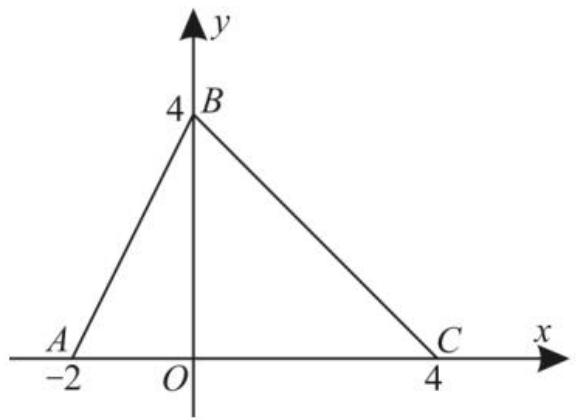

# 分段函数热点题型及解题策略

natural_image

Three cartoon business figures in suits, smiling and gesturing with raised hands (no text or symbols)

分段函数是一种形式特殊且应用广泛的常见函数,也是高考的重点考查内容之一。现将分段函数的热点题型及解题策略总结如下,供同学们学习与参考。

# 一、分段函数的求值问题

例 1 已知函数 $f(x)=\left\{\begin{aligned}x-3,x&\geqslant10,\\ f[f(x+5)],&x<10,\end{aligned}\right.$ 则 $f(9)=(\quad)$ 。

A. 5

B. 6

C. 7

D. 8

分析:根据分段函数的解析式,分段求解即可。

解：因为 $9 < 10$ ，所以 $f(9) = f[f(9 + 5)] = f[f(14)] = f(14 - 3) = f(11) = 11 - 3 = 8$ 。应选D。

评注:已知 x 求 $f[f(x)]$ 的值,一般是从内到外依次求值,即先求 $f(x)$ 的值,再求 $f[f(x)]$ 的值。

# 二、分段函数的不等式问题

例 2 如图 1, 函数 $f(x)$ 的图像为折线段 ABC, 则不等式 $f(x) \geqslant (x - 2)^{2}$ 的解集是()。

text_image

y
4 B
A C
-2 O x
4

图1

A. $\left[-2,0\right]\cup\left[3,4\right]$   
B. $(-∞,0]∪[3,+∞)$   
C. $(0,3)$   
D. $[0,3]$

分析:根据图像,求出 $f(x)$ 的解析式,再利用不等式求解集。

解:由函数 $f(x)$ 的图像为折线段 ABC，
且点 A(-2,0), B(0,4), C(4,0)，可设函数 $f(x)=\left\{\begin{aligned}&kx+b,-2\leqslant x<0,\\ &mx+n,0\leqslant x\leqslant4.\end{aligned}\right.$ 结合点 A,B,C
的坐标得 $-2k + b = 0, b = n = 4, 4m + n = 0$ 所以 k=2,m=-1。

所以 $f(x)=\left\{\begin{aligned}&2x+4,-2\leqslant x<0,\\&-x+4,0\leqslant x\leqslant4.\end{aligned}\right.$

当 $-2 \leqslant x < 0$ 时，不等式 $f(x) \geqslant (x - 2)^2$ 可化为 $2x + 4 \geqslant (x - 2)^2$ ，即 $x^2 - 6x \leqslant 0$ ，可得 $0 \leqslant x \leqslant 6$ （舍去）；当 $0 \leqslant x \leqslant 4$ 时，不等式 $f(x) \geqslant (x - 2)^2$ 可化为 $-x + 4 \geqslant (x - 2)^2$ ，即 $x^2 - 3x \leqslant 0$ ，可得 $0 \leqslant x \leqslant 3$ 。

故不等式 $f(x) \geqslant (x - 2)^2$ 的解集是[0,3]。应选D。

评注:求解分段函数的不等式,关键在于对整体变量进行合理分类。

# 三、分段函数的单调性问题

例 3 已知函数 $f(x)=\left\{\begin{aligned}(3a-1)x+3a,x<1,\\ -x^{2}+1,x\geqslant1\end{aligned}\right.$ 在 R 上单调递减，则实数 a 的取值范围是（）。

A. $\left(\frac{1}{6},\frac{1}{3}\right)$   
B. $\left[\frac{1}{6},\frac{1}{3}\right)$   
C. $\left(-\infty,\frac{1}{3}\right)$   
D. $\left(-\infty,\frac{1}{6}\right]\cup\left(\frac{1}{3},+\infty\right)$

分析:已知分段函数是减函数,它的每一段都是减函数,且在分界点处从左向右的图像逐渐下降,但在分界点处的函数值相等。

解:由 $y=(3a-1)x+3a$ 在 $(-∞,1)$ 上为减函数得 3a-1<0，显然 $y=-x^{2}+1$ 在 $[1,+∞)$ 上为减函数，且在分界点处满足 $(3a-1)+3a\geqslant0$ ，即 6a-1 $\geqslant0$ ，所以 $\left\{\begin{aligned}&3a-1<0,\\ &6a-1\geqslant0,\end{aligned}\right.$ 解得 $\frac{1}{6}\leqslant a<\frac{1}{3}$ 。所以实数 a 的取值范围是 $\left[\frac{1}{6},\frac{1}{3}\right)$ 。应选 B。

评注:研究分段函数的单调性要注意两点:一是要保证分段区间都为单调增(减)区间,二是要保证从左到右图像上的点一直上升(一直下降)。

# 四、判断分段函数的奇偶性

例 4 判断函数 $f(x)=\left\{\begin{aligned}x^{2}-x-2,x<0,\\ -x^{2}-x+2,x>0\end{aligned}\right.$ 的奇偶性。

分析: 利用函数奇偶性的定义进行判断。

解: 当 x<0 时, -x>0, 则 $f(-x)=-(-x)^{2}-(-x)+2=-(x^{2}-x-2)=-f(x)$ ; 当 x>0 时, -x<0, 则 $f(-x)=(-x)^{2}-(-x)-2=-(x^{2}-x+2)=-f(x)$ 。

综上所述,对任意的 $x \in (-\infty, 0) \cup (0, +\infty)$ ，都有 $f(-x) = -f(x)$ ，所以函数 $f(x)$ 为奇函数。

评注:分段函数奇偶性的判断要在每一段里分别判断,要注意函数解析式的分段选择。对于奇偶性的判断,也可以通过函数图像的对称性进行判断。

# 五、分段函数的实际应用问题

例 5 电动出租车司机小李到商场里充电,充电费用由电费和服务费两部分组成,即充电费=(电费+服务费)×度数,商场采用按时间分不同时段的方式计算费用,11:00-13:00时电费是0.5元/度,服务费为0.35元/度,13:00-15:00时电费是1.15元/度,服务费为0.2元/度,假定在充电时电量是均匀输入的,车主小李充电30度需要60min。

(1)小李从 12:40 开始到充电 30 度,需要充电费多少元?  
(2)若小李在某年春运期间第 $x$ 天的收入 $g(x)$ (元)近似地满足 $g(x) = 165 - |30-$

$x \mid (1 \leqslant x \leqslant 40, x \in \mathbf{N})$ ，第 $x$ 天的充电费 $f(x)$ （元）近似地满足 $f(x) = 35 + \frac{1}{2} x (1 \leqslant x \leqslant 40, x \in \mathbf{N})$ ，记盈利比 $= \frac{\text{收入}}{\text{充电费}}$ ，试问哪天的盈利比最大。

分析: 分别计算在 12:40-13:00 时充电 10 度, 在 13:00-15:00 时充电 20 度的费用即可得出答案。由题意得 $g(x) = 165 - |30 - x| = \begin{cases} 135 + x, & 1 \leqslant x \leqslant 30, \\ 195 - x, & 30 < x \leqslant 40, \end{cases}$ 根据分段函数的性质, 利用盈利比的单调性即可求得结果。

解:(1)因为 11:00-13:00 时电费是 0.5 元/度,服务费为 0.35 元/度,13:00-15:00 时电费是 1.15 元/度,服务费为 0.2 元/度,又车主小李充电 30 度需要 60 min,即 2 min 充电 1 度,所以小李到商场 12:40 开始充电 30 度,则在 12:40-13:00 时段充电 10 度,此时费用为 $10 \times 0.85 = 8.5$ (元),在 13:00-15:00 时充电 20 度,此时费用为 $20 \times 1.35 = 27$ (元),所以需要充电费为 $8.5 + 27 = 35.5$ (元)。

(2) 函数 $g(x)=165-|30-x|=$ $\left\{\begin{aligned}&135+x,1\leqslant x\leqslant30,x\in\mathbb{N},\\ &195-x,30<x\leqslant40,x\in\mathbb{N}.\end{aligned}\right.$

因为函数 $g(x)$ 在 $(30,40]$ 上单调递减，而函数 $f(x) = 35 + \frac{1}{2} x$ 在 $(30,40]$ 上单调递增，所以盈利比的最大值不可能在 $(30,40]$ 上取得。

当 $x \in [1, 30]$ , 且 $x \in \mathbf{N}$ 时, 盈利比 $= \frac{135 + x}{35 + \frac{1}{2}x} = \frac{270 + 2x}{70 + x} = \frac{140 + 2x + 130}{70 + x} = 2 + \frac{130}{70 + x}$ , 所以当 $x = 1$ 时, 盈利比取得最大值为 $\frac{272}{71}$ , 即第 1 天的盈利比最大。

评注:求解分段函数的实际应用问题,关键在于认真审题,在理解题意的基础上构建分段函数模型求解。

作者单位:江苏省无锡市青山高级中学

(责任编辑 王琼霞)