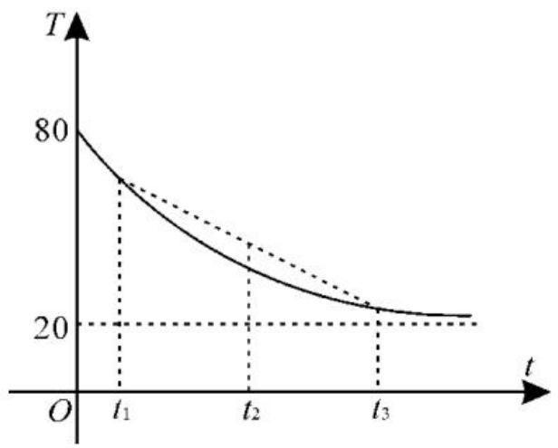

# 小议函数单调性的应用

# ■贺显孟

函数的单调性是函数的重要性质,求解函数问题一般涉及函数的单调性。下面举例说明函数单调性的应用。

# 一、判断函数的解析式

例 1 下列函数在区间 $(0,1)$ 上是增函数的是()。

A. $y = 1 - 2x$

B. $y=\frac{1}{x}$

C. $y = \sqrt{x - 1}$

D. $y = -x^{2} + 2x$

解析: 易知函数 y=1-2x 和 $y=\frac{1}{x}$ 在 (0,1) 上为减函数, 函数 $y=\sqrt{x-1}$ 的定义域为 $[1,+\infty)$ 不符合题意。应选 D。

点评:熟记常见函数的图像与性质是解题的关键。

# 二、比较大小

例2 已知 $f(x) = x^{2025} - \frac{1}{x - 1}$ ，且 $a = f(\sqrt{2})$ ， $b = f(\sqrt{3})$ ， $c = f(\sqrt{5})$ ，则（ ）。

A. $a > b > c$

B. $a > c > b$

C. $c > a > b$

D. $c > b > a$

解析: 易知函数 $f(x)=x^{2025}-\frac{1}{x-1}$ 在 $(1,+\infty)$ 上单调递增。因为 $\sqrt{5}>\sqrt{3}>\sqrt{2}$ ，所以 $f(\sqrt{5})>f(\sqrt{3})>f(\sqrt{2})$ ，即 c>b>a 。应选 D。

点评: 比较函数值的大小的关键是函数的单调性的灵活应用。

# 三、解不等式

例3 已知函数 $y = f(x)$ 的定义域为 $\mathbf{R}$ , 对任意 $x_{1}, x_{2} \in \mathbb{R}$ 且 $x_{1} \neq x_{2}$ , 总有 $\frac{f(x_{1}) - f(x_{2})}{x_{1} - x_{2}} > 0$ , 则 $f(x + 1) > f(2x)$ 的解集是（ ）。

A. $(-∞,1)$

B. $(1, +\infty)$

C. $(-\infty, 1]$

D. $[1, +\infty)$

解析:不妨设 $x_{1}>x_{2}$ ，由 $\frac{f(x_{1})-f(x_{2})}{x_{1}-x_{2}}>0$ ，可得 $f(x_{1})-f(x_{2})>0$ ，即 $f(x_{1})>f(x_{2})$ ，所以 $f(x)$ 是定义在 R 上的增函数。由 $f(x+1)>f(2x)$ ，可得 $x+1>2x$ ，解得 x<1，所以 $f(x+1)>f(2x)$ 的解集为 $(-∞,1)$ 。应选 A。

点评:任意 $x_{1}, x_{2} \in [a, b]$ 且 $x_{1} < x_{2}$ ， $\frac{f(x_{1})-f(x_{2})}{x_{1}-x_{2}}>0\Leftrightarrow f(x)$ 在 $[a,b]$ 上是增函数； $\frac{f(x_{1})-f(x_{2})}{x_{1}-x_{2}}<0\Leftrightarrow f(x)$ 在 $[a,b]$ 上是减函数。任意 $x_{1}, x_{2} \in [a, b]$ 且 $x_{1} < x_{2}$ ， $(x_{1}-x_{2})[f(x_{1})-f(x_{2})]>0\Leftrightarrow f(x)$ 在 $[a, b]$ 上是增函数； $(x_{1}-x_{2})[f(x_{1})-f(x_{2})]<0\Leftrightarrow f(x)$ 在 $[a,b]$ 上是减函数。

# 四、求最值

例 4 函数 $y = \sqrt{x + 1} - \sqrt{x}$ 的最大值为 \_\_\_\_。

解析:由 $\left\{\begin{aligned}x+1&\geqslant0,\\ x&\geqslant0,\end{aligned}\right.$ 可得 $x\geqslant0$ 。

所以函数 $y = \sqrt{x + 1} - \sqrt{x}$ 的定义域为 $[0, +\infty)$ 。

函数 $y=\sqrt{x+1}-\sqrt{x}$

$$
\begin{array}{l} = \frac {(\sqrt {x + 1} - \sqrt {x}) (\sqrt {x + 1} + \sqrt {x})}{\sqrt {x + 1} + \sqrt {x}} \\ = \frac {1}{\sqrt {x + 1} + \sqrt {x}} 。 \\ \end{array}
$$

因为函数 $y = \sqrt{x + 1} + \sqrt{x}$ 在 $[0, +\infty)$ 上是增函数，所以 $y = \frac{1}{\sqrt{x + 1} + \sqrt{x}}$ 在 $[0, +\infty)$ 上是减函数，所以当 $x = 0$ 时， $y = \frac{1}{\sqrt{x + 1} + \sqrt{x}}$ 取得最大值1，即函数 $y = \sqrt{x + 1} - \sqrt{x}$ 的最大值为1。

点评:解答本题的关键是对所求函数解

析式进行分子有理化。

# 五、求参数的取值范围

例 5 若 $f(x)=x^{2}-2ax+5(a>1)$ 在区间 $(-∞,2]$ 上是减函数，且对任意 $x_{1}, x_{2} \in [1,a+1]$ ，总有 $\left|f(x_{1})-f(x_{2})\right| \leqslant 4$ ，则实数 a 的取值范围为 \_\_\_\_。

解析: 函数 $f(x)$ 的图像开口向上, 且对称轴为 x=a。

若 $f(x)$ 在 $(- \infty, 2]$ 上是减函数，则 $a \geqslant 2$ ，所以 $f(x)$ 在 $[1, a]$ 上单调递减，在 $[a, a + 1]$ 上单调递增，所以 $f(x)_{\min} = f(a) = 5 - a^2, f(x)_{\max} = \max \{f(1), f(a + 1)\}$ 。因为 $f(1) - f(a + 1) = 6 - 2a - (a + 1)^2 + 2a(a + 1) - 5 = a(a - 2) \geqslant 0$ ，所以 $f(x)_{\max} = f(1) = 6 - 2a$ 。

对任意 $x_{1}, x_{2} \in [1, a + 1]$ ，总有 $|f(x_{1}) - f(x_{2})| \leqslant 4$ ，则 $f(x)_{\max} - f(x)_{\min} \leqslant 4$ ，可得 $6 - 2a - (5 - a^{2}) \leqslant 4$ ，即 $a^{2} - 2a - 3 \leqslant 0$ ，解得 $-1 \leqslant a \leqslant 3$ 。

又 $a \geqslant 2$ ，所以 $2 \leqslant a \leqslant 3$ ，即实数 $a$ 的取值范围为[2,3]。

点评:对于与二次函数有关的单调性问题,常常结合对称轴与给定区间的关系,列不等式求解。

# 六、求解实际问题

例 6 中国茶文化博大精深,茶水的口感与水的温度有关。一杯 $80^{\circ}$ C 的热红茶置于 $20^{\circ}$ C 的房间里,茶水的温度 T (单位: $^{\circ}$ C) 与时间 t (单位:min) 的函数 $T = f(t)$ 的图像如图 1 所示。则下列说法正确的是()。

line

| t    | T (solid line) | T (dashed line) |
| ---- | -------------- | --------------- |
| 0    | 80             | 80              |
| t₁   | ~70            | ~65             |
| t₂   | ~45            | ~40             |
| t₃   | ~25            | ~20             |

图1

A. 若 $t_1 + t_3 = 2t_2$ ，则 $f(t_1) + f(t_3) > 2f(t_2)$

B. 若 $t_1 + t_3 > 2t_2$ ，则 $f(t_1) + f(t_3) > 2f(t_2)$

C. 若 $f(t_{1}) + f(t_{3}) = 2f(t_{2})$ ，则 $t_1 + t_3 < 2t_2$   
D. 若 $f(t_{1}) + f(t_{3}) > 2f(t_{2})$ ，则 $t_1 + t_3 > 2t_2$

解析:已知函数 $T=f(t)$ 的图像上凹且单调递减，则上凹函数的性质为 $\frac{f(t_{1})+f(t_{3})}{2}\leqslant f\left(\frac{t_{1}+t_{3}}{2}\right)$ ，当且仅当 $t_{1}=t_{3}$ 时取等号，当 $t_{1}\neq t_{3}$ 时，可得 $\frac{f(t_{1})+f(t_{3})}{2}<f\left(\frac{t_{1}+t_{3}}{2}\right)$ 。设 $t_{1}<t_{2}<t_{3}$ ，由 $t_{1}+t_{3}=2t_{2}$ ，可得 $\frac{t_{1}+t_{3}}{2}=t_{2}$ 。对于 A，因为函数 $T=f(t)$ 的图像上凹且单调递减，所以 $\frac{f(t_{1})+f(t_{3})}{2}<f\left(\frac{t_{1}+t_{3}}{2}\right)$ ，即 $f(t_{1})+f(t_{3})<2f(t_{2})$ ，A 错误。对于 B，因为 $t_{1}+t_{3}>2t_{2}$ ，所以 $\frac{t_{1}+t_{3}}{2}>t_{2}$ 。结合函数 $T=f(t)$ 的单调递减，可得 $f\left(\frac{t_{1}+t_{3}}{2}\right)<f(t_{2})$ ，所以 $f(t_{1})+f(t_{3})<2f(t_{2})$ ，B 错误。对于 C，已知 $f(t_{1})+f(t_{3})=2f(t_{2})$ ，由函数 $T=f(t)$ 的图像上凹且单调递减得 $\frac{f(t_{1})+f(t_{3})}{2}<f\left(\frac{t_{1}+t_{3}}{2}\right)$ ，所以 $f\left(\frac{t_{1}+t_{3}}{2}\right)>f(t_{2})$ ，所以 $\frac{t_{1}+t_{3}}{2}<t_{2}$ ，即 $t_{1}+t_{3}<2t_{2}$ ，C 正确。对于 D，已知 $f(t_{1})+f(t_{3})>2f(t_{2})$ ，由 $\frac{f(t_{1})+f(t_{3})}{2}<f\left(\frac{t_{1}+t_{3}}{2}\right)$ 得 $f(t_{1})+f(t_{3})<2f\left(\frac{t_{1}+t_{3}}{2}\right)$ ，所以 $2f(t_{2})<2f\left(\frac{t_{1}+t_{3}}{2}\right)$ ，即 $f(t_{2})<f\left(\frac{t_{1}+t_{3}}{2}\right)$ ，所以 $t_{2}>\frac{t_{1}+t_{3}}{2}$ ，即 $t_{1}+t_{3}<2t_{2}$ ，D 错误。应选 C。

点评:识图、用图体现了数形结合思想的应用。 $\frac{f(t_{1})+f(t_{3})}{2}$ 表示 $f(t_{1})$ 与 $f(t_{3})$ 的算术平均数， $\frac{t_{1}+t_{3}}{2}=t_{2}$ 表示 $t_{2}$ 是 $t_{1}$ 与 $t_{3}$ 对应点的中点的横坐标。

作者单位:湖北省巴东县第三高级中学

(责任编辑 王琼霞)