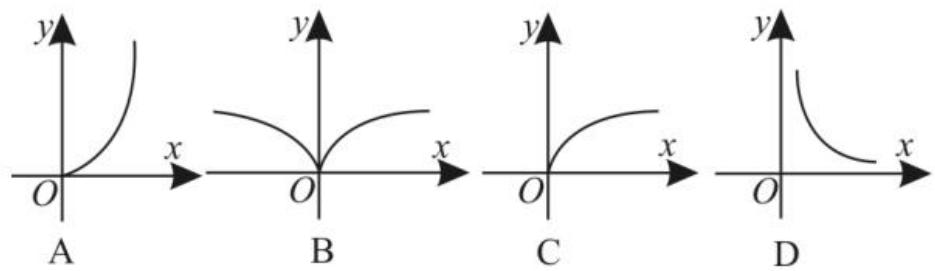

text_image

幂函数题型例讲
■王春玲 隋国庆

一般地, 函数 $y = x^{\alpha}$ 叫作幂函数, 其中 x 是自变量, $\alpha$ 是常数。幂函数的三个性质: 幂函数在 $(0, +\infty)$ 上都有定义; 当 $\alpha > 0$ 时, 幂函数的图像过点 $(1, 1)$ 和 $(0, 0)$ , 且在 $(0, +\infty)$ 上单调递增; 当 $\alpha < 0$ 时, 幂函数的图像过点 $(1, 1)$ , 且在 $(0, +\infty)$ 上单调递减。下面就幂函数的常见题型进行举例分析。

# 一、幂函数的判断

例1 已知函数 $y = x^{-4}, y = 3x^2, y = x^2 + 2x, y = 1$ ，则幂函数的个数为（ ）。

A. 4

B. 3

C. 2

D. 1

解: 函数 $y = x^{-4}$ 为幂函数。函数 $y = 3x^{2}$ 中 $x^{2}$ 的系数是 3，所以它不是幂函数。函数 $y = x^{2} + 2x$ 不是 $y = x^{a}$ ( $\alpha$ 是常数) 的形式，所以它不是幂函数。函数 y = 1 与 $y = x^{0} = 1 (x \neq 0)$ 不相同，所以 y = 1 不是幂函数。应选 D。

评注:幂函数 $y=x^{\alpha}$ ( $\alpha$ 为常数)需满足:
指数为常数;底数为自变量; $x^{a}$ 的系数为 1。

# 二、幂函数的图像

例 2 若幂函数 $y = f(x)$ 的图像过点 (4, 2)，则幂函数 $y = f(x)$ 的大致图像是（）。

text_image

y
x
O
A
y
x
B
y
x
C
y
x
D

解:设幂函数的解析式为 $y=x^{\alpha}$ 。因为幂函数 $y=f(x)$ 的图像过点(4,2)，所以 $2=4^{\alpha}$ ，解得 $\alpha=\frac{1}{2}$ ，所以 $y=\sqrt{x}$ ，其定义域为 $[0,+\infty)$ ，且是增函数。当 0<x<1 时，其图像在直线 y=x 的上方，对照选项知 C 正确。应选 C。

评注:解答本题的关键是区分 $y=x^{\alpha}$ 中的 $0<\alpha<1$ 和 $\alpha>1$ 两种情况的幂函数图像。

# 三、利用幂函数的性质比较大小

例 3 若 $a=\left(\frac{1}{2}\right)^{\frac{2}{3}}$ , $b=\left(\frac{1}{5}\right)^{\frac{2}{3}}$ , c=4, 则 a, b, c 的大小关系是 \_\_\_\_。

解: 因为幂函数 $y = x^{\frac{2}{3}}$ 在第一象限内是增函数, 且 $1 > \frac{1}{2} > \frac{1}{5}$ , 所以 $1^{\frac{2}{3}} > \left(\frac{1}{2}\right)^{\frac{2}{3}} > \left(\frac{1}{5}\right)^{\frac{2}{3}}$ , 所以 1 > a > b。又 4 > 1, 故 c > a > b。

评注: 当幂指数相同时, 可直接利用幂函数的单调性比较大小; 当幂指数不同时, 先转化为相同的幂指数, 再利用单调性比较大小。

# 四、利用幂函数的性质解不等式

例 4 若幂函数 $f(x)$ 过点 (2,8)，求满足 $f(a-3)>f(1-a)$ 的实数 a 的取值范围。

解:设幂函数为 $f(x)=x^{\alpha}$ 。因为图像过点(2,8)，所以 $2^{\alpha}=8$ ，解得 $\alpha=3$ ，所以 $f(x)=x^{3}$ 。 $f(x)=x^{3}$ 在 R 上为增函数，由 $f(a-3)>f(1-a)$ ，可得 a-3>1-a，解得 a>2，即实数 a 的取值范围是 $(2,+\infty)$ 。

评注:解答本题的关键是利用幂函数的单调性,将已知不等式转化为自变量的大小关系求解。

# 五、幂函数性质的综合应用

例5 已知幂函数 $f(x) = (2m^2 - 6m + 5)x^{m + 1}$ 为偶函数。

(1) 求 $f(x)$ 的解析式。

(2) 若函数 $y = f(x) - 2(a - 1)x + 1$ 在 (2,3) 上为单调函数，求实数 a 的取值范围。

解:(1)由 $f(x)$ 为幂函数知 $2m^{2}-6m+5=1$ ，即 $m^{2}-3m+2=0$ ，解得 m=1 或 m=2。当 m=1 时， $f(x)=x^{2}$ 为偶函数，符合题意；当 m=2 时， $f(x)=x^{3}$ 为奇函数，不符合题意，舍去。故幂函数 $f(x)=x^{2}$ 。

(2)结合(1)得 $y=x^{2}-2(a-1)x+1$ ，其对称轴为 x=a-1。由函数 y 在(2,3)上为单调函数，可得 $a-1 \leqslant 2$ 或 $a-1 \geqslant 3$ ，解得 $a \leqslant 3$ 或 $a \geqslant 4$ ，即实数 $a \in (-\infty, 3] \cup [4, +\infty)$ 。

评注:解答本题的关键是熟练掌握幂函数的图像与性质。

作者单位:沈阳市回民中学

(责任编辑 王琼霞)