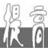

# 高斯函数及性质应用体验

# ■赵忆

natural_image

Cartoon illustration of a smiling boy with short hair and pointing upward (no text or symbols)

# 一、利用高斯函数表示函数的解析式

例 1 某校要召开学生代表大会,规定各班每 10 人推选一名代表,当班人数除以 10 的余数大于 6 时,再增选一名代表,则各班推选代表人数 y 与该班人数 x 之间的函数关系用取整函数 $y=[x]$ ([x] 表示不大于 x 的最大整数,如 $[-1.3]=-2,\left[\pi\right]=3,\left[4\right]=4$ ) 可表示为()。

A. $y = \left[\frac{x + 2}{10}\right]$

B. $y = \left[\frac{x + 3}{10}\right]$

C. $y = \left[\frac{x + 4}{10}\right]$

D. $y = \left[\frac{x + 5}{10}\right]$

解: 因为各班每 10 人推选一名代表, 当各班人数除以 10 的余数大于 6 时再增选一名代表, 所以当余数为 7, 8, 9 时可增选一名代表, 即 x 要进一位, 故最小应加 3, 所以利用取整函数可表示为 $y = \left[\frac{x + 3}{10}\right]$ 。应选 B。

或者,利用特殊值法进行判断。取 x=16,17,对应的 y=1,2,只有 B 满足要求。应选 B。

体验:取整函数 $y=[x]$ 的定义是不超过实数 x 的最大整数称为 x 的整数部分,记作 $[x]$ , 如 $[3.4]=3,[-2.1]=-3$ , 这一规定最早为数学家高斯所使用, 故函数 $y=[x]$ 称为高斯函数, 又称取整函数。取整函数揭示了 $[x]\leqslant x<[x]+1$ 的关系,有利于研究剩余类问题。

# 二、高斯函数有关性质的探究

例 2 （多选题）[x]表示不超过 x 的最大整数。18 世纪，函数 y = [x] 被“数学王子”高斯采用，因此得名为高斯函数。高斯函数的应用范围很广，在自然科学、社会科学及工程学等领域都能看到它的身影，下列关于高斯函数的相关结论正确的是（）。

A. $0 \leqslant x - [x] < 1$

B. $[x] \leqslant x < [x] + 1$

C. 高斯函数为偶函数

D. $[x] + \left[x + \frac{1}{2}\right] = \left[2x + \frac{1}{2}\right]$

解:根据高斯函数的定义得 $x - [x] \geqslant 0$ 且 $x < [x] + 1$ ，即可判断 A, B；举例即可判断 C, D。

因为 $[x]$ 表示不超过 $x$ 的最大整数，所以 $x - [x] \geqslant 0$ 且 $x < [x] + 1$ ，所以 $[x] \leqslant x < [x] + 1$ ，B 正确。由 $x < [x] + 1$ ，可得 $x - [x] < 1$ ，所以 $0 \leqslant x - [x] < 1$ ，A 正确。对于 C，设 $f(x) = [x]$ ，则 $f(1.5) = 1, f(-1.5) = -2$ ，所以高斯函数既不是偶函数也不是奇函数，C 错误。对于 D，当 $x = 0.4$ 时， $[x] = 0, \left[x + \frac{1}{2}\right] = 0, \left[2x + \frac{1}{2}\right] = [1.3] = 1$ ，D 错误。应选 AB。

体验:不超过实数 x 的最大整数称为 x 的整数部分,记作 $[x]$ , 如 $[4.4]=4,[-3.1]=-4$ , 这一规定最早为数学家高斯所使用, 故函数 $y=[x]$ 称为高斯函数, 又称取整函数。取整函数 $y=[x]$ 的定义域为 R, 值域为 Z, 且 $[x]\leqslant x<[x]+1$ , 取整函数不具有单调性、奇偶性和周期性。

# 三、涉及高斯函数不等式的恒成立问题

例 3 函数 $f(x)=[x]$ 被称为取整函数, 也称高斯函数, 其中 [x] 表示不大于实数 x 的最大整数。若 $\forall m \in (0, +\infty)$ , 满足 $[x]^{2} + [x] \leqslant \frac{m^{2} + 1}{m}$ , 则 x 的取值范围是()。

A. $[-1, 2]$

B. $(-1,2)$

C. $\left[-2,2\right)$

D. $(-2,2]$

解: 利用基本不等式求出最值, 结合一元二次不等式和取整函数的定义求出 x 的取值范围。

$\forall m \in (0, +\infty), \frac{m^2 + 1}{m} = m + \frac{1}{m} \geqslant 2$ ，当且仅当 $m = 1$ 时取等号。因为 $\forall m \in (0,$

$+\infty)$ ，满足 $[x]^{2}+[x]\leqslant\frac{m^{2}+1}{m}$ ，所以 $[x]^{2}+[x]\leqslant2$ ，即 $[x]^{2}+[x]-2\leqslant0$ ，所以 $([x]+2)([x]-1)\leqslant0$ ，解得 $-2\leqslant[x]\leqslant1$ ，所以 $-2\leqslant x<2$ 。应选C。

体验:涉及高斯函数不等式的恒成立问题,利用分离参数法,转化为不等式恒成立问题求出最值,再结合取整不等式即可求得结果。

# 感悟

1.(多选题)对于任意的 $x \in R, [x]$ 表示不超过 x 的最大整数。18 世纪， $y = [x]$ 被“数学王子”高斯采用，因此得名为高斯函数，人们更习惯称为取整函数。下列说法正确的是()。

A. 函数 $y = [x], x \in \mathbf{R}$ 的图像关于原点对称  
B. 函数 $y = x - [x], x \in \mathbf{R}$ 的值域为[0,1)  
C. 对于任意的 $x, y \in R$ ，不等式 $[x] + [y] \leqslant [x + y]$ 恒成立  
D. 不等式 $2[x]^2 + [x] - 1 < 0$ 的解集为 $\{x \mid 0 \leqslant x < 1\}$

提示:对于 A, 当 $0 \leqslant x < 1$ 时, $y = [x] = 0$ , 当 -1 < x < 0 时, $y = [x] = -1$ , 所以 $y = [x], x \in R$ 不是奇函数, 即函数 $y = [x], x \in R$ 的图像不关于原点对称, A 错误。对于 B, 由取整函数的定义知 $[x] \leqslant x < [x] + 1$ , 所以 $x - 1 < [x] \leqslant x$ , 所以 $0 \leqslant x - [x] < 1$ , 所以函数 $y = x - [x] (x \in \mathbb{R})$ 的值域为 $[0, 1)$ , B 正确。对于 C, 由取整函数的定义可知, $\forall x, y \in R, [x] \leqslant x, [y] \leqslant y$ , 所以 $[x] + [y] = [[x] + [y]] \leqslant [x + y]$ , C 正确。对于 D, 由 $2[x]^2 + [x] - 1 < 0$ , 可得 $(2[x] - 1)[[x] + 1) < 0$ , 解得 $-1 < [x] < \frac{1}{2}$ , 结合取整函数的定义得 $\{x \mid 0 \leqslant x < 1\}$ , D 正确。应选 BCD。

2. 设 $x \in R$ ，用 [x] 表示不超过 x 的最大整数，则 $y = [x]$ 称为高斯函数，如 $[-2.6] = -3, [3.7] = 3$ 。已知函数 $f(x) = \frac{(x + 1)^{2}}{x^{2} + 1} - \frac{1}{2}$ ，则函数 $y = [f(x)]$ 的值域是 \_\_\_\_。

提示: 显然 $f(0)=\frac{1}{2}$ 。当 $x \neq 0$ 时, 函数

$$
\begin{array}{l} f (x) = \frac {(x + 1) ^ {2}}{x ^ {2} + 1} - \frac {1}{2} = \frac {2 (x + 1) ^ {2} - (x ^ {2} + 1)}{2 (x ^ {2} + 1)} \\ = \frac {x ^ {2} + 4 x + 1}{2 (x ^ {2} + 1)} = \frac {1}{2} + \frac {2 x}{x ^ {2} + 1} = \frac {1}{2} + \frac {2}{x + \frac {1}{x}} 。 \\ \end{array}
$$

令 $t = x + \frac{1}{x}$ ，当 $x > 0$ 时， $t = x + \frac{1}{x} \geqslant 2\sqrt{x \cdot \frac{1}{x}} = 2$ ，当且仅当 $x = 1$ 时等号成立，所以 $0 < \frac{1}{t} \leqslant \frac{1}{2}$ ，所以 $\frac{1}{2} < f(x) \leqslant \frac{1}{2} + 2 \times \frac{1}{2} = \frac{3}{2}$ ，即 $\frac{1}{2} < f(x) \leqslant \frac{3}{2}$ 。

当 $x < 0$ 时， $t = x + \frac{1}{x} \leqslant -2 \cdot \sqrt{(-x) \cdot \left(-\frac{1}{x}\right)} = -2$ ，当且仅当 $x = -1$ 时等号成立，所以 $-\frac{1}{2} \leqslant \frac{1}{t} < 0$ ，所以 $\frac{1}{2} - 2 \times \frac{1}{2} = -\frac{1}{2} \leqslant f(x) < \frac{1}{2}$ ，即 $-\frac{1}{2} \leqslant f(x) < \frac{1}{2}$ 。

综上所述，函数 $f(x)$ 的值域为 $\left[-\frac{1}{2}, \frac{3}{2}\right]$ 。根据高斯函数的定义，可得函数 $y = [f(x)]$ 的值域是 $\{-1, 0, 1\}$ 。

3. 设 $x \in R$ ，用 $[x]$ 表示不超过 x 的最大整数，则 $y = [x]$ 称为高斯函数，也叫取整函数，如 $[-5.1] = -6, [7.1] = 7$ 。若函数 $f(x) = \frac{2^{x} + 5}{2^{x} + 1}$ ，则函数 $y = [f(x)]$ 的值域为（）。

A. $\{1,2,3\}$

B. $\{0,1,2,3\}$

C. $\{1,2,3,4\}$

D. $\{2,3,4,5\}$

提示: 已知 $f(x)=\frac{2^{x}+5}{2^{x}+1}=1+\frac{4}{2^{x}+1}$ ，因为 $2^{x}>0$ ，所以 $1+2^{x}>1,0<\frac{1}{2^{x}+1}<1$ ，所以 $1<1+\frac{4}{2^{x}+1}<5$ ，即 $1<f(x)<5$ 。当 $1<f(x)<2$ 时， $[f(x)]=1$ ；当 $2\leqslant f(x)<3$ 时， $[f(x)]=2$ ；当 $3\leqslant f(x)<4$ 时， $[f(x)]=3$ ；当 $4\leqslant f(x)<5$ 时， $[f(x)]=4$ 。故函数 $y=[f(x)]$ 的值域为 $\{1,2,3,4\}$ 。应选 C。

作者单位:南京大学附属中学

(责任编辑 王琼霞)