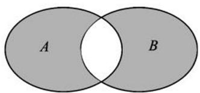
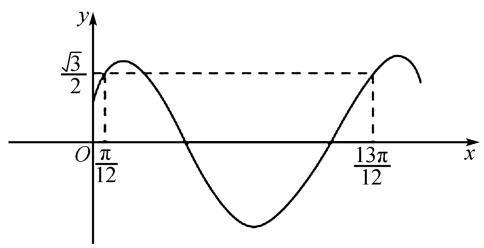
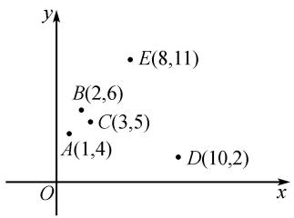
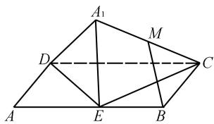
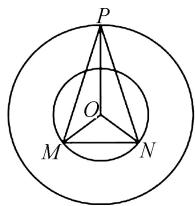
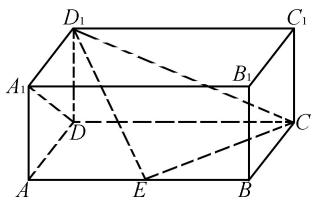
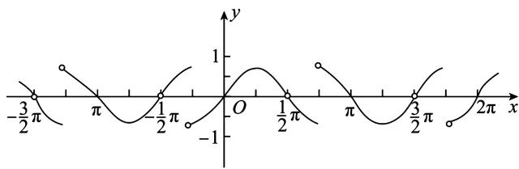
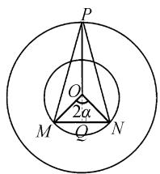
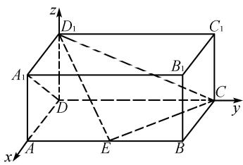

# 2025 年高考数学模拟卷(一)

# 李昌成

(新疆乌鲁木齐市第23中学, 新疆维吾尔自治区 乌鲁木齐 830002)

中图分类号：G632

文献标识码：A

文章编号:1008-0333(2025)10-0064-11

# 第Ⅰ卷(选择题)

一、单选题(本题共8小题,每小题5分,共40分.在每小题给出的选项中,只有一项是符合题目要求的)

1. 设函数 $f(x) = x \ln x, g(x) = \sin x + \sqrt{3} \cos x + x$ ，集合 $A = \{x | f'(x) > 0\}$ , $B = \{y | y = g'(x)\}$ ，则图1中的阴影部分表示的集合为（ ）.

text_image

A
B

图 1 题 1 示意图

A. $\left(\frac{1}{\mathrm{e}},3\right]$

B. $\left[-\frac{1}{e},3\right)$

C. $\left[-1, \frac{1}{\mathrm{e}}\right) \cup [3, +\infty)$

D. $[-1, \frac{1}{\mathrm{e}}] \cup (3, +\infty)$

2. 已知 $\lambda \in \mathbf{R}$ , 向量 $a = (3, \lambda), b = (\lambda - 1, 2)$ , 则“ $\lambda = 3$ ”是“ $a // b$ ”的（ ）.

A. 必要不充分条件

B. 充分不必要条件

C. 充分必要条件

D. 即不充分也不必要条件

3. 若 $f(x) = \left\{ \begin{array}{l} \cos x, |\tan x| \geqslant 1, \\ \sin x, |\tan x| < 1, \end{array} \right.$ 则 $f(x)$ 的值域为

( ).

A. $\left(-\frac{\sqrt{2}}{2},\frac{\sqrt{2}}{2}\right)$

B. $\left[-\frac{\sqrt{2}}{2}, \frac{\sqrt{2}}{2}\right]$

C. $\left[-1,1\right]$

D. $\left[-\frac{\sqrt{2}}{2},0\right)\cup \left(0,\frac{\sqrt{2}}{2}\right]$

4.6 名研究人员在 3 个不同的无菌研究舱同时进行工作, 每名研究人员必须去一个舱, 且每个舱至少去 1 人, 由于空间限制, 每个舱至多容纳 3 人, 则不同的安排方案共有().

A. 360 种

B.630种

C. 810 种

D. 450 种

5. 已知圆台的上、下底面半径分别为 2 cm, 12 cm, 侧面积等于 $280\pi \, cm^{2}$ , 若存在一个在圆台内部可以任意转动的正方体, 那么该正方体的体积取最大值时, 正方体的棱长为().

A. 16 cm

B. $8\sqrt{3}$ cm

C. $8\sqrt{2}$ cm

D. 8 cm

6. 已知双曲线 $C: \frac{x^{2}}{a^{2}} - \frac{y^{2}}{a^{2} - 1} = 1 (a > 1)$ 的右焦点为 F，过点 F 作直线 l 与 C 交于 A, B 两点，若满足 $|AB| = 3$ 的直线 l 有且仅有 1 条，则双曲线 C 的离心率为（）.

A. $\frac{\sqrt{14}}{3}$

B. $\frac{\sqrt{7}}{2}$

C. 2

D. $\frac{\sqrt{7}}{2}$ 或2

收稿日期:2025-01-05

作者简介: 李昌成, 本科, 正高级教师, 从事中学数学教学研究.

7. 已知函数 $f(x) = \sin (\omega x + \varphi) (\omega > 0, |\varphi| < \frac{\pi}{2})$ 的部分图象如图2所示，则（ ）.

line

| x       | y     |
| ------- | ----- |
| 0       | √3/2  |
| π/12    | √3/2  |
| 13π/12  | √3/2  |

图2 题7 示意图

A. $\omega = 2, \varphi = \frac{\pi}{6}$   
B. $\omega = \frac{1}{2},\varphi = \frac{\pi}{6}$   
C. $\omega = 2, \varphi = \frac{\pi}{3}$   
D. $\omega = \frac{1}{2},\varphi = \frac{\pi}{3}$

8. 已知函数 $f(x)$

$= \left\{ \begin{array}{l}2\sin \left[2\pi (x - a + \frac{1}{2})\right],x <   a,\\ x^{2} - (2a + 1)x + a^{2} + 2,x\geqslant a \end{array} \right.$ 在 $[0, + \infty)$ 内恰有

5 个零点, 则 a 的取值范围是().

A. $\left(\frac{7}{4},\frac{5}{2}\right)$

B. $\left(\frac{7}{4},2\right)$

C. $(\frac{7}{4},2)\cup (\frac{5}{2},3)$

D. $(\frac{7}{4}, 2) \cup (2, \frac{5}{2})$

二、多项选择题(本大题共3小题,每小题6分,共计18分.在每小题列出的四个选项中至少有两项是符合题目要求的,部分选对得部分分,有选错的得0分)

9. 某兴趣小组研究光照时长 x (单位: 小时) 和向日葵种子发芽数量 y (单位: 颗) 之间的关系, 采集 5 组数据, 作如图 3 所示的散点图. 若去掉 D (10, 2) 后, 下列说法正确的是().

scatter

| Point | x | y |
|---|---|---|
| A | 1 | 4 |
| B | 2 | 6 |
| C | 3 | 5 |
| D | 10 | 2 |
| E | 8 | 11 |

图3 题9示意图

A. $x$ 与 $y$ 的线性相关性变强  
B. 样本相关系数 r 变小  
C. 残差平方和变大  
D. 决定系数 $R^{2}$ 变大

10. 如图 4, 已知 $\square ABCD$ 中, $\angle BAD = 60^{\circ}, AB = 2AD, E$ 为边 $AB$ 的中点, 将 $\triangle ADE$ 沿直线 $DE$ 翻折成 $\triangle A_{1}DE$ . 若 $M$ 为线段 $A_{1}C$ 的中点, 则在 $\triangle ADE$ 翻折的过程中, 下列命题正确的有( ).

text_image

A₁
M
D
C
A
E
B

图4 题10示意图

A. 异面直线 DE 与 $A_{1}C$ 所成的角可以为 $90^{\circ}$   
B. 二面角 $D - A_{1}E - C$ 可以为 $90^{\circ}$   
C. 直线 MB 与平面 $A_{1}DE$ 所成的角为定值  
D. 线段 BM 的长为定值

11. 已知椭圆 $C: \frac{x^2}{4} + \frac{y^2}{3} = 1$ 的左右焦点分别为 $F_1(-c,0), F_2(c,0)$ , 过点 $F_1$ 的直线交椭圆 $C$ 于 $A$ , $B$ 两点 $(A,B$ 均异于点 $P)$ , $P$ 为椭圆的右顶点, 则 ( ).

A. $\triangle ABF_{2}$ 的周长为 10  
B. 若直线 $PA$ 与直线 $PB$ 的倾斜角分别为 $\alpha, \beta$ , 且 $k_{PA} + k_{PB} = 0$ , 则 $a + \beta = \pi$   
C. 若 $AB \perp x$ 轴, 则 $S_{\triangle ABF_2} = \frac{3}{2}$   
D. 若 AB 的斜率存在, 且 AB 的中点为 M, 则 $k_{AB} \cdot k_{OM} = -\frac{3}{4}$ (O 为坐标原点)

# 第Ⅱ卷(非选择题)

# 三、填空题(本题共3小题,每小题5分,共15分)

12. 已知 $\boldsymbol{a} = (m, -1)$ , $\boldsymbol{b} = (-2, 2m)$ (m < 0) 若 $a \parallel b$ ，则 m = \_\_\_\_.  
13. 在实数集 R 上定义一种运算“★”, 对于任

意给定的 $a, b \in \mathbf{R}, a \star b$ 为唯一确定的实数，且具有下列三条性质：

$$
\begin{array}{r l} & (1) a \star b = b \star a; (2) a \star 0 = a; (3) (a \star b) \star c \\ & = c \star (a b) + (a \star c) + (c \star b) - 2 c. \end{array}
$$

关于函数 $f(x)=x\star\frac{1}{x}$ ，有如下说法：

①函数 $f(x)$ 在 $(0, +\infty)$ 上的最小值为3；  
②函数 $f(x)$ 为偶函数；  
③函数 $f(x)$ 为奇函数；  
④函数 $f(x)$ 的单调递增区间为 $(-∞,-1)$ ， $(1,+∞)$ ;  
⑤函数 $f(x)$ 不是周期函数.

其中正确说法的序号为 \_\_\_\_.

14. 某城市要在广场中央的圆形地面设计一块浮雕, 以彰显城市积极向上的活力, 某公司设计方案如图5, 等腰 $\triangle PMN$ 的顶点 $P$ 在半径为 $10\mathrm{m}$ 的大圆 $O$ 上, 点 $M, N$ 在半径为 $5\mathrm{m}$ 的小圆 $O$ 上, 点 $O$ , 点 $P$ 在弦 $MN$ 的同侧. 则当 $\triangle PMN$ 面积取得最大值时, $\cos \angle MON = \_$ .

text_image

P
O
M N

图 5 题 14 示意图

四、解答题(本题共5个小题,共77分. 解答应在答卷的相应各题中写出文字说明,说明过程或演算步骤)

15. (本小题 13 分) 在数列 $\{a_{n}\}$ 中, $a_{1} = 2$ , $a_{n+1} = 4a_{n} - 3n + 1$ , $n \in \mathbf{N}$ .

(1) 证明数列 $\{a_{n} - n\}$ 是等比数列；  
(2)求数列 $\{a_{n}\}$ 的前 $n$ 项和 $S_{n}$ .  
16. (本小题 15 分) 如图 6, 在长方体 $ABCD - A_1B_1C_1D_1$ 中, $AD = AA_1 = 1$ , $AB = 2$ , 点 $E$ 在棱 $AB$ 上移动.

text_image

D₁
C₁
A₁
B₁
D
C
A
E
B

图 6 题 16 示意图

(1) 当点 E 在棱 AB 的中点时, 求点 $B_{1}$ 到平面 $ECD_{1}$ 的距离;  
(2) 当 AE 为何值时, 平面 $D_{1}EC$ 与平面 AECD 所成的夹角为 $\frac{\pi}{4}$ .

17. (本小题 15 分) 已知 O 为坐标原点, 椭圆 $C: \frac{x^{2}}{a^{2}} + \frac{y^{2}}{b^{2}} = 1 (a > b > 0)$ 的左、右焦点分别为 $F_{1}, F_{2}$ , 点 $F_{2}$ 又恰为抛物线 $D: y^{2} = 4x$ 的焦点, 以 $F_{1}F_{2}$ 为直径的圆与椭圆 C 仅有两个公共点.

(1) 求椭圆 C 的标准方程;  
(2) 若直线 l 与 D 相交于 A, B 两点, 记点 A, B 到直线 x = -1 的距离分别为 $d_{1}, d_{2}$ , 且 $AB = d_{1} + d_{2}$ . 直线 l 与 C 相交于 E, F 两点, 记 $\triangle OAB, \triangle OEF$ 的面积分别为 $S_{1}, S_{2}$ .

(i) 证明: $\triangle EFF_{1}$ 的周长为定值;  
(ii) 求 $\frac{S_{2}}{S_{1}}$ 的最大值.

18. (本小题 17 分) 已知函数 $f(x) = (x + 1)\mathrm{e}^{x} - ax^{2}(x > 0)$ .

(1) 若函数 $f(x)$ 在 $(0, +\infty)$ 上单调递增, 求实数 a 的取值范围;  
(2) 若函数 $f(x)$ 有两个不同的零点 $x_{1}, x_{2}$ .

(i) 求实数 a 的取值范围;

(ii) 求证: $\frac{1}{x_{1}} + \frac{1}{x_{2}} - \frac{1}{t_{0} + 1} > 1$ (其中 $t_{0}$ 为函数 $f(x)$ 的极小值点).  
19. (本小题 17 分) 信息在传送中都是以字节形式发送, 每个字节只有 0 或 1 两种状态, 为保证信息在传送中不至于泄露, 往往需要经过多重加密, 若

A, B 是含有一个字节的信息, 在加密过程中, 会经过两次加密, 第一次加密时信息中字节会等可能地变为 0 或 1, 且 0, 1 之间转换是相互独立的, 第二次加密时, 字节中 0 或 1 发生变化的概率为 p, 若 A, B 的初始状态为 0, 1 或 1, 0, 记通过两次加密后 A, B 中含有字节 1 的个数为 X.

(Ⅰ)若两次加密后的 A, B 中字节 1 的个数为 2, 且 $p = \frac{1}{3}$ , 求 A, B 通过第一次加密后字节 1 的个数为 2 的概率;

(Ⅱ)若一条信息有 $n(n>1, n \in \mathbf{N}^{*})$ 种等可能的情况且各种情况互斥，记这些情况发生的概率分别为 $p_{1}, p_{2}, p_{3}, \cdots, p_{n}$ ，则称 $H = f(p_{1}) + f(p_{2}) + \cdots + f(p_{n})$ （其中 $f(x) = -x \log_{2} x$ ）为这条信息的信息熵，试求 A, B 通过两次加密后字节 1 的个数为 X 的信息熵 H；

(Ⅲ) 将一个字节为 0 的信息通过第二次加密, 当字节变为 1 时停止, 否则重复通过第二次加密直至字节变为 1, 设停止加密时该字节通过第二次加密的次数为 $Y(Y=1,2,3,\cdots,n)$ . 证明: $E(Y)<\frac{1}{p}$ .

# 参考答案

1. 因为 $f'(x) = 1 + \ln x (x > 0)$ ,

由 $f'(x)>0$ ，即 $1+\ln x>0$ .

解得 $x > \frac{1}{e}$ .

故 $A = \left( \frac{1}{\mathrm{e}}, +\infty \right)$ .

$$
\begin{array}{l} g ^ {\prime} (x) = \cos x - \sqrt {3} \sin x + 1 \\ = 2 \cos \left(x + \frac {\pi}{3}\right) + 1 \in [ - 1, 3 ], \\ \end{array}
$$

即 $B = [-1, 3]$ .

则 $A \cap B = (\frac{1}{\mathrm{e}}, 3], A \cup B = [-1, +\infty)$ .

图 1 中阴影部分表示集合 $\complement_{(A \cup B)} (A \cap B) = \left[-1, \frac{1}{\mathrm{e}}\right] \cup (3, +\infty)$ .

故选 D.

2. 由 $a \parallel b$ , 得 $\lambda (\lambda - 1) - 6 = 0$ ,

解得 $\lambda = 3$ 或 -2.

所以“ $\lambda=3$ ”是“ $a\parallel b$ ”的充分不必要条件.

故选 B.

3. 由 $|\tan x| \geqslant 1$ ，得

$$
- \frac {\pi}{2} + k \pi <   x \leqslant - \frac {\pi}{4} + k \pi \text {或} \frac {\pi}{4} + k \pi \leqslant x <   \frac {\pi}{2} + k \pi .
$$

由 $|\tan x| < 1$ ，得

$$
- \frac {\pi}{4} + k \pi <   x <   \frac {\pi}{4} + k \pi .
$$

当 $x \in (-\frac{\pi}{2} + k\pi, -\frac{\pi}{4} + k\pi] \cup [\frac{\pi}{4} + k\pi, \frac{\pi}{2} + k\pi)$ 时，由余弦函数的图象与性质可知 $\cos x \in [-\frac{\sqrt{2}}{2}, 0) \cup (0, \frac{\sqrt{2}}{2}]$ ;

当 $x \in (-\frac{\pi}{4} + k\pi, \frac{\pi}{4} + k\pi)$ 时，由正弦函数的图象与性质可知 $\sin x \in (-\frac{\sqrt{2}}{2}, \frac{\sqrt{2}}{2})$

作出 $f(x)$ 的大致图象,如图7所示:

line

| x         | y     |
| --------- | ----- |
| -3/2π     | 0     |
| π         | 1     |
| -1/2π     | 0     |
| 0         | -1    |
| 1/2π      | 0     |
| π         | 1     |
| 3/2π      | 0     |
| 2π        | 1     |

图 7 题 3 解析图

由图7可知, $f(x)$ 的值域为 $\left[-\frac{\sqrt{2}}{2},\frac{\sqrt{2}}{2}\right]$ .

故选 B.

4. 由题意可知,6 名研究员的安排可以是按平均分组,即每 2 人一组分到三个研究舱,或者是按人数为 1,2,3 分为 3 组分到三个研究舱.

每2人一组分到三个研究舱,共有 $\frac{C_{6}^{2}C_{4}^{2}C_{2}^{2}}{A_{3}^{3}}\cdot A_{3}^{3}=90$ (种)安排方案,按人数为1,2,3分为3组分到三个研究舱时,共有 $C_{6}^{3}C_{3}^{2}A_{3}^{3}=360$ (种)安排方案,故共有 $90 + 360 = 450$ (种) 安排方案, 故选 D.

5. 设圆台的高为 $h \, cm$ ，母线长为 $l \, cm$ ，正方体的棱长为 $a \, cm$ .

由题意可得 $\pi(2+12)l=280\pi$ , 解得 l=20.

则 $h = \sqrt{l^2 - (12 - 2)^2} = 10\sqrt{3}$ .

易得圆台的母线与下底面所成角为 $60^{\circ}$ .

所以可以将该圆台的轴截面补形为边长为 24 cm 的正三角形. 设该正三角形的内切圆半径为 R, 则根据等面积法可得

$$
\frac {1}{2} \times 2 4 \times 2 4 \times \sin 6 0 ^ {\circ} = \frac {1}{2} \times 2 4 R \times 3,
$$

解得 $R = 4\sqrt{3}$ .

又 $2R = 8\sqrt{3} < 10\sqrt{3}$ ,

所以该内切圆也为此圆台轴截面的内切圆.

所以圆台的内切球半径为 $R' = 4\sqrt{3}$ .

因为该正方体可以在圆台内部任意转动,所以 $\sqrt{3}a\leqslant2R'$ , 解得 $a\leqslant8$ .

所以当正方体的体积取最大值时,正方体的棱长为 $8 \, cm$ .

故选 D.

6. 若直线 l 的斜率存在且不为 0, 根据双曲线的对称性, 此时满足 $\left|AB\right|=3$ 的直线 l 的个数为偶数, 所以直线 l 的斜率为 0 或斜率不存在.

当直线 l 的斜率为 0 时, A, B 为双曲线的左、右顶点, 由 $\left|AB\right|=2a=3$ , 得双曲线 C 的方程为 $\frac{x^{2}}{9/4}-\frac{y^{2}}{5/4}=1$ .

易得,过点 F 的通径长为

$$
\frac {2 \times 5 / 4}{3 / 2} = \frac {5}{3} <   3.
$$

所以满足 $|AB|=3$ 的直线有3条,不符合题意.

当直线 l 的斜率不存在时, 此时 AB 为双曲线过点 F 的通径, 则 $\left|AB\right|=\frac{2\left(a^{2}-1\right)}{a}=3$ ,

解得 $a=2(a=-\frac{1}{2}$ 舍去 $)$ .

此时双曲线实轴长为 4.

因为 4 > 3, 所以满足 $\left| AB \right| = 3$ 的直线只有 1 条, 符合题意.

此时, $a=2,c=\sqrt{7}$ ,离心率为 $\sqrt{7}/2$ .

综上所述,双曲线 C 的离心率为 $\sqrt{7}/2$ .

故选 B.

7. 最小正周期 $T=\frac{13\pi}{12}-\frac{\pi}{12}=\pi$ ，即 $\frac{2\pi}{\omega}=\pi$ .

则 $\omega = 2$

当 $x = \frac{\pi}{12}$ 时， $f\left(\frac{\pi}{12}\right) = \sin \left(2 \times \frac{\pi}{12} + \varphi\right) = \frac{\sqrt{3}}{2}$ .

即 $\sin\left(\frac{\pi}{6}+\varphi\right)=\frac{\sqrt{3}}{2}.$

所以 $|\varphi|<\frac{\pi}{2}$ .

所以 $-\frac{\pi}{2}<\varphi<\frac{\pi}{2}.$

则 $-\frac{\pi}{3} < \frac{\pi}{6} + \varphi < \frac{2\pi}{3}$ .

可得 $\frac{\pi}{6}+\varphi=\frac{\pi}{3}$ ，解得 $\varphi=\frac{\pi}{6}$ .

故选 A.

8. 因为 $x^{2}-(2a+1)x+a^{2}+2=0$ 最多有 2 个根, 所以 $2\sin\left[2\pi\left(x-a+\frac{1}{2}\right)\right]=0$ 至少有 3 个根.

由 $2\sin \left[2\pi (x - a + \frac{1}{2})\right] = 0$ ，得

$$
2 \pi (x - a + \frac {1}{2}) = k \pi , k \in \mathbf {Z},
$$

解得 $x = \frac{k}{2} + a - \frac{1}{2}, k \in \mathbf{Z}$ .

由 $0 \leqslant \frac{k}{2} + a - \frac{1}{2} < a$ ，得 $1 - 2a \leqslant k < 1$ .

(1) 当 $x < a$ 时, $f(x) = 2\sin \left[2\pi \left(x - a + \frac{1}{2}\right)\right]$ .

①当 $-3 < 1 - 2a \leqslant -2$ ，即 $\frac{3}{2} \leqslant a < 2$ 时， $f(x)$ 有

3 个零点；

②当 $-4 < 1 - 2a \leqslant -3$ ，即 $2 \leqslant a < \frac{5}{2}$ 时， $f(x)$ 有 4 个零点；  
③当 $-5 < 1 - 2a \leqslant -4$ ，即 $\frac{5}{2} \leqslant a < 3$ 时， $f(x)$ 有 5 个零点.

(2) 当 $x \geqslant a$ 时, $f(x) = x^{2} - (2a + 1)x + a^{2} + 2$ , $\Delta=(2a+1)^{2}-4(a^{2}+2)=4a-7.$

①当 $a < \frac{7}{4}$ 时, $\Delta < 0$ , $f(x)$ 没有零点;  
②当 $a = \frac{7}{4}$ 时， $\Delta = 0, f(x)$ 有1个零点；  
③当 $a > \frac{7}{4}$ 时， $\Delta > 0$ ，令 $f(a) = a^2 - a(2a + 1) + a^2 + 2 \geqslant 0$ ，得 $\frac{7}{4} < a \leqslant 2$ .

此时, $f(x)$ 有2个零点,而当a>2时, $f(x)$ 有1个零点.

综上,要使 $f(x)$ 在 $[0,+\infty)$ 内恰有5个零点.

则 $\left\{\begin{aligned}\frac{3}{2}&\leqslant a<2,\\ \frac{7}{4}<a&\leqslant2\end{aligned}\right.$ 或 $\left\{\begin{aligned}2&\leqslant a<\frac{5}{2},\\ a&=\frac{7}{4}\text{或}a>2\end{aligned}\right.$ 或 $\left\{\begin{aligned}\frac{5}{2}&\leqslant a<3,\\ a&<\frac{7}{4},\end{aligned}\right.$

解得 $\frac{7}{4}<a<2$ 或 $2<a<\frac{5}{2}$ .

故选 D.

9. 由散点图可知, 散点大致分布在一条直线附近, 变量 x 和变量 y 具有线性相关关系. D 离回归直线较远, 去掉后变量 x 和变量 y 的相关性变强, 相关系数变大, 残差的平方和变小, 决定系数 $R^{2}$ 变大, 各组数据对应的点到回归直线的距离的平方和变小, 所求回归直线方程与实际更接近.

故选 AD.

10. 对于 A, 假设存在某个位置, 使 $DE \perp A_{1}C$ .

设 AB = 2AD = 2，由 $\angle BAD = 60^{\circ}$ 可求得 DE = 1， $CE=\sqrt{3}.$

所以 $CE^{2} + DE^{2} = CD^{2}$ .

即 $CE \perp DE$ .

因为 $A_{1}C \cap CE = C$ ，且 $A_{1}C, CE \subset$ 面 $A_{1}CE$ ，

所以 $DE \perp$ 面 $A_{1}CE$ .

因为 $A_{1}E \subset$ 面 $A_{1}CE$ ,

所以 $DE \perp A_{1}E$ ，与已知相矛盾.

即 A 错误.

对于 B. 在 $\triangle ADE$ 翻折的过程中, 存在平面 $A_{1}DE$ 与平面 ABCD 垂直, 设 DE 的中点为 F, 则 $A_{1}F \perp$ 平面 ABCD.

又 $CE \subset$ 平面ABCD, 则 $CE \perp A_{1}F$ .

又 $CE \perp DE, A_1F \cap DE = F$ ，且 $A_1F, DE \subset$ 面 $A_1DE$ ，所以 $CE \perp$ 面 $A_1DE$ .

因为 $CE \subset$ 面 $A_{1}CE$ ，所以面 $A_{1}DE \perp A_{1}CE$ .

故二面角 $D-A_{1}E-C$ 可以为 $90^{\circ}$ . 即 B 正确.

对于 C, 取 DC 的中点 N, 由上知 $MN \parallel A_{1}D$ , $NB \parallel DE$ , 且 $MN \cap NB = N, A_{1}D \cap DE = D$ .

所以面 $MNB \parallel$ 面 $A_{1}DE$ .

又 $MB \subset$ 面 MNB, 所以 $MB \parallel$ 面 $A_{1}DE$ .

所以直线 MB 与平面 $A_{1}DE$ 所成的角为定值 $0^{\circ}$ .

即 C 正确.

对于 D, 由上知 $MN \parallel A_{1}D$ , 且 $MN = \frac{1}{2}A_{1}D$ 为定值, $NB \parallel DE$ , 且 NB = DE 为定值, 所以 $\angle MNB = \angle A_{1}DE$ 为定值.

由余弦定理,得

$$
M B ^ {2} = M N ^ {2} + N B ^ {2} - 2 M N \cdot N B \cos \angle M N B.
$$

所以 BM 的长为定值. 即 D 正确.

故选 BCD.

11. 对于 A, 因为 $\frac{x^{2}}{4} + \frac{y^{2}}{3} = 1$ , 所以 $a = 2, b = \sqrt{3}$ .
由椭圆的定义, 可知 $\triangle ABF_{2}$ 的周长为

$$
\vert A B \vert + \vert A F _ {2} \vert + \vert B F _ {2} \vert = 4 a = 8.
$$

故 A 错误.

对于 B, 因为 $k_{PA} + k_{PB} = 0$ ,

所以 $k_{PA} = -k_{PB}$ .

因为 $k_{PA}=\tan\alpha,k_{PB}=\tan\beta,\alpha,\beta\in[0,\pi)$ ,

所以 $\tan\alpha = -\tan\beta = \tan(\pi - \beta)$ .

从而得到 $\alpha + \beta = \pi.$

故 B 正确.

对于 C, 因为 $F_{1}(-1,0)$ , 所以 $\left|F_{1}A\right|=\left|y_{A}\right|=\frac{3}{2}$ .

所以 $S_{\triangle ABF_{2}}=\frac{1}{2}\times2\times\frac{3}{2}\times2=3.$

故 C 错误.

对于 D, 设 $A(x_{1}, y_{1})$ , $B(x_{2}, y_{2})$ , $M(x_{0}, y_{0})$ , 则 $\frac{x_{1}^{2}}{4} + \frac{y_{1}^{2}}{3} = 1$ , $\frac{x_{2}^{2}}{4} + \frac{y_{2}^{2}}{3} = 1$ , $\frac{x_{1} + x_{2}}{2} = x_{0}$ , $\frac{y_{1} + y_{2}}{2} = y_{0}$ .

所以 $\frac{(x_{1}-x_{2})(x_{1}+x_{2})}{4}+\frac{(y_{1}-y_{2})(y_{1}+y_{2})}{3}=0.$

所以 $\frac{(x_{1}-x_{2})x_{0}}{4}=-\frac{(y_{1}-y_{2})y_{0}}{3}.$

即 $\frac{y_1 - y_2}{x_1 - x_2} \cdot \frac{y_0}{x_0} = -\frac{3}{4}$ .

即 $k_{AB} \cdot k_{OM} = -\frac{3}{4}.$

故 D 正确.

故选 BD.

12. 因为 $a \parallel b$ ，所以 $m \cdot 2m - (-1)(-2) = 0$ (m < 0)，解得 m = -1.

13. 对于新运算“★”的性质(3)，令 c=0，则

$$
\begin{array}{l} (a \star b) \star 0 = 0 \star (a b) + (a \star 0) + (0 \star b) \\ = a b + a + b. \\ \end{array}
$$

即 $a \star b = ab + a + b.$

所以 $f(x)=x\star\frac{1}{x}=1+x+\frac{1}{x}.$

当 $x > 0$ 时， $f(x) = 1 + x + \frac{1}{x} \geqslant 1 + 2\sqrt{x \cdot \frac{1}{x}} = 3$ ，当且仅当 $x = \frac{1}{x}$ ，即 $x = 1$ 时取等号，

所以函数 $f(x)$ 在 $(0, +\infty)$ 上的最小值为3.

故①正确.

函数 $f(x)$ 的定义域为 $(-∞,0)∪(0,+∞)$ ，因为 $f(1)=1+1+1=3,f(-1)=1-1-1=-1$ ，

所以 $f(-1) \neq -f(1)$ 且 $f(-1) \neq f(1)$ .

所以函数 $f(x)$ 为非奇非偶函数.

故②③错误.

根据函数的单调性,知函数 $f(x)=1+x+\frac{1}{x}$ 的单调递增区间为 $(-∞,-1),(1,+∞)$ ,故④正确.

易知函数 $f(x)=1+x+\frac{1}{x}$ 是对勾函数 $y=x+\frac{1}{x}$ 向上平移一个单位形成的,根据对勾函数的性质可得函数 $f(x)=1+x+\frac{1}{x}$ 不是周期函数,故⑤正确.

综上所述,所有正确说法的序号为①④⑤.

14. 设 $\angle MON = 2\alpha (0 < \alpha < \frac{\pi}{2})$ ，由于 $\triangle PMN$ 为等腰三角形，故 PM = PN.

于是延长 PO 交 MN 于点 Q, 可知 $PQ \perp MN$ , 如图 8 所示, 因此 PQ 为 $\triangle PMN$ 底边 MN 上的高.

text_image

P
O
2α
M
Q
N

图 8 题 14 示意图

由题意 $\angle MOQ = \frac{1}{2}\angle MON = \alpha$ ，则

$$
P Q = P O + O Q = 1 0 + 5 \cos \alpha ,
$$

$$
M N = 2 \times O M \times \sin \alpha = 1 0 \sin \alpha .
$$

即得 $\triangle PMN$ 的面积

$$
S = \frac {1}{2} \times M N \times P Q = 2 5 \times (2 + \cos \alpha) \sin \alpha .
$$

又 $\sin \alpha = \sqrt{1 - \cos^2\alpha}$

令 $t = \cos \alpha (t\in (0,1)$ ，则

$$
S = 2 5 (2 + t) \sqrt {1 - t ^ {2}}.
$$

对 S 求导, 得

$$
S ^ {\prime} = 2 5 \times \frac {- 2 t ^ {2} - 2 t + 1}{\sqrt {1 - t ^ {2}}},
$$

令 $S' > 0$ ，得 $t \in (0, \frac{\sqrt{3} - 1}{2})$ ，

令 $S' < 0$ , 得 $t \in (\frac{\sqrt{3} - 1}{2}, 1)$ .

故 $S=25(2+t)\sqrt{1-t^{2}}$ 在 $(0,\frac{\sqrt{3}-1}{2})$ 上单调递增，在 $(\frac{\sqrt{3}-1}{2},1)$ 上单调递减.

因此当 $t = \cos \alpha = \frac{\sqrt{3} - 1}{2}$ 时， $\triangle PMN$ 的面积 $S$ 取得最大值. 所以 $\cos \angle MON = \cos 2\alpha = 2\cos^2\alpha - 1 = 1 - \sqrt{3}$ .

15. (1) 令 $b_{n} = a_{n} - n$ ，则

$$
\begin{array}{l} \frac {b _ {n + 1}}{b _ {n}} = \frac {a _ {n + 1} - (n + 1)}{a _ {n} - n} \\ = \frac {4 a _ {n} - 3 n + 1 - (n + 1)}{a _ {n} - n} \\ = \frac {4 (a _ {n} - n)}{a _ {n} - n} = 4, \\ \end{array}
$$

且 $b_{1}=a_{1}-1=1$

故 $b_{n}$ 为以 1 为首项,4 为公比的等比数列.

(2)由(1)得 $b_{n}=b_{1}q^{n-1}=4^{n-1}$ .

因为 $a_{n}=b_{n}+n=4^{n-1}+n$ ,

所以 $S_{n}=(4^{0}+4^{1}+4^{2}+\cdots+4^{n-1})+(1+2+3$

$$
\begin{array}{l} + \dots + n) = \frac {1 - 4 ^ {n}}{1 - 4} + \frac {n (n + 1)}{2} = \frac {4 ^ {n} - 1}{3} + \frac {n (n + 1)}{2} \\ = \frac {4 ^ {n} - 1}{3} + \frac {n + n ^ {2}}{2}. \\ \end{array}
$$

16.(1)以 D 为原点, DA 为 x 轴, DC 为 y 轴, $DD_{1}$ 为 z 轴, 建立如图 9 所示的空间直角坐标系, 当点 E 在棱 AB 的中点时, $E(1,1,0)$ , $B_{1}(1,2,1)$ ,

$$
\begin{array}{r l} & {D _ {1} (0, 0, 1), C (0, 2, 0), \overrightarrow {E B _ {1}} = (0, 1, 1), \overrightarrow {E D _ {1}}} \\ & {= (- 1, - 1, 1), \overrightarrow {E C} = (- 1, 1, 0), \text {设平面} E C D _ {1} \text {的}} \end{array}
$$

法向量 $\boldsymbol{n}=(x,y,z)$ ，则 $\left\{\begin{aligned}\boldsymbol{n}\cdot\overrightarrow{ED_{1}}&=-x-y+z=0,\\ \boldsymbol{n}\cdot\overrightarrow{EC}&=-x+y=0.\end{aligned}\right.$

text_image

z
D₁
C₁
A₁
B₁
D
C
y
A
E
B
x

图9 题16解析图

取 x=1 , 得 $\boldsymbol{n}=(1,1,2)$ .

所以点 $B_{1}$ 到平面 $ECD_{1}$ 的距离为

$$
d = \frac {\left| \overrightarrow {E B _ {1}} \cdot \boldsymbol {n} \right|}{\left| \boldsymbol {n} \right|} = \frac {3}{\sqrt {6}} = \frac {\sqrt {6}}{2}.
$$

(2) 设 $AE = t (0 \leqslant t \leqslant 2)$ 时, 平面 $D_{1}EC$ 与平面 AECD 所成角为 $\frac{\pi}{4}$ , 则 $E(1, t, 0)$ , $D_{1}(0, 0, 1)$ , $C(0, 2, 0)$ , $\overrightarrow{CE} = (1, t - 2, 0)$ , $\overrightarrow{CD_{1}} = (0, -2, 1)$ .

设平面 $D_{1}EC$ 的法向量 $\boldsymbol{m}=(a,b,c)$ ，则

$$
\left\{ \begin{array}{l} \boldsymbol {m} \cdot \overrightarrow {C E} = a + (t - 2) b = 0, \\ \boldsymbol {m} \cdot \overrightarrow {C D _ {1}} = - 2 b + c = 0. \end{array} \right.
$$

取 b=1 , 得 $\boldsymbol{m}=(2-t,1,2)$ .

平面 AECD 的法向量 $\boldsymbol{p}=(0,0,1)$ ，所以

$$
\cos \frac {\pi}{4} = \frac {| \boldsymbol {m} \cdot \boldsymbol {p} |}{| \boldsymbol {m} | \cdot | \boldsymbol {p} |} = \frac {2}{\sqrt {(2 - t) ^ {2} + 5}} = \frac {\sqrt {2}}{2}.
$$

由 $0 \leqslant t \leqslant 2$ ，解得 $t = 2 - \sqrt{3}$ .

所以 $AE = 2 - \sqrt{3}$ 时, 平面 $D_{1}EC$ 与平面 AECD 所成角为 $\frac{\pi}{4}$ .

17. (1) 因为 $F_{2}$ 为抛物线 $D: y^{2} = 4x$ 的焦点, 故 $F_{2}(1,0)$ . 所以 c = 1.

又因为以 $F_{1}F_{2}$ 为直径的圆与椭圆 $C$ 仅有两个公共点知 $b = c$ . 所以 $a = \sqrt{2}, b = 1$ .

所以椭圆 C 的标准方程为 $\frac{x^{2}}{2} + y^{2} = 1$ .

(2)(i)由题知,因为 x = -1 为抛物线 D 的准线,由抛物线的定义知

$$
\left| A B \right| = d _ {1} + d _ {2} = \left| A F _ {2} \right| + \left| B F _ {2} \right|.
$$

又因为 $|AB|\leqslant|AF_{2}|+|BF_{2}|$ ，等号当且仅当

$A, B, F_{2}$ 三点共线时成立, 所以直线 $l$ 过定点 $F_{2}$ .

根据椭圆定义得

$$
\begin{array}{l} \mid E F \mid + \mid E F _ {1} \mid + \mid F F _ {1} \mid \\ = \left| E F _ {2} \right| + \left| E F _ {1} \right| + \left| F F _ {1} \right| + \left| F F _ {2} \right| \\ = 4 a = 4 \sqrt {2}. \\ \end{array}
$$

(ii) 若直线 l 的斜率不存在, 则直线 l 的方程为 x = 1.

因为 $|AB|=4,|EF|=\sqrt{2}$ ,

所以 $\frac{S_{2}}{S_{1}}=\frac{|EF|}{|AB|}=\frac{\sqrt{2}}{4}.$

若直线 l 的斜率存在,则可设直线

$$
l: y = k (x - 1) (k \neq 0).
$$

设 $A(x_{1},y_{1}),B(x_{2},y_{2})$ .由 $\left\{ \begin{array}{ll}y^{2} = 4x,\\ y = k(x - 1), \end{array} \right.$ 得

$$
k ^ {2} x ^ {2} - (2 k ^ {2} + 4) x + k ^ {2} = 0.
$$

所以 $x_{1} + x_{2} = \frac{2 k^{2} + 4}{k^{2}}$ ,

$$
\vert A B \vert = x _ {1} + x _ {2} + 2 = \frac {4 k ^ {2} + 4}{k ^ {2}}.
$$

设 $E(x_{3},y_{3}),F(x_{4},y_{4})$ ，由 $\left\{ \begin{array}{l} \frac{x^2}{2} + y^2 = 1, \\ y = k(x - 1), \end{array} \right.$ 得

$$
(1 + 2 k ^ {2}) x ^ {2} - 4 k ^ {2} x + 2 k ^ {2} - 2 = 0.
$$

则 $x_{3} + x_{4} = \frac{4k^{2}}{1 + 2k^{2}},x_{3}x_{4} = \frac{2k^{2} - 2}{1 + 2k^{2}}.$

所以 $|EF| = \sqrt{1 + k^2} \cdot |x_3 - x_4|$

$$
\begin{array}{l} = \sqrt {1 + k ^ {2}} \cdot \sqrt {\left(x _ {3} + x _ {4}\right) ^ {2} - 4 x _ {3} x _ {4}} \\ = \frac {2 \sqrt {2} (1 + k ^ {2})}{1 + 2 k ^ {2}}. \\ \end{array}
$$

则 $\frac{S_2}{S_1} = \frac{|EF|}{|AB|} = \frac{k^2}{\sqrt{2}(1 + 2k^2)} = \frac{\sqrt{2}}{2}\times (\frac{1}{1 / k^2 + 2})\in$ $(0,\frac{\sqrt{2}}{4}).$

综上, $\frac{S_{2}}{S_{1}}$ 的最大值等于 $\frac{\sqrt{2}}{4}$ .

18. (1) 由 $f(x) = (x + 1)\mathrm{e}^x - ax^2$ ，得

$$
f ^ {\prime} (x) = (x + 2) \mathrm{e} ^ {x} - 2 a x.
$$

因为函数 $f(x)$ 在 $(0, +\infty)$ 上单调递增，所以 $f'(x) = (x + 2)e^x - 2ax \geqslant 0$ 在 $(0, +\infty)$ 上恒成立.

所以 $a \leqslant \frac{(x + 2)\mathrm{e}^x}{2x}$ 在 $(0, +\infty)$ 上恒成立.

设 $g(x) = \frac{(x + 2)\mathrm{e}^x}{2x} (x > 0)$

则 $g'(x)=\frac{(x^{2}+2x-2)\mathrm{e}^{x}}{2x^{2}}.$

令 $g'(x)=0$ , 得 $x=\sqrt{3}-1$ (负值舍去).

当 x 变化时, $g(x)$ , $g'(x)$ 的变化情况见表 1:

表 1 $g(x), g'(x)$ 的变化情况

<table><tr><td>x</td><td> $(0,\sqrt{3}-1)$ </td><td> $\sqrt{3}-1$ </td><td> $(\sqrt{3}-1,+\infty)$ </td></tr><tr><td> $g'(x)$ </td><td>-</td><td>0</td><td>+</td></tr><tr><td> $g(x)$ </td><td>单调递减</td><td>极小值</td><td>单调递增</td></tr></table>

所以当 $x = \sqrt{3} - 1$ 时, $g(x)$ 取得极小值也是最小值, 即 $g(x)_{\min} = g(\sqrt{3} - 1) = \frac{(2 + \sqrt{3}) e^{\sqrt{3} - 1}}{2}$ .

故实数 a 的取值范围为 $(-∞, \frac{(2 + \sqrt{3})e^{\sqrt{3}-1}}{2}]$ .

(2)(i)令 $f(x)=0$ ,得 $\frac{(x+1)\mathrm{e}^{x}}{x^{2}}-a=0.$

设 $h(x)=\frac{(x+1)\mathrm{e}^{x}}{x^{2}}-a(x>0)$ ，则函数 $f(x)$ 有两个不同的零点 $x_{1}, x_{2}$ 等价于 $h(x)$ 在 $(0,+\infty)$ 上有两个不同的零点， $h'(x)=\frac{(x^{2}-2)\mathrm{e}^{x}}{x^{3}}$ ，令 $h'(x)=0$ ，得 $x=\sqrt{2}$ （负值舍去）.

当 x 变化时, $h(x)$ , $h'(x)$ 的变化情况见表 2:

表 2 $h(x), h'(x)$ 的变化情况

<table><tr><td>x</td><td>(0, $\sqrt{2}$ )</td><td> $\sqrt{2}$ </td><td> $(\sqrt{2},+\infty)$ </td></tr><tr><td>h&#x27;(x)</td><td>-</td><td>0</td><td>+</td></tr><tr><td>h(x)</td><td>单调递减</td><td>极小值</td><td>单调递增</td></tr></table>

所以当 $x=\sqrt{2}$ 时, $h(x)$ 取得极小值也是最小值.

即 $h(x)_{\min} = h(\sqrt{2}) = \frac{(\sqrt{2} + 1)\mathrm{e}^{\sqrt{2}}}{2} - a.$

因为函数 $h(x)$ 在 $(0, +\infty)$ 上有两个不同的零点，所以 $\frac{(\sqrt{2} + 1)\mathrm{e}^{\sqrt{2}}}{2} - a < 0.$

即 $a > \frac{(\sqrt{2} + 1)\mathrm{e}^{\sqrt{2}}}{2}$ .

设 $\varphi(x) = \frac{\mathrm{e}^x}{x^2}(x > 0)$ , 则 $\varphi'(x) = \frac{(x - 2)\mathrm{e}^x}{x^3}$ .

令 $\varphi'(x)=0$ , 得 x=2.

当 x 变化时, $\varphi(x)$ , $\varphi'(x)$ 的变化情况见表 3:

表 3 $\varphi(x)$ , $\varphi'(x)$ 的变化情况

<table><tr><td>x</td><td>(0,2)</td><td>2</td><td>(2,+∞)</td></tr><tr><td>φ&#x27;(x)</td><td>-</td><td>0</td><td>+</td></tr><tr><td>φ(x)</td><td>单调递减</td><td>极小值</td><td>单调递增</td></tr></table>

所以当 x=2 时, $\varphi(x)$ 取得极小值也是最小值,

即 $\varphi(x)_{\min}=\varphi(2)=\frac{e^{2}}{4}.$

所以 $\varphi(x)\geqslant\frac{\mathrm{e}^{2}}{4}>1.$

即当 x > 0 时, $e^{x} > x^{2}$ .

所以 $h(x) > x + 1 - a$ ,

$$
a - 1 > \frac {(\sqrt {2} + 1) \mathrm{e} ^ {\sqrt {2}}}{2} - 1 > \frac {(\sqrt {2} + 1) \times (\sqrt {2}) ^ {2}}{2} - 1 = \sqrt {2}.
$$

因为 $h(a-1)>a-1+1-a=0$ ,

所以 $h(x)$ 在 $(\sqrt{2}, a - 1)$ 上有且仅有一个零点.

当 $0 < x < \sqrt{2}$ 时， $h(x) = \frac{(x + 1)\mathrm{e}^x}{x^2} - a > \frac{x + 1}{x^2} - a > \frac{1}{x} - a,$

因为 $a > \frac{(\sqrt{2} + 1)\mathrm{e}^{\sqrt{2}}}{2}$ , 所以 $0 < \frac{1}{a} < \sqrt{2}$ .

所以 $h\left(\frac{1}{a}\right) > \frac{1}{1 / a} - a = 0.$

所以 $h(x)$ 在 $\left(\frac{1}{a},\sqrt{2}\right)$ 上有且仅有一个零点.

所以 $h(x)$ 在 $(0, +\infty)$ 上有两个不同的零点.

所以实数 a 的取值范围为 $\left(\frac{(\sqrt{2}+1)\mathrm{e}^{\sqrt{2}}}{2},+\infty\right)$ .

(ii) 先证明不等式: 若 $x_{1}, x_{2} \in (0, +\infty), x_{1} \neq$

$x_{2}$ ，则 $\sqrt{x_1x_2} < \frac{x_2 - x_1}{\ln x_2 - \ln x_1} < \frac{x_1 + x_2}{2}.$

证明:不妨设 $x_{2}>x_{1}>0$ , 即证

$$
\frac {2 \left(x _ {2} / x _ {1} - 1\right)}{x _ {2} / x _ {1} + 1} <   \ln \frac {x _ {2}}{x _ {1}} <   \frac {x _ {2} / x _ {1} - 1}{\sqrt {x _ {2} / x _ {1}}}.
$$

设 $t = \frac{x_2}{x_1} > 1, g(t) = \ln t - \frac{t - 1}{\sqrt{t}}, h(t) = \ln t - \frac{2(t - 1)}{t + 1}$ , 则只需证 $g(t) < 0$ , 且 $h(t) > 0$ .

因为 $g'(t) = -\frac{(\sqrt{t} - 1)^{2}}{2t\sqrt{t}} < 0$ ,

$$
h ^ {\prime} (t) = \frac {(t - 1) ^ {2}}{t (t + 1) ^ {2}} > 0,
$$

所以 $g(t)$ 在 $(1, +\infty)$ 上单调递减， $h(t)$ 在 $(1, +\infty)$ 上单调递增.

所以 $g(t) < g(1) = 0, h(t) > h(1) = 0.$

从而不等式得证.

再证原命题 $\frac{1}{x_{1}}+\frac{1}{x_{2}}-\frac{1}{t_{0}+1}>1.$

由 $\left\{\begin{aligned}f(x_{1})&=0,\\ f(x_{2})&=0,\end{aligned}\right.$ 得

$$
\left\{ \begin{array}{l} \left(x _ {1} + 1\right) \mathrm{e} ^ {x _ {1}} - a x _ {1} ^ {2} = 0, \\ \left(x _ {2} + 1\right) \mathrm{e} ^ {x _ {2}} - a x _ {2} ^ {2} = 0, \end{array} \right.
$$

所以 $\frac{(x_{1}+1)\mathrm{e}^{x_{1}}}{x_{1}^{2}}=\frac{(x_{2}+1)\mathrm{e}^{x_{2}}}{x_{2}^{2}}.$

两边取对数,得

$$
2 \left(\ln x _ {2} - \ln x _ {1}\right) - \left[ \ln \left(x _ {2} + 1\right) - \ln \left(x _ {1} + 1\right) \right] = x _ {2} - x _ {1}.
$$

即 $\frac{2(\ln x_2 - \ln x_1)}{x_2 - x_1} -\frac{\ln(x_2 + 1) - \ln(x_1 + 1)}{(x_2 + 1) - (x_1 + 1)} = 1.$

因为 $\frac{2(\ln x_{2}-\ln x_{1})}{x_{2}-x_{1}}-\frac{\ln(x_{2}+1)-\ln(x_{1}+1)}{(x_{2}+1)-(x_{1}+1)}<$ $\frac{2}{\sqrt{x_{1}x_{2}}}=\frac{2}{(x_{1}+1)+(x_{2}+1)},$

所以 $1 + \frac{2}{x_1 + x_2 + 2} < \frac{2}{\sqrt{x_1x_2}} < \frac{1}{x_1} + \frac{1}{x_2}$ .

因此,要证 $\frac{1}{x_{1}}+\frac{1}{x_{2}}-\frac{1}{t_{0}+1}>1$ ,

只需证 $x_{1} + x_{2} < 2t_{0}$

因为 $f(x)$ 在 $(t_{0}, +\infty)$ 上单调递增, $0 < x_{1} < t_{0} < x_{2}$ , 所以只需证 $f(x_{2}) < f(2t_{0} - x_{1})$ .

即证 $f(x_{1})<f(2t_{0}-x_{1})$ .

即证 $f(t_{0}+x)<f(t_{0}-x)$ （其中 $x\in(-t_{0},0)$ ）.

设 $r(x)=f(t_{0}+x)-f(t_{0}-x)(-t_{0}<x<0)$ ，则只需要证明 $r(x)<0$ .

计算得 $r'(x) = (x + t_{0} + 2)e^{t_{0} + x} + (-x + t_{0} + 2) \cdot e^{t_{0} - x} - 4a t_{0}.$

令 $m(x) = r'(x) = (x + t_0 + 2)\mathrm{e}^{t_0 + x} + (-x + t_0$

$$
+ 2) \mathrm{e} ^ {t _ {0} - x} - 4 a t _ {0}.
$$

则 $m'(x)=\mathrm{e}^{t_{0}-x}\left[(x+t_{0}+3)\mathrm{e}^{2x}+(x-t_{0}-3)\right]$ .

由 $y=(t_{0}+x+3)\mathrm{e}^{2x}+(x-t_{0}-3)$ 在 $(-t_{0},0)$ 上单调递增, 得

$$
y <   \left(t _ {0} + 3\right) \mathrm{e} ^ {0} + \left(0 - t _ {0} - 3\right) = 0.
$$

所以 $m'(x) < 0$ .

即 $r'(x)$ 在 $(-t_{0},0)$ 上单调递减.

所以 $r'(x) > r'(0) = 2f'(t_{0}) = 0.$

即 $r(x)$ 在 $(-t_{0},0)$ 上单调递增.

所以 $r(x) < r(0) = 0.$

原命题得证.

19. (I) 记事件 $M_{i}$ 为“ $A, B$ 通过第一次加密后字节 1 的个数为 $i$ ”， $i = 0, 1, 2$ ，事件 $N$ 为“ $A, B$ 通过第二次加密后字节 1 的个数为 2”，则

$$
P (M _ {0}) = P (M _ {2}) = \left(\frac {1}{2}\right) ^ {2} = \frac {1}{4},
$$

$$
P \left(M _ {1}\right) = 2 \times \left(\frac {1}{2}\right) ^ {2} = \frac {1}{2},
$$

$$
P (N \mid M _ {0}) = \frac {1}{9},
$$

$$
P (N \mid M _ {1}) = \frac {2}{9},
$$

$$
P (N \mid M _ {2}) = \frac {4}{9}.
$$

则 $P(N) = P(M_0)P(N|M_0) + P(M_1)P(N|M_1)$

$$
+ P \left(M _ {2}\right) P \left(N \mid M _ {2}\right) = \frac {1}{4}.
$$

故 $P(M_{2}|N) = \frac{P(M_{2}N)}{P(N)} = \frac{P(M_{2})P(N|M_{2})}{P(N)} = \frac{4}{9}.$

(Ⅱ)由题知 X=0,1,2,

由(Ⅰ)知 $P(X=2)=\frac{1}{4}p^{2}+\frac{1}{2}p(1-p)+\frac{1}{4}(1-p)^{2}=\frac{1}{4}.$

同理可得 $P(X=1)=\frac{1}{4}\mathrm{C}_{2}^{1}p(1-p)+\frac{1}{2}[p^{2}+(1-p)^{2}]+\frac{1}{4}\mathrm{C}_{2}^{1}p(1-p)=\frac{1}{2}.$

则 $P(X=0)=1-P(X=1)-P(X=2)=\frac{1}{4}.$

故 $X$ 的信息熵

$$
H = f \left(\frac {1}{4}\right) + f \left(\frac {1}{2}\right) + f \left(\frac {1}{4}\right)
$$

$$
= 2 \times \left(- \frac {1}{4} \log_ {2} \frac {1}{4}\right) - \frac {1}{2} \log_ {2} \frac {1}{2} = \frac {3}{2}.
$$

(Ⅲ)由题知 $P(Y=n)=(1-p)^{n-1}p$ ，其中 n=1,2,3，…，则 $E(Y)=(1-p)^{0}p+2(1-p)^{1}p+\cdots+n(1-p)^{n-1}p.$

因为 $\sum_{i=1}^{n}ip(1-p)^{i-1}=p\sum_{i=1}^{n}i(1-p)^{i-1}$ ,

$$
\begin{array}{l} \sum_ {i = 1} ^ {n} i (1 - p) ^ {i - 1} = (1 - p) ^ {0} + 2 (1 - p) ^ {1} + 3 (1 - p) ^ {2} \\ + \dots + (n - 1) (1 - p) ^ {n - 2} + n (1 - p) ^ {n - 1}, \tag {①} \\ \end{array}
$$

$$
\begin{array}{l} (1 - p) \sum_ {i = 1} ^ {n} i (1 - p) ^ {i - 1} = (1 - p) ^ {1} + 2 (1 - p) ^ {2} \\ + 3 (1 - p) ^ {3} + \dots + (n - 1) (1 - p) ^ {n - 1} + n (1 - p) ^ {n}, \tag {②} \\ \end{array}
$$

① - ②, 得

$$
\begin{array}{l} p \sum_ {i = 1} ^ {n} i (1 - p) ^ {i - 1} = (1 - p) ^ {0} + (1 - p) ^ {1} + (1 - p) ^ {2} \\ + \dots + (1 - p) ^ {n - 1} - n (1 - p) ^ {n} \\ = \frac {1 - (1 - p) ^ {n}}{p} - n (1 - p) ^ {n}. \\ \end{array}
$$

当 n 无限增大时, $(1-p)^{n}$ 和 $n(1-p)^{n}$ 都无限趋近于 0,所以 $E(Y)<\frac{1}{p}$ .