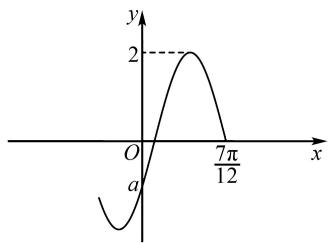
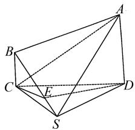
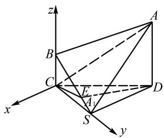

# 2025 年高考数学模拟卷(三)

# 王东海

(安徽省合肥市肥东县城关中学, 安徽 合肥 231600)

中图分类号：G632

文献标识码：A

文章编号:1008-0333(2025)10-0085-06

# 第Ⅰ卷(选择题)

一、单选题(本题共8小题,每小题5分,共40分.在每小题给出的选项中,只有一项是符合题目要求的)

1. 设全集 $U = \mathbf{R}$ , 集合 $A = \{x \mid x^2 - x - 2 > 0\}$ , $B = \{x \mid x \geqslant 1\}$ , 则 $(\complement_U A) \cap B = (\quad)$ .

A. $\{x\mid 1\leqslant x\leqslant 2\}$

B. $\{x\mid 1 <   x\leqslant 2\}$

C. $\{x \mid x > 2\}$

D. $\{x\mid 1\leqslant x <   2\}$

2. 设 $2(z + \bar{z}) + 3(z - \bar{z}) = 4 + 6\mathrm{i}$ , 则 $z = (\quad)$ .

A. $1 - 2\mathrm{i}$

B. $1 + 2i$

C. $1 + i$

D. 1 - i

3. 已知三个单位向量 a, b, c 满足 $a = b + c$ ，则向量 b, c 的夹角为().

A. $\frac{\pi}{6}$

B. $\frac{\pi}{3}$

C. $\frac{2\pi}{3}$

D. $\frac{5\pi}{6}$

4. 若 $\sin(\alpha+\beta)+\cos(\alpha+\beta)=2\sqrt{2}\cos(\alpha+\frac{\pi}{4})$ $\cdot\sin\beta,$ 则( ).

A. $\tan (\alpha +\beta) = -1$

B. $\tan (\alpha +\beta) = 1$

C. $\tan (\alpha -\beta) = -1$

D. $\tan (\alpha -\beta) = 1$

5. 已知圆锥的顶点和底面圆周均在球 O 的球面上, 若该圆锥的底面半径为 $2\sqrt{3}$ , 高为 6, 则球 O 的表面积为().

A. $32\pi$

B. $48\pi$

C. $64\pi$

D. $80\pi$

6. 函数 $f(x)=\left\{\begin{aligned}x^{2}-(a+4)x+5,x<2,\\ (2a-3)x+1,x\geqslant2\end{aligned}\right.$ 满足对 $\forall x_{1},x_{2}\in R$ 且 $x_{1}\neq x_{2}$ ，都有 $\left[f(x_{1})-f(x_{2})\right](x_{1}-x_{2})<0$ ，则实数 a 的取值范围是（）.

A. $(0,\frac{3}{2})$

B. $\left[0,\frac{3}{2}\right)$

C. $(0,1)$

D. $[0,1]$

7. 函数 $f(x) = A \sin(\omega x + \varphi) (A > 0, \omega > 0, |\varphi| < \frac{\pi}{2})$ 的部分图象如图 1 所示，将 $f(x)$ 的图象向左平移 $\frac{\pi}{12}$ 个单位长度后所得图象关于原点对称，则图中的 a 值为（）.

line

| x | y |
|---|---|
| 0 | -∞ |
| π/12 | 2 |

图1 第7题图

A. -1

B. $-\sqrt{3}$

C. $-\sqrt{2}$

D. $-\frac{\sqrt{6}-\sqrt{2}}{2}$

8. 已知定义在 $\mathbf{R}$ 上的函数 $f(x)$ 在区间 $[0,2]$ 上单调递减，且满足 $f(4 + x) + f(x) = 2f(-2)$ ，函数 $y = f(x - 2)$ 的对称中心为 $(4,0)$ ，则下述结论正确的是（ ）。（注： $\ln 3 \approx 1.099$ ）

收稿日期:2025-01-05

作者简介: 王东海, 从事中学数学教学研究.

A. $f(2024) = 0$

B. $f(1) + f\left(\frac{7}{2}\right) > 0$

C. $f(3) > f(2\log_248)$

D. $f(4\sin 1) > f(\ln \frac{1}{9})$

二、多选题(本题共3小题,每小题6分,共18分.在每小题给出的选项中,有多项符合题目要求.全部选对的得6分,部分选对的得部分分,有选错的得0分)

9. 随着“一带一路”国际合作的深入, 某茶叶种植区多措并举推动茶叶出口. 为了解推动出口后的亩收入(单位: 万元)情况, 从该种植区抽取样本, 得到推动出口后亩收入的样本均值 $\bar{x} = 2.1$ , 样本方差 $s^{2} = 0.01$ , 已知该种植区以往的亩收入 X 服从正态分布 $N(1.8, 0.1^{2})$ , 假设推动出口后的亩收入 Y 服从正态分布 $N(\bar{x}, x^{2})$ , 则(). (若随机变量 Z 服从正态分布 $N(\mu, \sigma^{2})$ , 则 $P(Z < \mu + \sigma) \approx 0.8413$ )

A. $P(X > 2) > 0.2$

B. $P(X > 2) <   0.5$

C. $P(Y > 2) > 0.5$

D. $P(Y > 2) <   0.8$

10. 已知函数 $f(x) = x(x - 3)^{2}$ ，若 $f(a) = f(b) = f(c)$ ，其中 a < b < c，则（）.

A. $1 < a < 2$

B. $a + b + c = 6$

C. $a + b > 2$

D. abc 的取值范围是(0,4)

11.“固定项链的两端,使其在重力的作用下自然下垂,项链所形成的曲线是什么?”这就是意大利画家列奥纳多·达·芬奇曾提出的著名的“悬链线问题”,后人给出了悬链线的函数表达式 $f(x)=a\cosh\frac{x}{a}$ ,其中a为悬链线系数, $\cosh x$ 称为双曲余弦函数,其函数表达式 $\cosh x=\frac{e^{x}+e^{-x}}{2}$ ,相应地,双曲正弦函数的函数表达式为 $\sinh x=\frac{e^{x}-e^{-x}}{2}$ ,则().

A. $\cosh 2x = \cosh^2 x + \sinh^2 x$

B. 关于 $x$ 的不等式 $\sin h(\ln x) - \sinh (-\ln x) \leqslant$

$\frac{e^{2}-1}{x}$ 的解集为 $(1,e]$

C. 当 y = m 与 $y = \sinh x$ 和 $y = \cosh x$ 共有 3 个交点时, $m \in (1, +\infty)$   
D. 如果对任意 $x \in (0, +\infty)$ , 都有 $\sinh x > kx$ , 那么 $k$ 的最大值为 1

# 第Ⅱ卷(非选择题)

# 三、填空题(本题共3小题,每小题5分,共15分)

12. 过双曲线 $C: \frac{x^{2}}{a^{2}} - \frac{y^{2}}{b^{2}} = 1 (b > a > 0)$ 的焦点 $F_{1}$ 作以焦点 $F_{2}$ 为圆心的圆的一条切线，切点为 M， $\triangle F_{1}F_{2}M$ 的面积为 $\frac{\sqrt{3}}{2}c^{2}$ ，其中 c 为半焦距，线段 $MF_{1}$ 恰好被双曲线 C 的一条渐近线平分，则双曲线 C 的离心率为 \_\_\_\_.

13. 若直线 y = 2x 为曲线 $y = e^{ax + b}$ 的一条切线，则 ab 的最大值为 \_\_\_\_.

14. 某班组织开展知识竞赛,抽取四名同学,分成甲、乙两组:每组两人,进行对战答题.规则如下:每次每名同学回答6道题目,其中有1道是送分题(即每名同学至少答对1题).若每次每组对的题数之和为3的倍数,则原答题组的人再继续答题;若对的题数之和不是3的倍数,就由对方组接着答题,假设每名同学每次答题之间相互独立,且每次答题顺序不作考虑,第一次由甲组开始答题,则第7次由甲组答题的概率为\_\_\_\_.

# 四、解答题(本题共5小题,共77分. 解答应写出文字说明、证明过程或演算步骤)

15. (本小题 13 分) 记 $\triangle ABC$ 的三个内角分别为 $A, B, C$ , 其对边分别为 $a, b, c$ , 分别以 $a, b, c$ 为边长的三个正三角形的面积依次为 $S_{1}, S_{2}, S_{3}$ , 且 $S_{1} - S_{2} + S_{3} = \frac{\sqrt{3}}{2}, \sin B = \frac{1}{3}$ .

(1) 求 $\triangle ABC$ 的面积;

(2) 若 $\sin A\sin C = \frac{\sqrt{2}}{3}$ , 求 $b$ .

16. (本小题 15 分) 已知椭圆 C 的方程为 $\frac{x^{2}}{a^{2}} + \frac{y^{2}}{b^{2}} = 1 (a > b > 0)$ ，右焦点为 $F(\sqrt{2}, 0)$ ，且离心率为 $\frac{\sqrt{6}}{3}$ .

(1) 求椭圆 C 的方程;

(2) 设 $M, N$ 是椭圆 $C$ 上的两点, 直线 $MN$ 与曲线 $x^{2} + y^{2} = b^{2} (x > 0)$ 相切. 证明: $M, N, F$ 三点共线的充要条件是 $|MN| = \sqrt{3}$ .

17. (本小题 15 分) 如图 2, 在四棱锥 $S-ABCD$ 中, $AD \parallel BC$ , $AD \perp CD$ , 平面 $SCD \perp$ 平面 $ABCD$ , $SC \perp SD$ , $SC = AD = 2BC = 2$ , $SD = 2\sqrt{2}$ .

text_image

Geometric diagram of a polyhedron with labeled vertices A, B, C, D, E, S and connecting edges

图 2 第 17 题图

(1) 求点 B 到平面 SAC 的距离;

(2) 在线段 $SB$ 上是否存在点 $E$ , 使二面角 $E - CD - A$ 的正弦值为 $\frac{4\sqrt{70}}{35}$ ? 若存在, 请确定点 $E$ 的位置; 若不存在, 请说明理由.

18. (本小题 17 分) 已知函数 $f(x) = x + \sin x - ax(1 + \cos x)$ .

(1) 当 a=1 时, 求 $f(x)$ 的单调区间;

(2) 当 a=0 时, 求曲线 $y=f(x)$ 的对称中心;

(3) 当 $0 \leqslant x \leqslant \pi$ 时, $f(x) \geqslant 0$ , 求 $a$ 的取值范围.

19. (本小题 17 分) 给定数列 $A_{n}: a_{1}, a_{2}, \cdots, a_{n}$ ( $a_{i} \in \mathbf{N}, i = 1, 2, \cdots, n$ ), 定义“ $\omega$ 变换”为将数列 $A_{n}$ 变换成 $B_{n}: b_{1}, b_{2}, \cdots, b_{n}$ , 其中 $b_{i} = |a_{i+1} - a_{i}| (i = 1, 2, \cdots, n-1)$ , 且 $b_{n} = |a_{n} - a_{1}|$ . 这种“ $\omega$ 变换”记作

$B_{n}=\omega(A_{n})$ ，继续对数列 $B_{n}$ 进行“ $\omega$ 变换”，得到数列 $C_{n},\cdots$ ，以此类推，当得到的数列各项为0时变换结束.

(1) 求数列 $A_{4}:1,4,2,9$ 经过 4 次“ $\omega$ 变换”后得到的数列；

(2) 证明: 数列 $A_{3}: a_{1}, a_{2}, a_{3}$ 经过有限次“ $\omega$ 变换”后能够结束的充要条件是 $a_{1} = a_{2} = a_{3}$ ;

(3)已知数列 $A_{3}:2\ 024,2,2\ 028$ 经过 K 次 “ $\omega$ 变换” 后得到的数列各项之和最小, 求 K 的最小值.

# 参考答案

1. A 2. C 3. C 4. C 5. C 6. D 7. A

8. C  9. BC  10. BCD  11. ACD

12.2 13. $\frac{2}{\mathrm{e}^2}$ 14. $\frac{365}{729}$ .

15.(1)因为边长为 a 的正三角形的面积为 $\frac{\sqrt{3}}{4}a^{2}$ ,

所以 $S_{1}-S_{2}+S_{3}=\frac{\sqrt{3}}{4}(a^{2}-b^{2}+c^{2})=\frac{\sqrt{3}}{2}.$

即 $acc\cos B = 1$

故 $\cos B > 0$

由 $\sin B = \frac{1}{3}$ , 得 $\cos B = \frac{2\sqrt{2}}{3}$ .

所以 $ac=\frac{1}{\cos B}=\frac{3\sqrt{2}}{4}.$

故 $S_{\triangle ABC}=\frac{1}{2}ac\sin B=\frac{1}{2}\times\frac{3\sqrt{2}}{4}\times\frac{1}{3}=\frac{\sqrt{2}}{8}.$

(2)由正弦定理,得

$$
\frac {b ^ {2}}{\sin^ {2} B} = \frac {a}{\sin A} \cdot \frac {c}{\sin C}
$$

$$
= \frac {a c}{\sin A \sin C}
$$

$$
= \frac {3 \sqrt {2} / 4}{\sqrt {2} / 3} = \frac {9}{4}.
$$

故 $b=\frac{3}{2}\sin B=\frac{1}{2}.$

16.(1)由题意,椭圆半焦距 $c=\sqrt{2}$ 且 $e=\frac{c}{a}=\frac{\sqrt{6}}{3}$ .

所以 $a = \sqrt{3}$

又 $b^{2} = a^{2} - c^{2} = 1$

所以椭圆方程为 $\frac{x^{2}}{3}+y^{2}=1$ .

(2)由(1)得,曲线为 $x^{2}+y^{2}=1(x>0)$ .

当直线 MN 的斜率不存在时, 直线 MN: x = 1, 不满足 M, N, F 三点共线.

当直线 MN 的斜率存在时, 设 $M(x_{1}, y_{1}), N(x_{2}, y_{2})$ .

必要性: 若 M, N, F 三点共线, 可设直线 MN: $y=k(x-\sqrt{2})$ ,

即 $kx - y - \sqrt{2} k = 0.$

由直线 MN 与曲线 $x^{2} + y^{2} = 1 (x > 0)$ 相切可得

$$
\frac {| \sqrt {2} k |}{\sqrt {k ^ {2} + 1}} = 1,
$$

解得 $k = \pm 1$ .

联立 $\left\{\begin{aligned}y&=\pm(x-\sqrt{2}),\\ \frac{x^{2}}{3}&+y^{2}=1,\end{aligned}\right.$ 可得

$$
4 x ^ {2} - 6 \sqrt {2} x + 3 = 0, \Delta > 0,
$$

所以 $x_{1} + x_{2} = \frac{3\sqrt{2}}{2}, x_{1} \cdot x_{2} = \frac{3}{4}$ .

所以 $|MN|=\sqrt{1+1}\cdot\sqrt{(x_{1}+x_{2})^{2}-4x_{1}\cdot x_{2}}=\sqrt{3}.$

所以必要性成立.

充分性:设直线 MN:y=kx+b,(kb<0),

即 $kx - y + b = 0$

由直线 MN 与曲线 $x^{2} + y^{2} = 1 (x > 0)$ 相切可得

$$
\frac {| b |}{\sqrt {k ^ {2} + 1}} = 1.
$$

所以 $b^{2}=k^{2}+1$ .

联立 $\left\{\begin{aligned}y&=kx+b,\\ \frac{x^{2}}{3}&+y^{2}=1,\end{aligned}\right.$ 可得

$$
\left(1 + 3 k ^ {2}\right) x ^ {2} + 6 k b x + 3 b ^ {2} - 3 = 0,
$$

$$
\Delta = 1 2 \left(3 k ^ {2} - b ^ {2} + 1\right) = 2 4 k ^ {2} > 0.
$$

所以 $x_{1} + x_{2} = -\frac{6kb}{1 + 3k^{2}}, x_{1} \cdot x_{2} = \frac{3b^{2} - 3}{1 + 3k^{2}}.$

所以 $|MN| = \sqrt{1 + k^2} \cdot \sqrt{(x_1 + x_2)^2 - 4x_1x_2}$

$$
= \sqrt {1 + k ^ {2}} \cdot \sqrt {\left(- \frac {6 k b}{1 + 3 k ^ {2}}\right) ^ {2} - 4 \cdot \frac {3 b ^ {2} - 3}{1 + 3 k ^ {2}}}
$$

$$
= \sqrt {1 + k ^ {2}} \cdot \frac {\sqrt {2 4 k ^ {2}}}{1 + 3 k ^ {2}} = \sqrt {3},
$$

化简, 得 $3(k^{2}-1)^{2}=0$ .

所以 $k = \pm 1$ .

所以 $\left\{\begin{aligned}k&=1,\\ b&=-\sqrt{2}\end{aligned}\right.$ 或 $\left\{\begin{aligned}k&=-1,\\ b&=\sqrt{2}.\end{aligned}\right.$

所以直线 MN: $y = x - \sqrt{2}$ 或 $y = -x + \sqrt{2}$ .

所以直线 MN 过点 $F(\sqrt{2},0)$ , M, N, F 三点共线, 充分性成立.

所以 M, N, F 三点共线的充要条件是 $\left|MN\right| = \sqrt{3}$ .

17.(1)因为平面 $SCD \perp$ 平面 ABCD,

平面 $SCD \cap$ 平面 $ABCD = CD, AD \subset$ 平面 $ABCD, AD \perp CD,$

所以 $AD \perp$ 平面 SCD.

因为 $AD \parallel BC$ ,

所以 $BC \perp$ 平面 SCD.

过点 C 作 $CF \parallel SD$ ，因为 $SC \perp SD$ ，

所以 $CF \perp SC.$

以 $\{\overrightarrow{CF},\overrightarrow{CS},\overrightarrow{CB}\}$ 为正交基底建立如图 3 所示的空间直角坐标系, 因为 SC = AD = 2BC = 2, $SD = 2\sqrt{2}$ ,

text_image

z
A
B
C
E
A₁
D
S
x
y

图 3 第 17 题解析图

则 $C(0,0,0)$ , $B(0,0,1)$ , $S(0,2,0)$ , $A(-2\sqrt{2},2,2)$ .

所以 $\overrightarrow{CA} = (-2\sqrt{2}, 2, 2), \overrightarrow{CS} = (0, 2, 0)$ .

设平面 SAC 的一个法向量为 $\boldsymbol{n}=(x,y,z)$ ，则

$$
\left\{ \begin{array}{l} \overrightarrow {C A} \perp \boldsymbol {n}, \\ \overrightarrow {C S} \perp \boldsymbol {n}. \end{array} \right.
$$

即 $\left\{\begin{aligned}\overrightarrow{CA}\cdot\boldsymbol{n}&=-2\sqrt{2}x+2y+2z=0,\\\overrightarrow{CS}\cdot\boldsymbol{n}&=2y=0.\end{aligned}\right.$

取 $\boldsymbol{n}=(1,0,\sqrt{2})$ ，又 $\overrightarrow{CB}=(0,0,1)$ ，

所以点 B 到平面 SAC 的距离

$$
d = \frac {| \overrightarrow {C B} \cdot \boldsymbol {n} |}{| \boldsymbol {n} |} = \frac {\sqrt {2}}{\sqrt {3}} = \frac {\sqrt {6}}{3}.
$$

(2) $C(0,0,0),D(-2\sqrt{2},2,0),A(-2\sqrt{2},2,2)$ , $B(0,0,1),S(0,2,0)$ , 设 $\overrightarrow{BE} = \lambda \overrightarrow{BS}, \lambda \in [0,1]$ , 则 $\overrightarrow{BE} = \lambda (0,2,-1) = (0,2\lambda,-\lambda)$ ,

所以 $E(0,2\lambda,1-\lambda)$ .

设平面 ACD 的一个法向量为 $\boldsymbol{n}_{1}=(x_{1},y_{1},z_{1})$ $\overrightarrow{CA}=(-2\sqrt{2},2,2),\overrightarrow{CD}=(-2\sqrt{2},2,0)$ ,

由 $\left\{\begin{aligned}\overrightarrow{CA}\perp\boldsymbol{n}_{1},\\\overrightarrow{CD}\perp\boldsymbol{n}_{1},\end{aligned}\right.$ 得 $\left\{\begin{aligned}\overrightarrow{CA}\cdot\boldsymbol{n}_{1}&=-2\sqrt{2}x_{1}+2y_{1}+2z_{1}=0,\\\overrightarrow{CD}\cdot\boldsymbol{n}_{1}&=-2\sqrt{2}x_{2}+2y_{2}=0,\end{aligned}\right.$

取 $\boldsymbol{n}_{1}=(1,\sqrt{2},0)$ ,

设平面 CDE 的一个法向量为 $\boldsymbol{n}_{2}=(x_{2},y_{2},z_{2})$ ， $\overrightarrow{CE}=(0,2\lambda,1-\lambda)$ ,

由 $\left\{\begin{aligned}\overrightarrow{CD}\cdot\boldsymbol{n}_{2}&=0,\\\overrightarrow{CE}\cdot\boldsymbol{n}_{2}&=0,\end{aligned}\right.$

得 $\left\{\begin{aligned}\overrightarrow{CD}\cdot\boldsymbol{n}_{2}&=-2\sqrt{2}x_{2}+2y_{2}=0,\\\overrightarrow{CE}\cdot\boldsymbol{n}_{2}&=2\lambda y_{2}+(1-\lambda)z_{2}=0.\end{aligned}\right.$

取 $\boldsymbol{n}_{2}=(\lambda-1,\sqrt{2}(\lambda-1),2\sqrt{2}\lambda)$ ,

所以 $\cos < n_1, n_2 > = \frac{n_1 \cdot n_2}{|n_1| |n_2|}$

$$
= \frac {3 (\lambda - 1)}{\sqrt {3} \cdot \sqrt {1 1 \lambda^ {2} - 6 \lambda + 3}}.
$$

设二面角 E - CD - A 的平面角为 $\theta$ ，因为二面角 E - CD - A 的正弦值为 $\frac{4\sqrt{70}}{35}$ ，

所以 $|\cos \theta| = \sqrt{1 - (\frac{4\sqrt{70}}{35})^2} = \frac{\sqrt{105}}{35}$ .

又 $|\cos < n_1, n_2 > | = |\cos \theta|$ ,

所以 $\left|\frac{3(\lambda-1)}{\left|\sqrt{3}\cdot\sqrt{11\lambda^{2}-6\lambda+3}\right|}\right|=\frac{\sqrt{105}}{35}$ ,

化简, 得 $3 \lambda^{2} - 8 \lambda + 4 = 0$ ,

解得 $\lambda = 2$ 或 $\lambda = \frac{2}{3}$ .

因为 $\lambda\in[0,1]$ ，所以 $\lambda=\frac{2}{3}$ .

所以当点 E 是线段 SB 上靠近点 S 的三等分点时, 满足条件.

18. (1) 当 $a = 1$ 时, $f(x) = \sin x - x\cos x$ ,

$$
f ^ {\prime} (x) = x \sin x,
$$

令 $f'(x) \geqslant 0$ , 得

$$
\begin{array}{l} 2 k \pi \leqslant x \leqslant \pi + 2 k \pi , \\ - \pi - 2 k \pi \leqslant x \leqslant - 2 k \pi (k \in \mathbf {N}). \\ \end{array}
$$

令 $f'(x) \leqslant 0$ , 得

$$
\begin{array}{l} \pi + 2 k \pi \leqslant x \leqslant 2 \pi + 2 k \pi , \\ - 2 \pi - 2 k \pi \leqslant x \leqslant - \pi - 2 k \pi (k \in \mathbf {N}). \\ \end{array}
$$

所以 $f(x)$ 的单调递增区间为

$$
[ 2 k \pi , \pi + 2 k \pi ], [ - \pi - 2 k \pi , - 2 k \pi ] (k \in \mathbf {N}),
$$

单调递减区间为

$$
\left[ \pi + 2 k \pi , 2 \pi + 2 k \pi \right], \left[ - 2 \pi - 2 k \pi , - \pi - 2 k \pi \right] (k \in \mathbf {N}).
$$

(2) 当 a=0 时, $f(x)=x+\sin x$ , 设曲线 $y=f(x)$ 的对称中心为 $(m,n)$ , 则

$$
\begin{array}{l} f (x) + f (2 m - x) = x + \sin x + 2 m - x + \sin (2 m - x) \\ = 2 m + 2 \sin m \cos (x - m) \\ = 2 n. \\ \end{array}
$$

所以 $\left\{\begin{aligned}\sin m&=0,\\ 2m&=2n,\end{aligned}\right.$

解得 $m = n = k\pi (k \in \mathbf{Z})$ .

所以曲线 $y = f(x)$ 的对称中心为 $(k\pi, k\pi)$ $(k \in \mathbf{Z})$ .

(3) 当 $a \leqslant 0$ 时, $f(x) = x + \sin x - ax(1 + \cos x) \geqslant 0$ 在 $[0, \pi]$ 上恒成立, 满足题意;

当 $a > 0$ 时，

$$
\begin{array}{l} f ^ {\prime} (x) = 1 + \cos x - a (1 + \cos x - x \sin x) \\ = (1 - a) (1 + \cos x) + a x \sin x, \\ \end{array}
$$

当 $0 < a \leqslant 1$ 时，

$$
f ^ {\prime} (x) = (1 - a) (1 + \cos x) + a x \sin x \geqslant 0,
$$

所以 $f(x)$ 在 $[0, \pi]$ 上单调递增，

$f(x) \geqslant f(0) = 0$ , 满足题意.

当 $a > 1, x \in [0, \frac{\pi}{2}]$ 时，令 $h(x) = f'(x)$ ，

$$
\begin{array}{l} h ^ {\prime} (x) = - \sin x + a (2 \sin x + x \cos x) \\ \geqslant \sin x + x \cos x \geqslant 0, \\ \end{array}
$$

所以 $f'(x)$ 在 $[0, \frac{\pi}{2}]$ 上单调递增.

又因为 $f'(0)=2-2a<0,$

$$
f ^ {\prime} \left(\frac {\pi}{2}\right) = 1 - a \left(1 - \frac {\pi}{2}\right) > 0,
$$

所以存在 $x_{0} \in (0, \frac{\pi}{2})$ ，使得 $f'(x_{0}) = 0$ .

当 $x \in (0, x_{0})$ 时， $f'(x) < 0, f(x)$ 单调递减，所以 $f(x) < f(0) = 0$ ，不符合题意.

综上所述, $a$ 的取值范围为 $(-\infty, 1]$ .

19.(1)由题知:数列 $A_{4}:1,4,2,9$ 经过 1\~4 次 “ $\omega$ 变换”后得到的数列依次为:

3,2,7,8;1,5,1,5;4,4,4,4;0,0,0,0.

(2) 充分性: 当 $a_{1} = a_{2} = a_{3}$ 时, 数列 $A_{3}: a_{1}, a_{2}, a_{3}$ 经过一次“ $\omega$ 变换”后结束.

必要性: 即证明当 $a_{1}, a_{2}, a_{3}$ 不全相等时, $A_{3}: a_{1}, a_{2}, a_{3}$ 经过有限次“ $\omega$ 变换”后不会结束.

设数列 $D: d_{1}, d_{2}, d_{3}$ ，数列 $E: e_{1}, e_{2}, e_{3}$ ，数列 F: 0, 0, 0，且 $E = \omega(D)$ , $F = \omega(E)$ ，由充分性易知：数列

E 只能为非零常数列.

不妨设 $e_{1}=e_{2}=e_{3}=e(e\neq0)$ ，为了变换得到数列 E 的前两项，数列 D 只有如下四种可能：

$$
\begin{array}{l} D: d _ {1}, d _ {1} + e, d _ {1} + 2 e; \\ D: d _ {1}, d _ {1} + e, d _ {1}; \\ D: d _ {1}, d _ {1} - e, d _ {1} - 2 e; \\ D: d _ {1}, d _ {1} - e, d _ {1}, \\ \end{array}
$$

那么数列 E 的第三项只能是 0 或者 2e.

即不存在数列 D, 使其经过一次“ $\omega$ 变换”后变为非零常数列.

故当 $a_{1}, a_{2}, a_{3}$ 不全相等时, $A_{3}: a_{1}, a_{2}, a_{3}$ 经过有限次“ $\omega$ 变换”后不会结束, 必要性得证.

(3) 数列 $A_{3}:2\ 024,2,2\ 028$ 经过一次“ $\omega$ 变换”后得到数列 $B_{3}:2\ 022,2\ 026,4$ ，其结构为 $a,a+4,4$ ，且 a 远大于 4，那么其经过 1\~6 次“ $\omega$ 变换”后得到数列依次为：

$$
4, a, a - 4;
$$

$$
a - 4, 4, a - 8;
$$

$$
a - 8, a - 1 2, 4;
$$

$$
4, a - 1 6, a - 1 2;
$$

$$
a - 2 0, 4, a - 1 6;
$$

$$
a - 2 4, a - 2 0, 4.
$$

所以数列 $a, a + 4, 4$ 经过 6 次“ $\omega$ 变换”后得到的数列结构也是形如 $a, a + 4, 4$ 的数列，仅除 4 之外的两项均减小 24.

因为 $2022 = 24 \times 84 + 6$ ,

所以数列 $B_{3}$ 经过 $6 \times 84 = 504$ 次“ $\omega$ 变换”后得到数列6,10,4,

接下来经过“ $\omega$ 变换”依次得到

$$
4, 6, 2; 2, 4, 2; 2, 2, 0; 0, 2, 2,
$$

至此数列各项之和最小值为 4, K 的最小值为 $1 + 6 \times 84 + 3 = 508$ .

[责任编辑:李慧娇]