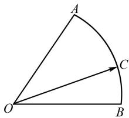
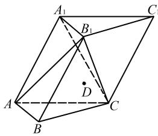
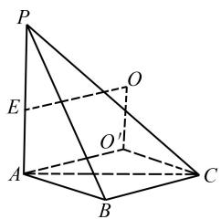
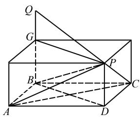
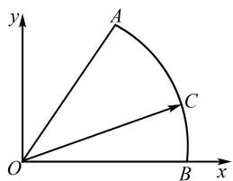
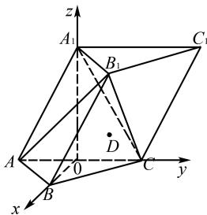

# 2025 年高考数学模拟卷(二)

# 李昌成

(新疆乌鲁木齐市第23中学, 新疆维吾尔自治区 乌鲁木齐 830017)

中图分类号：G632

文献标识码：A

文章编号:1008-0333(2025)10-0075-10

# 第Ⅰ卷（选择题）

# 一、单选题(本题共8小题,每小题5分,共40分.在每小题给出的选项中,只有一项是符合题目要求的)

1. 在复平面内, 复数 $Z = i^{2024} + i^{2025}$ , 则 z 的虚部为().

A. 1

B. -1

C. i

D. -i

2. 命题“ $\exists x_{0} > 0, \mathrm{e}^{x_{0}} - 1 < x_{0}$ ”的否定是( ).

A. $\forall x > 0, e^{x} - 1 > x$

B. $\forall x < 0, \mathrm{e}^{x} - 1 > x$

C. $\forall x > 0, e^{x} - 1 \geqslant x$

D. $\forall x\leqslant 0,\mathrm{e}^{x} - 1\geqslant x$

3. 已知双曲线 $C: \frac{x^2}{a^2} - \frac{y^2}{b^2} = 1 (a > 0, b > 0)$ 的左、右焦点为 $F_1, F_2$ ，过 $F_2$ 的直线 $l$ 分别交双曲线 $C$ 的左、右两支于 $A, B$ . 若 $|BF_1|: |AF_1|: |BF_2| = 3: 2: 1$ ，则双曲线 $C$ 的渐近线方程为（ ）.

A. $y = \pm \frac{3\sqrt{6}}{4}x$

B. $y = \pm \frac{2\sqrt{6}}{3}x$

C. $y = \pm \frac{2\sqrt{3}}{3}x$

D. $y = \pm \frac{3\sqrt{3}}{4}x$

4. Logistic 模型是常用数学模型之一, 可用于流行病学领域. 有学者根据所公布的数据建立了某地区新冠肺炎累计确诊病例 $I(t)$ (t 的单位: 天) 的 Logistic 模型: $I(t) = \frac{K}{1 + e^{12-t/4}}$ , 其中 K 为最大确诊病

例数. 当 $I(t_{0}) = 0.05 \, K$ 时, 标志着已初步遏制疫情, 则 $t_{0}$ 约为 $(\ln 19 \approx 3)$ ( ).

A. 35

B. 36

C. 60

D. 40

5. 已知椭圆 $\frac{x^{2}}{a^{2}} + \frac{y^{2}}{b^{2}} = 1 (a > b > 0)$ 右顶点为 A(2,0)，上顶点为 B，该椭圆上一点 P 与 A 的连线的斜率 $k_{1} = -\frac{1}{4}$ ，AP 的中点为 E，记 OE 的斜率为 $k_{OE}$ ，且满足 $k_{OE} + 4k_{1} = 0$ ，若 C, D 分别是 x 轴，y 轴负半轴上的动点，且四边形 ABCD 的面积为 2，则 $\triangle COD$ 面积的最大值是（）.

A. $3 - 2\sqrt{2}$

B. $3 + 2\sqrt{2}$

C. $2 - \sqrt{2}$

D. $\frac{3-2\sqrt{2}}{2}$

6. 若关于 $x$ 的不等式 $(a^2 - a)x + a\ln x \leqslant e^x - 2a\ln a$ 在 $(0, +\infty)$ 上恒成立，则实数 $a$ 的最大值为（ ）.

A. $\sqrt{\mathrm{e}}$

B. e

C. $\sqrt{e^{3}}$

D. $e^{2}$

7. 已知甲盒中有 2 个红球, 1 个蓝球, 乙盒中有 1 个红球, 2 个蓝球, 从甲乙两个盒中各取 1 球放入原来为空的丙盒中, 现从甲盒中取 1 个球, 记红球的个数为 $\xi_{1}$ , 从乙盒中取 1 个球, 记红球的个数为 $\xi_{2}$ , 从丙盒中取 1 个球, 记红球的个数为 $\xi_{3}$ , 则下列说法正确的是( ).

A. $E(\xi_1) > E(\xi_3) > E(\xi_2), D(\xi_1) = D(\xi_2) >$

$D(\xi_{3})$

B. $E(\xi_1) < E(\xi_3) < E(\xi_2), D(\xi_1) = D(\xi_2) > D(\xi_3)$

C. $E(\xi_1) > E(\xi_3) > E(\xi_2), D(\xi_1) = D(\xi_2) < D(\xi_3)$

D. $E(\xi_1) < E(\xi_3) < E(\xi_2), D(\xi_1) = D(\xi_2) < D(\xi_3)$

8. 已知点 P, A, B, C 均在表面积为 $81\pi$ 的球面上，其中 $PA \perp$ 平面 ABC, $\angle BAC = 30^{\circ}$ , $AC = \sqrt{3}AB$ ，则三棱锥 P - ABC 的体积的最大值为().

A. $\frac{81}{8}$

B. $\frac{243}{32}$

C. $\frac{81}{32}$

D. 81

二、多项选择题(本大题共3小题,每小题6分,共计18分.在每小题列出的四个选项中至少有两项是符合题目要求的,部分选对得部分分,有选错的得0分)

9. 已知函数 $f(x)=2\sin\left(2x-\frac{\pi}{6}\right)+3$ ，则下列说法正确的是().

A. $f(x)$ 的值域为[1,5]

B. $f(x)$ 在 $(0, \frac{\pi}{2})$ 上的递增区间为 $(0, \frac{\pi}{3})$

C. $f(x)$ 的对称中心为 $\left(\frac{\pi}{12}+\frac{k\pi}{2},0\right), k \in Z$

D. $f(x)$ 在 $(0, \frac{5}{6}\pi)$ 上的极值点个数为 2

10. 已知三棱锥 P-ABC 的每个顶点都在球 O 的球面上, $AB = BC = 2$ , $PA = PC = \sqrt{5}$ , $AB \perp BC$ , 过点 B 作平面 ABC 的垂线 BQ, 且 BQ = AB, PQ = 3, 点 P 与点 Q 都在平面 ABC 的同侧, 则().

A. 三棱锥 $P - ABC$ 的体积为 $\frac{2}{3}$ B. $PA \perp AB$

C. $PC \parallel BQ$ D. 球 O 的表面积为 $9\pi$

11. 已知函数 $f(x) = x \cos x - \sin x$ ，下列结论中正确的是().

A. 函数 $f(x)$ 在 $x=\frac{\pi}{2}$ 时, 取得极小值 -1

B. 对于 $\forall x \in [0, \pi], f(x) \leqslant 0$ 恒成立

C. 若 $0 < x_{1} < x_{2} < \pi$ ，则 $\frac{x_{1}}{x_{2}} < \frac{\sin x_{1}}{\sin x_{2}}$

D. 若 $a < \frac{\sin x}{x} < b$ ，对于 $\forall x \in (0, \frac{\pi}{2})$ 恒成立，则 a 的最大值为 $\frac{2}{\pi}$ ，b 的最小值为 1

# 第Ⅱ卷(非选择题)

三、填空题(本题共3小题,每小题5分,共15分)

12. 已知某种商品的广告费支出 x (单位: 万元) 与销售额 y (单位: 万元) 之间有如下对应数据 (见表 1):

表 1 广告费支出 $x$ 与销售额 $y$ 关系表

<table><tr><td>x</td><td>1</td><td>3</td><td>4</td><td>5</td><td>7</td></tr><tr><td>y</td><td>15</td><td>20</td><td>30</td><td>40</td><td>45</td></tr></table>

根据表中数据得到 y 关于 x 的经验回归方程为 $\hat{y}=5.5x+\hat{a}$ ，则当 x=7 时，残差为 \_\_\_\_。（残差 = 观测值 - 预测值）

13. 如图 1, 在扇形 OAB 中, $\angle AOB = 60^{\circ}$ , C 为弧 $\widehat{AB}$ 上的一个动点, 若 $\overrightarrow{OC} = x \overrightarrow{OA} + y \overrightarrow{OB}$ , 则 x - y 的取值范围是 \_\_\_\_.

text_image

A
O
B
C

图1 第13题图

14. 已知点 $P(x,y)$ 是直线 $l: kx - y + 4 = 0 (k > 0)$ 上的动点, 过点 P 作圆 $C: x^{2} + y^{2} + 2y = 0$ 的切线 PA, A 为切点, 若 $|PA|$ 最小为 2 时, 圆 $M: x^{2} + y^{2} - my = 0$ 与圆 C 外切, 且与直线 l 相切, 则 m 的值为 \_\_\_\_.

四、解答题(本题共5个小题,共77分. 解答应在答卷的相应各题中写出文字说明、说明过程或演算步骤)

15. (本小题 13 分) 定义函数 $f_{n}(x)=1-x+\frac{x^{2}}{2}$

$$
- \frac {x ^ {3}}{3} + \dots + (- 1) ^ {n} \frac {x ^ {n}}{n} (n \in \mathbf {N} ^ {*}).
$$

(1) 求曲线 $y = f_{n}(x)$ 在 x = -2 处的切线斜率;

(2) 若 $f_{2}(x)-2 \geqslant k e^{x}$ 对任意 $x \in R$ 恒成立, 求 $k$ 的取值范围.

(注:e=2.718 28…是自然对数的底数)

16. (本小题 15 分) 某学校组织 100 名学生去高校参加社会实践. 为了了解学生性别与颜色喜好的关系, 准备了足量的红、蓝颜色的两种帽子, 它们除颜色外完全相同. 每位学生根据个人喜好领取 1 顶帽子, 学校统计学生所领帽子的颜色, 得到了如下 $2 \times 2$ 列联表(见表 2).

表 2 列联表

<table><tr><td></td><td>红色</td><td>蓝色</td><td>合计</td></tr><tr><td>男</td><td>20</td><td>25</td><td>45</td></tr><tr><td>女</td><td>40</td><td>15</td><td>55</td></tr><tr><td>合计</td><td>60</td><td>40</td><td>100</td></tr></table>

(1) 是否有 99% 的把握认为“喜好红色或蓝色与性别有关”；  
(2) 在进入高校某实验室前, 需要将帽子临时存放, 为此学校准备了标号为 1 号到 7 号的 7 个箱子, 现从中随机选取 4 个箱子.

①求所选的4个箱子的标号数之和为奇数的概率；  
②记所选的箱子中有 X 对相邻序号(如:所选箱子的标号为 1,2,3,5,则 1,2 和 2,3 为 2 对相邻序号,所以 X=2),求随机变量 X 的分布列和数学期望 $E(X)$ .

附： $\chi^2 = \frac{n(ad - bc)^2}{(a + b)(c + d)(a + c)(b + d)}$ ，其中 $n = a + b + c + d.$

$\chi^{2}$ 独立性检验表见表 3.

表 3 ${\chi }^{2}$ 独立性检验表

<table><tr><td> $\alpha$ </td><td>0.1</td><td>0.05</td><td>0.01</td></tr><tr><td> $x_{\alpha}$ </td><td>2.706</td><td>3.841</td><td>6.635</td></tr></table>

17. (本小题 15 分) 如图 2, 在三棱柱 $ABC - A_{1}B_{1}C_{1}$ 中, 侧面 $A_{1}ACC_{1} \perp$ 底面 $ABC, \triangle ABC, \triangle A_{1}AC$ 是

边长为2的正三角形,已知点D满足 $\overrightarrow{BD}=\overrightarrow{BA}+\overrightarrow{BC}$ .

text_image

A₁
B₁
C₁
D
A
B
C

图 2 第 17 题图

(1) 求二面角 $B_{1}-AC-B$ 的大小;  
(2)求异面直线 $A_{1}A$ 与BC的距离；  
(3) 直线 $A_{1}A$ 上是否存在点 $G$ , 使 $DG \parallel$ 平面 $AB_{1}C$ ? 若存在, 请确定点 $G$ 的位置; 若不存在, 请说明理由.

18.(本小题17分)已知 $M(1,0)$ ，动点P满足以PM为直径的圆与y轴相切，记动点P的轨迹为C.

(1) 求 C 的方程;  
(2) 设过点 $N(3,0)$ 的直线与 C 交于 A, B 两点，若 $\tan \angle AOB = -8$ ，求直线 AB 的方程.  
19. (本小题 17 分) 设 $\{a_{n}\}$ 是各项均为正数的等差数列, $a_{1} = 1$ , $a_{3} + 1$ 是 $a_{2}$ 和 $a_{8}$ 的等比中项, $\{b_{n}\}$ 的前 $n$ 项和为 $S_{n}, 2b_{n} - S_{n} = 2 (n \in \mathbf{N}^{*})$ .

(1) 求 $\{a_{n}\}$ 和 $\{b_{n}\}$ 的通项公式；

(2) 设 $c_{n} = \log_{2} \frac{a_{n+1}}{a_{n}}$ ，数列 $\{c_{n}\}$ 的前 n 项和为 $T_{n}$ ，使 $T_{k}$ 为整数的 $k (k \in \mathbf{N}^{*})$ 称为“优数”，求区间 [1, 2021] 上所有“优数”之和；  
(3) 求 $\sum_{k=1}^{2n}\frac{(-1)^{k}a_{k}^{2}b_{k}}{3+(-1)^{k}}(n\in\mathbf{N}^{*})$ .

# 参考答案

1. 因为复数 $z = i^{2024} + i^{2025} = 1 + i$ ,

则 z 的共轭复数 $\bar{z}=1-i$ .

所以 $\bar{z}$ 的虚部为-1.

故选 B.

2. 把存在改成任意, 结论进行否定.

所以命题“ $\exists x_{0}>0, e^{x_{0}}-1<x_{0}$ ”的否定是： $\forall x>0, e^{x}-1 \geqslant x$ .

故选 C.

3. 由 $|BF_{1}|: |AF_{1}|: |BF_{2}| = 3: 2: 1$ ，设 $|BF_{1}| = 3t, |AF_{1}| = 2t, |BF_{2}| = t$

由双曲线定义有

$$
\left| A F _ {2} \right| - \left| A F _ {1} \right| = \left| B F _ {1} \right| - \left| B F _ {2} \right| = 2 a = 2 t.
$$

即 $t = a, |AF_2| = 4a$

$$
\cos \angle A F _ {1} F _ {2} = \frac {(2 a) ^ {2} + (4 a) ^ {2} - 4 c ^ {2}}{2 \cdot 2 a \cdot 4 a}
$$

$$
= \frac {4 a ^ {2} + 9 a ^ {2} - 9 a ^ {2}}{2 \cdot 2 a \cdot 3 a},
$$

得 $c=\frac{\sqrt{33}}{3}a$ ，可得 $\frac{b}{a}=\frac{2\sqrt{6}}{3}$ .

则双曲线 C 的渐近线方程为 $y = \pm \frac{2\sqrt{6}}{3}x$ .

故选 B.

4. 由已知, $I(t)=\frac{K}{1+\mathrm{e}^{12-t/4}}$ ,

当 $I(t_{0})=0.05K$ 时, 标志着已初步遏制疫情,
可得 $\frac{K}{1+\mathrm{e}^{12-t_{0}/4}}=0.05K.$

即 $1 + \mathrm{e}^{12 - \frac{t_0}{4}} = 20.$

则 $12 - \frac{t_0}{4} = \ln 19.$

又 $\ln 19\approx 3$ ，所以 $t_0\approx 36.$

故选 B.

5. 设 $P(x_{1}, y_{1})$ , $A(x_{2}, y_{2})$ , PA 中点 $E(x_{0}, y_{0})$ ,
则有 $\frac{x_{1}^{2}}{a^{2}}+\frac{y_{1}^{2}}{b^{2}}=1,\frac{x_{2}^{2}}{a^{2}}+\frac{y_{2}^{2}}{b^{2}}=1.$

两式相减,得

$$
\frac {\left(x _ {1} + x _ {2}\right) \left(x _ {1} - x _ {2}\right)}{a ^ {2}} + \frac {\left(y _ {1} + y _ {2}\right) \left(y _ {1} - y _ {2}\right)}{b ^ {2}} = 0.
$$

即 $\frac{y_1 + y_2}{x_1 + x_2} \cdot \frac{y_1 - y_2}{x_1 - x_2} = -\frac{b^2}{a^2}$ .

即 $k_{1} \cdot k_{OE} = -\frac{b^{2}}{a^{2}}$ .

由 $A(2,0)$ 为椭圆右顶点, 所以 a=2.

又 $k_{1} = -\frac{1}{4}, k_{OE} + 4k_{1} = 0$

得到 $k_{OE}=1, b=1$ .

设 $C(-m,0)$ , $D(0,-n)$ , m>0, n>0, 则由四边形 ABCD 的面积为 2, 又 B 为上顶点, 有

$$
\frac {1}{2} (m + 2) (n + 1) = 2.
$$

即 $mn + m + 2n = 2$

由基本不等式,得

$$
2 \geqslant m n + 2 \sqrt {2 m n},
$$

解不等式得 $\sqrt{mn} \leqslant 2 - \sqrt{2}$ .

所以 $\triangle COD$ 的面积

$$
S = \frac {1}{2} m n \leqslant \frac {1}{2} (2 - \sqrt {2}) ^ {2} = 3 - 2 \sqrt {2},
$$

当且仅当 m=2n，即 $m=2\sqrt{2}-2$ ， $n=\sqrt{2}-1$ 时取等号.

故选 A.

6. 由已知可得 a > 0, x > 0.

由 $(a^2 - a)x + a\ln x \leqslant e^x - 2a\ln a$ ，得

$$
(a - 1) x + \ln x \leqslant \mathrm{e} ^ {x - \ln a} - 2 \ln a.
$$

所以 $\mathrm{e}^{x - \ln a} + x - \ln a\geqslant ax + \ln x + \ln a$

$$
= \mathrm{e} ^ {\ln x + \ln a} + \ln x + \ln a.
$$

构造函数 $f(x)=\mathrm{e}^{x}+x$ ，其中 $x\in R$ ，则

$$
f ^ {\prime} (x) = \mathrm{e} ^ {x} + 1 > 0.
$$

故函数 $f(x)$ 在R上为增函数.

由 $e^{x-\ln a} + x - \ln a \geqslant e^{\ln x + \ln a} + \ln x + \ln a$ ，得

$$
f (x - \ln a) \geqslant f (\ln x + \ln a).
$$

所以 $x - \ln a \geqslant \ln x + \ln a$ .

即 $2\ln a \leqslant x - \ln x$ .

令 $g(x)=x-\ln x$ ，其中 x>0，则

$$
g ^ {\prime} (x) = 1 - \frac {1}{x} = \frac {x - 1}{x}.
$$

当 0 < x < 1 时, $g'(x) < 0$ , 此时函数 $g(x)$ 在 $(0, 1]$ 单调递减,

当 x > 1 时, $g'(x) > 0$ , 此时函数 $g(x)$ 在 $(0,1]$ 单调递增.

则 $g(x)_{\min}=g(1)=1.$

所以 $2\ln a \leqslant 1$ .

解得 $0 < a \leqslant \sqrt{e}$ .

故实数 a 的最大值为 $\sqrt{e}$ .

故选 A.

7. 由题意得随机变量 $\xi_{1}$ 的可能取值为 $0,1$ ,

$$
P \left(\xi_ {1} = 0\right) = \frac {2}{3} \times \frac {1}{2} = \frac {1}{3},
$$

$$
P \left(\xi_ {1} = 1\right) = \frac {2}{3} \times \frac {1}{2} + \frac {1}{3} \times 1 = \frac {2}{3}.
$$

所以 $\xi_{1}$ 服从两点分布, $E(\xi_{1})=\frac{2}{3},D(\xi_{1})=\frac{2}{9};$ 随机变量 $\xi_{2}$ 的可能取值为0,1,

$$
P \left(\xi_ {2} = 0\right) = \frac {1}{3} \times 1 + \frac {2}{3} \times \frac {1}{2} = \frac {2}{3},
$$

$$
P \left(\xi_ {2} = 1\right) = \frac {2}{3} \times \frac {1}{2} = \frac {1}{3},
$$

所以 $\xi_{2}$ 服从两点分布, $E(\xi_{2})=\frac{1}{3},D(\xi_{2})=\frac{2}{9}.$

随机变量 $\xi_{3}$ 的可能取值为0,1,当 $\xi_{3}=0$ 时,丙盒中无红球或有一个红球,无红球的概率为 $\frac{1}{3}\times\frac{2}{3}$ ,有一个红球的概率为 $\frac{2}{3}\times\frac{2}{3}+\frac{1}{3}\times\frac{1}{3}$ ,

$$
P \left(\xi_ {3} = 0\right) = \frac {1}{3} \times \frac {2}{3} + \left(\frac {2}{3} \times \frac {2}{3} + \frac {1}{3} \times \frac {1}{3}\right) \times \frac {1}{2} = \frac {1}{2},
$$

$$
P \left(\xi_ {3} = 1\right) = \left(\frac {2}{3} \times \frac {2}{3} + \frac {1}{3} \times \frac {1}{3}\right) \times \frac {1}{2} + \frac {2}{3} \times \frac {1}{3} = \frac {1}{2},
$$

所以 $\xi_{3}$ 服从两点分布, $E(\xi_{3})=\frac{1}{2},D(\xi_{3})=\frac{1}{4}.$

则 $E(\xi_1) > E(\xi_3) > E(\xi_2), D(\xi_1) = D(\xi_2) < D(\xi_3)$ .

故选 C.

text_image

P
E
O
A
B
O'
C

图 3 第 8 题解析图

8. 如图 3, 点 P, A, B, C 均在表面积为 $81\pi$ 的球面上,可得球的半径为 $\sqrt{\frac{81\pi}{4\pi}}=\frac{9}{2}$ .

由 $\angle BAC = 30^{\circ}, AC = \sqrt{3} AB$ ，可得

$$
B C = \sqrt {A B ^ {2} + A C ^ {2} - 2 A B \cdot A C \cos 3 0 ^ {\circ}} = A B,
$$

外接圆的半径为 $r=\frac{AB}{2\sin30^{\circ}}=AB.$

三棱锥的高 $PA = 2\sqrt{\left(\frac{9}{2}\right)^2 - AB^2}$ .

则三棱锥 $P - ABC$ 的体积

$$
V = \frac {1}{3} \times \frac {1}{2} A B \times A C \sin 3 0 ^ {\circ} \times 2 \sqrt {\frac {8 1}{4} - A B ^ {2}}
$$

$$
= \frac {\sqrt {3}}{6} \times A B ^ {2} \times \sqrt {\frac {8 1}{4} - A B ^ {2}}.
$$

令 $AB^{2} = x$ ，则

$$
V ^ {2} = \frac {1}{3} \cdot \frac {1}{2} x \cdot \frac {1}{2} x \cdot (\frac {8 1}{4} - x)
$$

$$
\leqslant \frac {1}{3} \times \left(\frac {x / 2 + x / 2 + 8 1 / 4 - x}{3}\right) ^ {3} = \frac {8 1 ^ {2}}{4 ^ {3}},
$$

可得 $V \leqslant \frac{81}{8}$ ，当且仅当 $x = \frac{27}{2}$ ，即 $AB = \frac{3\sqrt{6}}{2}$ 时取等号.

故选 A.

9. 对于 A, 因为 $y = \sin\left(2x - \frac{\pi}{6}\right) \in [-1, 1]$ ,

所以 $f(x)=2\sin(2x-\frac{\pi}{6})+3\in[1,5]$ .

故选项 A 正确.

对于 B, 当 $x \in (0, \frac{\pi}{2})$ 时, $2x - \frac{\pi}{6} \in (-\frac{\pi}{6}, \frac{5\pi}{6})$ ,

令 $2x - \frac{\pi}{6} = \frac{\pi}{2}$ , 则 $x = \frac{\pi}{3}$ .

所以 $f(x)$ 在 $(0, \frac{\pi}{2})$ 上的递增区间为 $(0, \frac{\pi}{3})$ .

故选项 B 正确.

对于 C, 令 $2x - \frac{\pi}{6} = k\pi (k \in \mathbf{Z})$ , 得

$$
x = \frac {k \pi}{2} + \frac {\pi}{1 2} (k \in \mathbf {Z}).
$$

所以 $f(x)$ 的对称中心为 $\left(\frac{k\pi}{2} +\frac{\pi}{12},3\right)(k\in \mathbf{Z})$

故选项 C 错误.

对于 D, 当 $x \in (0, \frac{5\pi}{6})$ 时, $2x - \frac{\pi}{6} \in (-\frac{\pi}{6}, \frac{3\pi}{2})$ ,

所以只有当 $x = \frac{\pi}{3}$ 时， $f(x)$ 取得极大值5，无极小值.

所以 $f(x)$ 在 $(0, \frac{5\pi}{6})$ 上的极值点个数为1.

故选项 D 错误.

故选 AB.

text_image

Geometric diagram of a cube with labeled vertices and internal points, used for spatial geometry problems.

图4 第10题解析图

10. 如图 4, 长方体的高为 1, 底面是边长为 2 的正方形, 满足

$$
A B = B C = 2, P A = P C = \sqrt {5}, A B \perp B C,
$$

三棱锥 $P - ABC$ 的体积为

$$
\frac {1}{3} \times \frac {1}{2} \times 2 \times 2 \times 1 = \frac {2}{3},
$$

故 A 正确.

$$
P B = \sqrt {P D ^ {2} + B D ^ {2}}
$$

$$
= \sqrt {P D ^ {2} + A B ^ {2} + A D ^ {2}}
$$

$$
= \sqrt {2 ^ {2} + 2 ^ {2} + 1 ^ {2}} = 3,
$$

满足 $PA^{2} + AB^{2} = PB^{2}$ ，可得 $PA \perp AB$ .

故 B 正确.

$BQ \perp$ 平面 ABC, $PD \perp$ 平面 ABC,则 $BQ \parallel PD$ .

假设 $PC \parallel BQ$ ，则 $PC \parallel PD$ 。

这和 PD 与 PC 相交于点 P 矛盾.

故 C 错误.

三棱锥 P-ABC 的外接球即长方体 DG 的外接球，设其半径为 R，则

$$
2 R = \sqrt {2 ^ {2} + 2 ^ {2} + 1 ^ {2}} = 3,
$$

即 $R=\frac{3}{2}$ .

可得球 $O$ 的表面积为

$$
4 \pi \times (\frac {3}{2}) ^ {2} = 9 \pi .
$$

故 D 正确.

故选 ABD.

11. 因为 $f(x) = x \cos x - \sin x$ ,

所以 $f'(x) = \cos x - x\sin x - \cos x = -x\sin x.$

所以 $f'(\frac{\pi}{2}) = -\frac{\pi}{2} \neq 0.$

所以 $x=\frac{\pi}{2}$ 不是函数的极值点.

故 A 错误.

若 $x \in [0, \pi]$ , 则 $f'(x) = -x \sin x \leqslant 0$ .

所以函数 $f(x) = x\cos x - \sin x$ 在区间 $[0, \pi]$ 上单调递减.

因此 $f(x) \leqslant f(0) = 0.$

故 B 正确.

令 $g(x) = \frac{\sin x}{x}$ , 则

$$
g ^ {\prime} (x) = \frac {x \cos x - \sin x}{x ^ {2}}.
$$

因为 $f(x)=x\cos x-\sin x\leqslant0$ 在 $[0,\pi]$ 上恒成立,所以 $g'(x)=\frac{x\cos x-\sin x}{x^{2}}<0$ 在 $(0,\pi)$ 上恒成立.

因此函数 $g(x)=\frac{\sin x}{x}$ 在 $(0,\pi)$ 上单调递减.

又 $0 < x_{1} < x_{2} < \pi$ ，所以 $g(x_{1}) > g(x_{2})$

即 $\frac{\sin x_{1}}{x_{1}}>\frac{\sin x_{2}}{x_{2}}.$

所以 $\frac{x_{1}}{x_{2}}<\frac{\sin x_{1}}{\sin x_{2}}.$

故 C 正确.

因为函数 $g(x)=\frac{\sin x}{x}$ 在 $(0,\pi)$ 上单调递减，

所以 $x \in (0, \frac{\pi}{2})$ 时, 函数 $g(x) = \frac{\sin x}{x}$ 也单调递减.

因此 $g(x)=\frac{\sin x}{x}>g(\frac{\pi}{2})=\frac{2}{\pi}$ 在 $(0,\frac{\pi}{2})$ 上恒成立.

令 $h(x)=x-\sin x, x\in(0,\frac{\pi}{2})$ ,

则 $h'(x)=1-\cos x\geqslant0$ 在 $(0,\frac{\pi}{2})$ 上恒成立.

所以 $h(x)=x-\sin x$ 在 $(0,\frac{\pi}{2})$ 上单调递增.

因此 $h(x)=x-\sin x>0.$

即 $\frac{\sin x}{x}<1$ 在 $(0,\frac{\pi}{2})$ 上恒成立.

综上, $\frac{2}{\pi}<\frac{\sin x}{x}<1$ 在 $(0,\frac{\pi}{2})$ 上恒成立.

故 D 正确.

故选 BCD.

12. $\bar{x}=\frac{1}{5}\times(1+3+4+5+7)=4$ ,

$$
\bar {y} = \frac {1}{5} \times (1 5 + 2 0 + 3 0 + 4 0 + 4 5) = 3 0,
$$

故回归直线过点(4,30).

代入 $\hat{y}=5.5x+\hat{a}$ ，可得

$$
3 0 = 5. 5 \times 4 + \hat {a},
$$

解得 $\hat{a}=8.$

当 x=7 时, $\hat{y}=5.5\times7+8=38.5+8=46.5$ ,

所以残差为 45 - 46.5 = -1.5.

故答案为 -1.5.

13. 设扇形 OAB 的半径为 1, 由已知可设 OB 为 x 轴的正半轴, O 为坐标原点, 建立直角坐标系, 如图 5, 其中 $A\left(\frac{1}{2}, \frac{\sqrt{3}}{2}\right)$ , $B(1,0)$ .

设 $\angle BOC = \theta (0\leqslant \theta \leqslant \frac{\pi}{3})$ ，则 $C(\cos \theta ,\sin \theta)$

text_image

y
A
C
O
B
x

图 5 第 13 题解析图

由 $\overrightarrow{OC} = x\overrightarrow{OA} +y\overrightarrow{OB}$ ，得

$$
(\cos \theta , \sin \theta) = x \left(\frac {1}{2}, \frac {\sqrt {3}}{2}\right) + y (1, 0).
$$

整理, 得 $\frac{1}{2}x + y = \cos\theta, \frac{\sqrt{3}}{2}x = \sin\theta,$

解得 $x=\frac{2\sin\theta}{\sqrt{3}}$ , $y=\cos\theta-\frac{\sin\theta}{\sqrt{3}}$ .

则 $x - y = \frac{2\sin\theta}{\sqrt{3}} -\cos \theta +\frac{\sin\theta}{\sqrt{3}}$

$$
= \sqrt {3} \sin \theta - \cos \theta = 2 \sin \left(\theta - \frac {\pi}{6}\right).
$$

由 $0 \leqslant \theta \leqslant \frac{\pi}{3}$ , 得 $-\frac{\pi}{6} \leqslant \theta - \frac{\pi}{6} \leqslant \frac{\pi}{6}$ .

所以 $2\sin (\theta -\frac{\pi}{6})\in [-1,1]$

所以 x-y 的取值范围是 $[-1,1]$ .

故答案为[-1,1].

14. 由 $x^{2} + y^{2} + 2y = 0$ ，得 $x^{2} + (y + 1)^{2} = 1$ .

则圆心 $C(0, -1)$ ，半径为 1.

易知 $PA = \sqrt{PC^{2} - 1^{2}} = \sqrt{PC^{2} - 1}$ .

要使得 $|PA|$ 取最小值, 即 $|PC|$ 取最小值, 只有 $PC \perp$ 直线 l 时, $|PC|$ 取得最小值, 即为圆心 C 到直线 l 的距离 d.

此时 $PA = \sqrt{\left(\frac{|5|}{\sqrt{k^2 + 1}}\right)^2 - 1} = 2.$

又 k > 0, 解得 k = 2.

所以直线 l 的方程为 $2x - y + 4 = 0$ .

又 $x^{2} + y^{2} - my = 0$ 的标准方程为

$$
x ^ {2} + \left(y - \frac {m}{2}\right) ^ {2} = \frac {m ^ {2}}{4},
$$

即圆心为 $(0,\frac{m}{2})$ ，半径为 $|\frac{m}{2}|$ ，且过原点.

由圆 $M: x^{2} + y^{2} - my = 0$ 与圆 C 外切, 可得 m > 0.

又 $x^{2} + y^{2} - my = 0$ 与直线 $l$ 相切，

所以 $\frac{|-m / 2 + 4|}{\sqrt{5}} = \frac{m}{2}$

解得 $m=2\sqrt{5}-2$ .

故答案为 $2\sqrt{5} - 2$ .

15. (1) 由 $f_{n}(x)=1-x+\frac{x^{2}}{2}-\frac{x^{3}}{3}+\cdots+(-1)^{n}\frac{x^{n}}{n}$ ,得 $f_{n}^{\prime}(x)=-1+x-x^{2}+\cdots+(-1)^{n}x^{n-1}$

可得 $f_{n}^{\prime}(-2)=-1-2-2^{2}-\cdots-2^{n-1}$

$$
= - \frac {1 - 2 ^ {n}}{1 - 2}
$$

$$
= 1 - 2 ^ {n}.
$$

所以曲线 $y = f_{n}(x)$ 在 $x = -2$ 处的切线斜率为 $1 - 2^{n}$ .

(2) 因为 $f_{2}(x)-2 \geqslant k e^{x}$ 对任意 $x \in R$ 恒成立，

则 $k \leqslant \frac{f_2(x) - 2}{\mathrm{e}^x} = \frac{-1 - x + x^2 / 2}{\mathrm{e}^x}$ 对任意 $x \in \mathbf{R}$ 恒成立.

令 $g(x) = \frac{-1 - x + x^2 / 2}{\mathrm{e}^x}$ , 则

$$
g ^ {\prime} (x) = \frac {x (4 - x)}{2 \mathrm{e} ^ {x}}.
$$

由 $g'(x) < 0$ 解得 x < 0 或 x > 4;

由 $g'(x)>0$ , 解得 0<x<4.

故 $g(x)$ 在 $(-∞,0]$ 上单调递减，在 $(0,4)$ 上单调递增，在 $[4,+∞)$ 上单调递减.

又 $g(0) = -1$ ，且当 x > 4 时， $g(x) > 0$ ，故 $g(x)$ 的最小值为 $g(0) = -1$ .

故 $k \leqslant -1$ .

即 k 的取值范围是 $(-∞, -1]$ .

16.(1)零假设 $H_{0}$ : 喜好红色或蓝色与性别无关, 因为 $\chi^{2}=\frac{100(20\times15-25\times40)^{2}}{60\times40\times45\times55}=\frac{2\ 450}{297}\approx8.$ 249>6.635, 所以根据独立性检验, 没有充分证据推断 $H_{0}$ 成立.

因此有 99% 的把握认为“喜好红色或蓝色与性别有关”.

(2)①根据题意可知箱子的标号有4个奇数3个偶数,标号为1号到7号的7个箱子,现从中随机选取4个箱子,设事件A记为所选的4个箱子的标号数之和为奇数,则

$$
P (A) = \frac {\mathrm{C} _ {3} ^ {3} \mathrm{C} _ {4} ^ {1} + \mathrm{C} _ {3} ^ {1} \mathrm{C} _ {4} ^ {3}}{\mathrm{C} _ {7} ^ {4}} = \frac {1 6}{3 5}.
$$

②标号为1号到7号的7个箱子,现从中随机

选取 4 个箱子, 则选取 4 个箱子的所有情况有:
1 234, 1 235, 1 236, 1 237, 1 245, 1 246, 1 247, 1 256,
1 257, 1 267, 1 345, 1 346, 1 347, 1 356, 1 357, 1 367,
1 456, 1 457, 1 467, 1 567, 2 345, 2 346, 2 347, 2 356,
2 357, 2 367, 2 456, 2 457, 2 467, 2 567, 3 456, 3 457,
3 467, 3 567, 4 567.

记所选的箱子中有 X 对相邻序号, 可得
X=0,1,2,3,

则 $P(X=0)=\frac{C_{4}^{4}}{C_{7}^{4}}=\frac{1}{35}$ ,

$$
P (X = 1) = \frac {1 2}{\mathrm{C} _ {7} ^ {4}} = \frac {1 2}{3 5},
$$

$$
P (X = 2) = \frac {1 8}{\mathrm{C} _ {7} ^ {4}} = \frac {1 8}{3 5},
$$

$$
P (X = 3) = \frac {4}{C _ {7} ^ {4}} = \frac {4}{3 5},
$$

所以随机变量 X 的分布列为(见表 4):

表 4 随机变量 X 的分布列

<table><tr><td>X</td><td>0</td><td>1</td><td>2</td><td>3</td></tr><tr><td>P</td><td> $\frac{1}{35}$ </td><td> $\frac{12}{35}$ </td><td> $\frac{18}{35}$ </td><td> $\frac{4}{35}$ </td></tr></table>

所以 $E(X)=0\times\frac{1}{35}+1\times\frac{12}{35}+2\times\frac{18}{35}+3\times\frac{4}{35}=\frac{12}{7}.$

17.(1)取AC的中点O,连接 $A_{1}O$ ,BO.

因为 $\triangle A_{1}AC$ 为正三角形,所以 $A_{1}O\perp AC$ .

又侧面 $A_{1}ACC_{1} \perp$ 底面 ABC,

故可以得到 $A_{1}O \perp$ 底面 ABC.

所以 AO = 1, $OA_{1} = OB = \sqrt{3}$ , $BO \perp AC$ .

以 O 为坐标原点, 分别以 OB, OC, $OA_{1}$ 为 x 轴、y 轴、z 轴建立如图 6 所示空间直角坐标系, 则

text_image

z
A₁
B₁
C₁
A
0
D
C
y
x
B

图6 第17题解析图

$A(0, -1, 0), B(\sqrt{3}, 0, 0), A_{1}(0, 0, \sqrt{3}), C(0, 1, 0), B_{1}(\sqrt{3}, 1, \sqrt{3})$ .

所以 $\overrightarrow{AA_1} = (0,1,\sqrt{3})$

$$
\overrightarrow {A B _ {1}} = (\sqrt {3}, 2, \sqrt {3}),
$$

$$
\overrightarrow {B C} = (- \sqrt {3}, 1, 0),
$$

$$
\overrightarrow {A B} = (\sqrt {3}, 1, 0),
$$

$$
\overrightarrow {A C} = (0, 2, 0).
$$

设平面 $AB_{1}C$ 的法向量为 $\pmb {n} = (x,y,z)$ ，则

$$
\left\{ \begin{array}{l} \boldsymbol {n} \cdot \overrightarrow {A B _ {1}} = 0, \\ \boldsymbol {n} \cdot \overrightarrow {A C} = 0. \end{array} \right.
$$

即 $\left\{\begin{aligned}\sqrt{3}x_{1}+2y_{1}+\sqrt{3}z_{1}&=0,\\ 2y_{1}&=0.\end{aligned}\right.$

取 z=1 , 可得 $\boldsymbol{n}=(-1,0,1)$ .

又平面 ABC 的一个法向量为 $\overrightarrow{OA_{1}} = (0, 0, \sqrt{3})$ ，
所以 $\cos <n\cdot\overrightarrow{OA_{1}}>=\frac{n\cdot\overrightarrow{OA_{1}}}{|n||\overrightarrow{OA_{1}}|}=\frac{\sqrt{3}}{\sqrt{2}\times\sqrt{3}}=\frac{\sqrt{2}}{2}.$

由图 6 可知二面角 $B_{1}-AC-B$ 为锐角.

故二面角 $B_{1} - AC - B$ 的大小为 $\frac{\pi}{4}$ .

(2) 异面直线 $AA_{1}$ 与 $BC$ 的公垂线的方向向量 $\pmb{m} = (x_{2}, y_{2}, z_{2})$ ，则

$$
\left\{ \begin{array}{l} \boldsymbol {m} \cdot \overrightarrow {A A _ {1}} = 0, \\ \boldsymbol {n} \cdot \overrightarrow {B C} = 0. \end{array} \right.
$$

即 $\left\{\begin{aligned}y_{2}+\sqrt{3}z_{2}&=0,\\ -\sqrt{3}x_{2}+y_{2}&=0.\end{aligned}\right.$

取 $x_{2} = 1$ ，易得 $\pmb {m} = (1,\sqrt{3}, - 1)$

则异面直线 $A_{1}A$ 与 $BC$ 的距离

$$
d = \frac {| \overrightarrow {A B} \cdot \boldsymbol {m} |}{| \boldsymbol {m} |} = \frac {2 \sqrt {3}}{\sqrt {5}} = \frac {2 \sqrt {1 5}}{5}.
$$

(3) 因为 $\overrightarrow{BD} = \overrightarrow{BA} + \overrightarrow{BC}$ ，而 $\overrightarrow{BA} = (-\sqrt{3}, -1, 0)$ ， $\overrightarrow{BC} = (-\sqrt{3}, 1, 0)$ ,

所以 $\overrightarrow{BD}=(-2\sqrt{3},0,0)$ .

又因为 $B(\sqrt{3},0,0)$

所以点 D 的坐标为 $(- \sqrt{3}, 0, 0)$ .

假设存在点 G 符合题意, 则点 G 的坐标可设为 $(0, y, z)$ .

所以 $\overrightarrow{DG} = (\sqrt{3}, y, z), \overrightarrow{AG} = (0, y + 1, z)$ .

因为 $DG \parallel$ 平面 $AB_{1}C, n = (-1, 0, 1)$ 为平面 $AB_{1}C$ 的一个法向量，

由 $\overrightarrow{AG} = \lambda \overrightarrow{AA_1} = (0, \lambda, \sqrt{3}\lambda)$ ，得

$$
\left\{ \begin{array}{l} y + 1 = \lambda , \\ z = \sqrt {3}, \\ \overrightarrow {n} \cdot \overrightarrow {D G} = - \sqrt {3} + z = 0, \end{array} \right.
$$

所以 $\left\{\begin{aligned}y&=0,\\ z&=\sqrt{3}.\end{aligned}\right.$

又 $DG\not\subset$ 平面 $AB_{1}C$ ，故存在点 $G$ ，使 $DG//$ 平面 $AB_{1}C$ ，其坐标为 $(0,0,\sqrt{3})$ ，即恰好为点 $A_{1}$

18.(1)设 $P(x,y)$ ，又因为 $M(1,0)$ ，所以线段 PM 的中点坐标为 $\left(\frac{x+1}{2},\frac{y}{2}\right)$ .

又因为以 PM 为直径的圆与 y 轴相切，

所以 $\left|\frac{x+1}{2}\right|=\frac{1}{2}\sqrt{(x-1)^{2}+y^{2}}.$

化简, 得 $y^{2}=4x$ .

所以动点 P 的轨迹 C 的方程为 $y^{2}=4x$ .

(2) 设 $A(x_{1}, y_{1})$ , $B(x_{2}, y_{2})$ ，当斜率不存在，则 $A(3, 2\sqrt{3})$ , $B(3, -2\sqrt{3})$ .

则 $\tan \angle AOB = \tan 2\angle AON$

$$
= \frac {2 \tan \angle A O N}{1 - \tan^ {2} \angle A O N}
$$

$$
= \frac {2 \times 2 \sqrt {3} / 3}{1 - (2 \sqrt {3} / 3) ^ {2}} = - 4 \sqrt {3} \neq - 8,
$$

不符合题意.

所以易知 AB 斜率不为 0. 不妨设 AB 的方程为 $x = ty + 3$ ,

联立 $\left\{\begin{aligned}y^{2}&=4x,\\ x&=ty+3,\end{aligned}\right.$ 得 $y^{2}-4ty-12=0.$

则 $y_{1} + y_{2} = 4t, y_{1}y_{2} = -12.$

因为 $\tan\angle AOB=\frac{\sin\angle AOB}{\cos\angle AOB}=-8$

所以 $\sin\angle AOB + 8\cos\angle AOB = 0.$

所以 $|OA||OB|\sin\angle AOB+8|OA||OB|\cdot\cos\angle AOB=0.$

所以 $2S_{\triangle OAB} + 8 \overrightarrow{OA} \cdot \overrightarrow{OB} = 0.$

即 $S_{\triangle OAB} + 4 \overrightarrow{OA} \cdot \overrightarrow{OB} = 0.$

因为 $|AB| = \sqrt{1 + t^2} \cdot |y_1 - y_2|$

$$
\begin{array}{l} = \sqrt {1 + t ^ {2}} \cdot \sqrt {\left(y _ {1} + y _ {2}\right) ^ {2} - 4 y _ {1} y _ {2}} \\ = \sqrt {1 + t ^ {2}} \cdot \sqrt {1 6 t ^ {2} + 4 8}, \\ \end{array}
$$

且 $d_{O-AB}=\frac{3}{\sqrt{1+t^{2}}}$ ,

所以 $S_{\triangle OAB}=\frac{1}{2}d_{O-AB}\cdot|AB|=6\sqrt{t^{2}+3}.$

又因为 $\overrightarrow{OA} \cdot \overrightarrow{OB} = x_{1}x_{2} + y_{1}y_{2}$

$$
= \left(t y _ {1} + 3\right) \left(t y _ {2} + 3\right) + y _ {1} y _ {2}
$$

$$
= \left(t ^ {2} + 1\right) y _ {1} y _ {2} + 3 t \left(y _ {1} + y _ {2}\right) + 9
$$

$$
= - 1 2 \left(t ^ {2} + 1\right) + 1 2 t ^ {2} + 9 = - 3,
$$

所以 $S_{\triangle OAB} + 4 \overrightarrow{OA} \cdot \overrightarrow{OB} = 6 \sqrt{t^2 + 3} - 12 = 0.$

所以 $\sqrt{t^{2}+3}=2$ ,

解得 $t = \pm 1$ .

所以直线 AB 的方程为 $x = \pm y + 3$ .

即 y = x - 3 或 $y = -x + 3$ .

19.(1)设等差数列 $\{a_{n}\}$ 的公差为d,

因为 $a_1 = 1, a_3 + 1$ 是 $a_2$ 和 $a_8$ 的等比中项，

所以 $(a_{3}+1)^{2}=a_{2}\cdot a_{8}.$

即 $(1+2d+1)^{2}=(1+d)(1+7d)$ ,

解得 $d = \pm 1$ .

因为 $\{a_{n}\}$ 是各项均为正数的等差数列，

所以 d=1.

故 $a_{n} = a_{1} + (n - 1)d = n.$

因为 $\{b_{n}\}$ 的前 $n$ 项和为 $S_{n}$ , 且

$$
2 b _ {n} - S _ {n} = 2 (n \in \mathbf {N} ^ {*}),
$$

所以 $2b_{n-1}-S_{n-1}=2(n\geqslant2)$ .

两式相减, 得 $\frac{b_{n}}{b_{n-1}} = 2 (n \geqslant 2)$ .

当 n=1 时, $2b_{1}-S_{1}=2,b_{1}=2$ ,

所以 $\{b_{n}\}$ 是以2为首项,2为公比的等比数列.
所以 $b_{n}=2^{n}$ .

(2) 由 $a_{n} = n$ ，得 $c_{n} = \log_{2}\frac{a_{n+1}}{a_{n}} = \log_{2}\frac{n+1}{n}$ .

所以 $T_{n}=c_{1}+c_{2}+\cdots+c_{n}$

$$
= \log_ {2} \frac {2}{1} + \log_ {2} \frac {3}{2} + \dots + \log_ {2} \frac {n + 1}{n}
$$

$$
= \log_ {2} \left(\frac {2}{1} \times \frac {3}{2} \times \dots \times \frac {n + 1}{n}\right) = \log_ {2} (n + 1),
$$

要使 $T_{k}$ 为整数,则应满足 $k+1=2^{m}(m\in\mathbf{N}^{*})$ .

即满足 $T_{k}$ 为整数的 $k(k\in\mathbf{N}^{*})$ 形成数列 $\{2^{m}-1\}$ .

由题可得 $1 \leqslant 2^{m} - 1 \leqslant 2021$ ,

解得 $1 \leqslant m \leqslant 10, m \in N^{*}$ .

则满足条件的“优数”之和为

$$
S = (2 ^ {1} - 1) + (2 ^ {2} - 1) + \dots + (2 ^ {1 0} - 1)
$$

$$
= \left(2 ^ {1} + 2 ^ {2} + \dots + 2 ^ {1 0}\right) - 1 0
$$

$$
= \frac {2 \times (1 - 2 ^ {1 0})}{1 - 2} - 1 0 = 2 0 3 6.
$$

(3) 设 $x_{n} = -\frac{(2n-1)^{2} \cdot 2^{2n-1}}{2} + \frac{(2n)^{2} \cdot 2^{2n}}{4}$

$$
= (4 n - 1) \cdot 2 ^ {2 n - 2} = (4 n - 1) \cdot 4 ^ {n - 1},
$$

则 $\sum_{k=1}^{2n}\frac{(-1)^{k}a_{k}^{2}b_{k}}{3+(-1)^{k}}(n\in\mathbf{N}^{*})$ 即为数列 $\{x_{n}\}$ 的前 n 项和, 设为 $P_{n}$ , 则

$$
P _ {n} = 3 \times 4 ^ {0} + 7 \times 4 ^ {1} + 1 1 \times 4 ^ {2} + \dots + (4 n - 1) \cdot 4 ^ {n - 1}.
$$

所以 $4P_{n}=3\times4^{1}+7\times4^{2}+11\times4^{3}+\cdots+(4n-5)4^{n-1}+(4n-1)\cdot4^{n}.$

两式相减,得

$$
\begin{array}{c} - 3 P _ {n} = 3 \times 4 ^ {0} + 4 \times 4 ^ {1} + 4 \times 4 ^ {2} + \dots + 4 \times 4 ^ {n - 1} \\ - (4 n - 1) 4 ^ {n}. \end{array}
$$

所以 $-3P_{n}=3+4\times\frac{4(1-4^{n-1})}{1-4}-(4n-1)\cdot4^{n}.$

所以 $P_{n}=\frac{7}{9}+\frac{12n-7}{9}\cdot4^{n}.$