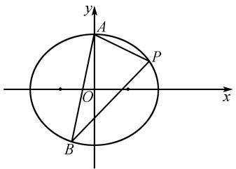
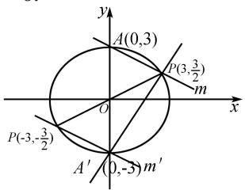

# 一道 2024 年高考题的多解探究与推广

# 贺凤梅 $^{1}$ 李昌成 $^{2}$

(1. 巩留县高级中学, 新疆维吾尔自治区 伊犁 835400;

2. 乌鲁木齐市第 23 中学, 新疆维吾尔自治区 乌鲁木齐 830002)

摘 要:圆锥曲线是解析几何的重要内容,也是高考考查的热点,对学生的逻辑思维能力、计算能力要求较高.本文以2024年新课标Ⅰ卷圆锥曲线解答题为例进行分析与探究,并予以拓展推广.

关键词: 圆锥曲线; 直线方程; 多解探究; 推广

中图分类号：G632

文献标识码：A

文章编号:1008-0333(2025)10-0042-04

解析几何试题通常运算量比较大,突破的方式比较多,能对学生的数学核心素养进行全面考查,有较强的区分度,一直是学生的学习难点、痛点.日常教学应注重多角度强化训练,学会寻找突破点,减少运算量,增加解题成功率.

# 1 试题呈现

题目 （2024 年全国高考新课标 I 卷第 16 题）
如图 1, 已知 $A(0,3)$ 和 $P(3,\frac{3}{2})$ 为椭圆 $\frac{x^{2}}{a^{2}} + \frac{y^{2}}{b^{2}} = 1$ $(a > b > 0)$ 上两点.

text_image

y
A
P
O
x
B

图 1 第 16 题原题图

(1) 求 C 的离心率;  
(2) 若过点 P 的直线 l 交 C 于另一点 B, 且

$\triangle ABP$ 的面积为 9, 求 l 的方程.

# 2 总体分析

本题是2024年全国高考新课标Ⅰ卷第16题，是直线与圆锥曲线的综合题.此题以椭圆为载体，第(1)问是求离心率，根据题目所给信息求出a,b,c，即可得离心率，属于基础题；第(2)问入口宽，方法多样，不同的求解方法思维量不同，运算量差异很大.另外，还可以将问题进行进一步拓展和推广，得到一般结论.

# 3 试题解答

第(1)问略解:椭圆方程为 $\frac{x^{2}}{12}+\frac{y^{2}}{9}=1$ ,离心率为 $e=\frac{1}{2}$ .

以下着重探讨第(2)问.

视角 1 以 BP 方程为切入点.

当 BP(即 l) 斜率不存在时, 方程为 l: x = 3, 易得

收稿日期:2025-01-05

作者简介:贺凤梅,本科,一级教师,从事中学数学教学研究.

点 $B(3,-\frac{3}{2})$ , $|BP|=3$ , 点 A 到 BP 距离为 d=3, 求得 $\triangle ABP$ 的面积为 $\frac{9}{2}$ , 不符合题意. 故 BP 斜率存在.

解法 1 直线 BP 的点斜式 + 韦达定理.

设直线 $l: y - \frac{3}{2} = k(x - 3)$ , $P(x_{1}, y_{1})$ , $B(x_{2})$ ,

$y_{2}$ ，联立 $\left\{\begin{aligned}y&=k(x-3)+\frac{3}{2},\\ 3x^{2}&+4y^{2}-36=0,\end{aligned}\right.$ 消y整理，得

$$
\begin{array}{l} (4 k ^ {2} + 3) x ^ {2} - (2 4 k ^ {2} - 1 2 k) x + 3 6 k ^ {2} - 3 6 k - 2 7 \\ = 0 \text {, 且} \Delta > 0. \\ \end{array}
$$

由根与系数的关系,得

$$
x _ {1} + x _ {2} = \frac {2 4 k ^ {2} - 1 2 k}{4 k ^ {2} + 3}, x _ {1} x _ {2} = \frac {3 6 k ^ {2} - 3 6 k - 2 7}{4 k ^ {2} + 3}. \quad ①
$$

由弦长公式结合①求得

$$
\begin{array}{l} \mid B P \mid = \sqrt {1 + k ^ {2}} \mid x _ {1} - x _ {2} \mid \\ = \sqrt {1 + k ^ {2}} \cdot \sqrt {\left(x _ {1} + x _ {2}\right) ^ {2} - 4 x _ {1} x _ {2}} \\ = \frac {6 \sqrt {1 + k ^ {2}}}{4 k ^ {2} + 3} \cdot | 2 k + 3 |, \\ \end{array}
$$

点 $A$ 到 $BP$ 的距离 $d = \frac{|3k + 3 / 2|}{\sqrt{1 + k^2}}.$

所以 $S_{\triangle ABP} = 2 \times \frac{1}{2} |BP| \times d$

$$
= \frac {9 | 2 k + 3 | \cdot | 2 k + 1 | / 2}{4 k ^ {2} + 3} = 9,
$$

化简, 得 $\left|4k^{2}+8k+3\right|=8k^{2}+6$ ,

解得 $k=\frac{1}{2}$ 或 $k=\frac{3}{2}$ .

所以直线 l 方程为 $y=\frac{1}{2}x$ 或 $y=\frac{3}{2}x-3$ .

评注 此解法是学生最容易想到和运用的,思路自然,但化简过程相对烦琐,需要学生具备较强的运算能力、转化与化归的能力.另外,直线斜率不存在时需要进行验证,学生容易忽视.

解法 2 直线 BP 的斜截式 + 韦达定理.

设直线 $l: y = kx + m$ ，则 $3k + m = \frac{3}{2}$ . ②

设 $P(x_{1},y_{1}),B(x_{2},y_{2})$ ,

联立 $\left\{\begin{aligned}y&=kx+m,\\ 3x^{2}&+4y^{2}-36=0,\end{aligned}\right.$ 消 y 整理, 得

$(4k^{2}+3)x^{2}+8kmx+4m^{2}-36=0$ ,且 $\Delta>0$ .

由根与系数的关系,得

$$
x _ {1} + x _ {2} = - \frac {8 k m}{4 k ^ {2} + 3}, x _ {1} x _ {2} = \frac {4 m ^ {2} - 3 6}{4 k ^ {2} + 3}. \tag {③}
$$

由弦长公式结合③求得

$$
\begin{array}{l} \mid B P \mid = \sqrt {1 + k ^ {2}} \mid x _ {1} - x _ {2} \mid \\ = \frac {4 \sqrt {1 + k ^ {2}}}{4 k ^ {2} + 3} \cdot \sqrt {3 6 k ^ {2} - 3 m ^ {2} + 2 7}, \\ \end{array}
$$

点 $A$ 到 $BP$ 的距离 $d = \frac{|m - 3|}{\sqrt{1 + k^2}}.$

所以 $S_{\triangle ABP} = 2 \times \frac{1}{2} |BP| \times d$

$$
= \frac {2 | m - 3 |}{4 k ^ {2} + 3} \cdot \sqrt {3 6 k ^ {2} - 3 m ^ {2} + 2 7} = 9.
$$

联合②消去 k 求解可得

$$
\left| m ^ {2} - 9 m + 1 8 \right| = 2 m ^ {2} - 6 m + 1 8,
$$

解得 $\left\{\begin{aligned}m=0,\\ k=\frac{1}{2}\end{aligned}\right.$ 或 $\left\{\begin{aligned}m=-3,\\ k=\frac{3}{2}.\end{aligned}\right.$

故直线 l 方程为 $y = \frac{1}{2}x$ 或 $y = \frac{3}{2}x - 3$ .

评注 此解法与解法 1 相似, 在求解中合理转化, 将 $6k = 3 - 2m$ 整体代入, 确保系数为整数, 先求 $m$ 的值, 再得出 $k$ 的值, 可以简化运算. 代入整理后根式中恰好是完全平方, 可以去根号, 这需要在平时的训练中积累经验.

解法 3 直线 BP 的点斜式 + 求点 B 的横坐标.

设点 $P(3, \frac{3}{2})$ , $B(x_{B}, y_{B})$ ,

结合解法 1 可知 $3x_{B}=\frac{36k^{2}-36k-27}{4k^{2}+3}$ .

所以 $x_{B}=\frac{12k^{2}-12k-9}{4k^{2}+3}$ .

所以 $|BP|=\frac{6\sqrt{1+k^{2}}}{4k^{2}+3}\cdot|2k+3|$ ,

点 $A$ 到 $BP$ 的距离 $d = \frac{|3k + 3 / 2|}{\sqrt{1 + k^2}}$

下同解法 1.

评注 由于点 P 的坐标已知, 故可借助韦达定理, 将点 B 的坐标表示出来, 求弦长时能简化部分运算. 这是常规运算中的一点处理技巧, 也是“多思少算”的一种体现.

视角 2 以 AP 为切入点.

解法 4 以 AP 为底求点 B 的直角坐标.

由已知 $A(0,3)$ , $P(3,\frac{3}{2})$ ,

AP 方程为: $x + 2y - 6 = 0$ , 且 $\left|AP\right| = \frac{3\sqrt{5}}{2}$ ,

设点 B 到 AP 距离为 d,

由 $S_{\triangle ABP} = \frac{1}{2}|BP|\cdot d = 9$ ，解得 $d = \frac{12}{\sqrt{5}}.$

设过点 $B$ 且平行于 $AP$ 的直线为

$$
m: x + 2 y + t = 0,
$$

由 $d = \frac{|t + 6|}{\sqrt{5}} = \frac{12}{\sqrt{5}}$ ，解得 $t = 6$ 或 $t = -18$ ，经检验 $t = -18$ 时，直线与椭圆相离，舍去.

联立 $\left\{\begin{aligned}x+2y+6&=0,\\ 3x^{2}+4y^{2}-36&=0,\end{aligned}\right.$ 解得

$$
\left\{ \begin{array}{l} {x = 0,} \\ {y = - 3} \end{array} \text {或} \left\{ \begin{array}{l} x = - 3, \\ y = - \frac {3}{2}. \end{array} \right. \right.
$$

即点 $B(0, -3)$ 或 $B(-3, -\frac{3}{2})$ .

又 $P(3, \frac{3}{2})$ ，进而求得直线 $l$ 方程为 $y = \frac{1}{2} x$ 或 $y = \frac{3}{2} x - 3$ .

解法 5 以 AP 为底设点 B 的参数求解.

由椭圆方程设 $B(2\sqrt{3}\cos \alpha ,3\sin \alpha)$ ，结合解法4，点 $B$ 到 $AP$ 的距离 $d = \frac{|2\sqrt{3}\cos\alpha + 6\sin\alpha - 6|}{\sqrt{5}} = \frac{12}{\sqrt{5}}.$

化简整理,得 $\left|4\sqrt{3}\sin\left(\alpha+\frac{\pi}{6}\right)-6\right|=12$ ,

解得 $\alpha=\frac{7\pi}{6}$ 或 $\frac{3\pi}{2}$ .

所以点 $B(0, -3)$ 或 $(-3, -\frac{3}{2})$ .

进而得直线 l 方程为 $y=\frac{1}{2}x$ 或 $y=\frac{3}{2}x-3$ .

评注 解法 4 和解法 5 实质相同, 因为线段 AP 为定长, 结合面积得出点 B 到 AP 的距离为 $\frac{12}{\sqrt{5}}$ . 解法 4 利用点 B 在与直线 AP 平行且与 AP 的距离为 $\frac{12}{\sqrt{5}}$ 的直线上, 同时与椭圆相交, 最终联立求出交点 B 的坐标, 进而得出直线 l 方程.

视角 3 以 AB 为切入点.

解法 6 设直线 AB 方程求解.

当 AB 斜率不存在时, 易得点 $B(0, -3)$ , $|AB| = 6$ , 点 P 到 AB 距离为 d = 3, 求得 $\triangle ABP$ 的面积为 9, 符合题意. 此时直线 l 方程为 $y = \frac{3}{2}x - 3$ .

当 AB 斜率存在时, 设直线 $AB: y = kx + 3$ , 与椭圆方程联立, 结合弦长、面积公式等可得

$$
\left| 4 k ^ {2} + 2 k \right| = 4 k ^ {2} + 3,
$$

解得 $k=\frac{3}{2}$ .

此时 $B(-3, -\frac{3}{2})$ ，直线 l 方程为 $y = \frac{1}{2}x$ .

故直线 l 方程为 $y = \frac{1}{2}x$ 或 $y = \frac{3}{2}x - 3$ .

评注 由于点 A 在 y 轴上, 相比解法 1, 2, 3 而言, 联立求解运算量相对较小.

视角 4 结合图象,利用对称性简便求解.

解法 7 对称转化求解.

如图 2, 由解法 4 可知 AP(记为 m) 方程为

$$
x + 2 y - 6 = 0.
$$

text_image

y
A(0,3)
P(3,3/2)
m
O
x
P(-3,-3/2)
A' (0,-3)m'

图 2 解法 7 示意图

易求 $\triangle OAP$ 的面积为 $\frac{9}{2}$ ，恰为 $\triangle ABP$ 面积的一半，由对称性可知，设过点A,P关于O的对称点 $A'(0,-3)$ , $P'(-3,-\frac{3}{2})$ 的直线为 $m':x+2y+6=0$ ，则点B在 $m'$ 上.

即点 B 是 $A'(0, -3)$ 或 $P'(-3, -\frac{3}{2})$ .

故直线 l 方程为 $y = \frac{1}{2}x$ 或 $y = \frac{3}{2}x - 3$ .

评注 此解法考查的是数形结合能力,同时需要利用对称性进行转化与化归,从而找到点 B 的位置,求出点 B 的坐标,问题也就迎刃而解了.

# 4 拓展与推广

以上的探讨与解答只是对此道题的分析,如果就此止步,未免可惜.根据题目数据的设置,结合图象发现一个定点为椭圆的顶点,另一个定点在椭圆上,且 $\triangle OAP$ 的面积恰为 $\triangle ABP$ 面积的一半.由此猜想,直线的方程是否与椭圆中的a,b,c以及定点的坐标有内在联系呢?于是尝试将问题一般化,进行推广.(不妨设点P在第一象限)

推广 1 已知 $A(4,0)$ 和 $P(2,3)$ 为椭圆 $\frac{x^{2}}{a^{2}} + \frac{y^{2}}{b^{2}} = 1 (a > b > 0)$ 上两点.

(1) 求 C 的离心率;  
(2) 若过点 P 的直线 l 交 C 于另一点 B, 且 $\triangle ABP$ 的面积为 12, 求 l 的方程.

简解 可知 $AP$ (记为 $m$ ) 方程为: $3x + 2y - 12 = 0$ , 易求 $\triangle OAP$ 的面积为 6, 恰为 $\triangle ABP$ 面积的一半, 由对称性可知, 设过点 $A, P$ 关于 $O$ 的对称点 $A'(-4,0), P'(-2,-3)$ 的直线为 $m': 3x + 2y + 12 = 0$ , 则点 $B$ 在 $m'$ 上.

即点 B 就是 $A'(-4,0)$ 或 $P'(-2,-3)$ .

故直线 l 方程为 $y=\frac{3}{2}x$ 或 $y=\frac{1}{2}(x+4)$ .

推广2 已知 $A(0,b)$ 和 $P(x_0,y_0)$ 为椭圆 $\frac{x^2}{a^2}$

$+\frac{y^{2}}{b^{2}}=1(a>b>0)$ 上两点. 若过点 P 的直线 l 交 C
于另一点 B, 且 $\triangle ABP$ 的面积为 $bx_{0}$ , 求 l 的方程.

参考答案 直线 l 方程为 $y=\frac{y_{0}}{x_{0}}x$ 或 $y=\frac{y_{0}+b}{x_{0}}x-b$ .

推广 3 已知 $A(a,0)$ 和 $P(x_{0},y_{0})$ 为椭圆 $\frac{x^{2}}{a^{2}} + \frac{y^{2}}{b^{2}} = 1 (a > b > 0)$ 上两点. 若过点 P 的直线 l 交 C 于另一点 B, 且 $\triangle ABP$ 的面积为 $ay_{0}$ , 求 l 的方程.

参考答案 直线 l 方程为 $y=\frac{y_{0}}{x_{0}}x$ 或 $y=\frac{y_{0}}{x_{0}+a}(x+a)$ .

# 5 结束语

直线与圆锥曲线的综合题在高考与模考中均以压轴题出现,主要涉及弦长问题、面积问题、直线的斜率、直线的方程问题等.解答这部分试题,需要较强的运算求解能力和识别图形的能力,常常需要快速准确地进行数与形的语言转换与运算,并在运算过程中注重思维的严密性,以保证结果的完整性.突出考查了数形结合、转化与化归的数学思想,对分析问题和解决问题的能力要求都很高 $^{[1]}$ .另外,《普通高中数学课程标准》中指出,要重视中学生的思维能力,“多思少算”是高中数学解题的一种非常重要的策略,能帮助学生拓宽思维,提高解题效率,提升数学核心素养.因此,“多思少算”策略逐渐成为专家和一线教师的研究方向以及命题方向 $^{[2]}$ .

# 参考文献：

[1] 刘志浩. 圆锥曲线问题的几何思考 [J]. 课程教学研究, 2013(11): 132.  
[2] 王瑜. 核心素养背景下提高高中生解题思维: 多思少算 [J]. 数学学习与研究, 2019(05): 143-144.

[责任编辑:李慧娇]