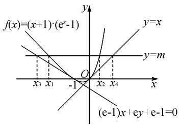
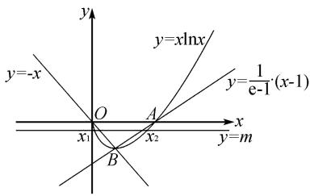
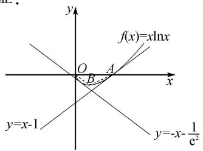

# 例谈函数零点之差范围的求法

郝娜娜

(兰州新区舟曲中学, 甘肃 兰州 730300)

摘 要:零点的和差积商是函数双变量问题主要探讨的类型,函数的零点之和、之积与极值点偏移问题有关,解决方法也多样,而零点之商的问题常采用整体代换的方法加以解决.据此,文章探讨了函数零点之差范围问题的一般解法,即切割线放缩.

关键词: 函数; 零点; 零点之差

中图分类号：G632

文献标识码：A

函数中的双变量问题是高考的热点问题,求函数零点之差范围也是函数双变量经常涉及的问题之一,这类问题因为关系到函数的凸凹性、构造函数及构造函数的切割线等而有一定的难度.本文通过近期有关省份的模考及高考试题,谈谈这类问题的一般解法.

# 1 切线放缩,确定零点之差范围

例 1 （广东省汕头市金山中学 2019 届高三上学期期中考试）已知函数 $f(x) = (x + b)(\mathrm{e}^{x} - a)(b > 0)$ 在点 $P(-1, f(-1))$ 处的切线方程为 $(\mathrm{e} - 1)x + \mathrm{e}y + \mathrm{e} - 1 = 0$ .

(1) 若 $n \leqslant 0$ , 证明: $f(x) \geqslant nx^{2} + x$ ;   
(2) 若方程 $f(x) = m$ 有两个实数根 $x_{1}, x_{2}$ ，且 $x_{1} < x_{2}$ ，证明： $x_{1} - x_{2} \leqslant 1 + \frac{m(1 - 2\mathrm{e})}{1 - \mathrm{e}}$ .

分析 本例第(1)问是证明函数不等式恒成立的问题,是简单题.下面侧重对本例第(2)问分析说

文章编号:1008-0333(2025)10-0057-04

明:由(1)易得 $f(x)=(x+1)(e^{x}-1)$ ，题中已知函数 $f(x)$ 在点 $P(-1,f(-1))$ 处的切线方程为 $(e-1)x+ey+e-1=0$ ，而x=-1是函数的一个零点。考虑函数在另外一个零点x=0处的切线，得到切线方程为y=x，通过几何画板作图，又易知函数 $f(x)$ 是下凸函数，则函数 $f(x)$ 图象夹在两条切线之间（需要证明，如图1），引入直线y=m，则直线与函数的交点的横坐标即为 $x_{1},x_{2}$ ，实为函数 $y=f(x)-m$ 的两个零点，记y=m与两条切线的交点的横坐标为 $x_{3},x_{4}$ ，则 $x_{2}-x_{1}\leqslant x_{4}-x_{3}$ 。故只需求出 $x_{4}-x_{3}$ 即可。

text_image

f(x)=(x+1)\( \cdot \)(e^x-1)
y=x
y=m
x_3 x_1 -1 O x_2 x_4 x
(e-1)x+ey+e-1=0

图 1 切线放缩确定零点之差范围

解析 (2) 由(1)知, $f(x)=(x+1)(e^{x}-1)$ , 则 $f'(x)=(x+2)e^{x}-1.$ 已知 $f(x)=(x+1)(e^{x}-1)$

在 $(-1,0)$ 处的切线方程为

$$
(e - 1) x + e y + e - 1 = 0,
$$

与直线 y = m 联立, 解得交点横坐标

$$
x _ {3} = - 1 - \frac {\mathrm{e} m}{\mathrm{e} - 1}.
$$

又易得函数 $f(x) = (x + 1)(\mathrm{e}^x - 1)$ 在(0,0)处的切线方程为 $y = x$ ，与直线 $y = m$ 联立，解得交点横坐标 $x_4 = m$ .

下面证明 $f(x)$ 的图象(切点除外)在切线 $y = x$ 的上方, 即证 $f(x) \geqslant x$ .

设 $\varphi(x)=x$ ，构造函数 $g(x)=f(x)-\varphi(x)$ ， $g'(x)=f'(x)-1=(x+2)e^{x}-2$ ，当 x<0, $g'(x)<0$ , $g(x)$ 单调递减；当 x>0, $g'(x)>0$ , $g(x)$ 单调递增，所以 $g(x)\geqslant g(0)=0$ 。从而 $f(x)\geqslant\varphi(x)$ 。

所以 $m=f(x_{2})=\varphi(x_{4})\geqslant\varphi(x_{2})$ .

又易知 $\varphi(x)$ 单调递增, 故 $x_{4} \geqslant x_{2}$ .

下面证明 $f(x)$ 的图象在直线 $(\mathrm{e} - 1)x + \mathrm{e}y + \mathrm{e} - 1 = 0$ 的上方.

设 $t(x) = (\frac{1}{\mathrm{e}} - 1)(x + 1)$ , 构造函数 $F(x) = f(x) - t(x), F'(x) = (x + 2)\mathrm{e}^x - \frac{1}{\mathrm{e}}$ , 当 $x \leqslant -2$ , $F'(x) = (x + 2)\mathrm{e}^x - \frac{1}{\mathrm{e}} \leqslant -\frac{1}{\mathrm{e}} < 0$ , 当 $x > -2$ , 令 $G(x) = F'(x) = (x + 2)\mathrm{e}^x - \frac{1}{\mathrm{e}}$ , 因 $G'(x) = (x + 3)\mathrm{e}^x > 0$ , 故函数 $F'(x)$ 在 $(-2, +\infty)$ 上单调递增.

又 $F^{\prime}(-1) = 0$ ，所以当 $x\in (-\infty , - 1)$ 时， $F^{\prime}(x) <   0$ ，当 $x\in (-1, + \infty)$ 时， $F^{\prime}(x) > 0$ ，所以函数 $F(x)$ 在 $x\in (-\infty , - 1)$ 单调递减，在 $x\in (-1,$ $+\infty)$ 单调递增，故 $F(x)\geqslant F(-1) = 0.$ 即 $f(x)\geqslant$ $t(x)$ .所以 $m = f(x_{1}) = t(x_{3})\geqslant t(x_{1})$ .又易知 $t(x)$ 单调递减，故 $x_{1}\geqslant x_{3}$

方程 $f(x) = m$ 有两个根，等价于函数 $f(x) = m$ 与 $y = m$ 图象有两个交点 $x_{1}, x_{2} (x_{1} < x_{2})$ ，则 $x_{2} - x_{1} \leqslant x_{4} - x_{3} = m - (-1 - \frac{\mathrm{e}m}{\mathrm{e} - 1}) = 1 + \frac{m(1 - 2\mathrm{e})}{1 - \mathrm{e}}$ .

评注 本题考查函数的综合应用,涉及导数的几何意义、函数的零点、函数的单调性、函数的极值和最值、利用导数证明不等式等知识点,从思想方法来说,考查了函数与方程的思想、数形结合的思想、等价转化的思想,解题的关键在于化曲为直 $^{[1]}$ ,切线逼近.本题解答构造了两条切线,一条是已知条件告知的,是x=-1处的切线,另外一条是x=0处的切线,这两条切线都是函数零点处的切线,这也是本题解答的一个特点.

# 2 割线放缩,确定零点之差范围

例 2 已知 $x_{1}\ln x_{1}=x_{2}\ln x_{2}=m(x_{1}<x_{2})$ .

(1) 求实数 m 的取值范围;  
(2) 求证: $1 + me < x_{2} - x_{1} < 2m + 1 + e^{-2}$ .

分析 本例第(1)问是求参数范围的问题,也是简单题.下面侧重对本例第(2)问进行分析,由已知条件可知, $x_{1},x_{2}$ 是函数 $y=x\ln x-m$ 的两个零点,也是函数 $f(x)=x\ln x$ 与y=m图象交点的横坐标.

由(1)可知, $B(\frac{1}{\mathrm{e}},-\frac{1}{\mathrm{e}})$ 为函数 $f(x)=x\ln x$ 的最小值点(如图2),连接OB,AB,即为函数两条割线,引入直线y=m,则直线与函数的交点的横坐标即为 $x_{1},x_{2}(x_{1}<x_{2})$ ,直线与OB,AB的交点分别为 $x_{1}^{\prime},x_{2}^{\prime}(x_{1}^{\prime}<x_{2}^{\prime})$ ,显然 $x_{2}-x_{1}>x_{2}^{\prime}-x_{1}^{\prime}$ .下面对这个明显的结论进行证明,不等式右边的证明采用切线放缩的方法.

text_image

y
y=-x
O
A
x₁
x₂
B
y=xlnx
y=\frac{1}{e-1}(x-1)
x
y=m

图 2 割线放缩确定零点之差范围

解析 (1) $m \in (-\frac{1}{\mathrm{e}}, 0)$ .

(2)首先证明不等式的左边,用割线放缩的方

法 $^{[2]}$ (如图2). 因为 $B(\frac{1}{\mathrm{e}}, -\frac{1}{\mathrm{e}})$ ，直线 OB 的方程为 y = -x.

下面证明 $-x > x \ln x (0 < x < \frac{1}{\mathrm{e}})$ .

因为 $0 < x < \frac{1}{\mathrm{e}}$ ，故 $\ln x < \ln \frac{1}{\mathrm{e}} = -1.$

因此 $-x > x\ln x$ ，且 $x_1' = -m$ .

①又 $A(1,0)$ ，直线 AB 的方程为 $y=\frac{1}{\mathrm{e}-1}(x-1)$ .

下面证明: $\frac{1}{e-1}(x-1)>x\ln x(\frac{1}{e}<x<1)$ .

构造函数 $g(x) = \frac{1}{\mathrm{e} - 1}(x - 1) - x\ln x(\frac{1}{\mathrm{e}} < x < 1)$ ，故 $g'(x) = \frac{1}{\mathrm{e} - 1} - 1 - \ln x, g'(x)$ 单调递减， $g'(\frac{1}{\mathrm{e}}) = \frac{1}{\mathrm{e} - 1} - 1 + 1 > 0, g'(1) = \frac{1}{\mathrm{e} - 1} - 1 < 0$ ，故在 $(\frac{1}{\mathrm{e}}, 1)$ 之间必存在一点 $x_0$ ，使得 $g'(x_0) = 0$ ，故 $g(x)$ 在 $(\frac{1}{\mathrm{e}}, x_0)$ 单调递增， $(x_0, 1)$ 单调递减，且 $g(\frac{1}{\mathrm{e}}) = g(1) = 0$ 。故 $g(x) > 0$ 。即 $\frac{1}{\mathrm{e} - 1}(x - 1) > x\ln x(\frac{1}{\mathrm{e}} < x < 1)$ ，且 $x_2' = m(\mathrm{e} - 1) + 1$ 。②

由①②, $x_{2}-x_{1}>x_{2}^{\prime}-x_{1}^{\prime}=1+me.$

其次证明不等式的右边,用切线放缩的方法,如图3,选择函数 $f(x)=x\ln x$ 在零点x=1处的切线,选择另一条切线的斜率与直线OB的斜率相同,由函数 $f(x)=x\ln x$ 图象下凸,可知函数 $f(x)=x\ln x$ 的图象夹在两条切线之间,后续与例1证法类似,下面构造函数简证:

text_image

f(x)=x\ln x
y=x-1
y=-x-\frac{1}{e^2}

图 3 切线放缩,以直代曲

由 $f(x)$ 在 $x = 1$ 处的切线方程为 $y = x - 1$ ，在 $x = \frac{1}{\mathrm{e}^2}$ 的切线方程为 $y = -x - \frac{1}{\mathrm{e}^2}$ ，构造函数证得 $f(x) = x\ln x > x - 1.$

则 $m = x_{2}\ln x_{2} > x_{2} - 1$ ，则 $x_{2} < m + 1.$ ③

同理可得 $f(x)=x\ln x>-x-\frac{1}{\mathrm{e}^{2}}.$

则 $m = x_{1}\ln x_{1} > -x_{1} - \frac{1}{\mathrm{e}^{2}}$ ，则 $-x_{1} < m + \frac{1}{\mathrm{e}^{2}}.$ ④

由③④可得: $x_{2}-x_{1}<2m+1+\frac{1}{\mathrm{e}^{2}}.$

综上所述, $1+me<x_{2}-x_{1}<2m+1+e^{-2}$

# 3 其他方法放缩,确定零点之差范围

例3 已知 $f(x) = \sin x - x + ax^2$ ，若 $g(x) = f'(x) + \frac{1}{4}$ ，在 $x \in (-\frac{\pi}{2}, \frac{\pi}{2})$ 上有两个零点 $x_1, x_2 (x_1 \neq x_2)$ ，求 $a$ 的取值范围；并证明 $|x_1 - x_2| > \sqrt{16a^2 + 2}$ .

分析 函数 $g(x)=f'(x)+\frac{1}{4}$ 含有三角函数与多项式, 其零点无法求出来, 需要转化为易求的多项式函数的零点.

解析 由题意可得 $g(x) = 2ax + \cos x - \frac{3}{4},$ $g'(x) = 2a - \sin x.$

当 $a \geqslant \frac{1}{2}$ 时, $g'(x) \geqslant 0$ , 则 $g(x)$ 单调递增, 故至多一个零点, 不合题意; 当 $a \leqslant -\frac{1}{2}$ 时, $g'(x) \leqslant 0$ , 则 $g(x)$ 单调递减, 故至多一个零点, 不合题意;

当 $a \in (-\frac{1}{2}, \frac{1}{2})$ 时， $g'(-\frac{\pi}{2}) = 2a + 1 > 0$ ， $g'(\frac{\pi}{2}) = 2a - 1 < 0$ ，故必存在一根 $m$ 使得 $g'(m) = 0, g(x)$ 在 $(- \frac{\pi}{2}, m)$ 单调递增， $(m, \frac{\pi}{2})$ 单调递减.

注意到 $g(0)=\frac{1}{4}>0$ , 欲使 $g(x)$ 有两个零点,则 $g(-\frac{\pi}{2}) < 0, g(\frac{\pi}{2}) < 0$ ，解得 $-\frac{3}{4\pi} < a < \frac{3}{4\pi}$ .

因此 $g(x)$ 在 $(- \frac{\pi}{2}, 0)$ 和 $(0, \frac{\pi}{2})$ 各有一根，不妨设 $x_{1} < x_{2}$ ，则 $x_{1} < 0 < x_{2}$ . 因为 $\cos x \geqslant 1 - \frac{1}{2} x^{2}$ ，则 $g(x) \geqslant 2ax - \frac{1}{2} x^{2} + \frac{1}{4} = h(x)$ . 设 $x_{3}, x_{4} (x_{3} < 0 < x_{4})$ 是 $h(x)$ 的两个零点，则 $|x_{3} - x_{4}| = \sqrt{16a^{2} + 2}$ ， $h(x_{3}) = g(x_{1}) \geqslant h(x_{1})$ ，故 $x_{3} \geqslant x_{1}$ .

同理 $h(x_{4}) = g(x_{2})\geqslant h(x_{2})$ ，故 $x_{2}\geqslant x_{4}$

因此 $x_{2} - x_{1}\geqslant x_{4} - x_{3}\geqslant \sqrt{16a^{2} + 2}.$

评注 由于 $g(x) = 2ax + \cos x - \frac{3}{4}$ 是既含有三角函数, 又含有多项式的函数, 求 $g(x)$ 的零点范围是很困难的. 本题由泰勒公式可知 $\cos x \geqslant 1 - \frac{1}{2}x^2$ , 从而把求函数 $g(x)$ 零点范围的问题转化为二次函数 $h(x) = 2ax - \frac{1}{2}x^2 + \frac{1}{4}$ 的零点的范围问题.

# 4 高考链接

例 4 （2015 年天津高考理科 21 题）已知函数 $f(x) = nx - x^{n}, x \in \mathbf{R}$ ，其中 $n \in N^{*}, n \geqslant 2$ .

(1) 讨论 $f(x)$ 的单调性；  
(2) 设曲线 $y = f(x)$ 与 x 轴正半轴的交点为 P，曲线在点 P 处的切线方程为 $y = g(x)$ ，求证：对于任意的正实数 x，都有 $f(x) \leqslant g(x)$ ;  
(3) 关于 $x$ 的方程 $f(x) = a$ ( $a$ 为实数) 有两个正实根 $x_{1}, x_{2}$ , 求证: $|x_{2} - x_{1}| < \frac{a}{1 - n} + 2$ .

分析 (3) 设 $x_{1} \leqslant x_{2}$ , 设方程 $g(x) = a$ 的根为 $x_{2}^{\prime}$ , 由(2)可知 $x_{2} \leqslant x_{2}^{\prime}$ . 设曲线 $y = f(x)$ 在原点处的切线方程为 $y = h(x)$ , 可得 $h(x) = nx$ , 设方程 $h(x) = a$ 的根为 $x_{1}^{\prime}$ , 可得 $x_{1}^{\prime} < x_{1}$ , 从而 $x_{2} - x_{1} < x_{2}^{\prime} - x_{1}^{\prime}$ . 本题只需求出 $x_{2}^{\prime} - x_{1}^{\prime}$ 即可.

证明 设 $P(x_{0},0)$ ，不妨设 $x_{1} \leqslant x_{2}$ 。由(2)知$g(x)=(n-n^{2})(x-x_{0})$ . 设方程 $g(x)=a$ 的根为 $x_{2}^{\prime}$ ，可得 $x_{2}^{\prime}=\frac{a}{n-n^{2}}+x_{0}$ .

又由(2)知 $g(x_{2}) \geqslant f(x_{2}) = a = g(x_{2}^{\prime})$ ,

可得 $x_{2} \leqslant x_{2}^{\prime}$ .

同理,设曲线 $y=f(x)$ 在原点处的切线方程为 $y=h(x)$ ，可得 $h(x)=nx$ ，当 $x\in(0,+\infty)$ ， $f(x)-h(x)=-x^{n}<0$ ，即对于任意的 $x\in(0,+\infty)$ ， $f(x)<h(x)$ .

设方程 $h(x) = a$ 的根为 $x_1'$ ，可得 $x_1' = \frac{a}{n}$ . 因为 $h(x) = nx$ 在 $(- \infty, +\infty)$ 上单调递增，且 $h(x_1') = a = f(x_1) < h(x_1)$ ，因此 $x_1' < x_1, x_2 - x_1 < x_2' - x_1' = \frac{a}{1 - n} + x_0$ . 因为 $n \geqslant 2$ ，所以 $2^{n-1} = (1 + 1)^{n-1} \geqslant 1 + C_{n-1}^1 = 1 + n - 1 = n$ . 故 $2 \geqslant \frac{1}{n^{n-1}} = x_0$ . 所以 $|x_2 - x_1| < \frac{a}{1 - n} + 2$ .

评注 关注函数在零点处的两条切线是解决该高考题的关键所在,本题只需严格证明函数图象在切线的下方即可.

# 5 结束语

对于求解函数零点之差范围的问题,应结合几何画板作图,这种试题中出现的函数凸凹性明显,采用切割线放缩的方法来解决,结论显然易见,但需要构造函数,利用函数的单调性来证明.某些函数譬如是三角函数和多项式函数的综合,就需要进一步转化为易求的函数零点之差的问题,而这往往会用到泰勒展开式.

# 参考文献：

[1] 李守明. 例谈区间端点赋值的合理性 [J]. 中学数学杂志, 2018(11): 42-44.  
[2] 李守明. 再谈区间端点赋值的合理性 [J]. 中学数学教学, 2019(01): 54-57.

[责任编辑:李慧娇]