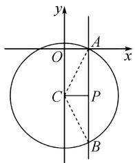
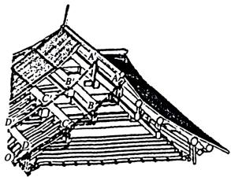
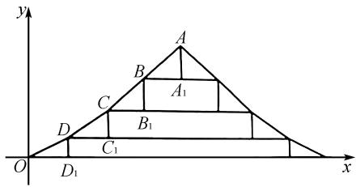
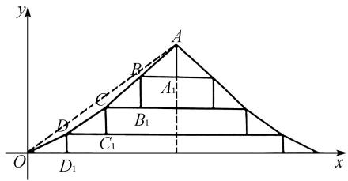
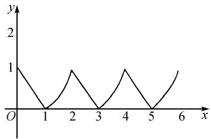
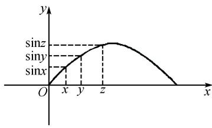
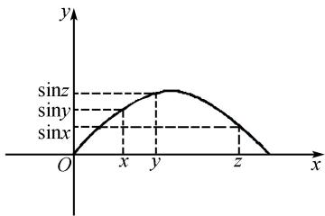
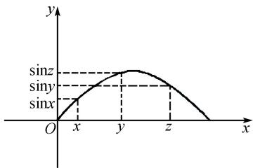
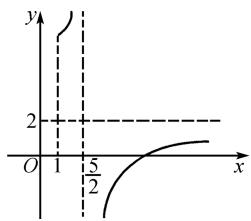

# 例谈数形结合策略解高中等差数列选择题

# 王佳琪

(扬州大学数学科学学院, 江苏 扬州 225100)

摘 要:文章从2024年全国甲卷理科数学第12题出发,在数学核心素养的视角下深入探讨了“数形结合”策略在解等差数列选择题中的应用.通过对比分析传统代数解法与数形结合解法,揭示了后者在化繁为简、化难为易方面的显著优势.

关键词:2024年高考;全国甲卷;等差数列;数形结合策略;图象特征

中图分类号：G632

文献标识码：A

文章编号:1008-0333(2025)10-0025-04

新课改在“四基”“四能”“三会”和一个“科学精神”的课程目标下，正式提出了六大数学核心素养。“四基”是发展数学核心素养的有效载体，而“数形结合”作为高中重要的数学思想方法，是“抽象”基本思想在直观中的具体体现[1].本文选取2024年全国甲卷理科第12题和2022年全国新高考Ⅱ卷第3题作为典型例题，这两道题均能利用“数形结合”的方法巧妙求解.文章将从定义、求和公式以及等差中项三个知识点切入，对比分析传统代数解法与数形结合解法，并深入剖析后者在解题过程中展现出的优势.

# 1 试题分析

题 1 （2024 年全国甲卷理科第 12 题）已知 b 是 a, c 的等差中项，直线 $ax + by + c = 0$ 与圆 $x^{2} + y^{2} + 4y - 1 = 0$ 交于 A, B 两点，则 $|AB|$ 的最小值为（）.

A.2

B. 3

C. 4

D. $2\sqrt{5}$

解析 因为 a, b, c 成等差数列, 所以 $2b = a + c$ .
代入直线方程 $ax + by + c = 0$ , 得 $ax + by + 2b - a = 0$ .
即 $a(x-1)+b(y+2)=0$ . 令 $\left\{\begin{aligned}x-1&=0,\\ y+2&=0,\end{aligned}\right.$ 得 $\left\{\begin{aligned}x=1,\\ y=-2.\end{aligned}\right.$ 故直线恒过(1,-2).

设 $P(1,-2)$ ，将圆的方程化为标准方程得 C: $x^{2}+(y+2)^{2}=5$ ，设圆心为 C，在平面直角坐标系中绘制直线与圆的图形，由图 1 可知，当 $PC \perp AB$ 时， $|AB|$ 最小， $|PC|=1, |AC|=|r|=\sqrt{5}$ .

此时 $|AB|=2|AP|=2\sqrt{AC^{2}-PC^{2}}=4.$

text_image

y
O
A
x
C
P
B

图 1 题 1 解析图

题 2 （2022 年全国新高考Ⅱ卷第 3 题）图 2 是

收稿日期:2025-01-05

作者简介: 王佳琪, 硕士研究生, 从事数学教学研究.

中国古代建筑中的举架结构, $AA'$ , $BB'$ , $CC'$ , $DD'$ 是桁,相邻桁的水平距离称为步,垂直距离称为举,图3是某古代建筑屋顶截面的示意图,其中 $DD_{1}$ , $CC_{1}$ , $BB_{1}$ , $AA_{1}$ 是举, $OD_{1}$ , $DC_{1}$ , $CB_{1}$ , $BA_{1}$ 是相等的步,相邻桁的举步之比分别为 $\frac{DD_{1}}{OD_{1}}=0.5,\frac{CC_{1}}{DC_{1}}=k_{1},\frac{BB_{1}}{CB_{1}}=k_{2},\frac{AA_{1}}{BA_{1}}=k_{3}$ .已知 $k_{1},k_{2},k_{3}$ 成公差为0.1的等差数列,且直线OA的斜率为0.725,则 $k_{3}=(\quad)$ .

A. 0.75

B.0.8

C. 0.85

D. 0.9

natural_image

Architectural line drawing of a roof structure with truss and supports (no text or symbols)

图 2 中国古代建筑举架结构图  

text_image

y
A
B
A₁
C
D₁
C₁
B₁
O
x

图 3 某古代建筑屋顶截面示意图

解析 如图4, 连接 $OA$ , 延长 $AA_{1}$ 与 $x$ 轴交于点 $A_{2}$ , 则 $OA_{2} = 4OD_{1}$ . 因为 $k_{1}, k_{2}, k_{3}$ 成公差为0.1的等差数列, 所以 $k_{1} = k_{3} - 0.2, k_{2} = k_{3} - 0.1$ .

text_image

y
A
B
C
D
A₁
B₁
C₁
D₁
O
x

图 4 题 2 解析图

所以 $CC_{1}=DC_{1}(k_{3}-0.2)$ , $BB_{1}=CB_{1}(k_{3}-0.1)$ , $AA_{1}=k_{3}BA_{1}$ . 即 $CC_{1}=OD_{1}(k_{3}-0.2)$ , $BB_{1}=OD_{1}(k_{3}-0.1)$ , $AA_{1}=k_{3}OD_{1}$ .

又 $\frac{DD_1}{OD_1} = 0.5$ ，故 $DD_{1} = 0.5OD_{1}$

所以 $AA_{2}=0.5OD_{1}+OD_{1}(k_{3}-0.2)+OD_{1}(k_{3}-0.1)+k_{3}OD_{1}=OD_{1}(3k_{3}+0.2)$ .

故 $\tan \angle AOA_{2} = \frac{AA_{2}}{OA_{2}} = \frac{OD(3k_{2} + 0.2)}{4OD_{1}} = 0.725$

解得 $k_{3}=0.9$ .

# 2 典例分析

解决等差数列选择题的方法有很多,每种方法都有其独特的优势和适用场景 $^{[2]}$ . 下面将用常规代数和数形结合两种解法求解多道模拟考试中的选择题,并分析后者在解决等差数列选择题中的作用.

# 2.1 等差数列定义中的应用

例 1 已知函数 $f(x)$ 满足当 $x \in [0,1)$ 时, $f(x) = 1 - x$ , 当 $x \in [1, +\infty)$ 时, $f(x) = \frac{1 - f(x - 1)}{1 + f(x - 1)}$ . 若方程 $f(x) = k$ 在 $[0, +\infty)$ 上的根从小到大排列恰好构成一个等差数列, 则下面的数可能在这个数列中的是().

A. $2020 - \sqrt{2}$

B. 2 020

C. 2 021

D. $2\ 020 + \sqrt{2}$

解法1（代数法）当 $x \in [1,2)$ 时， $x - 1 \in [0,1)$ ，故 $f(x - 1) = 1 - (x - 1) = 2 - x$ .

则 $f(x)=\frac{1-f(x-1)}{1+f(x-1)}=\frac{1-(2-x)}{1+(2-x)}=\frac{x-1}{3-x}.$

$$
\begin{array}{r l} & {\text {当} x \geqslant 2 \text {时,} f (x) = \frac {1 - f (x - 1)}{1 + f (x - 1)}} \\ & {= \frac {1 - [ 1 - f (x - 2) ] / [ 1 + f (x - 2) ]}{1 + [ 1 - f (x - 2) ] / [ 1 + f (x - 2) ]} = f (x - 2).} \end{array}
$$

即 $f(x)$ 的周期为2.

当 k=0 时, 方程 $f(x)=1-x=0$ , 解得 x=1. 又因为 $f(x)$ 的周期为 2, 所以根恰好是 $1,3,5,\cdots$ , 成等差数列, 2021 在此数列中.

当 k=1 时, 方程 $f(x)=1-x=1$ , 解得 x=0, 又因为 $f(x)$ 的周期为 2, 所以根恰好是 0, 2, 4, …, 成等差数列, 2020 在此数列中.

当 0 < k < 1 时, 设 $f(x) = k$ 在 $[0,4)$ 上的根从小到大排列为 $x_{1}, x_{2}, x_{3}, x_{4}$ , 因为 $f(x)$ 的周期为 2, 则 $x_{3} = x_{1} + 2$ . 若 $x_{1}, x_{2}, x_{3}, x_{4}$ 恰好构成等差数列, 则 $x_{1} + x_{3} = 2x_{2}$ , 结合两式可得 $x_{2} - x_{1} = 1$ , 即要使方程 $f(x) = k$ 的根成等差数列, 则公差只能为 1. 设方程的根依次为 $a, a + 1, a + 2, \cdots$ , 其中 $a \in (0,1)$ , 则 $f(a) = f(a + 1)$ , 即 $1 - a = \frac{a}{2 - a}$ , 解得 $a = 2 - \sqrt{2}$ , 所以 $2020 - \sqrt{2}$ 在此数列中.

解法 2 （数形结合法）由题意可得

$f(x) = \begin{cases} 1 - x, & 0 \leqslant x < 1, \\ \frac{x - 1}{3 - x}, & 1 \leqslant x < 2, \end{cases}$ 且 $f(x)$ 的周期为2，作出 $f(x)$ 的图象如图5所示.

line

| x | y |
|---|---|
| 0 | 1 |
| 1 | 0 |
| 2 | 1 |
| 3 | 0 |
| 4 | 1 |
| 5 | 0 |
| 6 | 1 |

图5 分段函数图象

当 k=0 时, 方程 $f(x)=0$ 的根恰好是 1,3,5,…, 成等差数列, 2021 在此数列中.

当 k=1 时, 方程 $f(x)=1$ 的根恰好是 0,2,4,…, 成等差数列, 2020 在此数列中.

当 0 < k < 1 时, 要使方程 $f(x) = k$ 的根成等差数列, 则公差只能为 1, 设方程的根依次为 a, $a + 1, a + 2, \cdots$ , 其中 $a \in (0, 1)$ , 则 $f(a) = f(a + 1)$ , 即 $1 - a = \frac{a}{2 - a}$ , 解得 $a = 2 - \sqrt{2}$ , 所以 $2020 - \sqrt{2}$ 在此数列中.

# 2.2 等差中项中的应用

例 2 已知实数 x, y, z 满足 $0 < x < y < z < \pi$ ，且 $\sin x, \sin y, \sin z$ 可以按照某个顺序排成等差数列，则（）.

A. $\sin x$ 不可能是等差中项

B. siny 不可能是等差中项

C. $\sin z$ 不可能是等差中项  
D. $\sin x, \sin y, \sin z$ 都可能是等差中项

解法 1 （代数法）因为函数 $y = \sin x$ 在 $(0, \frac{\pi}{2})$ 上单调递增， $(\frac{\pi}{2}, \pi)$ 上单调递减，若 x, y, z 满足 $0 < \frac{\pi}{2} < x < y < z < \pi$ ，则有 $\sin z < \sin y < \sin x$ 。存在 $2\sin y = \sin x + \sin z$ ，使得 $\sin z, \sin y, \sin x$ 成等差数列，其中 $\sin y$ 是等差中项。

若 $x, y, z$ 满足 $0 < x < \frac{\pi}{2} < y < z < \pi$ , 则有 $\sin z < \sin x < \sin y$ , $\sin z < \sin y < \sin x$ 或 $\sin x < \sin z < \sin y$ .

存在 $2\sin x = \sin y + \sin z$ ，使得 $\sin z, \sin x, \sin y$ 成等差数列，其中 $\sin x$ 是等差中项；

存在 $2\sin y = \sin x + \sin z$ ，使得 $\sin z, \sin y, \sin x$ 成等差数列，其中 $\sin y$ 是等差中项；

存在 $2\sin z = \sin x + \sin y$ ，使得 $\sin x, \sin z, \sin y$ 成等差数列，其中 $\sin z$ 是等差中项.

若 $x, y, z$ 满足 $0 < x < y < \frac{\pi}{2} < z < \pi$ , 则有 $\sin x < \sin z < \sin y$ , $\sin z < \sin x < \sin y$ 或 $\sin x < \sin y < \sin z$ .

存在 $2\sin z = \sin x + \sin y$ ，使得 $\sin x, \sin z, \sin y$ 成等差数列，其中 $\sin z$ 是等差中项；

存在 $2\sin x = \sin y + \sin z$ ，使得 $\sin z, \sin x, \sin y$ 成等差数列，其中 $\sin x$ 是等差中项；

存在 $2\sin y = \sin x + \sin z$ ，使得 $\sin x, \sin y, \sin z$ 成等差数列，其中 $\sin y$ 是等差中项.

若 $x, y, z$ 满足 $0 < x < y < z < \frac{\pi}{2}$ , 则有 $\sin x < \sin y < \sin z$ . 存在 $2 \sin y = \sin x + \sin z$ , 使得 $\sin x, \sin y, \sin z$ 成等差数列, 其中 $\sin y$ 是等差中项.

所以 $\sin x, \sin y, \sin z$ 都可能是等差中项.

解法 2 （数形结合法）若 siny 是等差中项，如图 6 所示。若 sinx 是等差中项，如图 7 所示。若 sinz 是等差中项，如图 8 所示。所以 sinx, siny, sinz 都可能是等差中项。

text_image

y
sinz
siny
sinx
O x y z x

图6 siny为等差中项  

text_image

y
sinz
siny
sinx
O
x
y
z
x

图7 $\sin x$ 为等差中项  

text_image

y
sinz
siny
sinx
O x y z x

图8 $\sin z$ 为等差中项

# 2.3 等差数列求和中的应用

例 3 等差数列 $\{a_{n}\}$ 与 $\{b_{n}\}$ 的前 n 项和分别是 $S_{n}$ 和 $T_{n}$ ，且 $\frac{S_{n}}{T_{n}} = \frac{4n - 25}{2n - 5} (n \in \mathbf{N}^{*})$ ，则（）.

A. $\frac{a_3}{b_3} = -13$

B. $\frac{a_{3}}{b_{4}}=-\frac{5}{9}$

C. $\frac{S_n}{T_n}$ 的最大值是17

D. $\frac{S_n}{T_n}$ 的最小值是7

针对 C,D 选项的求解,可分为以下两种解法.

解法1（代数法）设函数 $f(x) = \frac{4x - 25}{2x - 5}$ ，其中 $x \geqslant 1$ 且 $x \neq \frac{5}{2}$ ，且 $f'(x) = \frac{30}{(2x - 5)^2} > 0$ ，则函数 $f(x)$ 在 $[1, \frac{5}{2}), (\frac{5}{2}, +\infty)$ 上分别单调递增.

当 $x \in [1, \frac{5}{2})$ 时， $f(x) \in [\frac{21}{3}, +\infty)$ ；

当 $x \in \left(\frac{5}{2}, +\infty\right)$ 时, $f(x) \in (-\infty, 2)$ .

即 $f(2)>f(1)>\cdots>f(4)>f(3)$ .

当 n=2 时, $\frac{S_{n}}{T_{n}}$ 取得最大值 17, 当 n=3 时, 取得最小值 -13. 所以 C 正确, D 错误.

解法 2 （数形结合法）根据单调性, 可作出函数 $f(x) = \frac{4x - 25}{2x - 5} (x \geqslant 1 \text{ 且 } x \neq \frac{5}{2})$ 的大致图象(如图9). 由图9可知, 当 n = 2 时, $\frac{S_{n}}{T_{n}}$ 取得最大值 17, 当 n = 3 时, 取得最小值 -13. 所以 C 正确, D 错误.

line

| x | y |
|---|---|
| 0 | 0 |
| 1 | 5/2 |
| 2 | 0 |

图9 函数图象

# 3 结束语

通过对高考卷、模拟卷中的等差数列选择题进行研究发现,图象特征可以辅助解题. 针对此类题,学生可以构建函数,借助函数图象性质,利用数形结合策略求解. 相比于代数法,数形结合法更直观高效,能简化计算,培养空间想象与直观理解能力 $^{[3]}$ . 本文在代数解法的基础上,引入数形结合策略进行初步探讨,帮助学生拓宽解题思路,培养应用能力,提升数学抽象和直观想象的核心素养. 数形结合作为数学学科中重要的解题方法,能让抽象难以理解的题意变得清晰,助力发展高中数学核心素养.

# 参考文献：

[1] 李昭平. 例析“整体思想”解高考递推型数列题 [J]. 广东教育(高中版), 2017(11): 28-31.  
[2] 李昭平, 项张荣. 奇偶讨论柳暗花明: 从河北省名校最新联考一道数列题谈起 [J]. 中学数学研究 (华南师范大学版), 2024(07): 36-38.  
[3] 江晓洁. 基于高考“数列”专题探究解题技巧 [J]. 数理化解题研究, 2024(06): 2-4.

[责任编辑:李慧娇]