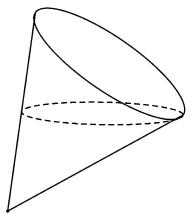
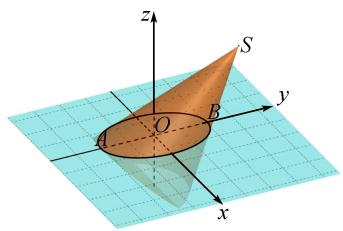
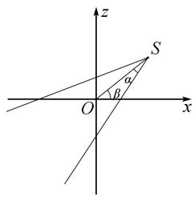
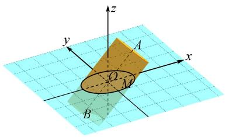
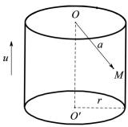
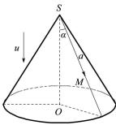

# 利用空间向量探究截口曲线的形状

周星宇 $^{1*}$ 张杰 $^{2}$ 卢中华 $^{3}$

(1. 四川师大附中书院分校, 四川 成都 610015; 2. 四川省成都市树德中学, 四川 成都 610074;  
3. 四川大学附属中学, 四川 成都 610044)

摘 要:文章以截圆锥问题为切入口,思考圆柱、圆锥等空间几何体的向量表征,利用空间向量夹角公式、点到直线距离公式求得截面曲线的方程,为研究截面问题提供了新的视角.

关键词: 圆锥曲线; 截口曲线; 空间向量

中图分类号：G632

文献标识码:A

文章编号:1008-0333(2025)10-0022-03

《普通高中教科书数学选择性必修第一册》提到“用一个不垂直于圆锥的轴的平面截圆锥，当平面与圆锥的轴所成的角不同时，可以得到不同的截口曲线，它们分别是椭圆、抛物线和双曲线”[1]. 截圆锥问题体现了三种圆锥曲线的联系，其背后实质是在透视变换下三种曲线的同源性. 最近，各地模拟试题的命制也不乏以该问题作为背景. 截圆锥可看作是立体几何中的问题情境，空间向量作为研究立体几何问题的有力工具，能否用于研究圆锥截口曲线的形状呢？笔者对此展开了探究.

# 1 试题探究

例 1 （2024 年杭州二模）机场为旅客提供的圆锥形纸杯如图 1 所示，该纸杯母线长为 12 cm，开口直径为 8 cm，旅客使用纸杯喝水时，当水面与纸杯内壁所形成的椭圆经过母线中点时，椭圆的离心率等于\_\_\_\_.

natural_image

Pure geometric diagram of a cone with dashed internal lines, no text or symbols present

图1 例1图

分析 例1的本质是截圆锥问题. 常规解法中, 需要算出椭圆长、短轴的比值, 进而求出椭圆的离心率. 不少学生提出了这样的问题: 如何证明截口曲线是椭圆呢? 一个思路是建立空间直角坐标系, 求出截口曲线的方程. 要达成上述目标, 需要先思考以下两个问题: (1) 如何建立合适的空间直角坐标系? (2) 如何使用数学语言刻画圆锥的特征以求得椭圆的方程?

对于问题(1),若以圆锥底面圆的圆心 O 为坐标原点, $xOy$ 平面垂直于圆锥的轴线,设圆锥顶点为 $S(0,0,8\sqrt{2})$ ,圆锥底面圆上点 $A(0,-4,0)$ ,圆锥母线中点为 $B(0,2,4\sqrt{2})$ ,则过 $A,B$ 两点且平行于 $x$ 轴的平面截圆锥所得截口曲线为椭圆.这种建系方式的好处在于充分利用了圆锥的几何特征,圆锥上特殊点的坐标易于表达,但以这种方式求得椭圆方程的表达式中含有变量 $z$ ,不便于后续的研究.为避免椭圆方程中出现变量 $z$ ,一个自然的想法是把椭圆放在坐标平面 $xOy$ 内.如图2,椭圆的左右顶点 $A,B$ 均在 $y$ 轴上,且关于原点对称,此时可求得圆锥顶点 $S$ .

text_image

z
S
y
O
A
B
x

图2 例1建系图

要使用数学工具对圆锥进行刻画,需回到圆锥的定义:以直角三角形的一条直角边所在直线为旋转轴,其余两边旋转一周形成的面所围成的旋转体叫做圆锥.可以看到,刻画圆锥离不开圆锥的顶点、旋转轴以及母线等要素.从圆锥的几何特征出发,我们可以得到圆锥侧面上任意一点都满足的不变性质:若点M为所求椭圆上任意一点,连接圆锥顶点S与M,则直线SM与SO所成夹角不变,其余弦值始终等于圆锥的旋转轴与母线夹角的余弦值,即

$$
\frac {\overrightarrow {S O} \cdot \overrightarrow {S M}}{| S O | \cdot | S M |} = \frac {2 \sqrt {2}}{3}.
$$

解析 如图 2, 在 $\triangle SAB$ 中, 由中线长公式, 可求得 $|AB| = 2\sqrt{17}$ .

此时 $A(0, -\sqrt{17}, 0)$ , $B(0, \sqrt{17}, 0)$ .

所以顶点 S 的坐标为 $(0, \frac{27\sqrt{17}}{17}, \frac{16\sqrt{34}}{17})$ .

设 $M(x, y, 0)$ 为椭圆上任意一点，由

$\frac{\overrightarrow{SO} \cdot \overrightarrow{SM}}{|SO| \cdot |SM|} = \frac{2\sqrt{2}}{3}$ , 得 $\frac{x^2}{17} + \frac{y^2}{8} = 1$ .

结合 $a = \sqrt{17}$ , $b = 2\sqrt{2}$ , 故 c = 3.

故离心率 $e=\frac{3\sqrt{17}}{17}$ .

# 2 方法推广

用平面 $\pi$ 截圆锥, 得到的截口曲线的形状取决于平面 $\pi$ 与圆锥的旋转轴所成的角, 记圆锥母线与旋转轴所成角为 $\alpha$ , 平面 $\pi$ 与旋转轴所成角为 $\beta$ , 若 $\pi$ 不过圆锥的顶点, 我们有:

(1) 当 $\beta = \alpha < \frac{\pi}{2}$ 时, 平面 $\pi$ 与圆锥侧面的截口曲线是抛物线;  
(2) 当 $0 \leqslant \beta < \alpha < \frac{\pi}{2}$ 时, 平面 $\pi$ 与圆锥侧面的截口曲线是双曲线的一支;  
(3) 当 $\alpha < \beta < \frac{\pi}{2}$ 时, 平面 $\pi$ 与圆锥侧面的截口曲线是椭圆.

下面我们使用同样的方法探究上述结论.

如图3,圆锥的旋转轴经过坐标原点 $O(0,0,$ 0),顶点 $S$ 位于 $xOz$ 平面内,直线 $SO$ 与平面 $xOy$ 所成角为 $\beta$ ,设顶点 $S(\cos \beta ,0,\sin \beta)$ ,取 $\pmb {u} = (-\cos \beta ,$ $0, - \sin \beta)$ 为向量 $\overrightarrow{SO}$ 的一个单位方向向量, $M(x,y,$ 0)为截口曲线上任意一点,由 $\frac{\overrightarrow{SM}\cdot\pmb{u}}{|\overrightarrow{SM}|} = \cos \alpha$ ,得

$$
\frac {- x \cos \beta + 1}{\sqrt {x ^ {2} + y ^ {2} - 2 x \cos \beta + 1 ^ {2}}} = \cos \alpha .
$$

text_image

z
S
α
β
O
x

图 3 情况(1)建系图

两边平方整理,得

$(\cos^2\alpha - \cos^2\beta)x^2 + \cos^2\alpha y^2 + 2\cos\beta \sin^2\alpha x - \sin^2\alpha = 0.$

(1) 当 $0 < a < \beta < \frac{\pi}{2}$ 时, $0 < \cos^2\alpha - \cos^2\beta < \cos^2\alpha$ , 该方程表示一个椭圆.  
(2) 当 $0 \leqslant \beta < \alpha < \frac{\pi}{2}$ 时, $\cos^2\alpha - \cos^2\beta < 0 < \cos^2\alpha$ , 此时该方程表示双曲线的一支,  
(3) 当 $\beta = \alpha < \frac{\pi}{2}$ 时, $\cos^{2}\alpha - \cos^{2}\beta = 0$ , 此时该方程表示一条抛物线.

从上述结论中我们还可以得到圆锥曲线离心率的计算公式 $e=\frac{\cos\beta}{\cos\alpha}$ .

例 2 用与圆柱底面不平行的平面去截圆柱, 所得到的完整截口曲线为椭圆, 若圆柱的旋转轴与椭圆所在平面所成角为 $\beta(0 < \beta < \frac{\pi}{2})$ , 求该椭圆的离心率.

解析 设圆柱底面半径为 r，上、下底面圆的圆心为 A, B, $M(x, y, 0)$ 为椭圆上任意一点.

如图 4, A, B 在平面 xOz 内, 且旋转轴 AB 所在直线经过坐标原点. 根据题意, 直线 AB 与平面 xOz 所成角为 $\beta$ , 不妨设直线 AB 的一个单位方向向量为 $\boldsymbol{u} = (\cos\beta, 0, \sin\beta)$ .

text_image

z
y
A
O
M
x
B

图4 例2建系图

因为点 M 到直线 AB 的距离为 r, 记 $a = \overrightarrow{OM}$ , 根据点到直线的距离公式, 有

$$
r = \sqrt {(\boldsymbol {a}) ^ {2} - (\boldsymbol {a} \cdot \boldsymbol {u}) ^ {2}}.
$$

即 $r = \sqrt{x^2 + y^2 - (x\cos\beta)^2}$ .

整理, 得 $\sin^{2}\beta x^{2} + y^{2} = r^{2}$ .

该方程表示一个椭圆,离心率 $e = \cos \beta$ .

事实上,我们可以把圆柱看作是旋转轴与母线的夹角 $\alpha$ 为 0 的圆锥,这样圆锥的离心率公式 $e=\frac{\cos\beta}{\cos\alpha}$ 在圆柱这里也同样适用.

# 3 圆柱和圆锥的向量表征

对于解析几何问题,应该明晰研究对象如曲线、曲面等的特征,并且使用合适的数学工具对其本质加以刻画.本文通过对圆柱与圆锥的截面问题进行探究,得到了圆柱与圆锥的向量表征方式,见表1.

表 1 圆柱和圆锥的向量表征

<table><tr><td>空间几何体</td><td>几何特征</td><td>向量表征</td></tr><tr><td></td><td>圆柱侧面上任意一点M到旋转轴的距离等于底面圆的半径r</td><td> $r = \sqrt{(\overrightarrow{OM})^2 - (\frac{\overrightarrow{OM} \cdot \overrightarrow{OO'}}{|\overrightarrow{OO'}|})^2}$ 或  $r = \sqrt{(a)^2 - (a \cdot u)^2}$ </td></tr><tr><td></td><td>圆锥侧面上任意一点M与顶点S所连直线和旋转轴所成角等于母线与旋转轴所成角</td><td> $\frac{\overrightarrow{SM} \cdot \overrightarrow{SO}}{|\overrightarrow{SM}| |\overrightarrow{SO}|} = \cos\alpha$ 或  $\frac{a \cdot u}{|a|} = \cos\alpha$ </td></tr></table>

# 4 结束语

在日常教学中,教师应尽可能让学生使用数学工具综合解决问题,发挥向量的工具作用.以代数语言表征几何对象,以代数方法研究几何问题,把握基础性、综合性和创新性的导向,有效促进数学学科核心素养的提升.

# 参考文献：

[1] 章建跃, 李增沪. 普通高中教科书数学选择性必修第一册 [M]. 北京: 人民教育出版社, 2022.

[责任编辑:李慧娇]