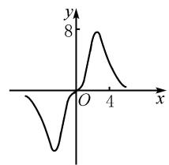
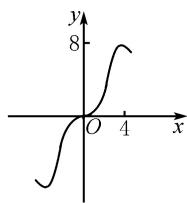
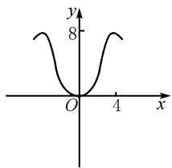
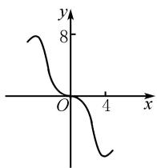

# 基于教学评一体化的函数特殊“点”教学探究

魏东升

(漳州台商区第一中学, 福建 漳州 363107)

摘 要:在教学评一体化视角下,文章介绍了函数概念中一些常见的特殊“点”,区分了部分容易混淆的概念,并通过部分真题展示这些特殊“点”在高考中的地位和考查方式.从评价的视角来看,函数概念中特殊“点”的呈现以及在处理教学和评价的关系方面,能给我们带来一些启发.

关键词: 教学评; 函数; 概念; 特殊“点”

中图分类号：G632

文献标识码：A

文章编号:1008-0333(2025)10-0015-04

《普通高中数学课程标准(2017年版2020年修订)》(以下简称《课程标准》)指出,教师应结合相应的教学内容,落实“四基”,培养“四能”,促进学生数学核心素养的形成和发展,达到相应水平的要求[1].教学目标是《课程标准》对本节课学生达成目标的要求,是课堂教学活动的起点和归宿,是教学设计的核心,是教学活动的指导思想.而现实教学中,许多教师把精力只用在“教”的设计上,而忽略甚至忘了“教”是为“学”服务的.因此,预设的教学目标达成度是衡量一节课是否成功的重要标志,而这也是目前教师感觉到最棘手、最难操作的问题.

评价目标前置化是最好的解决办法. 比如函数的概念和图象是培养学生逻辑推理、直观想象和数学运算等核心素养的主要载体之一, 也一直是高考数学考查的重点内容. 其中函数图象上的一些常见特殊“点”在刻画函数图象的形态和函数的相关性质时有重要作用,这些特殊“点”其实一直是高考题中的“常客”,但是学生往往对这些函数概念的理解并不到位,以致常因概念混淆影响相关问题的解决.如果教师在设置教学目标时,注意到这些问题,把评价目标前置,探究清楚相关的每一个数学概念,并且在相关概念学习结束后,适时以小专题形式开展一节关于函数概念中特殊点的专题课,相信定能促进学生的关键能力和核心素养的提升.

本文结合部分高考试题,以小专题的形式呈现函数概念中的这些特殊“点”,以供大家参考.

# 1 案例剖析

# 1.1 零点

对于定义在 I 的函数 $y = f(x)$ ，我们把 $x_{0} \in I$ 且满足 $f(x_{0}) = 0$ 的实数 $x_{0}$ （注意其是一个数）称为函数 $y = f(x)$ 的零点.

收稿日期:2025-01-05

作者简介:魏东升,高级教师,从事高中数学教学研究.

基金项目:福建省教育科学“十四五”规划“研究共同体”专项课题“逆向设计下高中数学概念教学评一体化的研究”(项目编号:Fjygzx23-145).

例 1 （2019 年全国Ⅱ卷理）已知函数 $f(x)=\ln x-\frac{x+1}{x-1}$ . 讨论 $f(x)$ 的单调性, 并证明 $f(x)$ 有且仅有两个零点.

解析 $f(x)$ 的定义域为 $(0,1)\cup(1,+\infty)$ .

因为 $f'(x)=\frac{1}{x}+\frac{2}{(x-1)^{2}}>0,$

所以 $f(x)$ 在 $(0,1)$ , $(1,+\infty)$ 单调递增.

因为 $f(\mathrm{e})=1-\frac{\mathrm{e}+1}{\mathrm{e}-1}<0,$

$$
f \left(\mathrm{e} ^ {2}\right) = 2 - \frac {\mathrm{e} ^ {2} + 1}{\mathrm{e} ^ {2} - 1} = \frac {\mathrm{e} ^ {2} - 3}{\mathrm{e} ^ {2} - 1} > 0,
$$

所以 $f(x)$ 在 $(1, +\infty)$ 有唯一零点 $x_{1}$ ，即 $f(x_{1})=0$ .

又 $0 < \frac{1}{x_1} < 1, f(\frac{1}{x_1}) = -\ln x_1 + \frac{x_1 + 1}{x_1 - 1} = -f(x_1)$ $= 0$ ，故 $f(x)$ 在 $(0,1)$ 有唯一零点 $\frac{1}{x_1}$ .

综上可知, $f(x)$ 有且仅有两个零点.

评析 零点是高中数学中一个非常重要的概念,其沟通了函数、方程和不等式之间的联系,是考查数形结合思想、函数与方程思想、分类讨论思想和转化与化归思想等数学思想的重要载体.在导数压轴题中,由超越函数带来的函数零点个数判断(或根据零点个数求参,或零点所在区间判断)和隐零点等问题,是检验学生逻辑推理和直观想象等核心素养的有效手段.

# 1.2 极值点

设函数 $f(x)$ 在 $x_0$ 附近有定义, 如果对 $x_0$ 附近的所有点都满足 $f(x) < f(x_0)$ , 就说 $f(x_0)$ 是 $f(x)$ 的一个极大值, $x_0$ (注意其是一个数) 是 $f(x)$ 的一个极大值点. 同理可定义极小值点, 极大值点和极小值点统称极值点.

例 2 （2019 年全国 I 卷理）已知函数 $f(x) = \sin x - \ln(1 + x)$ , $f'(x)$ 为 $f(x)$ 的导数. 证明： $f'(x)$ 在区间 $(-1, \frac{\pi}{2})$ 存在唯一极大值点.

解析 设 $g(x)=f'(x)$ ，则 $g(x)=\cos x-\frac{1}{1+x}$ ,

$$
g ^ {\prime} (x) = - \sin x + \frac {1}{(1 + x) ^ {2}}.
$$

当 $x \in (-1, \frac{\pi}{2})$ 时, $g'(x)$ 单调递减, 而 $g'(0) > 0$ , $g'(\frac{\pi}{2}) < 0$ , 可得 $g'(x)$ 在 $(-1, \frac{\pi}{2})$ 上有唯一零点, 设为 $\alpha$ .

则当 $x \in (-1, \alpha)$ 时， $g'(x) > 0$ ；当 $x \in (\alpha, \frac{\pi}{2})$ 时， $g'(x) < 0$ 。所以 $g(x)$ 在 $(-1, \alpha)$ 单调递增，在 $(\alpha, \frac{\pi}{2})$ 单调递减。故 $g(x)$ 在 $(-1, \frac{\pi}{2})$ 存在唯一极大值点。即 $f'(x)$ 在 $(-1, \frac{\pi}{2})$ 存在唯一极大值点。

评析 对于可导函数 $f(x)$ ，其极值点可通过令 $f'(x) = 0$ 求得。对于定义在 $(a, b)$ 的函数 $f(x)$ ，如果存在 $x_0 \in (a, b)$ 且 $f'(x_0) = 0$ ，当 $x \in (a, x_0)$ 时， $f'(x_0) < 0 (>0), x \in (x_0, b)$ 时， $f'(x_0) > 0 (< 0)$ ，则 $x_0$ 是函数 $f(x)$ 极大（小）值点；对于不可导函数 $f(x)$ ，可结合定义或图象来确定，如函数 $f(x) = |x - 1|$ ，根据图象可知其极小值点为 1。

# 1.3 最值点

对于定义在 I 的函数 $y = f(x)$ ，如果存在实数 M 满足：①对于任意实数 $x \in I$ ，都有 $f(x) \leqslant M$ ，②存在 $x_{0} \in I$ ，使得 $f(x_{0}) = M$ 。那么我们称 $x_{0}$ （注意其是一个数）是函数 $y = f(x)$ 的最大值点。同理可定义最小值点，最大值点和最小值点统称最值点。

例 3 （2019 年北京卷文）已知函数 $f(x)=\frac{1}{4}x^{3}-x^{2}+x.$ 当 $x\in[-2,4]$ 时，求证： $x-6\leqslant f(x)\leqslant x.$

解析 令 $g(x) = f(x) - x, x \in [-2,4]$ ，由 $g(x) = \frac{1}{4} x^3 - x^2$ ，得 $g'(x) = \frac{3}{4} x^2 - 2x$ .

令 $g'(x)=0$ 得 x=0 或 $x=\frac{8}{3}$ .

当 $x \in (-2,0)$ 和 $(\frac{8}{3},4)$ 时， $g'(x) > 0$ ，所以 $g(x)$ 在 $[-2,0]$ 和 $[\frac{8}{3},4]$ 单调递增；当 $x \in (0,\frac{8}{3})$

时, $g'(x)<0$ ,所以 $g(x)$ 在 $\left[0,\frac{8}{3}\right]$ 单调递减.

经计算可得 $g(x)_{\max}=g(0)=g(4)=0, g(x)_{\min}=g(-2)=-6.$

所以 $-6 \leqslant g(x) \leqslant 0$ ，即 $x - 6 \leqslant f(x) \leqslant x$ .

评析 从上述例题我们知道,函数的最值点和极值点是不一样的概念,最值点体现的是函数在整体上的最值情况,而极值点反映的是函数在某一点附近的局部最值情况.此外,虽然函数的最大(小)值点和极大(小)值点都可以不止一个,但最值点有可能是闭区间的端点,且最值点一定是极值点,极值点却不一定是最值点.

# 1.4 驻点

驻点又称为平稳点、稳定点或临界点,若定义在I的函数 $f(x)$ 中存在 $x_{0}\in I$ 满足 $f'(x_{0})=0$ ,则称 $x_{0}$ (注意其是一个数)为 $f(x)$ 的一个驻点.

例 4 （2019 年全国Ⅲ卷理）函数 $y=\frac{2x^{3}}{2^{x}+2^{-x}}$ 在 $[-6,6]$ 的图象大致为（）.

line

| x | y |
|---|---|
| 0 | 0 |
| 1 | -2 |
| 2 | 0 |
| 3 | 8 |
| 4 | 0 |

A

line

| x | y |
|---|---|
| 0 | 0 |
| 1 | 2 |
| 2 | 4 |
| 3 | 6 |
| 4 | 8 |

B

line

| x | y |
|---|---|
| 0 | 0 |
| 4 | 8 |

C

line

| x | y |
|---|---|
| 0 | 8 |
| 1 | 6 |
| 2 | 4 |
| 3 | 2 |
| 4 | -2 |

D

解析 设 $y = f(x) = \frac{2x^{3}}{2^{x} + 2^{-x}}$ ，则

$$
f (- x) = \frac {2 (- x) ^ {3}}{2 ^ {- x} + 2 ^ {x}} = - \frac {2 x ^ {3}}{2 ^ {x} + 2 ^ {- x}} = - f (x).
$$

所以 $f(x)$ 是奇函数，图象关于原点成中心对称，排除选项C；又 $f(4) = \frac{2\times 4^3}{2^4 + 2^{-4}} >0$ ，排除选项D； $f(6) = \frac{2\times 6^3}{2^6 + 2^{-6}}\approx 7$ ，排除选项A，故选B.

评析 本题实际上是根据函数的单调性、奇偶性和特殊值等性质来确定其大致的图象. 举例于此的目的是强调函数的驻点和极值点是不同的概念, 有的学生会通过求导发现函数在 $x = 0$ 处的导数值为 0 , 便误以为 0 是函数 $f(x)$ 的一个极值点, 从而直接选 C. 事实上, 驻点不一定是极值点, 因为可导函数在极值点处的导数值不仅要求为 0 , 还要求左右两侧导数值符号相反; 极值点也不一定是驻点, 如函数 $f(x) = |x - 1|$ 的极值点 1 就不是驻点.

# 1.5 拐点

设函数 $y = f(x)$ 在 $x_{0}$ 的某邻域内连续, 若 $(x_{0}, f(x_{0}))$ 是曲线 $y = f(x)$ 凹与凸的分界点, 则称 $(x_{0}, f(x_{0}))$ (注意其是一个点) 为曲线 $y = f(x)$ 的拐点, 也称反曲点.

例 5 （2018 年全国Ⅲ卷理）已知函数 $f(x) = (2 + x + ax^{2}) \ln(1 + x) - 2x$ . 若 a = 0, 证明: 当 -1 < x < 0 时, $f(x) < 0$ ; 当 x > 0 时, $f(x) > 0$ .

解析 (1) 当 $a = 0$ 时, $f(x) = (2 + x)\ln (1 + x)$

$$
- 2 x, f ^ {\prime} (x) = \ln (1 + x) - \frac {x}{1 + x}.
$$

设函数 $g(x) = f'(x) = \ln(1 + x) - \frac{x}{1 + x}$ ，则 $g'(x)=\frac{x}{(1+x)^{2}}.$

当 -1 < x < 0 时, $g'(x) < 0$ ; 当 x > 0 时, $g'(x) > 0$ . 故当 x > -1 时, $g(x) \geqslant g(0) = 0$ . 从而 $f'(x) \geqslant 0$ , 且仅当 x = 0 时, $f'(x) = 0$ . 所以 $f(x)$ 在 $(-1, +\infty)$ 单调递增.

又 $f(0)=0$ ，故当-1<x<0时， $f(x)<0$ ；当x>0时， $f(x)>0$ 。

评析 若函数 $f(x)$ 在 $x_{0}$ 的某邻域内连续二阶可导且 $(x_{0}, f(x_{0}))$ 是拐点，则 $f''(x_{0}) = 0$ 。注意到其对 $f'(x_{0}) = 0$ 不作要求，所以拐点和驻点、极值点之间没有关系。本题中 $(0, 0)$ 其实就是函数 $f(x)$ 的一个拐点，其在 $(0, 0)$ 处的切线刚好穿过函数的图象,据此确定了 $f(x)$ 在原点两侧的符号,从这里便能看出命题者根据拐点命题的“痕迹”.实际上,极值点刻画了函数图象的轴对称形态,拐点刻画了函数图象的中心对称形态 $^{[2]}$ .我们有理由相信,在今后会有越来越多和拐点有关的试题出现,比如类似于“极值点偏移”的“拐点偏移”问题.

# 1.6 不动点

对于定义在 I 的函数 $y = f(x)$ ，我们把 $x_{0} \in I$ 且满足 $f(x_{0}) = x_{0}$ 的实数 $x_{0}$ （注意其是一个数）称为函数 $y = f(x)$ 的不动点.

例 6 （2019 年浙江卷）设 $a, b \in R$ ，数列 $\{a_{n}\}$ 满足 $a_{1} = a, a_{n+1} = a_{n}^{2} + b, n \in N^{*}$ ，则（）.

A. 当 $b = \frac{1}{2}, a_{10} > 10$   
B. 当 $b = \frac{1}{4}, a_{10} > 10$   
C. 当 $b = -2, a_{10} > 10$   
D. 当 $b = -4, a_{10} > 10$

解析 令 $a_{n+1} = f(a_n), n \in \mathbf{N}^*$ , 构造 $f(x) = x^2 + b$ , 令 $f(x) = x$ , 即 $x^2 - x + b = 0$ . 则当 $\Delta = 1 - 4b \geqslant 0$ 时, 即必存在 $x_0$ , 使得 $x_0^2 - x_0 + b = 0$ , 即必存在 $a_{n+1} = a_n^2 + b = a_n$ 对任意 $n \in \mathbf{N}^*$ 成立.

当 $a_{1}=a=x_{0}$ 时, 解方程 $a^{2}-a+b=0$ , 得 $a=\frac{1\pm\sqrt{1-4b}}{2}$ , 把 B, C, D 中 b 的值代入验证可得 $a_{1}=a_{2}=\cdots=a_{10}\leqslant10$ , 故 B, C, D 三项均不正确. 当 b= $\frac{1}{2}$ 时, $a_{2}=a_{1}^{2}+b\geqslant\frac{1}{2}$ , $a_{3}=a_{2}^{2}+\frac{1}{2}\geqslant\frac{3}{4}$ , $a_{4}\geqslant a_{3}^{2}+\frac{1}{2}$ $=\frac{17}{16}>1,\cdots,a_{10}=a_{9}^{2}+\frac{1}{2}>10$ , 故 A 项正确.

评析 函数的不动点在一些数学问题的解决上应用非常广泛. 比如作为特殊函数存在的例 6 中的数列 $\{a_{n}\}$ ，利用不动点理论求解这类递推数列通项问题，往往可以事半功倍. 这里用一个简单的例子来说明其理论依据: 比如数列 $\{a_{n}\}$ 满足 $a_{n+1}=2a_{n}+1$ ,

$a_{1}=1$ , 求其通项公式. 我们知道其可以通过构造等比数列求解, 但通常给的数列递推关系可能更复杂, 这时我们需要寻求一个通法: 原递推关系等价于 $a_{n+1} + x = 2\left(a_{n} + \frac{x+1}{2}\right)$ , 此时 “ $a_{n+1} + x$ ” 和 “ $a_{n} + \frac{x+1}{2}$ ” 的形式应该是“完全一致”的, 也就是“ $a_{n+1}$ ” 和 “ $a_{n}$ ” 看起来要完全一致, “ $f(x)$ ” 和 “x” 也要完全一致, 这样这个问题就转化为函数不动点的问题了 $^{[3]}$ .

# 2 结束语

我们知道,认清函数图象上的这些特殊“点”的概念、厘清它们之间的区别和联系以及熟悉其在高考解题中的作用,对我们的教学是十分必要的,充分理解这些数学概念是发展学生核心素养的重要抓手.在实际教学中,对数学概念的理解既要以素养为导向,又必须依托真实的数学情境,没有真实情境,就谈不上关键能力、必备品格和价值观念的培养.

当下,为了实现人民对美好生活的向往,促进经济社会的全面发展,国家正在大力弘扬新质生产力.在新高考改革的背景下,教育行业也应该践行教育的新质生产力.因此,正确处理好教学和评价的关系,认识到评价在教学评一致性中扮演着的至关重要的角色,非常有必要.

# 参考文献：

[1] 中华人民共和国教育部. 普通高中数学课程标准(2017年版2020年修订)[M]. 北京: 人民教育出版社, 2020.  
[2] 侯希艳. 极值点与最值点、稳定点及拐点的关系 [J]. 甘肃高师学报, 2005(05): 11-12.   
[3] 彭家麟. 函数的不动点和稳定点 [J]. 数学教学, 2011(07): 37, 40.

[责任编辑:李慧娇]