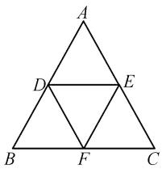
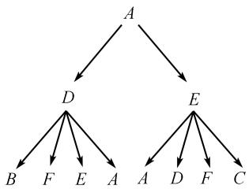
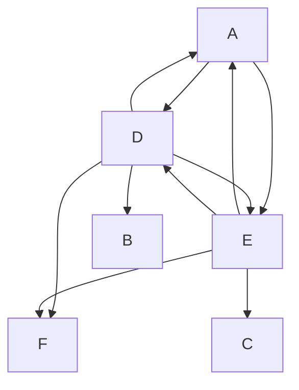

# 基于马尔科夫链的高中数学试题编制

高 清 曹跃洋 沈南山

(合肥师范学院, 安徽 合肥 230601)

摘 要:“概率与统计”是高中数学的核心模块,新高考对该部分内容的考查常与其他知识结合,具有综合性.本文以高中数学新教材选择性必修三中的传球问题(P91)为原型,以概率与数列章节知识为载体,探讨基于马尔科夫链模型的数学试题的编制,为新高考下的数学命题与教学提供思路与方法.

关键词: 马尔科夫链; 概率与统计; 试题编制

中图分类号：G632 文献标识码：A

文章编号:1008-0333(2025)10-0029-03

《普通高中数学课程标准(2017年版2020年修订)》[1]新增要求,利用全概率公式解决概率问题,其核心要求是将一个复杂事件的概率问题转化为不同条件下的简单事件概率的加权求和.高中数学新教材选择性必修三中的传球问题(P91)是概率问题的具体体现.2020年教育部考试中心发布了《中国高考评价体系》,明确提出了“基础性、综合性、应用性、创新性”的“四翼”考查要求.2023年新高考I卷第21题,出现了以马尔科夫链为模型的期望递推问题,其基本思想与方法是以全概率公式为基础,考查数列递推关系,注重对学生数学建模、数据分析和数学运算等核心素养的考查.本文基于马尔科夫链模型,探讨新高考下概率命题的思路与方法.

# 1 从马尔科夫链谈起

# 1.1 马尔科夫链

马尔科夫链 $^{[2]}$ 是“概率与统计”中首个被提出并加以研究的重要模型. 1906 年, 数学家安德雷·马尔科夫在研究随机过程时, 为了摆脱当时概率论研究过程中对相对静止随机变量序列的依赖, 构造了一条按条件概率动态的随机过程, 该随机过程被称为马尔可夫链. 它具备“无记忆”的性质, 即第 $n+1$ 次状态的概率分布只跟第 $n$ 次的状态有关, 与第 $n-1, n-2, n-3 \cdots$ 次的状态是没有任何关系的. 其数学定义为: 假设我们的序列状态是 $\cdots, X_{t-2}, X_{t-1}, X_t, X_{t+1}, \cdots$ , 那么 $X_{t+1}$ 时刻的状态的条件概率仅依赖前一状态 $X_t, P(X_{t+1} \mid \cdots, X_{t-2}, X_{t-1}, X_t) = P(X_{t+1} \mid X_t)$ . 从定义中可以看出, 马尔科夫模型关键在于梳理系统中任意两个状态之间的转换概率, 进而求出递推公式.

# 1.2 新教材中的马尔科夫链例题

例题 （高中数学新教材选择性必修三中的传球问题）甲、乙、丙三人相互做传球训练，第1次由甲将球传出，每次传球时，传球者都可能地将球传给

收稿日期:2025-01-05

作者简介:高清,硕士,从事数学教学研究;

曹跃洋,硕士,从事数学教学研究;

沈南山,博士,教授,从事数学教学研究.

基金项目:合肥师范学院科研项目“新时代基础教育评价改革的实践困境与纾解策略研究”(项目编号:2022SKZD24).

另外两个人中的任何一人. 求第 n 次传球后球在甲手中的概率.

解析 可以设第 n 次传球后球在甲手中的概率为 $P_{n}$ ，开始球在甲手中，则 $P_{0}=1$ ，若第 n 次传球后球在甲手中，则第 n-1 次传球后在乙或丙手中，所以第 n-1 次传球后球不在甲手中的概率为 $1-P_{n-1}$ .

由乙或丙把球传给甲的概率为 $\frac{1}{2}$ ,

所以 $P_{n}=\frac{1}{2}(1-P_{n-1})$ .

构造等比数列 $\{P_{n} + \lambda \}$ 得到

$$
P _ {n} - \frac {1}{3} = - \frac {1}{2} (P _ {n - 1} - \frac {1}{3}), n \geqslant 1.
$$

代入 $P_0 = 1$ ，于是数列 $\{P_n - \frac{1}{3}\}$ 是首项为 $\frac{2}{3}$ 公比为 $-\frac{1}{2}$ 的等比数列， $P_n - \frac{1}{3} = \frac{2}{3} \cdot (-\frac{1}{2})^n.$

整理, 得 $P_{n}=\frac{2}{3}\cdot\left(-\frac{1}{2}\right)^{n}+\frac{1}{3}(n\in\mathbf{N}^{*})$ .

# 2 基于马尔科夫链的试题编制

# 2.1 模型的情境更换应用题

试题 1 现有甲、乙两人进行扔飞镖比赛, 当甲扔飞镖时, 命中靶子概率为 $\frac{1}{2}$ , 当扔中圆盘上偶数倍的数字, 获得本局胜利并且下一局继续由甲扔飞镖. 若甲没扔中, 或未命中偶数倍, 则由乙扔飞镖, 乙命中靶子的概率为 $\frac{1}{3}$ , 扔中奇数倍, 则乙胜利, 并下一局继续由乙打飞镖. (首先由甲打飞镖, 靶子上总共有 1\~30 个数字, 平均分布, 两人扔中、命中每个数字概率相同)

(1) 前 3 局甲扔飞镖次数的数学期望;  
(2) 第 n 局飞镖在甲手中的概率.

解析 （1）设前3局甲扔飞镖次数为事件 X, X 的可能取值 1, 2, 3. 因为首先由甲打飞镖，当 X = 1 时，则第一局甲未胜利且第二局乙胜利，第一局甲未胜利的情况分两种：未命中靶子或命中靶子但未扔

中偶数倍的数字. 乙胜利的条件是命中靶子且扔中奇数倍的数字.

$$
P (X = 1) = \left(\frac {1}{2} + \frac {1}{2} \times \frac {1}{2}\right) \times \frac {1}{3} \times \frac {1}{2} = \frac {1}{8}.
$$

当 X=2 时, 分为两种情况, 第一局甲胜利且第二局甲未胜利或第一局甲未胜利且第二局乙未胜利.

$$
\begin{array}{l} P (X = 2) = \frac {1}{2} \times \frac {1}{2} \times \left(1 - \frac {1}{2} \times \frac {1}{2}\right) + \left(\frac {1}{2} + \frac {1}{2} \right. \\ \times \frac {1}{2}) \times \left(\frac {1}{3} \times \frac {1}{2} + \frac {2}{3}\right) = \frac {1 3}{1 6}. \\ \end{array}
$$

当 X=3 时,说明第一局和第二局甲都胜利.

$$
P (X = 3) = \frac {1}{2} \times \frac {1}{2} \times \frac {1}{2} \times \frac {1}{2} = \frac {1}{1 6}.
$$

得到 X 的分布列见表 1:

表 1 前 3 局甲扔飞镖次数的分布列

<table><tr><td>X</td><td>1</td><td>2</td><td>3</td></tr><tr><td>P</td><td> $\frac{1}{8}$ </td><td> $\frac{13}{16}$ </td><td> $\frac{1}{16}$ </td></tr></table>

$$
E (X) = 1 \times \frac {1}{8} + 2 \times \frac {1 3}{1 6} + 3 \times \frac {1}{1 6} = \frac {3 1}{1 6}.
$$

(2) 设第 n 局飞镖在甲手中的概率为 $P_{n}, P_{1}$

$$
= 1, P _ {n} = \frac {1}{2} \times \frac {1}{2} P _ {n - 1} + \left(\frac {2}{3} + \frac {1}{3} \times \frac {1}{2}\right) \left(1 - P _ {n - 1}\right),
$$

经过化简得到 $12P_{n} = -7P_{n-1} + 10$ .

构造等比数列 $\{P_{n} + \lambda \}$ 得到

$$
1 2 \left(P _ {n} - \frac {1 0}{1 9}\right) = - 7 \left(P _ {n - 1} - \frac {1 0}{1 9}\right).
$$

故 $\left\{P_{n}-\frac{10}{19}\right\}$ 是等比数列,代入 $P_{1}=1$ ,首项为 $\frac{9}{19}$ ,公比为 $-\frac{7}{12}$ ,于是 $P_{n}-\frac{10}{19}=\frac{9}{19}\cdot(-\frac{7}{12})^{n-1}$ .

则 $P_{n} = \frac{9}{19}\cdot (-\frac{7}{12})^{n - 1} + \frac{10}{19} (n\in \mathbf{N}^{*}).$

命题意图 该题基于现实情境,对原教材中的试题背景进行改编,考查学生对概率、随机变量、数学期望、数列等知识的综合应用,发展学生数学建模、数学运算和数学抽象等核心素养.

# 2.2 模型的拓展延伸应用题

试题 2 如图 1, 在点 A 有一只蚂蚁, F 处有足量的食物残渣, $A\sim F$ 之间分别有桥互相搭连,蚂蚁沿一个方向行进(允许向后折返运动),在 $A\sim F$ 各点上选择每座桥的概率相等.

text_image

A
D
E
B
F
C

图 1 蚂蚁路径图

(1)蚂蚁行进两次时,到达各点的概率;   
(2)蚂蚁第 n 次行进后到达点 F 的概率.

解析 (1) 画出小蚂蚁行进树状图, 如图 2.

flowchart

图 2 蚂蚁行进两次路径树状图

可以得到 $P(A)=\frac{1}{4}, P(B)=\frac{1}{8}, P(C)=\frac{1}{8}$ ,

$$
P (D) = \frac {1}{8}, P (E) = \frac {1}{8}, P (F) = \frac {1}{4}.
$$

(2)根据对称性易得,第 n 次到 D,E 的概率相同,B,C 同理,可以设 $P_{A}^{n}$ 为第 n 次行进后到达点 A 的概率; $P_{BC}^{n}$ 为第 n 次行进后到达点 B,C 的概率; $P_{DE}^{n}$ 为第 n 次行进后到达点 D,E 的概率; $P_{F}^{n}$ 为第 n 次行进后到达点 F 的概率. 列出当 $n \geqslant 2$ 时的转移方程: $P_{F}^{n+1} = \frac{1}{2} P_{BC}^{n} + \frac{1}{4} P_{DE}^{n}, P_{BC}^{n+1} = \frac{1}{2} P_{F}^{n} + \frac{1}{4} P_{DE}^{n}$ ,

$$
P _ {D E} ^ {n + 1} = P _ {A} ^ {n} + \frac {1}{2} P _ {F} ^ {n} + \frac {1}{2} P _ {B C} ^ {n} + \frac {1}{4} P _ {D E} ^ {n}, P _ {A} ^ {n + 1} = \frac {1}{4} P _ {D E} ^ {n}.
$$

解得 $P_{F}^{n}=\left\{\begin{aligned}&\frac{2}{9}+\frac{2}{9}\left(-\frac{1}{2}\right)^{n}-\frac{1}{9}\left(-\frac{1}{2}\right)^{2n-2},\\ &0,n=1.\end{aligned}\right.$

命题意图 该题借助谢尔宾斯基三角形,结合对称性,寻找前后状态的概率关系,再依托全概率公式列出前后状态概率的方程.这种方式,促使学生加强了数列的运算和代数变换,进而梳理出对应的递推关系. 该题考查学生对对称性、全概率公式、数列运算等综合性知识的灵活应用能力, 以及对复杂关系的理解能力, 特别是厘清前后状态之间关系的能力.

# 3 结束语

2020 年发布的《中国高考评价体系》回答了“怎么考”这一问题. 这要求教师从知识基础出发, 注重教材例习题的变式以及问题情境设置的创新性. 真实的情境要素能培养学生将数学知识和实际生活相联系的能力. 教材中的知识点与实际生活紧密相关, 情境创设应贴合学生认知水平, 从熟悉场景逐步过渡到跨学科复杂情境. 具体而言, 可以社会热点问题为蓝本建模, 考查学生的数学建模素养及知识迁移运用水平. 在教学过程中, 教师应强调综合性、创新性, 打破知识板块壁垒, 融合多知识点, 鼓励学生创新思维.

近几年的高考数学创新题主要考查学生综合运用知识解决问题的能力. 本文所赏析的2023年新高考Ⅰ卷第23题就考查了随机事件的概率、随机变量数学期望的计算、等比数列通项公式等知识, 不再仅仅局限于对某一知识和某一能力的专门考查, 打破了传统高考考查单一内容、机械套用解题方法的局面, 这也是新高考评价体系和《普通高中数学课程标准》的基本要求. 知识融合的最本质目的是考查学生多方面的能力, 教师应在日常教学中适当创新, 将知识点融合在题目中, 逐步培养学生解决问题的能力.

# 参考文献：

[1] 中华人民共和国教育部. 普通高中数学课程标准(2017年版2020年修订)[M]. 北京: 人民教育出版社, 2020.  
[2] 关嘉欣. 基于马尔可夫链的高考概率试题研究 [J]. 中学数学月刊, 2024(03):75-77.

[责任编辑:李慧娇]