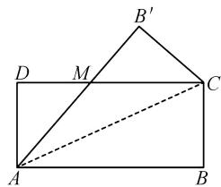
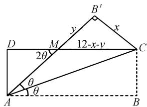
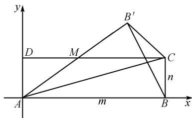
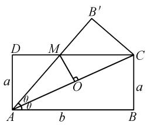

# 新高考视角下一道课本习题的探究与赏析

李春林

(甘肃省天水市第九中学, 甘肃 天水 741020)

摘 要:本文以一道课本习题为切入点,从多个不同的视角展开深入探究,通过细心观察、认真分析、缜密思考探寻到6种不同的解题方法.在此基础上,反思解题过程,研究各解法的优劣,挖掘各解法之间的内在联系,期望能提高学生的数学探究意识和数学创新能力,提升学生的数学核心素养.

关键词: 新高考; 课本习题; 解法; 赏析

中图分类号：G632

文献标识码：A

文章编号:1008-0333(2025)10-0038-04

高中数学教材中的许多例题、课堂练习题、课后习题和复习参考题(简称“四题”),因其有着极强的“代表性”与“穿透性”,往往受到命题者的青睐而成为高考的题源.2019年人教A版教材中的习题分为“复习巩固”“综合运用”“拓广探索”三个层次,教师应开展对教材习题的研究,创设合理的变式教学,以“最近发展区”为平台,拓展学生的认知.在落实“情境与问题、知识与技能、思维与表达、交流与反思”的过程中,既夯实了学生未来发展所必需的数学基础知识、基本技能、基本思想和基本活动经验,又培养了学生的数学核心素养[1].

# 1 试题呈现

试题 （2019 年人教 A 版数学 · 必修二第 49 页第 8 题）设矩形 ABCD (AB > BC) 的周长为 24 cm，把 $\triangle ABC$ 沿 AC 向 $\triangle ADC$ 折叠，AB 折叠后交 DC 于点 M，求 $\triangle ADM$ 的面积最大值及此时 AB 的值.

# 2 试题分析

本题是2019年人教A版数学必修二第49页第8题,新颖别致、独创一格,主要考查三角函数、解三角形、基本不等式求最值等知识.若从新高考的视角观察,该题目解题的切入点多,解题方法灵活多样,体现了较大的开放性与包容性.

# 3 多解探究与赏析

视角 1 三角形全等 + 基本不等式.

解法 1 如图 1, 设 AB = m, BC = n, DM = x, 因为 Rt△ADM ≅ Rt△CB'M,

text_image

B'
D M C
A B

图 1 解法 1 示意图

所以 AM = CM = m - x.

又 $m + n = 12$ ，所以 $n = 12 - m$

由 $AM^{2}=AD^{2}+DM^{2}$ ，得 $(m-x)^{2}=n^{2}+x^{2}$ .

解得 $x=\frac{m^{2}-n^{2}}{2m}=\frac{6(m-n)}{m}.$

所以 $S_{\triangle ADM} = \frac{1}{2} AD \cdot DM$

$$
= \frac {1}{2} n \cdot \frac {6 (m - n)}{m}
$$

$$
= \frac {3 n (m - n)}{m}
$$

$$
= \frac {3 (1 2 - m) (2 m - 1 2)}{m}
$$

$$
= \frac {6 (1 2 - m) (m - 6)}{m}
$$

$$
= 1 0 8 - 6 \left(m + \frac {7 2}{m}\right)
$$

$$
\leqslant 1 0 8 - 1 2 \sqrt {m \cdot \frac {7 2}{m}}
$$

$$
= 1 0 8 - 7 2 \sqrt {2},
$$

当且仅当 $m = 6\sqrt{2}$ 时取“=”.

所以 $\triangle ADM$ 的面积最大值为 $108 - 72\sqrt{2}$ , 此时 $AB = 6\sqrt{2}$ .

点评 由 Rt $\triangle ADM \cong$ Rt $\triangle CB'$ M,得出 $\angle BAC = \angle ACD = \angle CAB'$ .从而 $AM = CM = m - x$ .又 $m + n = 12$ ,进一步得出 $S_{\triangle ADM} = 108 - 6(m + \frac{72}{m})$ ,最后再结合基本不等式使问题得解.

解法 2 如图 1, $\angle BAC = \angle ACD = \angle CAB'$ , 所以 AM = MC.

所以 $AD + DM + AM = AD + DM + MC = 12.$

令 AD = x, DM = y, AM = z, 则

$$
x + y + z = 1 2,
$$

$$
x ^ {2} + y ^ {2} = z ^ {2},
$$

$$
x ^ {2} + y ^ {2} = (x + y) ^ {2} - 2 x y,
$$

$$
z ^ {2} = \left[ 1 2 - (x + y) \right] ^ {2}.
$$

所以 $(x+y)^{2}-2xy=\left[12-(x+y)\right]^{2}$ .

即 $12(x+y)=72+xy\geqslant24\sqrt{xy}$ （当且仅当“x=y”取“=”）.

所以 $(\sqrt{xy})^2 - 24\sqrt{xy} + 72 \geqslant 0$ .

所以 $\sqrt{xy} \leqslant 12 - 6\sqrt{2}$ 或 $\sqrt{xy} \geqslant 12 + 6\sqrt{2}$ .

因为 x<12, y<12,

所以 $\sqrt{xy} \geqslant 12 + 6\sqrt{2}$ (舍去).

所以 $\sqrt{xy} \leqslant 12 - 6\sqrt{2}$ .

即 $xy \leqslant 216 - 144\sqrt{2}$ .

所以 $S_{\triangle ADM} = \frac{1}{2}xy \leqslant 108 - 72\sqrt{2}$ （当且仅当“x = y = 12 - 6 $\sqrt{2}$ ”取“=”）.

即 $AB = 12 - (12 - 6\sqrt{2}) = 6\sqrt{2}$ 时， $\triangle ADM$ 的面积最大值为 $108 - 72\sqrt{2}$ .

点评 由 Rt $\triangle ADM \cong$ Rt $\triangle CB'M$ , 得出 $\angle BAC = \angle ACD = \angle CAB'$ . 从而 $AM = CM$ . 再结合基本不等式及不等式性质, 得出 $xy \leqslant 216 - 144\sqrt{2}$ , 最后求得 $S_{\triangle ADM} = \frac{1}{2} xy \leqslant 108 - 72\sqrt{2}$ , 问题得以解决.

视角 2 三角函数 + 换元法 + 基本不等式.

解法 3 如图 1, 设 $\left|AC\right|=t,\angle CAB=\theta,\left|AD\right|=t\sin\theta$ , 在 Rt△ADM 中,

$$
\mid D M \mid = \mid A D \mid \tan (9 0 ^ {\circ} - 2 \theta) = \mid A D \mid \cot 2 \theta .
$$

所以 $S_{\triangle ADM} = \frac{1}{2} |AD| |DM| = \frac{1}{2} t^{2} \cdot \frac{\sin^{2}\theta \cos 2\theta}{\sin 2\theta}.$

又 $|AD| + |AB| = 12$ ,

所以 $t\sin\theta + t\cos\theta = 12$ .

所以 $t=\frac{12}{\sin\theta+\cos\theta}$ .

所以 $S_{\triangle ADM}=36\cdot\frac{\sin\theta(\cos\theta-\sin\theta)}{\cos\theta(\cos\theta+\sin\theta)}$

$$
= 3 6 \tan \theta \cdot \frac {1 - \tan \theta}{1 + \tan \theta}.
$$

令 $1 + \tan\theta = x(0 < x < 2)$ ,

所以 $S_{\triangle ADM}=36\cdot\frac{(x-1)(2-x)}{x}$

$$
\begin{array}{l} = - 3 6 \left(x + \frac {2}{x} - 3\right) \\ \leqslant - 3 6 (2 \sqrt {2} - 3) \\ = 1 0 8 - 7 2 \sqrt {2}, \\ \end{array}
$$

当且仅当 $x = \sqrt{2}$ ，即 $\tan\theta = \sqrt{2} - 1$ 时取“=”.

即 $\triangle ADM$ 面积最大值为 $108 - 72\sqrt{2}$ , 此时

$$
\mid A D \mid = t \sin \theta = \frac {1 2 \sin \theta}{\sin \theta + \cos \theta} = \frac {1 2}{1 + \cot \theta} = 1 2 - 6 \sqrt {2}.
$$

即 $|AB|=12-(12-6\sqrt{2})=6\sqrt{2}$ .

点评 折叠过后,则 Rt△ADM≌Rt△CB'M,引入∠CAB=θ,利用三角函数关系建立关系式,最后换元,再利用基本不等式使问题得解.

视角 3 三角函数 + 导数法.

解法 4 如图 2, 设 $\angle BAC = \theta, AD = x, DM = y$ , 则 AB = 12 - x (0 < x < 3).

因为 AB > BC，所以 12 - x > x，得 0 < x < 6。

text_image

B'
y
x
D
M
12-x-y
C
2θ
θ
A
B

图 2 解法 4 示意图

由翻折和平行知: $\angle DMA = 2\theta.$

在 Rt△ADM 中, $\tan2\theta=\frac{AD}{DM}=\frac{x}{y}$ ,

在 Rt△ABC 中, $\tan\theta=\frac{BC}{AB}=\frac{x}{12-x}.$

又 $\tan 2\theta = \frac{2\tan\theta}{1 - \tan^2\theta}$ 即

$$
\frac {x}{y} = \frac {2 x / (1 2 - x)}{1 - x ^ {2} / (1 2 - x) ^ {2}},
$$

解得 $y=\frac{72-12x}{12-x}$ .

所以 $S_{\triangle ADM} = \frac{1}{2}xy$

$$
= \frac {3 6 x - 6 x ^ {2}}{1 2 - x}
$$

$$
= 1 0 8 - 6 \left[ (1 2 - x) + \frac {7 2}{1 2 - x} \right],
$$

$$
S ^ {\prime} = 6 - \frac {4 3 2}{(1 2 - x) ^ {2}},
$$

令 $S' = 0$ , 解得 $x = 12 - 6\sqrt{2}$ .

当 $x \in (0, 12 - 6\sqrt{2})$ 时, $S' > 0$ ,

当 $x \in (12 - 6\sqrt{2}, 3)$ 时, $S' < 0$ .

所以 $x = 12 - 6\sqrt{2}$ 时, 即 $\left|AB\right| = 12 - x = 6\sqrt{2}$ 时, S 有最大值 $S_{max} = 108 - 72\sqrt{2}$ .

点评 设 $\angle BAC = \theta$ ，利用二倍角公式解方程，找到目标三角形中的边长数量关系，进而得到目标函数，进一步用导数法求得目标函数的最值.

视角 4 直线方程 + 基本不等式.

解法 5 如图 3, 设 AD = n, AB = m, 则 m > n, $m + n = 12, \tan \angle BAC = \frac{n}{m}.$

text_image

y
D M B' C
A m B n x

图 3 解法 5 示意图

则 $\tan\angle BAB' = \tan2\angle BAC = \frac{2n/m}{1-n^{2}/m^{2}}$ $=\frac{2mn}{m^{2}-n^{2}}.$

所以直线 $AB': y = \frac{2mn}{m^{2} - n^{2}}x$ ，直线 CD: y = n.

所以 $x=\frac{m^{2}-n^{2}}{2m}$ .

即 $M(\frac{m^2 - n^2}{2m}, n)$ .

所以 $S_{\triangle ADM} = \frac{1}{2} AD \cdot DM = \frac{1}{2} n \times \frac{m^{2} - n^{2}}{2m} = \frac{n(m^{2} - n^{2})}{4m}.$

又 $m + n = 12$

所以 $S_{\triangle ADM} = \frac{(12 - m) \cdot 12 \cdot (2m - 12)}{4m}$

$$
= 1 0 8 - 1 2 \left(m + \frac {7 2}{m}\right)
$$

$$
\leqslant 1 0 8 - 7 2 \sqrt {2},
$$

当且仅当 $m = 6\sqrt{2}$ 时取“=”号

点评 建立平面直角坐标系后,先写出直线 $AB'$ 与CD的方程,通过联立方程,求出点M横坐标,结合题意得出 $S_{\triangle ADM}=108-12(m+\frac{72}{m})$ ,最后再利用基本不等式,求得面积的最大值.

视角 5 面积割补法 + 基本不等式.

解法 6 如图 4, 设 AD = a, AB = b, 则 $a + b = 12$ , 且 AM = MC.

text_image

B'
D M C
a O a
θ θ
A b B

图 4 解法 6 示意图

所以 $\triangle AMC$ 为等腰三角形.

$$
\left| A C \right| = \sqrt {a ^ {2} + b ^ {2}},
$$

$$
\left| A O \right| = \frac {\sqrt {a ^ {2} + b ^ {2}}}{2},
$$

$$
M O = | A O | \cdot \tan \theta = | A O | \times \frac {a}{b} = \frac {a \sqrt {a ^ {2} + b ^ {2}}}{2 b},
$$

$$
S _ {\triangle A M C} = \frac {1}{2} \times | A C | \times | M O | = \frac {a (a ^ {2} + b ^ {2})}{4 b},
$$

$$
S _ {\triangle A D C} = \frac {1}{2} a b,
$$

$$
S _ {\triangle A D M} = S _ {\triangle A D C} - S _ {\triangle A M C}
$$

$$
= \frac {1}{2} a b - \frac {a (a ^ {2} + b ^ {2})}{4 b}
$$

$$
= \frac {a b ^ {2} - a ^ {3}}{4 b}
$$

$$
= \frac {a (b + a) (b - a)}{4 b}
$$

$$
= \frac {6 a (b - a)}{4 b}.
$$

又 $a = 12 - b$

所以 $S_{\triangle ADM} = \frac{6(12 - b)(2b - 12)}{4b}$

$$
= 1 2 \left[ 9 - \left(b + \frac {7 2}{b}\right) \right] \leqslant 1 0 8 - 7 2 \sqrt {2},
$$

当且仅当 $b=\frac{72}{b}$ ，即 $b=6\sqrt{2}$ 取“ =”.

即 $AB = 6\sqrt{2}$ 时, S 有最大值 $S_{max} = 108 - 72\sqrt{2}$ .

点评 将目标三角形的面积分割成两个易表示的三角形的面积之差即 $S_{\triangle ADM} = S_{\triangle ADC} - S_{\triangle AMC}$ ，消元后得 $S_{\triangle ADM} = 12 \left[9 - \left(b + \frac{72}{b}\right)\right]$ ，再转化为基本不等式求解，从而问题获解.

# 4 结束语

重视教材、深挖教材、运用教材是发展学生数学核心素养的重要环节。学好高中数学离不开对高中数学教材习题的深度把握。作为教师，应深入挖掘教材，通过课本习题教学，使学生认识教材、重视教材，深刻领会编者的意图，发挥课本习题的教育与引领作用。教学中应尽力寻找高考题、模拟题在课本中的“影子”，充分挖掘课本习题的潜能，以激发学生的潜力。作为学生，在数学学习中，要养成多向思维的习惯，对某一数学问题寻求多种解法，这样不仅可以开拓思路，提高分析能力，培养创新精神，而且可以真正抓住问题的实质，使相关知识连成板块，在综合运用各种知识的过程中，提高解题技能 $^{[2]}$ 。

# 参考文献：

[1] 彭光焰. 对一道课本例题的解法探讨 [J]. 数理化解题研究, 2022(34): 15-18.  
[2] 高利辉, 高军. 一道课本习题的解法探究及推广应用 [J]. 高中数理化, 2023(17): 23-25.

[责任编辑:李慧娇]