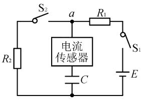
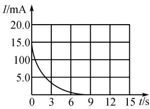
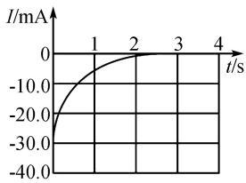
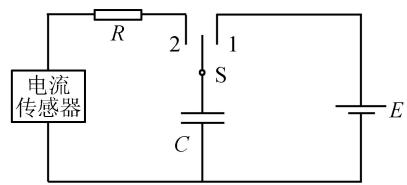

# 源自教材 方能让高考试题更有意境

——以 2024 年高考广西卷第 12 题为例

# 黄涛 $^{1}$ 刘军 $^{2}$

(1. 宜城第一中学, 湖北 襄阳 441400; 2. 襄阳市第二十一中学, 湖北 襄阳 441000)

摘 要:文章通过对2024年高考广西卷第12题定量研究,阐述了两幅图中最大电流的来历,分析了电容器充、放电时电路中电流和电容器电压变化规律,并将广西卷与教材上电容器充、放电实验电路进行对比分析,发现其试题设计的独特创意,最后给出几个拓展性问题.

关键词: 电容器; 最大电流; 闭合电路欧姆定律

中图分类号：G632

文献标识码:A

文章编号:1008-0333(2024)10-0091-03

2024 年高考命题主要以《普通高中课程标准 (2017 年版 2020 年修订)》和《中国高考评价体系》为依据. 这两个文件在内在逻辑和核心指向方面具有高度统一性, 强调“价值引领、素养导向、能力为重、知识为基”的多维考查模式, 实现从“考知识”向“考能力素养”的转变. 高考命题遵循“无价值, 不入题; 无思维, 不命题; 无情境, 不成题; 无任务, 不立题”的原则. 高考试题将紧密结合社会主义核心价值观, 强调思维品质和实际应用能力的考查, 同时通过情境化试题提高学生的实际问题解决能力.

# 1 题目

某同学为探究电容器充、放电过程,设计了图1实验电路.器材如下:电容器、电源E(电动势6 V,内阻不计)、电阻 $R_{1}=400.0\ \Omega$ 、电阻 $R_{2}=200.0\ \Omega$ 、

电流传感器、开关 $S_{1}$ 、 $S_{2}$ 、导线若干. 实验步骤如下:

text_image

S₂
a
R₁
电流
传感器
R₂
C
E
S₁

图 1 电路图

(1) 断开 $S_{1}$ 、 $S_{2}$ ，将电流传感器正极与 a 节点相连，其数据采样频率为 5000 Hz，则采样周期为 \_\_\_\_ s；  
(2)闭合 $S_{1}$ ，电容器开始充电，直至充电结束，得到充电过程的 I-t 曲线如图 2，由图 2 可知开关 $S_{1}$ 闭合瞬间流经电阻 $R_{1}$ 的电流为 \_\_\_\_ mA（结果保留 3 位有效数字）；  
(3)保持 $S_{1}$ 闭合,再闭合 $S_{2}$ ,电容器开始放电,直至放电结束,则放电结束后电容器两极板间电压

收稿日期:2025-01-05

作者简介: 黄涛, 本科, 中学一级教师, 从事高中物理教学研究;

刘军,本科,中学一级教师,从事初中物理教学研究.

基金项目:2021年武汉市教育科学规划重点课题“基于新课程标准的高中情境化命题实践研究”(课题编号:2021A051)

为 V;

(4)实验得到放电过程的 I-t 曲线如图 3, I-t 曲线与坐标轴所围面积对应电容器释放的电荷量为 0.0188 C, 则电容器的电容 C 为 \_\_\_\_ μF. 图 3 中 I-t 曲线与横坐标、直线 t=1 s 所围面积对应电容器释放的电荷量为 0.0038 C, 则 t=1 s 时电容器两极板间电压为 \_\_\_\_ V (结果保留 2 位有效数字).

line

| t/s | I/mA |
|---|---|
| 0 | 20.0 |
| 3 | 100.0 |
| 6 | 5.0 |
| 9 | 2.5 |
| 12 | 1.25 |
| 15 | 0.625 |

图 2 充电电流

line

| t/s | I/mA |
|---|---|
| 0 | -20.0 |
| 1 | -10.0 |
| 2 | 0.0 |
| 3 | 0.0 |
| 4 | 0.0 |

图3 放电电流

# 2 参考答案与解析

(1)采样周期为 $T=\frac{1}{f}=\frac{1}{5\ 000}$ s.   
(2)由图乙可知开关 $S_{1}$ 闭合瞬间流经电阻 $R_{1}$ 的电流为 15.0 mA.  
(3) 放电结束后电容器两极板间电压等于 $R_{2}$ 两端电压, 根据闭合电路欧姆定律得电容器两极板间电压为 $U_{c} = \frac{E}{R_{1} + R_{2}} \cdot R_{2} = 2 \, V$ .  
(4) 充电结束后电容器两端电压为 $U_{C}' = E = 6 \, V$ ，故可得 $\Delta Q = (U_{C}' - U_{C}) C = 0.0188 \, \text{C}$ ，解得 $C = 4.7 \times 10^{3} \mu \text{F}$ 。设 t = 1 s 时电容器两极板间电压为 $U_{C}'$ ，则有 $(U_{C}' - U_{C}') C = (0.0188 - 0.0038) C$ ，解得 $U_{C}' = 2.8 \, V$ 。

# 3 这道题留下的思维空间

问题 1 为什么充电最大电流为 15 mA, 放电最大电流为 30 mA?

分析 在电容器充电瞬间,可以认为电容器正负极短接,电路中电流 $I_{1m}=\frac{E}{R_{1}}=15\ mA$ ,电容器放电瞬间,电流传感器中电流为两个分电流的代数和;

其中一个是将电源视为内阻为零的导体,电容器对两个电阻放电,两个电阻并联阻值 $R_{并}=\frac{R_{1}R_{2}}{R_{1}+R_{2}}=\frac{400}{3}\Omega$ ,电流传感器所在电路中电流为 $I'=\frac{E}{R_{并}}=45\ mA$ ,方向向上;再将电容器视为电阻为零的导体,它把 $R_{2}$ 短路了,电源对电路供电电流 $I_{1m}=\frac{E}{R_{1}}=15\ mA$ ,电流传感器电流为 15 mA,方向向下,电流传感器中实际电流 $I_{2m}=I'-I_{1m}=30\ mA$ ,方向向上 $^{[1]}$ .

问题 2 电容器充电过程中电路发热量为多少？电容器放电过程中有多少电场能转化为两个电阻的热量？

分析 充电过程中电源对电路做功 $W_{1} = CE^{2}$ ，电容器储存电场能 $E_{电场} = \frac{1}{2} CE^{2}$ ，所以电阻 $R_{1}$ 上发热量为 $Q_{1} = \frac{1}{2} CE^{2}$ ，这与电阻无关，它与电容器储存电场能相等，电容器在充电过程中有“半能损失”，这一特点与传送带模型类似 $^{[2]}$ .

电容器在放电过程中把电容器等效成一个电源,两个电阻并联,由于电源没有内阻,电容器释放能量 $E_{\text{电场}} = \frac{1}{2} C (E^{2} - U^{2})$ , 两个电阻并联分配能量与电阻成反比,则 $R_{1}$ 得到能量为 $Q_{1} = \frac{1}{2} C (E^{2} - U^{2}) \frac{R_{2}}{R_{1} + R_{2}}$ , $R_{2}$ 得到能量为 $Q_{2} = \frac{1}{2} C (E^{2} - U^{2}) \frac{R_{1}}{R_{1} + R_{2}}$ .

问题 3 电容器充电放电过程中电路中电流和电容器电压解析式是怎样的？

分析 当电路中只闭合开关 $S_{1}$ 时, 设某时刻电容器上的电量为 q, 则电路中电流为 $i = \frac{dq}{dt}$ , 则有闭合电路欧姆定律得, $\frac{q}{C} + R_{1} \frac{dq}{dt} = E$ , 整理后得 $\frac{dq}{CE - q}$

$= \frac{1}{CR_1} dt$ ，进一步变形得， $\frac{d(CE - q)}{CE - q} = -\frac{1}{CR_1} dt$ ，两边不定积分后得 $\ln (CE - q) = -\frac{1}{CR_1} t + c$ ，由于开始时电容器电量为零，则充电过程中电容器电量与时间关系 $q = CE(1 - e^{-\frac{t}{CR_1}})$

当电路中把开关 $S_{2}$ 闭合时, 设某时刻电容器电量为 q, 设 $R_{1}$ 所在支路电流为 $I_{1}$ , 则电容器中电流为 $\frac{dq}{dt}$ , 则由闭合电路欧姆定律得 $\frac{q}{C} + R_{1}I_{1} = E$ , $\frac{q}{C} = R_{2}(I_{1} - \frac{dq}{dt})$ .

联立以上两式消去 $I_{1}$ 得， $\frac{E - q / C}{R_1} = \frac{q}{R_2} +\frac{dq}{dt}$ ，进一步整理后得 $q - \frac{CER_2}{R_1 + R_2} = -\frac{CR_1R_2}{R_1 + R_2}\frac{dq}{dt}$ ，分离变量后得 $-\frac{R_1 + R_2}{CR_1R_2} dt = \frac{d(q - CR_2E / R_1 + R_2)}{q - CR_2E / R_1 + R_2}$ ，等号两边不定积分得 $\ln (q - \frac{CR_2E}{R_1 + R_2}) = -\frac{R_1 + R_2}{CR_1R_2} t + c$ ，开始时电容器电量 $q(0) = CE$ ，则电容器电量为 $q = \frac{CER_2}{R_1 + R_2} +\frac{CER_1}{R_1 + R_2} e^{-\frac{R_1 + R_2}{CR_1R_2} t}$ 则 $I_{1} = \frac{E}{R_{1}} -\frac{q}{CR_{1}} = \frac{E}{R_{1}}$ $-\left[\frac{ER_2}{(R_1 + R_2)R_1} +\frac{E}{R_1 + R_2} e^{-\frac{R_1 + R_2}{CR_1R_2} t}\right].$

将相关数值代入后得电容器放电过程中电压为

$$
U = \frac {q}{C} = \frac {E R _ {2}}{R _ {1} + R _ {2}} + \frac {E R _ {1}}{R _ {1} + R _ {2}} e ^ {- \frac {R _ {1} + R _ {2}}{C R _ {1} R _ {2}} t} = 2 + 4 e ^ {- \frac {3}{1 . 8 8} t}.
$$

当 $t = 1 \, s$ 时, 电容器电压为 $2.811 \, V$ , 原题答案没有问题.

问题 4 广西卷相对于课本中电路有哪些优点?

图 4 为课本中电容器充放电电路图, 图中有一个问题, 即电容器充电电路中没有电阻. 由上面的分析可知, 虽然电路中发热量与电阻无关, 但没有电阻热量无法释放. 这个问题在 2013 年高考全国卷含电容器的电磁感应电路中也出现过, 若电容器所在电路没有电阻或电感, 则电路无法工作. 而 2024 年高考广西卷让电流传感器、电阻与电容器串联, 既能更

好地观察电容器充放电电流与时间关系图,又解决了教材上问题,还有教材中电容器放电时电源不工作,而广西卷中电容器在放电时,电源还在工作,这虽增加了一定的难度,但创设了一种新的情境,让试题更有新意 $^{[3]}$ .

text_image

电流
传感器
R
2
1
S
C
E

甲 观察电容器放电的电路图  
图 4 电容器充放电电路

# 4 结束语

2024 年广西卷电学实验题实现了高考命题的三个重要转变,即从考试评价工具到全面育人载体的转变,从“解题”到“解决问题”的转变,从“以纲定考”到“教考衔接”的转变.这些转变体现了高考的育人功能,以及对学生的思维过程和思维方式的重视.注重考查学生的基础知识、基本技能、基本方法的理解,同时强调灵活运用知识.命题内容限定在课程标准范围内,又注重考查内容的全面性和主干重点内容,避免偏题、怪题.此外,它更加注重考查学生的思维品质,鼓励学生主动思考和深入探究.综上所述,2024 年高考广西卷第 12 题是一道不可多得的优秀试题.

# 参考文献：

[1] 吴敬波. 含电容器的电磁感应问题的应用探讨 [J]. 数理天地(高中版), 2024(16): 4-5.   
[2] 陈书鹏, 陈刚. 基于任务分析法的“电容器的电容”教学梳理 [J]. 物理教学探讨, 2024(07): 41-45.  
[3] 马仕彪. 电容器典型性问题探讨 [J]. 高中数理化, 2024(Z2):5-8.

[责任编辑:李璟]