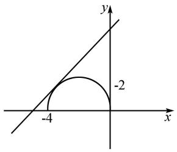

# 聚焦结构特征:例谈含参不等式 恒成立问题的求解策略

孙 茂 范习昱

(镇江市丹徒高级中学, 江苏 镇江 212143)

摘 要:瞄准不等式的结构特征,合理等价转化,可以突破含参不等式恒成立问题的求解.文章精选案例加以分类阐述,发现并归纳出此类问题的几种典型求解策略.

关键词: 结构特征; 恒成立; 含参不等式; 策略

中图分类号：G632

文献标识码：A

文章编号:1008-0333(2025)10-0050-04

含参不等式恒成立问题一直是各地高考的热点. 这类问题往往具有广泛的交汇性和巨大的思维含量, 同时其解题方法也多种多样. 一般而言, 这类题以函数、数列、三角函数或解析几何为载体, 重点探讨参数的求解范围. 解决这类问题主要是运用等价转化、分类讨论或者数形结合的数学思想. 笔者整理和研究相关资料发现: 瞄准不等式的结构特征、合理等价转化、恰当地构造函数并研究最值, 是最为典型的处理策略.

# 1 闭区间上的一次或二次式结构,函数保号性策略

例 1 $\forall a\in[-1,1]$ ，不等式 $x^{2}+(a-4)x+4-2a>0$ 恒成立，求 x 的取值范围.

解析 令 $f(a) = (x - 2)a + x^2 - 4x + 4$ ，则原问题转化为 $f(a) > 0$ 恒成立 ( $a \in [-1, 1]$ ).

(1) 当 x=2 时, 可得 $f(a)=0$ , 不合题意.

(2) 当 $x \neq 2$ 时, 应有 $\left\{ \begin{array}{l} f(1) > 0, \\ f(-1) > 0, \end{array} \right.$ 解之得 $x < 1$ 或 $x > 3$ .

故 x 的取值范围为 $(-∞,1)∪(3,+∞)$ .

评析 视 $a$ 为主元, 本题实质为一次不等式 $(x - 2)a + x^2 - 4x + 4 > 0$ 在 $a \in [-1, 1]$ 上恒成立的问题, 解决此类问题首选一次函数的保号. 即一般地, 一次函数 $f(x) = kx + b (k \neq 0)$ 在 $[\alpha, \beta]$ 上恒有 $f(x) > 0$ 的充要条件是 $\left\{ \begin{array}{l} f(\alpha) > 0, \\ f(\beta) > 0. \end{array} \right.$

例 2 对任意 $x \in [-1,1]$ ，不等式 $x^{2} + (a - 4)x + 4 - 2a < 0$ 恒成立，求 a 的取值范围.

解析 令 $f(x) = x^{2} + (a - 4)x + 4 - 2a$ ，则原问题转化为 $f(x) < 0$ 恒成立 ( $x \in [-1, 1]$ ).

由二次函数的保号性, $f(-1)<0$ 且 $f(1)<0$ , 解得a>3.

收稿日期:2025-01-05

作者简介:孙茂,本科,一级教师,从事高中数学教学研究;

范习昱,硕士,一级教师,从事高中数学教学研究.

基金项目:镇江市教育科学研究所“十四五”教学研究课题“新高考背景下高中生数学阅读能力培养策略的研究”(课题编号:2021jky-L302).

评析 视 x 为主元, 题中的不等式其实是关于 x 的一元二次不等式, 本题就变为一元二次函数在闭区间上恒正或恒负的问题, 有时也可以利用二次函数的保号性解决.

设 $f(x)=ax^{2}+bx+c(a\neq0)$ ,

(1) 当 $a > 0$ 时, $f(x) < 0$ 在 $x \in [\alpha, \beta]$ 上恒成立 $\Leftrightarrow \left\{ \begin{array}{l} f(\alpha) < 0, \\ f(\beta) < 0. \end{array} \right.$   
(2) 当 $a < 0$ 时, $f(x) > 0$ 在 $x \in [\alpha, \beta]$ 上恒成立 $\Leftrightarrow \left\{ \begin{array}{l} f(\alpha) > 0, \\ f(\beta) > 0. \end{array} \right.$

上述规律可以简单总结为:开口向上保负号,开口向下保正号.

一般来说,当题中出现一次或二次式结构时,我们要优先想到函数的保号性,选定主元和函数类型(次数),运用上述结论求解.但保号性策略的运用得益于这两类函数图象的特殊性,局限性很大,一般不能推广,因而变式较少,容易掌握.

# 2 典型二次式结构,判别式策略

例 3 已知关于 x 的不等式 $(m^{2} + 4m - 5)x^{2} - 4(m - 1)x + 3 > 0$ 对一切实数 x 恒成立, 求实数 m 的取值范围.

解析 (1) 当 $m^2 + 4m - 5 = 0$ 时, 即 $m = 1$ 或 $m = -5$ , 显然 $m = 1$ 时, 符合条件, $m = -5$ 时不符合条件.

(2) 当 $m^{2} + 4m - 5 \neq 0$ 时, 由二次函数对一切实数恒为正数的充要条件, 得

$$
\left\{ \begin{array}{l} m ^ {2} + 4 m - 5 > 0, \\ \Delta = 1 6 (m - 1) ^ {2} - 1 2 (m ^ {2} + 4 m - 5) <   0, \end{array} \right.
$$

解得 1 < m < 19.

综合(1)(2)得,实数 m 的取值范围为[1,19).

评析 对于典型二次式结构在实数集 R 上恒成立,一般利用二次项系数的正负和判别式就容易求解,在二次项系数含参数时,实际是“假二次”,应对参数分类讨论.

一般来说,若所求问题可转化为二次不等式对一切实数 x 恒成立,则可考虑应用判别式法解题.对于二次函数 $f(x)=ax^{2}+bx+c(a\neq0,x\in\mathbf{R})$ ,有

(1) $f(x)>0$ 对 $x\in R$ 恒成立 $\Leftrightarrow\left\{\begin{aligned}a>0,\\ \Delta<0.\end{aligned}\right.$   
(2) $f(x)<0$ 对 $x\in R$ 恒成立 $\Leftrightarrow\left\{\begin{aligned}a&<0,\\ \Delta&<0.\end{aligned}\right.$

# 3 绝对值结构,去绝对值后函数最值策略

例 4 若不等式 $\left|mx^{3}-\ln x\right|\geqslant1$ 对 $\forall x\in(0,1]$ 恒成立，则实数 m 的取值范围是 \_\_\_\_.

解析 根据 $|mx^3 - \ln x| \geqslant 1$ ，有 $mx^3 \leqslant \ln x - 1$ ，或 $mx^3 \geqslant \ln x + 1$ . 由于 $x \in (0,1]$ ，所以 $m \leqslant \frac{\ln x - 1}{x^3}$ ，或 $m \geqslant \frac{\ln x + 1}{x^3} \cdot \frac{\ln x - 1}{x^3}$ 没有最小值，所以不符合.

令 $f(x)=\frac{\ln x+1}{x^{3}},f'(x)=-\frac{3\ln x+2}{x^{4}}$ ，故当 $x=e^{-\frac{2}{3}}$ 时， $f(x)$ 取得最大值为 $\frac{e^{2}}{3}$ .

故 $m \in \left[\frac{\mathrm{e}^2}{3}, +\infty\right)$ .

评析 对于具有绝对值结构特征的恒成立问题,最直接有效的方法就是去绝对值.一般来说,分类讨论是去绝对值的首选方法.去掉绝对值后,函数变为简单初等函数,再进行变量分离和研究函数最值即可求解.

# 4 隐含几何结构,数形结合策略

例 5 设 $f(x) = \sqrt{-x^{2} - 4x}$ , $g(x) = \frac{4}{3}x + 1$ -a, 若恒有 $f(x) \leqslant g(x)$ 成立, 求实数 a 的取值范围.

解析 在同一直角坐标系中作出 $f(x)$ 及 $g(x)$ 的图象. 如图1所示, $f(x)$ 的图象是半圆 $(x + 2)^{2} + y^{2} = 4(y \geqslant 0)$ , $g(x)$ 的图象是平行的直线系 $4x - 3y + 3 - 3a = 0$ . 要使 $f(x) \leqslant g(x)$ 恒成立, 则圆心 $(-2,0)$ 到直线 $4x - 3y + 3 - 3a = 0$ 的距离满足$d=\frac{|-8+3-3a|}{5}\geqslant2$ , 解得 $a\leqslant-5$ 或 $a\geqslant\frac{5}{3}$ (由于是半圆故舍去), 即 $a\leqslant-5$ .

text_image

y
-2
-4
x

图 1 例 5 解析图

例 6 若当 $P(m,n)$ 为圆 $x^{2}+(y-1)^{2}=1$ 上任意一点时, 不等式 $m+n+c \geqslant 0$ 恒成立, 则 c 的取值范围是 \_\_\_\_.

解析 由 $m + n + c \geqslant 0$ ，可以看作是点 $P(m, n)$ 在直线 $x + y + c = 0$ 的右侧，而点 $P(m, n)$ 在圆 $x^2 + (y - 1)^2 = 1$ 上，即 $x^2 + (y - 1)^2 = 1$ 在直线的右侧并与它相离或相切。所以 $\left\{ \begin{array}{l} 0 + 1 + c > 0, \\ \frac{|0 + 1 + c|}{\sqrt{1^2 + 1^2}} \geqslant 1. \end{array} \right.$

所以 $c \geqslant \sqrt{2} - 1$ .

评析 对于隐含几何结构的恒成立问题,首选策略是数形结合策略,即找出或变形出具有几何意义的结构式,分析函数图象和不等式的密切联系,运用解析法破解.

事实上,函数图象和不等式有着如下关系:

(1) $f(x)>g(x)\Leftrightarrow$ 函数 $f(x)$ 图象恒在函数 $g(x)$ 图象上方；  
(2) $f(x) < g(x) \Leftrightarrow$ 函数 $f(x)$ 图象恒在函数 $g(x)$ 图象下方.

# 5 独立参量结构,变量分离策略

例 7 对于任意的 $x \in [-2,1]$ 时, 不等式 $ax^{3} - x^{2} + 4x + 3 \geqslant 0$ 恒成立, 则实数 a 的取值范围是 \_\_\_\_.

解析 ① 显然 $x = 0$ 时, 对任意实数 $a$ , 已知不等式恒成立.

令 $t=\frac{1}{x}$ ,

②若 $0 < x \leqslant 1$ ，则原不等式等价于

$$
a \geqslant - \frac {3}{x ^ {3}} - \frac {4}{x ^ {2}} + \frac {1}{x} = - 3 t ^ {3} - 4 t ^ {2} + t, t \in [ 1, + \infty).
$$

令 $g(t) = -3t^{3} - 4t^{2} + t$ ，则

$$
g ^ {\prime} (t) = - 9 t ^ {2} - 8 t + 1 = - (9 t - 1) (t + 1).
$$

由于 $t \geqslant 1$ ，故 $g'(t) \leqslant 0$ ，即函数 $g(t)$ 在 $[1, +\infty)$ 上单调递减，最大值为 $g(1) = -6$ ，故只要 $a \geqslant -6$ .

③若 $-2 \leqslant x < 0$ ，则原不等式等价于

$$
\begin{array}{r l} & a \leqslant - \frac {3}{x ^ {3}} - \frac {4}{x ^ {2}} + \frac {1}{x} = - 3 t ^ {3} - 4 t ^ {2} + t, t \in (- \infty , \\ & - \frac {1}{2} ]. \end{array}
$$

令 $g(t) = -3t^{3} - 4t^{2} + t$ ，则

$$
g ^ {\prime} (t) = - 9 t ^ {2} - 8 t + 1 = - (9 t - 1) (t + 1).
$$

在区间 $(-∞,-\frac{1}{2}]$ 上的极值点为t=-1，且为极小值点，故函数 $g(x)$ 在 $(-∞,-\frac{1}{2}]$ 上有唯一的极小值点，也是最小值点.

故只要 $a \leqslant g(-1) = -2$ .

综上可知,即 $-6 \leqslant a \leqslant -2$ .

评析 将不等式恒成立问题转化为求函数最值问题,其一般类型为 $^{[1]}$ :

(1) $f(x)>a$ 恒成立 $\Leftrightarrow a<f(x)_{\min}$ ;  
(2) $f(x)<a$ 恒成立 $\Leftrightarrow a>f(x)_{\max}$ .

更一般的有:(参数虽然不独立,但以“参”为变元的函数可以独立,也同样可以分离)

(1) $f(x) < g(a)$ (a 为参数) 恒成立 $\Leftrightarrow g(a) > f(x)_{\max}$ ;  
(2) $f(x)>g(a)$ (a为参数)恒成立 $\Leftrightarrow g(a)<f(x)_{\max}$ .

# 6 抽象函数结构,单调性剥离策略

例 8 设函数 $f(x)=x^{3}+x, x \in \mathbf{R}$ . 若当 $0 < \theta < \frac{\pi}{2}$ 时, 不等式 $f(m \sin \theta) + f(1 - m) > 0$ 恒成立, 则实数 m 的取值范围是().

A. $\left(\frac{1}{2},1\right]$

B. $\left(\frac{1}{2},1\right)$

C. $[1, +\infty)$

D. $(-∞,1]$

解析 易得 $f(x)$ 是奇函数, $f'(x) = 3x^2 + 1 > 0 \Rightarrow f(x)$ 在 $\mathbf{R}$ 上是增函数. 因为 $f(m\sin \theta) > f(m - 1)$ , 所以 $m\sin \theta > m - 1$ . 所以 $m < \frac{1}{1 - \sin \theta}$ .

因为 $0 < \sin\theta < 1$ ，所以 $\frac{1}{1 - \sin\theta} > 1$ 。所以 $m \leqslant 1$ 。

故选 D.

评析 面对抽象函数结构的含参恒成立问题，一般是利用抽象函数的单调性进行剥离，从而解放参数，没有了抽象函数的干扰，问题变得简单了.

# 7 双函数结构,构造新函数求最值策略

例9 已知函数 $f(x) = \frac{1}{2}\lg (x + 1), g(x) = \lg (2x + t)$ ，若当 $x \in [0,1]$ 时， $f(x) \leqslant g(x)$ 恒成立，求实数 $t$ 的取值范围.

解析 $f(x) \leqslant g(x)$ 在 $x \in [0,1]$ 恒成立，即 $\sqrt{x + 1} - 2x - t \leqslant 0$ 在 $x \in [0,1]$ 恒成立 $\Leftrightarrow \sqrt{x - 1} - 2x - t$ 在 $[0,1]$ 上的最大值小于或等于零.

令 $F(x) = \sqrt{x + 1} -2x - t$ ，则

$$
F ^ {\prime} (x) = \frac {1}{2 \sqrt {x + 1}} - 2 = \frac {1 - 4 \sqrt {x + 1}}{2 \sqrt {x + 1}}.
$$

因为 $x \in [0,1]$ ，所以 $F'(x) < 0$ ，即 $F(x)$ 在 $[0,1]$ 上单调递减， $F(0)$ 是最大值.

所以 $F(x) \leqslant F(0) = 1 - t \leqslant 0$ ，即 $t \geqslant 1$ .

评析 有时我们也会碰到双函数结构的恒成立问题,一般我们可以将两个函数作差来构造新函数,也可以恒等变形产生新函数,通过研究新函数的最值问题,从而得到参数的范围 $^{[2]}$ .

# 8 独立双变量结构,函数双最值策略

例 10 函数 $f(x)=x^{3}-3x-1$ ，若对于区间 $[-3,2]$ 上的任意 $x_{1}, x_{2}$ ，都有 $\left|f\left(x_{1}\right)-f\left(x_{2}\right)\right|\leqslant t$ ，则实数 t 的最小值是 \_\_\_\_.

解析 对于区间 $[-3,2]$ 上的任意 $x_{1}, x_{2}$ 都有 $|f(x_{1}) - f(x_{2})| \leqslant t$ ，等价于对于区间 $[-3,2]$ 上的任意 $x$ ，都有 $f(x)_{\max} - f(x)_{\min} \leqslant t$ .

因为 $f(x) = x^{3} - 3x - 1$ ，所以 $f'(x) = 3x^{2} - 3 = 3(x - 1)(x + 1)$ .

因为 $x \in [-3, 2]$ , 所以函数在 $[-3, -1], [1, 2]$ 上单调递增, 在 $[-1, 1]$ 上单调递减.

所以 $f(x)_{\max}=f(2)=f(-1)=1$ ,

$$
f (x) _ {\min} = f (- 3) = - 1 9.
$$

所以 $f(x)_{\max}-f(x)_{\min}=20.$

所以 $t \geqslant 20$ .

评析 恒成立问题其实就是全称量词命题为真时的充要条件所探讨的问题,但有时我们会面对双变量问题,即涉及两个量词的命题问题,这时如果两个变量独立,我们称为独立双变量结构,这种结构的含参恒成立问题,一般思维量大,难度很高,解决策略是转化为函数最值问题,和前面不一样,一般是最大值或者最小值都要考虑,我们称为函数双最值策略.

# 9 结束语

以上八类几乎囊括了含参不等式恒成立问题的所有情形,从题中所给不等式的结构特征出发,归类解决,是可以突破难点的.分析总结以上八类不同解析过程我们发现,含参不等式恒成立问题虽然其覆盖知识面广,方法也多种多样,但其核心思想还是等价转化为函数的最值问题,以此才能“以不变应万变”“一通百通”.

# 参考文献：

[1] 范习昱. 审视结构特征 构造合理函数: 例谈利用导数证明不等式的构造法 [J]. 数理化解题研究, 2019(16): 19-21.

[2] 范习昱. 几种典型的利用导数证明不等式题型的分类例析与应对策略 [J]. 数理化解题研究, 2022(04):79-83.