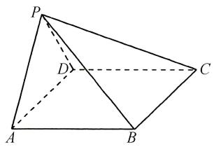
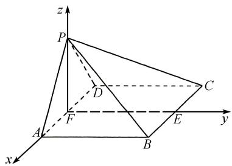

# 高观点视角下的高中数学解题研究

# 谢庆 $^{1}$ 陈维 $^{*1,2}$

(1. 伊犁师范大学数学与统计学院, 新疆维吾尔自治区 伊宁 835000;  
2. 伊犁师范大学应用数学研究所, 新疆维吾尔自治区 伊宁 835000)

摘 要:高观点视角下的数学教学,旨在运用高等数学和现代数学的思想方法、观点来剖析中学数学内容,从而把握其本质和关键.从高等数学的观点审视高中数学问题,不仅能够加深对问题本质的理解,还能为教学实践提供新的思路和方法.文章以数学高考题为例,探讨高观点视角下的解题策略,为高中数学解题提供参考.

关键词: 高观点视角; 高中数学; 解题

中图分类号：G632

文献标识码:A

19 世纪末 20 世纪初,德国数学家克莱因倡导“高观点下的初等数学”,引发克莱因—贝利运动[1]. 高观点视角下的数学教学,运用高等数学及现代数学思想、方法和观点剖析数学知识,有助于教师把握中学数学本质,拓广学生的解题思路,提高学生的解题能力. 高考常出现具有高等数学背景的试题,这些题目以其设计精巧、视角独特的特点,不仅拓宽了数学视野,而且促进了高等数学与初等数学的融合,成为检验学生思维能力的试金石. 从高等数学的观点审视数学问题,不仅能够加深对问题本质的理解,还能为解题提供新的思路和方法[2].

# 1 高观点视角下的高中数学解法探究

从高等数学视角出发,学生能够更深入地理解高中数学中的概念、定理和公式,还能为解题提供新思路与方法 $^{[3]}$ .

文章编号:1008-0333(2025)10-0019-03

例 1 （2018 年全国高考数学Ⅱ卷理科）已知函数 $f(x) = \mathrm{e}^{x} - ax^{2}$ ，若 $f(x)$ 在 $(0, +\infty)$ 只有一个零点，求 a.

解法1（高中数学知识）设函数 $h(x) = 1 - ax^2\mathrm{e}^{-x},f(x)$ 在 $(0, + \infty)$ 只有一个零点等价于 $h(x)$ 在 $(0, + \infty)$ 只有一个零点.

(1) 当 $a \leqslant 0$ 时, 因为 $x^{2} e^{-x} > 0$ , 所以 $ax^{2} e^{-x} \leqslant 0$ .
有 $h(x)=1-ax^{2}e^{-x}>0.$ 即 $h(x)$ 没有零点.  
(2) 当 a > 0 时, $h'(x) = ax(x - 2)e^{-x}$ .

①当 $x \in (0,2)$ 时， $x - 2 < 0, e^{-x} > 0$ ，所以 $h'(x) < 0, h(x)$ 在 $(0,2)$ 单调递减；

②当 $x \in (2, +\infty)$ 时， $h'(x) > 0, h(x)$ 在 $(2, +\infty)$ 单调递增，则 $h(2) = 1 - \frac{4a}{\mathrm{e}^2}$ 是 $h(x)$ 在 $(2, +\infty)$ 的最小值.

若 $h(2) > 0$ ，即 $a < \frac{\mathrm{e}^2}{4}$ ，此时 $h(x)$ 在 $(0, +\infty)$

收稿日期:2025-01-05

作者简介: 谢庆, 硕士, 从事数学教学研究.

通讯作者：\*陈维,副教授,从事概率论研究.

没有零点; 若 $h(2)=0$ , 即 $a=\frac{e^{2}}{4}$ , 此时 $h(x)$ 在 $(0, +\infty)$ 有一个零点; 若 $h(2)<0$ , 即 $a>\frac{e^{2}}{4}$ . 因为 $h(0)=1$ , 所以 $h(x)$ 在 $(0,2)$ 有一个零点.

当 $x > 0$ 时， $\mathrm{e}^x >x^2$ ，所以 $h(4a) = 1 - \frac{16a^3}{\mathrm{e}^{4a}} = 1$ $-\frac{16a^3}{(\mathrm{e}^{2a})^2} >1 - \frac{16a^3}{(2a)^4} = 1 - \frac{1}{a} >0$ ，即 $h(x)$ 在 $(2,4a)$ 上有一个零点.故 $h(x)$ 在 $(0, + \infty)$ 有2个零点

综上所述, $f(x)$ 在 $(0,+\infty)$ 只有一个零点, $a=\frac{e^{2}}{4}$ .

解法 2 （高观点下的极限思想） $f(x)$ 在 $(0, +\infty)$ 只有一个零点等价于 $f(x) = 0 (x > 0)$ 只有一个实数根. 因为 $f(0) \neq 0$ , 故 x = 0 不是零点.

$f(x)$ 在 $(0, +\infty)$ 只有一个零点可转换为 $\frac{\mathrm{e}^x}{x^2} = a$ $(x > a)$ 只有一个实根.

令 $g(x) = \frac{\mathrm{e}^x}{x^2}$ , 则 $g'(x) = \frac{\mathrm{e}^x}{x^3}(x - 2)$ . 当 $x \in (0, 2)$ 时, $g'(x) < 0$ ; 当 $x \in (2, +\infty)$ 时, $g'(x) > 0$ .

即 $g(x)$ 在 $(0,2)$ 上单调递减，在 $(2,+\infty)$ 上单调递增. 故 $g(2)=\frac{\mathrm{e}^{2}}{4}$ 是 $g(x)$ 在 $(0,+\infty)$ 的最小值.

因为 $\lim_{x\to 0^{+}}g(x) = \lim_{x\to 0^{+}}\frac{\mathrm{e}^x}{x^2} = +\infty ,\lim_{x\to +\infty}g(x)$ $= \lim_{x\to +\infty}\frac{\mathrm{e}^x}{x^2} = +\infty$ ，所以当 $a <   \frac{\mathrm{e}^2}{4},g(x)$ 与 $y = a$ 无交点；当 $a = \frac{\mathrm{e}^2}{4},g(x)$ 与 $y = a$ 只有一个交点；当 $a > \frac{\mathrm{e}^2}{4},$ $g(x)$ 与 $y = a$ 有2个交点.

综上所述, $f(x)$ 在 $(0,+\infty)$ 只有一个零点, $a=\frac{e^{2}}{4}$ .

例 2 （2017 年全国高考题）如图 1 所示，在四棱锥 P-ABCD 中， $AB \parallel CD$ ，且 $\angle BAP = \angle CDP = 90^{\circ}$ 。若 PA = PD = AB = DC， $\angle APD = 90^{\circ}$ ，求二面角 A - PB - C 的余弦值。

解法 1 （高中数学知识）由 $\angle BAP = \angle CDP = 90^{\circ}$ ，得 $AB \perp AP, CD \perp PD.$ 因为 $AB \parallel CD$ ，所以 AB

text_image

P
D
C
A
B

图1 例2图

$\perp PD.$ 又 $AP \cap PD = P, AP, PD \subset$ 平面 PAD, 从而 AB $\perp$ 平面 PAD.

在平面 PAD 内作 $PF \perp AD$ ，垂足为点 F，过点 F 在平面 ABCD 内作 $FE \parallel AB$ 交 BC 于点 E。故 $AB \perp PF$ 。又 $AB \cap AD = A, AB, CD \subset$ 平面 ABCD，所以 $PF \perp$ 平面 ABCD。以点 F 为坐标原点，AB = 1，建立空间直角坐标系如图 2 所示。

text_image

z
P
C
D
F
A
B
E
y
x

图2 建系图

所以 $A(\frac{\sqrt{2}}{2},0,0),P(0,0,\frac{\sqrt{2}}{2}),B(\frac{\sqrt{2}}{2},1,0)$ ， $C(-\frac{\sqrt{2}}{2},1,0)$ .即 $\overrightarrow{PC} = (-\frac{\sqrt{2}}{2},1, - \frac{\sqrt{2}}{2}),\overrightarrow{CB} = (\sqrt{2},$ $0,0),\overrightarrow{PA} = (\frac{\sqrt{2}}{2},0, - \frac{\sqrt{2}}{2}),\overrightarrow{AB} = (0,1,0).$

设 $\boldsymbol{n}=(x_{1},y_{1},z_{1})$ 是平面 PCB 的法向量，则 $\left\{\begin{aligned}\boldsymbol{n}\cdot\overrightarrow{PC}=0,\\ \boldsymbol{n}\cdot\overrightarrow{CB}=0.\end{aligned}\right.$ 即 $\left\{\begin{aligned}-\frac{\sqrt{2}}{2}x_{1}+y_{1}-\frac{\sqrt{2}}{2}z_{1}=0,\\ \sqrt{2}x_{1}=0.\end{aligned}\right.$

取 $y_{1} = -1$ ，可得 $\boldsymbol{n} = (0, -1, -\sqrt{2})$ 为平面 PCB 的一个法向量。同理， $\boldsymbol{m} = (1, 0, 1)$ 是平面 PAB 的一个法向量。则 $\cos < n, m > = \frac{n \cdot m}{|n| \cdot |m|} = -\frac{\sqrt{3}}{3}$ 。

由图 1 可得,二面角 A-PB-C 为钝角.

所以二面角 A-PB-C 的余弦值为 $-\frac{\sqrt{3}}{3}$ .

解法 2 （高观点下的几何思想）建立空间直角坐标系如图 2 所示，设 AB = 2，则 $D(-\sqrt{2}, 0, 0)$ ， $B(\sqrt{2}, 2, 0)$ ， $P(0, 0, \sqrt{2})$ ， $C(-\sqrt{2}, 2, 0)$ .

故 $\overrightarrow{BP}=(-\sqrt{2},-2,\sqrt{2}),\overrightarrow{BC}=(-2\sqrt{2},0,0)$ .

即平面 PBC 的法向量

$$
\begin{array}{l} \boldsymbol {t} = \overrightarrow {P B} \times \overrightarrow {B C} = \left(\left| \begin{array}{c c} - 2 & \sqrt {2} \\ 0 & 0 \end{array} \right|, \left| \begin{array}{c c} - \sqrt {2} & \sqrt {2} \\ - 2 \sqrt {2} & 0 \end{array} \right|, \left| \begin{array}{c c} - \sqrt {2} & - 2 \\ - 2 \sqrt {2} & 0 \end{array} \right|\right) \\ = (0, - 4, - 4 \sqrt {2}). \\ \end{array}
$$

因为 $\overrightarrow{PD} = (-\sqrt{2}, 0, -\sqrt{2})$ 是平面 $PAB$ 的一个法向量, 所以 $\cos < \overrightarrow{PD}, t > = \frac{\overrightarrow{PD} \cdot t}{|\overrightarrow{PD}| \cdot |t|} = \frac{8}{8\sqrt{3}} = \frac{\sqrt{3}}{3}$ .

由图 2 可得,二面角 A-PB-C 为钝角,所以二面角 A-PB-C 的余弦值为 $-\frac{\sqrt{3}}{3}$ .

# 2 高观点下数学解题策略

# 2.1 开拓数学思维,拓展解题思路

数学知识是一个逻辑严密且相互关联的整体,初等数学作为高等数学的基础,为学生提供了必要的数学语言和工具.要了解数学的广泛应用和前沿研究,需对不熟悉的符号语言进行阅读,在阅读中开拓思维,打开解题思路.在解决高中数学题时,可尝试引入高等数学中的一些概念和方法,如导数、极限等.通过数学思想的运用,开拓数学思维,提升解题的灵活性和创造性.

# 2.2 聚焦概念,理解本质

数学概念是数学体系的基础,它们构成了数学推理的基石.每一个数学概念都有其独特的定义和性质,这些定义和性质不仅决定了数学概念的应用范围,也提供了解题工具.理解数学概念的本质,需探究其背后的数学思想和原理.这不是对数学概念的简单记忆复述,而是深入思考领悟.理解数学概念的本质,能更好地把握数学概念的内涵和外延,从而更加灵活地运用这些概念来解决实际问题.

# 2.3 宏观看结构,微观抓关键

宏观看结构,意味着在解题时要从整体上把握问题的结构特征,明确问题所涉及的主要概念和关系.这有助于快速定位问题的核心,为接下来的解题步骤奠定基础.在数学问题中,结构特征可能表现为题目的叙述方式、所给条件的组合方式、所求结论的形式等.通过宏观把握,识别出问题的类型,从而选择相应的解题策略.微观抓关键,在解题过程中要深入细致地分析问题的细节,找出解决问题的关键点.这通常涉及对题目所给条件的深入挖掘和利用,以及对所求结论的精确推导.在微观层面,要特别注意题目中的隐含条件、特殊关系以及关键数学表达式的变形和应用.通过微观分析,可以发现题目中的易错点和难点,从而采取相应的方法进行突破[4].

# 3 结束语

数学高考题能有效衡量学生对知识体系的掌握程度、解题技巧的熟练度,还能检验学生的逻辑思维能力和综合分析能力,让学生体会到数学知识之间的联系性、渗透性与一体性.运用高等数学和现代数学的观点和方法来审视和解析中学数学的相关内容,可以帮助学生更好地理解问题的本质和内在联系,提高学生的数学思维和解题能力.

# 参考文献：

[1] F. 克莱茵. 高观点下的初等数学 [M]. 舒湘芹, 译. 武汉: 湖北教育出版社, 1980.  
[2] 张泽, 代红军. 高观点下的高中数学解题策略的研究: 以 2023 年北京高考数学第 19 题为例 [J]. 数理化解题研究, 2024(07): 65-68.  
[3] 杜继渠. 例谈数学解题的高观点立意和低起点切入 [J]. 数学通报, 2015, 54(07): 44-47, 54.  
[4] 华佳辰, 马东阳, 严春欢, 等. 数学分析观点下高中导数题的若干解题策略 [J]. 数理化解题研究, 2022(25): 98-100.

[责任编辑:李慧娇]