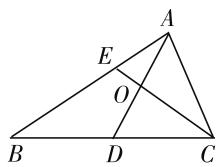
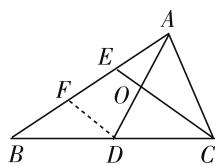
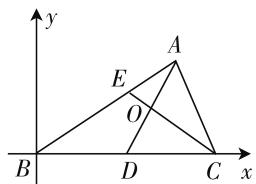
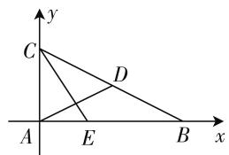
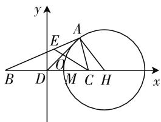

# 一道向量高考题的解法探究\*

● 江苏省扬州市新华中学 查宝才  
江苏省扬州市第一中学 张荣芳

平面向量在高考中占有非常重要的地位,它不仅可以单独命题,也可以与函数、方程、不等式、三角函数以及解析几何综合起来考查,在知识点交汇处命题,充分体现平面向量作为一种数学工具在教材中的突出地位.在江苏高考中,平面向量在填空题里出现较多,且多为中档题或压轴题.下面是2019年江苏卷的一道以向量为载体的高考试题,笔者在教学过程中以它为例与学生一起对其不同解法进行了探究,不当之处,敬请指正.原题如下:

如图 1, 在 $\triangle ABC$ 中, $D$ 是 $BC$ 的中点, $E$ 在边 $AB$ 上, $BE = 2EA$ , $AD$ 与 $CE$ 交于点 $O$ . 若 $\overrightarrow{AB}$ $\cdot\overrightarrow{AC}=6\overrightarrow{AO}\cdot\overrightarrow{EC}$ ，则 $\frac{AB}{AC}$ 的值是\_\_\_\_.

  
图1

涉及向量问题一般从向量基底法和坐标法两个角度去思考.

以 $\overrightarrow{AB}, \overrightarrow{AC}$ 为基底，易得 $\overrightarrow{EC} = \overrightarrow{AC} - \frac{1}{3} \overrightarrow{AB}$ . 如何用此基底表示 $\overrightarrow{AO}$ 是解决本题的瓶颈，也是突破口. 可以从“算两次”和平面几何的视角入手.

# 解法 1 基于“算两次”视角

设 $\overrightarrow{AO} = \lambda \overrightarrow{AD} (0 < \lambda < 1)$ ，又 $\overrightarrow{AD} = \frac{1}{2} (\overrightarrow{AB} + \overrightarrow{AC})$ ，所以 $\overrightarrow{AO} = \lambda \cdot \frac{1}{2} (\overrightarrow{AB} + \overrightarrow{AC}) = \frac{\lambda}{2}\overrightarrow{AB} + \frac{\lambda}{2}\overrightarrow{AC}$ . ①

因为 E, O, C 三点共线, 所以可设 $\overrightarrow{AO} = \mu \overrightarrow{AE} + (1 - \mu) \overrightarrow{AC} (0 < \mu < 1)$ .

因为 AB = 3AE，所以 $\overrightarrow{AO} = \frac{\mu}{3}\overrightarrow{AB} + (1 -$

$$
\mu) \overrightarrow {A C}. \quad ②
$$

根据平面向量基本定理,由①②得

$$
\left\{ \begin{array}{l} \frac {\lambda}{2} = \frac {\mu}{3}, \\ \frac {\lambda}{2} = 1 - \mu , \end{array} \text {解得} \left\{ \begin{array}{l} \lambda = \frac {1}{2}, \\ \mu = \frac {3}{4}, \end{array} \right. \right.
$$

故 $\overrightarrow{AO}=\frac{1}{4}\overrightarrow{AB}+\frac{1}{4}\overrightarrow{AC}.$

所以 $6\overrightarrow{AO} \cdot \overrightarrow{EC} = \frac{3}{2} (\overrightarrow{AB} + \overrightarrow{AC}) \cdot (\overrightarrow{AC} - \frac{1}{3}\overrightarrow{AB}) = \overrightarrow{AB} \cdot \overrightarrow{AC}.$

整理得 $\overrightarrow{AB^2} = 3\overrightarrow{AC^2}$ ，故 $\frac{AB}{AC} = \sqrt{3}$

# 解法 2 基于平面几何视角

如图2, 过点 D 作 $DF \parallel CE$ , 交 AB 于点 F, 由 BE = 2EA, D 为 BC 的中点, 知 BF = FE = EA, AO = OD.

因为 $\overrightarrow{AD} = \frac{1}{2} (\overrightarrow{AB} +\overrightarrow{AC})$ 所以 $\overrightarrow{AO} = \frac{1}{2}\overrightarrow{AD} = \frac{1}{4} (\overrightarrow{AB} +\overrightarrow{AC}).$

(以下做法同解法 1)

  
图2

点评: 解法1运用了“算两次”的思想以及三点共线的向量结论, 三点共线的向量结论可以用来求交点位置的向量或线段的比值, 但在解答题中要先证明再使用, 填空题可以直接使用. 解法2通过平行线分线段成比例定理确定了点O在AD上的位置, 巧妙地突破了解题瓶颈.

解决向量问题还可以从建立坐标系的角度思考，用坐标法解决问题. 如何建系，线段长度如何设定，关系到运算量的大小. 本题可以从一般性和特殊性的视角再尝试入手.

# 解法 3 基于一般化视角

如图 3, 以 B 为坐标原点, BC 所在直线为 x 轴建立如图 3 所示的平面直角坐标系.

设 BC=2a, A(3m,3n), 则各点坐标分别为 B(0,0), D(a,0), C(2a,0), E(2m,2n).

text_image

y
A
E
O
B
D
C
x

图3

$$
\begin{array}{r l} & {\text {所以} l _ {A D}: y = \frac {3 n}{3 m - a} (x} \\ & {- a), l _ {C E}: y = \frac {2 n}{2 m - 2 a} (x - 2 a).} \end{array}
$$

两直线联立,解得 $O\left(\frac{3m+a}{2},\frac{3n}{2}\right)$ .

$$
\begin{array}{l} = 9 m ^ {2} + 9 n ^ {2} - 6 a m, \overrightarrow {A O} \cdot \overrightarrow {E C} = \left(\frac {3 m + a}{2} - 3 m, \right. \\ \left. \frac {3 n}{2} - 3 n\right) \cdot (2 a - 2 m, - 2 n) = 3 m ^ {2} + 3 n ^ {2} - 4 a m + a ^ {2}. \\ \end{array}
$$

所以 $\overrightarrow{AB} \cdot \overrightarrow{AC} = (-3m, -3n) \cdot (2a - 3m, -3n)$

因为 $\overrightarrow{AB} \cdot \overrightarrow{AC} = 6\overrightarrow{AO} \cdot \overrightarrow{EC}$ , 所以 $3m^{2} + 3n^{2} = 6am - 2a^{2}$ , 所以 $\frac{AB}{AC} = \frac{\sqrt{9m^{2} + 9n^{2}}}{\sqrt{(2a - 3m)^{2} + (-3n)^{2}}} =$

$$
\sqrt {\frac {1 8 a m - 6 a ^ {2}}{6 a m - 2 a ^ {2}}} = \sqrt {3}.
$$

# 解法 4 基于特殊化视角

不妨取 $AB \perp AC$ ，如图 4，以 A 为坐标原点，AB 为 x 轴，AC 为 y 轴建立平面直角坐标系.

设 $B(a,0)$ , $C(0,b)$ ，则 $A(0,0),D\left(\frac{a}{2},\frac{b}{2}\right),E\left(\frac{a}{3},0\right)$

所以 $\overrightarrow{AD} = \left(\frac{a}{2},\frac{b}{2}\right),\overrightarrow{EC} =$

$$
\left(- \frac {a}{3}, b\right).
$$

text_image

y
C
D
A
E
B
x

图 4

因为 $\overrightarrow{AB} \cdot \overrightarrow{AC} = 6\overrightarrow{AO} \cdot \overrightarrow{EC} = 0$ ，所以 $\overrightarrow{AD} \cdot \overrightarrow{EC} = 0$ ，即 $a^2 = 3b^2$ 。故 $\frac{AB}{AC} = \sqrt{3}$ 。

点评:坐标法其实是基底法的特殊化形式,求某个点的坐标可以运用直线方程求交点的方法处理,必要时可以将角度、线段长度等元素进行特殊化,减少变量突出少思多算、多思少算的特点.特别是在解答填空题时,尽量避免小题大做,多思考是否有更优的解题方案.

再仔细审题后发现目标函数是一个比值为常数的定值,可联想到点A的轨迹是以B,C为定点的阿波罗尼斯圆,本题也可以从这个角度尝试入手.

# 解法 5 基于“阿氏圆”视角

如图 5, 以 D 为坐标原点, BC 所在直线为 x 轴建立平面直角坐标系.

设 $B(-a,0),C(a,0)$ ， $A(x,y), (a > 0)$ 则 $E\left(\frac{2x - a}{3},\frac{2y}{3}\right)$ .由直线 $AD$ 与 $CE$ 相交得 $O\left(\frac{x}{2},\frac{y}{2}\right)$ ，所

text_image

y
A
E
O
B D M C H x

图5

$$
\begin{array}{l} {\text {以} \overrightarrow {A O} = \left(- \frac {x}{2}, - \frac {y}{2}\right), \overrightarrow {E C} = \left(\frac {4 a - 2 x}{3}, - \frac {2 y}{3}\right), \overrightarrow {A B}} \\ {= (- a - x, - y), \overrightarrow {A C} = (a - x, - y).} \end{array}
$$

因为 $\overrightarrow{AB} \cdot \overrightarrow{AC} = 6\overrightarrow{AO} \cdot \overrightarrow{EC}$ , 所以 $x^{2} - a^{2} + y^{2} = 6\left[\left(-\frac{x}{2}\right) \cdot \frac{4a - 2x}{3} + \left(-\frac{y}{2}\right) \cdot \left(-\frac{2y}{3}\right)\right]$ , 整理得 $x^{2} + y^{2} = 4ax - a^{2}$ , 即 $(x - 2a)^{2} + y^{2} = 3a^{2}$ .

所以点 A 的轨迹是以 $H(2a,0)$ 为圆心， $\sqrt{3}a$ 为半径的圆.

因为 HB = 3a, HC = a, HA = r = $\sqrt{3}$ a, 所以 HB · HC = HA $^{2}$ .

所以圆 H 是以 B, C 为定点的阿氏圆.

圆 H 与线段 BC 交于点 $M((2-\sqrt{3})a,0)$ ，所以 $\frac{AB}{AC}=\frac{MB}{MC}=\frac{(3-\sqrt{3})a}{(\sqrt{3}-1)a}=\sqrt{3}$ .

点评:阿波罗尼斯圆常作为各类试题编写的背景,这是由于这类试题内容形式较常规、切口小、上手快,大部分学生不感到陌生,能快速聚焦思路,同时数学水平层次较高、学科素养较好的学生,若从阿氏圆的高层次观点考虑的同时结合其性质,往往能更快捷地解决问题.所以这类试题能很好地考查学生综合能力,较好地体现出试题的区分度.

以上几种解法,分别从不同角度对以向量为载体的数学问题进行了全方位的、多层次的探求,体现的均是中学数学解题的重要思想和方法.在解题复习指导中引导学生充分想象、巧用直观,探究多种解决方案,可以较好地拓展学生的解题思路,有效训练学生的发散思维能力,激发学生学习兴趣.平时教学中如能经常刻意地进行这方面的思维训练,对于全面提升学生数学核心素养是大有裨益的.

# 参考文献：

[1] 单博. 数学必修 4[M]. 南京: 江苏凤凰教育出版社, 2004. F