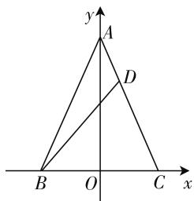
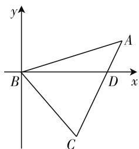
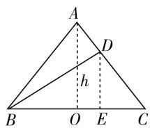

# 三思维切入,多角度拓展

—— 一道解三角形问题的探究

● 江苏省泰兴市第一高级中学 张永丰

解三角形问题经常出现在近几年的模拟考试、会考、高考、自主招生考试及竞赛题中，其能较好地融合其他相关知识，往往能合理交汇解三角形、三角函数、平面几何、不等式、平面向量等知识，难度可大可小，而且破解的思维多样，切入点灵活，是各级各类考试的考点与热点问题之一.

# 一、问题呈现

问题 （江苏省南通市 2020 届高三第一次调研测试·12）已知 $\triangle ABC$ 的面积为 3，且 $AB = AC$ . 若 $\overrightarrow{CD} = 2\overrightarrow{DA}$ ，则 $BD$ 的最小值为 \_\_\_\_.

此题以三角形为问题背景,题目简单,内容丰富,结合三角形的几何特征及平面向量的线性关系,进而来确定对应线段的最值问题.通过合理设置,把三角形、平面向量、解三角形、基本不等式、三角函数等相关知识加以有机融合,综合考查数学基础知识与数学基本能力.

# 二、问题破解

# 思维角度一:坐标思维

通过建立平面直角坐标系,设出相应点的坐标,利用题目条件确定相关点的坐标,结合三角形的面积计算公式与线段之间的关系确定线段BD长度的关系式,再结合基本不等式或参数的取值范围情况来确定相应的最值即可.不同的平面直角坐标系的建立,有不同的切入思维与方法.

解法 1:(坐标法 1) 如图 1 所示, 以 BC 所在直线为 x 轴, 线段 BC 的垂直平分线所在直线为 y 轴建立平面直角坐标系 xOy, 设 $B(-x,0)$ , $C(x,0)$ , $A(0,y)$ , 其中 x > 0, y > 0, 根据 $\triangle ABC$ 的面积为 3, 可得 $\frac{1}{2}\times2x\times y=3$ ，即xy=3，而由 $\overrightarrow{CD}=2\overrightarrow{DA}$ ，可得

text_image

y
A
D
B O C x

图1

$D\left(\frac{x}{3},\frac{2y}{3}\right)$ ，所以 $BD^{2}=\left(\frac{x}{3}+x\right)^{2}+\left(\frac{2y}{3}\right)^{2}=\frac{16}{9}x^{2}+\frac{4}{9}y^{2}\geqslant2\sqrt{\frac{16}{9}x^{2}\times\frac{4}{9}y^{2}}=\frac{16}{9}xy=\frac{16}{3}$ ，当且仅当 $\frac{16}{9}x^{2}=\frac{4}{9}y^{2}$ ，即 $y=2x=\sqrt{6}$ 时等号成立，可得 $BD\geqslant\frac{4\sqrt{3}}{3}$ ，即 BD 的最小值为 $\frac{4\sqrt{3}}{3}$ ，故填答案： $\frac{4\sqrt{3}}{3}$ .

解法 2: (坐标法 2) 如图 2 所示, 以点 B 为坐标原点, BD 所在直线为 x 轴建立平面直角坐标系 xOy, 设 $D(m,0)$ , $A(x,y)$ , 其中 m > 0, 由 AB = AC, $\overrightarrow{CD} = 2\overrightarrow{DA}$ , 可得 AB = 3AD, 即 $AB^{2} = 9AD^{2}$ , 则有 $x^{2} + y^{2} = 9[(x - m)^{2} + y^{2}]$ , 整理可得 $\left(x-\frac{9}{8}m\right)^{2}+y^{2}=\frac{9}{64}m^{2}$ ，则有 $|y|\leqslant\frac{3}{8}m$ ，根据 $\triangle ABC$ 的面积为3，可得 $S_{\triangle ABC}=3S_{\triangle ABD}=3\times\frac{1}{2}\times m\times|y|=\frac{3}{2}m|y|=3$ ，所以 $3=\frac{3}{2}m|y|\leqslant\frac{3}{2}m\times\frac{3}{8}m=\frac{9}{16}m^{2}$ ，则有 $m^{2}\geqslant\frac{16}{3}$ ，当且仅当 $|y|=\frac{3}{8}m,x=\frac{9}{8}m$ 时等号成立，可得 $BD=m\geqslant\frac{4\sqrt{3}}{3}$ ，即BD的最小值为 $\frac{4\sqrt{3}}{3}$ ，故填答案： $\frac{4\sqrt{3}}{3}$ .

text_image

y
A
B
D x
C

图2

# 思维角度二: 解三角形思维

通过设出线段的长度参数,结合三角形的面积计算公式及平面向量的线性关系确定线段的长度问题,通过解三角形中余弦定理的应用加以合理转化,并利用一次分式三角函数的待定系数法处理及辅助角公式的应用来确定最值问题,从而得以求解线段 BD 的最值问题.

解法3:(解三角形法)设AB=AC=3m,其中m>0,根据△ABC的面积为3,可得 $\frac{1}{2}\times3m\times3m\times\sin A=3$ ,即 $m^{2}\sin A=\frac{2}{3}$ ,而由 $\overrightarrow{CD}=2\overrightarrow{DA}$ ,可得AD=m,在△ABD中,由余弦定理,可得 $BD^{2}=(3m)^{2}+m^{2}-2\times3m\times m\times\cos A=10m^{2}-6m^{2}\cos A=\frac{20}{3\sin A}-\frac{4\cos A}{\sin A}=\frac{4}{3}\cdot\frac{5-3\cos A}{\sin A}$ ,令 $\frac{5-3\cos A}{\sin A}=k>0$ ,整理可得 $k\sin A+3\cos A=5$ ,则有 $\sqrt{k^{2}+9}\sin(A+\theta)=5$ ,可得 $\sqrt{k^{2}+9}\geqslant5$ ,解得 $k\geqslant4$ ,所以 $BD^{2}=\frac{4}{3}\cdot\frac{5-3\cos A}{\sin A}\geqslant\frac{16}{3}$ ,当且仅当 $\sin A=\frac{4}{5},\cos A=\frac{3}{5}$ 时等号成立,可得 $BD\geqslant\frac{4\sqrt{3}}{3}$ ,即BD的最小值为 $\frac{4\sqrt{3}}{3}$ ,故填答案: $\frac{4\sqrt{3}}{3}$ .

# 思维角度三:平面几何思维

通过三角形的平面几何作图处理,设出相应的高h,并作出相应的辅助线,结合三角形的面积计算公式及平面向量的线性关系确定对应线段的关系式,进而结合勾股定理及基本不等式的应用来确定相应的最值即可.

解法 4: (几何法) 如图 3 所示, 取 BC 的中点 O, 连接 AO, 由于 AB = AC, 可得 $AO \perp BC$ , 过点 D 作 $DE \perp BC$ 交 BC 于点 E, 设 AO = h > 0, 根据 $\triangle ABC$ 的面积为 3, 可得 $S = \frac{1}{2} \times BC \times h = 3$ ,则有 $BO = CO = \frac{1}{2} BC = \frac{3}{h}$ 而由 $\overrightarrow{CD} = 2\overrightarrow{DA}$ 可得 $DE = \frac{2}{3} h, BE = \frac{4}{h}$ 所以 $BD^{2} = \left(\frac{2}{3} h\right)^{2} + \left(\frac{4}{h}\right)^{2} = \frac{4}{9} h^{2} + \frac{16}{h^{2}} \geqslant 2\sqrt{\frac{4}{9} h^{2} \times \frac{16}{h^{2}}} = \frac{16}{3}$ ，当且仅当 $\frac{4}{9} h^{2} = \frac{16}{h^{2}}$ ，即 $h = \sqrt{6}$ 时等号成立，可得 $BD \geqslant \frac{4\sqrt{3}}{3}$ ，即 $BD$ 的最小值为 $\frac{4\sqrt{3}}{3}$ ，故填答案： $\frac{4\sqrt{3}}{3}$ .

  
图 3

点评:破解此类解三角形问题,常见的思维方式就是:坐标思维、解三角形思维、平面几何思维等,利用不同思维方式结合相关的方法,往往都能有效地破解相应的解三角形问题.在破解时,往往要充分考虑题目条件与问题背景,切实选择更为简单快捷的方法来转化与处理,从而得以解决.

# 三、变式拓展

结论 1: 已知 $\triangle ABC$ 的面积为 S，且 AB = AC。若 $\overrightarrow{CD} = \lambda \overrightarrow{DA} (\lambda > 0)$ ，则 BD 的最小值为 $\frac{\sqrt{2\lambda(\lambda + 2)S}}{\lambda + 1}$ 。

证明:如图3所示,取BC的中点O,连接AO,由于AB=AC,可得 $AO\perp BC$ ,过点D作 $DE\perp BC$ 交BC于点E,设AO=h>0,根据 $\triangle ABC$ 的面积为S,可得 $S=\frac{1}{2}\times BC\times h=S$ ,则有 $BO=CO=\frac{1}{2}BC=\frac{S}{h}$ ,而由 $\overrightarrow{CD}=\lambda\overrightarrow{DA}(\lambda>0)$ ,可得 $DE=\frac{\lambda}{\lambda+1}h,BE=\frac{(\lambda+2)S}{(\lambda+1)h}$ ,所以 $BD^{2}=\left(\frac{\lambda}{\lambda+1}h\right)^{2}+\left(\frac{(\lambda+2)S}{(\lambda+1)h}\right)^{2}=\frac{\lambda^{2}}{(\lambda+1)^{2}}h^{2}+\frac{(\lambda+2)^{2}S^{2}}{(\lambda+1)^{2}h^{2}}\geqslant2$ $\sqrt{\frac{\lambda^2}{(\lambda + 1)^2} h^2 \times \frac{(\lambda + 2)^2 S^2}{(\lambda + 1)^2 h^2}} = \frac{2\lambda (\lambda + 2)S}{(\lambda + 1)^2}$ , 当且仅当 $\frac{\lambda^2}{(\lambda + 1)^2} h^2 = \frac{(\lambda + 2)^2 S^2}{(\lambda + 1)^2 h^2}$ , 即 $h = \sqrt{\frac{(\lambda + 2)S}{\lambda}}$ 时等号成立, 可得 $BD \geqslant \frac{\sqrt{2\lambda (\lambda + 2)S}}{\lambda + 1}$ , 即 $BD$ 的最小值为 $\frac{\sqrt{2\lambda (\lambda + 2)S}}{\lambda + 1}$ .

其实, 当 $S=3, \lambda=2$ 时, 就是以上试题, 此时 BD 的最小值为 $\frac{\sqrt{2\lambda(\lambda+2)S}}{\lambda+1}=\frac{4\sqrt{3}}{3}$ .

# 四、解后反思

通过“一题多思”“一题多解”“一题多变”“一题多拓”等探究学习，充分使相关问题的丰富底蕴得以有效挖掘，从而真正达到“解一题拓一类，拓一类通一片”，避免“题海战术”，结合数学知识的交汇与融合，数学知识与方法的融会贯通，充分培养数学的思维品质，提升解题能力，拓展数学应用，达到“在解中学”“在学中悟”“在悟中不断提升”的良好品质，以不变应万变，提升解题思维与解题能力，培养核心素养。

W