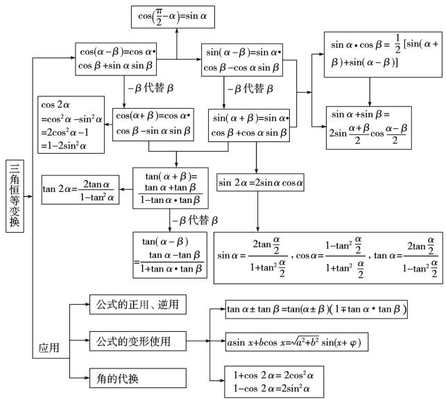

# 三角恒等变换题型探究\*

# ● 福建省厦门第六中学 史习佳

解三角函数问题往往离不开三角恒等变换,离开了三角恒等变换公式去解三角函数问题,可谓“天方夜谭”.那么,三角恒等变换公式有哪些?它们又是如何演变的呢?请看下表:

flowchart

公式虽好,会用才是硬道理,那么三角恒等变换公式的应用主要涉及哪些题型?

# 一、给角求值

在这类问题中,一般会出现一些非特殊角,需仔细观察这些非特殊角与特殊角之间的关系,并利用三角恒等变换把求非特殊角的三角函数问题,转化为求特殊角的三角函数问题即可.

例 1 (1) $\frac{\sqrt{3}}{\cos10^{\circ}} - \frac{1}{\sin170^{\circ}} =$ \_\_\_\_ ;

(2) $\frac{2\cos10^{\circ}-\sin20^{\circ}}{\cos20^{\circ}}=$ \_\_\_\_.

解析:(1) $\frac{\sqrt{3}}{\cos10^{\circ}}-\frac{1}{\sin170^{\circ}}=\frac{\sqrt{3}}{\cos10^{\circ}}-\frac{1}{\sin10^{\circ}}$

$$
\begin{array}{l} = \frac {\sqrt {3} \sin 1 0 ^ {\circ} - \cos 1 0 ^ {\circ}}{\sin 1 0 ^ {\circ} \cos 1 0 ^ {\circ}} = \frac {2 \sin (1 0 ^ {\circ} - 3 0 ^ {\circ})}{\frac {1}{2} \sin 2 0 ^ {\circ}} \\ = \frac {- 2 \sin 2 0 ^ {\circ}}{\frac {1}{2} \sin 2 0 ^ {\circ}} = - 4. \\ \end{array}
$$

(2) 原式 $= \frac{2\cos(30^{\circ}-20^{\circ})-\sin 20^{\circ}}{\cos 20^{\circ}} = \frac{\sqrt{3}\cos 20^{\circ}}{\cos 20^{\circ}}$

$$
= \sqrt {3}.
$$

# 二、给值求值

这类问题通常题设中给出某些角的三角函数式的值,要求解题者求出另外一些角的三角函数值,求解这类题的关键是善于“变角”,如: $\alpha=(\alpha+\beta)-\beta,2\alpha=(\alpha+\beta)+(\alpha-\beta)$ 等.把所求的角用含已知角的式子来表示,同时求解时要特别注意角的范围.

例 2 （1）若 $0 < \alpha < \frac{\pi}{2}$ ， $-\frac{\pi}{2} < \beta < 0$ ， $\cos\left(\frac{\pi}{4}+\alpha\right)=\frac{1}{3},\cos\left(\frac{\pi}{4}-\frac{\beta}{2}\right)=\frac{\sqrt{3}}{3}$ ，则 $\cos\left(\alpha+\frac{\beta}{2}\right)$ 等于 \_\_\_\_.

(2) 设 $\alpha$ 为锐角，若 $\cos\left(\alpha+\frac{\pi}{6}\right)=\frac{4}{5}$ ，则 $\sin\left(2\alpha+\frac{\pi}{12}\right)$ 的值为 \_\_\_\_.

解析:(1) 因为 $0 < \alpha < \frac{\pi}{2}$ ，则 $\frac{\pi}{4} < \frac{\pi}{4} + \alpha < \frac{3\pi}{4}$ ，
所以 $\sin\left(\frac{\pi}{4}+\alpha\right)=\sqrt{1-\cos^{2}\left(\frac{\pi}{4}+\alpha\right)}=\frac{2\sqrt{2}}{3}.$

又 $-\frac{\pi}{2} < \beta < 0$ ，则 $\frac{\pi}{4} < \frac{\pi}{4} - \frac{\beta}{2} < \frac{\pi}{2}$ ，所以 $\sin \left(\frac{\pi}{4} - \frac{\beta}{2}\right) = \sqrt{1 - \cos^2\left(\frac{\pi}{4} - \frac{\beta}{2}\right)} = \frac{\sqrt{6}}{3}$ .

故 $\cos \left(\alpha +\frac{\beta}{2}\right) = \cos \left[\left(\frac{\pi}{4} +\alpha\right) - \left(\frac{\pi}{4} -\frac{\beta}{2}\right)\right] =$

$$
\cos \left(\frac {\pi}{4} + \alpha\right) \cos \left(\frac {\pi}{4} - \frac {\beta}{2}\right) + \sin \left(\frac {\pi}{4} + \alpha\right) \sin \left(\frac {\pi}{4} - \frac {\alpha}{2}\right)
$$

$\left.\frac{\beta}{2}\right) = \frac{1}{3} \times \frac{\sqrt{3}}{3} + \frac{2\sqrt{2}}{3} \times \frac{\sqrt{6}}{3} = \frac{5\sqrt{3}}{9}$ . 故答案: $\frac{5\sqrt{3}}{9}$ .

$$
\begin{array}{l} \sin \Bigl (\alpha + \frac {\pi}{6} \Bigr) = \frac {3}{5}. \text {所以} \sin \Bigl (2 \alpha + \frac {\pi}{1 2} \Bigr) = \sin \Bigl [ 2 \Bigl (\alpha + \frac {\pi}{6} \Bigr) - \\ \left. \frac {\pi}{4} \right] = \sin 2 \left(\alpha + \frac {\pi}{6}\right) \cos \frac {\pi}{4} - \cos 2 \left(\alpha + \frac {\pi}{6}\right) \sin \frac {\pi}{4} = \\ \sqrt {2} \sin \left(\alpha + \frac {\pi}{6}\right) \cos \left(\alpha + \frac {\pi}{6}\right) - \frac {\sqrt {2}}{2} \left[ 2 \cos^ {2} \left(\alpha + \frac {\pi}{6}\right) - 1 \right] = \\ \sqrt {2} \times \frac {3}{5} \times \frac {4}{5} - \frac {\sqrt {2}}{2} \left[ 2 \times \left(\frac {4}{5}\right) ^ {2} - 1 \right] = \frac {1 2 \sqrt {2}}{2 5} - \frac {7 \sqrt {2}}{5 0} = \\ \end{array}
$$

(2) 因为 $\alpha$ 为锐角且 $\cos\left(\alpha+\frac{\pi}{6}\right)=\frac{4}{5}$ , 所以

$\frac{17\sqrt{2}}{50}$ . 故答案: $\frac{17\sqrt{2}}{50}$ .

# 三、给值求角

这类问题实质上是通过转化为“给值求值”问题来解决的，求解的关键还是变角，我们通常把所要求的角用含有已知角的式子来表示，再根据所求得的三角函数值，并结合该函数的单调性来求得结论.

例3 (1) 已知 $\cos (\alpha - \beta) = -\frac{3}{5}, \cos (\alpha + \beta) = \frac{3}{5}$ , 且 $\alpha - \beta \in \left(\frac{\pi}{2}, \pi\right), \alpha + \beta \in \left(\frac{3\pi}{2}, 2\pi\right)$ , 求角 $\beta$ 的值.

(2) 已知 $\alpha, \beta \in (0, \pi)$ , 且 $\tan (\alpha - \beta) = \frac{1}{2}, \tan \beta = -\frac{1}{7}$ , 则 $2\alpha - \beta$ 的值为 \_\_\_\_.

解析:(1)由 $\alpha-\beta\in\left(\frac{\pi}{2},\pi\right)$ , $\cos(\alpha-\beta)=-\frac{3}{5}$ , 可知 $\sin(\alpha-\beta)=\frac{4}{5}$ . 又因为 $\alpha+\beta\in\left(\frac{3\pi}{2},2\pi\right)$ , $\cos(\alpha+\beta)=\frac{3}{5}$ , 所以 $\sin(\alpha+\beta)=-\frac{4}{5}$ , 于是 $\cos2\beta=\cos[(\alpha+\beta)-(\alpha-\beta)]=\cos(\alpha+\beta)\cos(\alpha-\beta)+\sin(\alpha+\beta)\sin(\alpha-\beta)=\frac{3}{5}\times\left(-\frac{3}{5}\right)+\left(-\frac{4}{5}\right)\times\frac{4}{5}=-1$ . 因为 $\alpha-\beta\in\left(\frac{\pi}{2},\pi\right)$ , $\alpha+\beta\in\left(\frac{3\pi}{2},2\pi\right)$ , 所以 $2\beta\in\left(\frac{\pi}{2},\frac{3\pi}{2}\right)$ , 所以 $2\beta=\pi$ , 故 $\beta=\frac{\pi}{2}$ .

(2) 因为 $\tan \alpha = \tan [(\alpha - \beta) + \beta] =$

$\frac{\tan(\alpha-\beta)+\tan\beta}{1-\tan(\alpha-\beta)\tan\beta}=\frac{\frac{1}{2}-\frac{1}{7}}{1+\frac{1}{2}\times\frac{1}{7}}=\frac{1}{3}>0,$ 所以0<

$\alpha < \frac{\pi}{2}$ . 又因为 $\tan 2\alpha = \frac{2\tan\alpha}{1 - \tan^2\alpha} = \frac{2\times\frac{1}{3}}{1 - \left(\frac{1}{3}\right)^2} = \frac{3}{4} >$

0, 所以 $0 < 2\alpha < \frac{\pi}{2}$ , 所以 $\tan (2\alpha - \beta) = \frac{\tan 2\alpha - \tan \beta}{1 + \tan 2\alpha \tan \beta}$

$= \frac{\frac{3}{4} + \frac{1}{7}}{1 - \frac{3}{4} \times \frac{1}{7}} = 1.$ 因为 $\tan \beta = -\frac{1}{7} < 0$ ，所以 $\frac{\pi}{2} < \beta$

$<\pi,-\pi<2\alpha-\beta<0$ ,所以 $2\alpha-\beta=-\frac{3\pi}{4}$ .

# 四、三角恒等式的证明

这类问题主要包含两种类型: 不附加条件的恒等式证明和条件恒等式证明.

不附加条件的恒等式证明,通常可以利用三角恒等变换,逐步消除三角等式两端的差异,证明的常规思路是:由繁的一侧开始,证到到简的一侧,如果等式两侧繁的程度旗鼓相当,那么可采用左右同时推理的思路,从而将它们化为同一个式子.

条件恒等式的证明,关键是恰当并适时地使用已知的条件等式,或者通过仔细探求发现所给条件与欲证等式间的内在联系,再采用代入法和消元法来加以证明.

例 4 （1）已知 $\sin(2\alpha + \beta) = 5\sin\beta$ ，求证： $2\tan(\alpha + \beta) = 3\tan\alpha$ .

(2) 求证: $\frac{2\sin x\cos x}{(\sin x + \cos x - 1)(\sin x - \cos x + 1)} = \frac{1 + \cos x}{\sin x}$ .

解析:(1) 将已知等式中 $2\alpha + \beta$ 改写成 $(\alpha + \beta) + \alpha, \beta$ 改写成 $(\alpha + \beta) - \alpha$ ，再利用两角的和差公式展开，并加以重新整理。证明如下：

因为 $2\alpha + \beta = (\alpha + \beta) + \alpha, \beta = (\alpha + \beta) - \alpha,$

所以 $\sin(2\alpha + \beta) = 5\sin\beta \Rightarrow \sin[(\alpha + \beta) + \alpha] = 5\sin[(\alpha + \beta) - \alpha]$

$$
\Rightarrow \sin (\alpha + \beta) \cos \alpha + \cos (\alpha + \beta) \sin \alpha = 5 \sin (\alpha +
$$

$$
\beta) \cos \alpha - 5 \cos (\alpha + \beta) \cdot \sin \alpha
$$

$$
\Rightarrow 2 \sin (\alpha + \beta) \cos \alpha = 3 \cos (\alpha + \beta) \sin \alpha
$$

$$
\Rightarrow 2 \tan (\alpha + \beta) = 3 \tan \alpha .
$$

故 $2\tan(\alpha+\beta)=3\tan\alpha.$

(下转第66页)

$-\lambda\overrightarrow{PB},\overrightarrow{AQ}=\lambda\overrightarrow{QB}$ ，所以 $4=\frac{x_{1}-\lambda x_{2}}{1-\lambda},1=\frac{y_{1}-\lambda y_{2}}{1-\lambda},x=$ $\frac{x_{1}+\lambda x_{2}}{1+\lambda},y=\frac{y_{1}+\lambda y_{2}}{1+\lambda}$ ，从而 $4x=\frac{x_{1}^{2}-\lambda^{2}x_{2}^{2}}{1-\lambda},1\cdot y=$ $\frac{y_{1}^{2}-\lambda^{2}y_{2}^{2}}{1-\lambda}$ ，又点A,B在椭圆上，即 $x_{1}^{2}+2y_{1}^{2}=4,x_{2}^{2}+2y_{2}^{2}=4$ ，消元有 $4x+2y=4$ ，所以总在 $2x+y-2=0$ 上.

反思:该解法利用 A, B, P, Q 四点的位置关系, 巧妙地把线段间的数量关系转化为向量关系, 再由向量关系转化为代数关系. 利用几个代数量间的关系整体代入消元. 这种解法把向量式与代数式间的转化发挥得淋漓尽致.

# 三、问题拓展

两个一般性结论：

拓展 1: 椭圆 $C: \frac{x^{2}}{a^{2}} + \frac{y^{2}}{b^{2}} = 1 (a > b > 0)$ ，过椭圆 C 外一点 $P(x_{0}, y_{0})$ 的动直线 l 与椭圆 C 相交于两不同点 A, B 时，在线段 AB 上取点 Q，满足 $\left|\overrightarrow{AP}\right| \cdot \left|\overrightarrow{QB}\right| = \left|\overrightarrow{AQ}\right| \cdot \left|\overrightarrow{PB}\right|$ ，证明：点 Q 总在某定直线上.

为了方便只用方法 4 证明该结论：

设点 Q, A, B 的坐标分别为 $(x, y)$ , $(x_{1}, y_{1})$ , $(x_{2}, y_{2})$ , $|\overrightarrow{AP}|$ , $|\overrightarrow{PB}|$ , $|\overrightarrow{AQ}|$ , $|\overrightarrow{QB}|$ 均不为 0, 记 $\lambda = \frac{|\overrightarrow{AP}|}{|\overrightarrow{PB}|} = \frac{|\overrightarrow{AQ}|}{|\overrightarrow{QB}|} (\lambda > 0 \text{ 且 } \lambda \neq 1)$ , $\overrightarrow{AP} = -\lambda \overrightarrow{PB}$ , $\overrightarrow{AQ} = \lambda \overrightarrow{QB}$ ，所以 $x_{0} = \frac{x_{1} - \lambda x_{2}}{1 - \lambda}$ , $y_{0} = \frac{y_{1} - \lambda y_{2}}{1 - \lambda}$ , $x = \frac{x_{1} + \lambda x_{2}}{1 + \lambda}$ , $y = \frac{y_{1} + \lambda y_{2}}{1 + \lambda}$ ，从而 $x_{0} x = \frac{x_{1}^{2} - \lambda^{2} x_{2}^{2}}{1 - \lambda}$ , $y_{0} y = \frac{y_{1}^{2} - \lambda^{2} y_{2}^{2}}{1 - \lambda}$ ，又点 A, B 在椭圆上，即

$b^{2}x_{1}^{2}+a^{2}y_{1}^{2}=a^{2}b^{2},b^{2}x_{2}^{2}+a^{2}y_{2}^{2}=a^{2}b^{2}$ ，消元有 $b^{2}x_{0}x+a^{2}y_{0}y=a^{2}b^{2}$ ，所以点Q总在直线 $\frac{x_{0}x}{a^{2}}+\frac{y_{0}y}{b^{2}}=1$ 上.

拓展 2: 椭圆 $C: \frac{x^{2}}{a^{2}} + \frac{y^{2}}{b^{2}} = 1 (a > b > 0)$ ，过椭圆 C 内一点 $P(x_{0}, y_{0})$ 的动直线 l 与椭圆 C 相交于两不同点 A, B 时，在线段 AB 的延长线或反向延长线上取点 Q，满足 $\left|\overrightarrow{AP}\right| \cdot \left|\overrightarrow{QB}\right| = \left|\overrightarrow{AQ}\right| \cdot \left|\overrightarrow{PB}\right|$ ，证明：点 Q 总在某定直线上.

同拓展 1 的证法:

设点 Q, A, B 的坐标分别为 $(x, y)$ , $(x_{1}, y_{1})$ , $(x_{2}, y_{2})$ , $|\overrightarrow{AP}|$ , $|\overrightarrow{PB}|$ , $|\overrightarrow{AQ}|$ , $|\overrightarrow{QB}|$ 均不为 0, 记 $\lambda = \frac{|\overrightarrow{AP}|}{|\overrightarrow{PB}|} = \frac{|\overrightarrow{AQ}|}{|\overrightarrow{QB}|} (\lambda > 0 \text{ 且 } \lambda \neq 1)$ , $\overrightarrow{AP} = \lambda \overrightarrow{PB}$ , $\overrightarrow{AQ} = -\lambda \overrightarrow{QB}$ , 所以 $x_{0} = \frac{x_{1} + \lambda x_{2}}{1 + \lambda}$ , $y_{0} = \frac{y_{1} + \lambda y_{2}}{1 + \lambda}$ , $x = \frac{x_{1} - \lambda x_{2}}{1 - \lambda}$ , $y = \frac{y_{1} - \lambda y_{2}}{1 - \lambda}$ , 从而 $x_{0} x = \frac{x_{1}^{2} - \lambda^{2} x_{2}^{2}}{1 - \lambda}$ , $y_{0} y = \frac{y_{1}^{2} - \lambda^{2} y_{2}^{2}}{1 - \lambda}$ , 又点 A, B 在椭圆上, 即 $b^{2} x_{1}^{2} + a^{2} y_{1}^{2} = a^{2} b^{2}$ , $b^{2} x_{2}^{2} + a^{2} y_{2}^{2} = a^{2} b^{2}$ , 消元有 $b^{2} x_{0} x + a^{2} y_{0} y = a^{2} b^{2}$ , 所以点 Q 总在直线 $\frac{x_{0} x}{a^{2}} + \frac{y_{0} y}{b^{2}} = 1$ 上.

# 参考文献：

[1] 周净, 李红庆. 例析一类解析几何试题的解法 [J]. 数学通讯 (下半月), 2019(9).  
[2] 章建跃. 数学核心素养如何落实在课堂 [J]. 中小学数学 (高中版), 2016(3).  
[3] 李尚志. 核心素养怎样考 [J]. 数学通报, 2018(3).

W

(上接第64页) (2)本题要证的等式左边复杂,右边简单.证明可从左到右.证明如下:

$$
\text { 左边 } =
$$

$$
\begin{array}{l} \frac {2 \sin x \cos x}{\left(2 \sin \frac {x}{2} \cos \frac {x}{2} - 2 \sin^ {2} \frac {x}{2}\right) \left(2 \sin \frac {x}{2} \cos \frac {x}{2} + 2 \sin^ {2} \frac {x}{2}\right)} \\ = \frac {2 \sin x \cos x}{4 \sin^ {2} \frac {x}{2} \left(\cos^ {2} \frac {x}{2} - \sin^ {2} \frac {x}{2}\right)} = \frac {\sin x}{2 \sin^ {2} \frac {x}{2}} = \frac {\cos \frac {x}{2}}{\sin \frac {x}{2}} \\ = \frac {2 \cos^ {2} \frac {x}{2}}{2 \sin \frac {x}{2} \cos \frac {x}{2}} = \frac {1 + \cos x}{\sin x} = \text {右边}. \\ \end{array}
$$

所以原等式成立.

总而言之，三角恒等变换在三角函数中处于十分重要的“战略”地位，是三角函数解题的必备工具。考纲要求考生能熟练运用三角公式进行三角恒等变换，这些公式主要有两角和与差的正弦、余弦、正切公式和二倍角公式，而对于积化和差、和差化积和半角公式，虽然不要求记忆，但也要掌握它们的推理方法。此外公式的应用除了学会正用，我们还要学会公式的逆用和变形应用。与此同时，万能公式和辅助角公式的应用也十分广泛，尤其是辅助角公式，在讨论三角函数的最值、周期和单调性等性质时，是必须用到的公式，因此我们必须熟练掌握。W