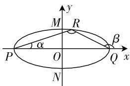

# 二级结论巧应用,椭圆问题妙拓展

——一道皖豫联考椭圆题的探究

山东省实验中学西校 刘荣权

破解圆锥曲线的一些选择题或填空题时,巧妙借用一些相应的二级结论,可以非常有效、快捷地切入,合理转化,正确破解.特别是涉及圆锥曲线的定义、性质、定值以及最值等一些相关的二级结论,结论简单,应用性广,若不直接掌握,解决问题时再去分析、推导,效益低,作用小.

# 一、问题呈现

问题 （2020 届皖豫联盟体高三第二次联考）已知椭圆 $C: \frac{x^{2}}{a^{2}} + \frac{y^{2}}{b^{2}} = 1 (a > b > 0)$ 与 x 轴交于 P, Q 两点，与 y 轴交于 M, N 两点，点 R 在椭圆 C 上， $\angle PRQ = 135^{\circ}$ , $\cos \angle RPQ = \frac{3\sqrt{10}}{10}$ ，且四边形 MPNQ 的面积为 $8\sqrt{6}$ ，则椭圆 C 的方程为（）.

A. $\frac{x^{2}}{24}+\frac{y^{2}}{4}=1$

B. $\frac{x^{2}}{12}+\frac{y^{2}}{8}=1$

C. $\frac{x^{2}}{16}+\frac{y^{2}}{6}=1$

D. $\frac{x^2}{18} +\frac{3y^2}{16} = 1$

此题以椭圆为载体,结合椭圆内接三角形中对应角的信息,并通过椭圆四顶点所围成的菱形的面积等条件,来确定椭圆的方程.利用三角形的信息,借助三角函数的相关知识以及解三角形来处理是破解问题的常见思维;而利用椭圆的第三定义显得更为简单快捷,关键是要掌握椭圆中一些相关的二级结论,方便用来处理一些相应的数学问题;而排除法的应用具有一定的特殊性,在特殊的选择题中有不错的效果.

# 二、问题破解

# 思维视角一: 直接思维

方法 1:(点的坐标转化法)

解析:由四边形 MPNQ 的面积为 $8\sqrt{6}$ ，可得 2ab = $8\sqrt{6}$ ，即 $ab = 4\sqrt{6}$ ，设 $\angle RPQ = \alpha, \angle RQP = \beta$ ，由 $\cos\alpha = \frac{3\sqrt{10}}{10}$ ，结合同角三角函数基本关系式可得 $\sin\alpha =$

$\sqrt{1-\cos^{2}\alpha}=\frac{\sqrt{10}}{10}$ ，而 $\angle PRQ=135^{\circ}$ ，那么 $\beta=180^{\circ}-\alpha-\angle PRQ=45^{\circ}-\alpha$ ，可得 $\sin\beta=\sin(45^{\circ}-\alpha)=\frac{\sqrt{5}}{5}>\frac{\sqrt{10}}{10}=\sin\alpha$ ，则有 $\beta>\alpha$ .

在 $\triangle PRQ$ 中，根据正弦定理，可得 $\frac{2a}{\sin\angle PRQ} = \frac{|RQ|}{\sin\alpha} = \frac{|PR|}{\sin\beta}$ ，整理有 $|RQ| = \frac{2\sqrt{5}}{5} a, |PR| = \frac{2\sqrt{10}}{5} a$ ，不失一般性，取点 $R$ 在第一象限，可得 $x_R = |PR| \cos \alpha - a = \frac{1}{5} a, y_R = |PR| \sin \alpha = \frac{2}{5} a$ ，将点 $R\left(\frac{1}{5} a, \frac{2}{5} a\right)$ 代入椭圆 $C$ 的方程，可得 $\frac{a^2}{25a^2} + \frac{4a^2}{25b^2} = 1$ ，结合 $ab = 4\sqrt{6}$ ，解得 $a^2 = 24, b^2 = 4$ ，所以椭圆 $C$ 的方程为 $\frac{x^2}{24} + \frac{y^2}{4} = 1$ ，故选择答案：A.

点评:根据四边形 MPNQ 的面积可以确定 a 与 b 的乘积,结合三角函数的相关公式以及正弦定理的转化,进而确定点 R 的坐标,代入椭圆 C 的方程又可以得到另一个 a 与 b 的关系式,从而联立得以确定参数值,求解对应的椭圆方程.破解的关键是巧妙利用条件来确定对应点的坐标问题.

# 思维视角二:二级结论思维

方法 2:(椭圆的第三定义法 1)

解析:由四边形 MPNQ 的面积为 $8\sqrt{6}$ ，可得 $2ab = 8\sqrt{6}$ ，即 $ab = 4\sqrt{6}$ ，设 $\angle RPQ = \alpha, \angle RQP = \beta$ ，由 $\cos\alpha = \frac{3\sqrt{10}}{10}$ ，结合同角三角函数基本关系式可得 $\sin\alpha = \sqrt{1 - \cos^{2}\alpha} = \frac{\sqrt{10}}{10}, \tan\alpha = \frac{\sin\alpha}{\cos\alpha} = \frac{1}{3}$ ，而 $\angle PRQ = 135^{\circ}$ ，那么 $\beta = 180^{\circ} - \alpha - \angle PRQ = 45^{\circ} - \alpha$ ，可得 $\tan\beta$

$= \tan (45^{\circ} - \alpha) = \frac{1 - \tan\alpha}{1 + \tan\alpha} = \frac{1}{2}$ , 不失一般性, 取点 $R$ 在第一象限, 根据椭圆的第三定义, 可得 $k_{RP} \cdot k_{RQ} = \tan \alpha \cdot (-\tan \beta) = -\frac{1}{6} = -\frac{b^{2}}{a^{2}}$ , 即 $a^{2} = 6b^{2}$ , 结合 $ab = 4\sqrt{6}$ , 解得 $a^{2} = 24, b^{2} = 4$ , 所以椭圆 $C$ 的方程为 $\frac{x^{2}}{24} + \frac{y^{2}}{4} = 1$ , 故选择答案: A.

点评:根据椭圆的第三定义,若A、B是关于坐标原点O对称的两点,P是椭圆 $C:\frac{x^{2}}{a^{2}}+\frac{y^{2}}{b^{2}}=1(a>b>0)$ 上异于A,B的一点,若 $k_{PA},k_{PB}$ 存在,则有 $k_{PA}\cdot k_{PB}=-\frac{b^{2}}{a^{2}}$ .借助椭圆的第三定义法,利用斜率与倾斜角关系来确定相应的斜率,进而得到参数的关系式,再利用相关条件联立得以确定参数值,求解对应的椭圆方程.破解的关键是分别确定两直线的斜率问题.

方法 3: (椭圆的第三定义法 2)

解析:由四边形 MPNQ 的面积为 $8\sqrt{6}$ ，可得 $2ab = 8\sqrt{6}$ ，即 $ab = 4\sqrt{6}$ ，设 $\angle RPQ = \alpha, \angle RQx = \beta$ ，如图 1 所示，由 $\cos\alpha = \frac{3\sqrt{10}}{10}$ ，结合同角

text_image

y
M
R
α
P
O
Q
x
β
N

图1

三角函数基本关系式可得 $\sin\alpha=\sqrt{1-\cos^{2}\alpha}=\frac{\sqrt{10}}{10}$ ，
则有 $\sin2\alpha=2\sin\alpha\cos\alpha=\frac{3}{5},\cos2\alpha=2\cos^{2}\alpha-1=\frac{4}{5}$ ，
根据椭圆的第三定义，可得 $k_{RP} \cdot k_{RQ} = \tan\alpha \cdot \tan\beta = -\frac{b^{2}}{a^{2}} = e^{2} - 1$ ，而 $\frac{\cos135^{\circ}}{\cos(2\alpha + 135^{\circ})} = \frac{1}{\cos2\alpha + \sin2\alpha} = \frac{5}{7}$ ，
又 $\frac{\cos135^{\circ}}{\cos(2\alpha+135^{\circ})}=\frac{\cos(\beta-\alpha)}{\cos(\beta+\alpha)}=\frac{\cos\beta\cos\alpha+\sin\beta\sin\alpha}{\cos\beta\cos\alpha-\sin\beta\sin\alpha}=\frac{1+\tan\beta\tan\alpha}{1-\tan\beta\tan\alpha}=\frac{e^{2}}{2-e^{2}}=\frac{5}{7}$ ，解得 $e^{2}=\frac{c^{2}}{a^{2}}=1-\frac{b^{2}}{a^{2}}=\frac{5}{6}$ ，即 $a^{2}=6b^{2}$ ，结合 $ab=4\sqrt{6}$ ，解得 $a^{2}=24, b^{2}=4$ ，所以椭圆 C 的方程为 $\frac{x^{2}}{24}+\frac{y^{2}}{4}=1$ ，故选择答案：A.

点评:根据椭圆的第三定义,确定 $\tan\alpha\cdot\tan\beta$ 的值,综合三角恒等变换公式,利用弦化切的转化与相应的代数运算,得到参数的关系式,再利用相关条件联立得以确定参数值,求解对应的椭圆方程.本质上还是抓住椭圆的第三定义加以分析与处理.

# 三、变式拓展

探究 1: 抓住原来问题的关键, 删除已知椭圆四顶点所围成的菱形的面积, 只保留对应的内接三角形中对应角的信息, 进而来求解椭圆的离心率问题, 得到以下变式:

变式 1: 已知椭圆 $C: \frac{x^{2}}{a^{2}} + \frac{y^{2}}{b^{2}} = 1 (a > b > 0)$ 与 x 轴交于 P, Q 两点，点 R 在椭圆 C 上， $\angle PRQ = 135^{\circ}$ ， $\cos \angle RPQ = \frac{3\sqrt{10}}{10}$ ，则椭圆 C 的离心率为 \_\_\_\_.

解析：设 $\angle RPQ = \alpha, \angle RQP = \beta$ ，由 $\cos\alpha = \frac{3\sqrt{10}}{10}$ ，结合同角三角函数基本关系式可得 $\sin\alpha = \sqrt{1 - \cos^2\alpha} = \frac{\sqrt{10}}{10}$ ，而 $\angle PRQ = 135^\circ$ ，那么 $\beta = 180^\circ - \alpha - \angle PRQ = 45^\circ - \alpha$ ，可得 $\sin\beta = \sin(45^\circ - \alpha) = \frac{\sqrt{5}}{5} > \frac{\sqrt{10}}{10} = \sin\alpha$ ，则有 $\beta > \alpha$ 。在 $\triangle PRQ$ 中，根据正弦定理，可得 $\frac{2a}{\sin\angle PRQ} = \frac{|RQ|}{\sin\alpha} = \frac{|PR|}{\sin\beta}$ ，整理有 $|RQ| = \frac{2\sqrt{5}}{5}a, |PR| = \frac{2\sqrt{10}}{5}a$ ，不失一般性，取点 $R$ 在第一象限，可得 $x_R = |PR| \cos\alpha - a = \frac{1}{5}a, y_R = |PR| \sin\alpha = \frac{2}{5}a$ ，将点 $R\left(\frac{1}{5}a, \frac{2}{5}a\right)$ 代入椭圆 $C$ 的方程，可得 $\frac{a^2}{25a^2} + \frac{4a^2}{25b^2} = 1$ ，整理有 $a^2 = 6b^2$ ，所以椭圆 $C$ 的离心率 $e = \frac{c}{a} = \sqrt{1 - \frac{b^2}{a^2}} = \frac{\sqrt{30}}{6}$ ，故填答案： $\frac{\sqrt{30}}{6}$ 。

# 四、解后反思

涉及圆锥曲线中一些相应的二级结论,其实质也是圆锥曲线的定义、方程与几何性质等相关内容的一部分,只是在此基本内容的基础上加以有效拓展、深入,从而形成一系列具有明显特点、容易记忆的涉及圆锥曲线的定义、性质、定值以及最值等内容的二级结论.系统理解与掌握圆锥曲线中一些相应的二级结论,可以进一步系统掌握相关的数学知识,有效提升数学知识与数学能力,拓展数学思维,培养数学核心素养.F