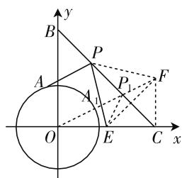

# 代数与几何齐飞,技能共素养一色

—— 一道向量综合题的剖析

山东省垦利第一中学 刘世彬

平面向量同时兼备“形”的形象与“数”的形式,破解时可以优先从这两个角度切入,也可以结合题目条件采用其他相关的方法来处理,充分借助平面向量这一知识平台,体现代数与几何的统一,技能与素养的综合.

平面向量同时兼备“形”的形象与“数”的形式，破解时可以优先从这两个角度切入，或从“形”的角度入手，结合几何的直观形象，通过几何特征或图形直观等形式来处理；或从“数”的角度入手，利用代数的运算形式，通过代数运算或坐标表示等形式来解决。当然碰到具体问题时，还可以结合题目条件采用其他相关的方法来处理，综合平面向量、平面几何、不等式等知识，结合平面向量的定义、性质、公式等，创新融合，合理交汇，综合应用，从而达到巧妙转化，正确破解的目的。

# 一、问题呈现

问题 （浙江省宁波市 2020 届高三上学期期末教学质量统一检测卷试题·17）已知 $\left|b\right|=\left|c\right|=k(k>\sqrt{2})$ , $b\cdot c=0$ , 若存在实数 $\lambda$ 及单位向量 a, 使得不等式 $\left|a-b+\lambda(b-c)\right|+\left|\frac{1}{2}c+(1-\lambda)(b-c)\right|\leqslant1$ 恒成立, 则实数 k 的最大值为 \_\_\_\_.

分析:本题题目较为复杂,平面向量个数也众多,综合平面向量的线性运算、绝对值以及不等式恒成立问题,还涉及多个参数以及最值问题.破解问题的关键在于,根据题目条件,由于存在实数 $\lambda$ 及单位向量a,使得不等式 $|a-b+\lambda(b-c)|+\left|\frac{1}{2}c+(1-\lambda)(b-c)\right|$ $\leqslant 1$ 恒成立，则原问题可以等价转化为 $\left\{\left|a-b+\lambda(b-c)\right|+\left|\frac{1}{2}c+(1-\lambda)(b-c)\right|\right\}_{\min}\leqslant$

1，进而通过确定 $|a - b + \lambda (b - c)| + \left|\frac{1}{2} c + (1 - \lambda)(b - c)\right|$ 的最小值问题来达到转化与分析的目的.

# 二、问题破解

方法 1: (几何法)

解析: 如图 1 所示, 以 O 为坐标原点, $c = \overrightarrow{OC}$ , $b = \overrightarrow{OB}$ 所在的直线分别为 x 轴、y 轴建立平面直角坐标系 xOy,设 $a=\overrightarrow{OA}$ ，其中点 A 在单位圆上，由于 $\left|a-b+\lambda(b-c)\right|+\left|\frac{1}{2}c+(1-\lambda)(b-c)\right|=|a-[(1-\lambda)b+\lambda c]|+\left|\frac{1}{2}c-[(1-\lambda)b+\lambda c]\right|=|AP|+|EP|$ ，其中点 E 为线段 OC 的中点，过点 E 作关于直线 BC 的对称点 F，那么结合“将军饮马”求解最小值的几何模型可得 $(|AP|+|EP|)_{\min}=|A_{1}F|=|OF|-1=\sqrt{|OC|^{2}+|FC|^{2}}-1=\frac{\sqrt{5}}{2}k-1$ ，根据题目条件可得 $\frac{\sqrt{5}}{2}k-1\leqslant1$ ，解得 $k\leqslant\frac{4\sqrt{5}}{5}$ ，所以实数 k 的最大值为 $\frac{4\sqrt{5}}{5}$ ，故填答案： $\frac{4\sqrt{5}}{5}$ .

text_image

y
B
P
A
A₁
P₁
F
O
E
C x

图 1

方法 2: (代数法)

解析:根据题目条件可设 $c=(k,0)$ , $b=(0,k)$ , $a=(\cos\theta,\sin\theta)$ , 那么

$$
\begin{array}{l} \left| \boldsymbol {a} - \boldsymbol {b} + \lambda (\boldsymbol {b} - \boldsymbol {c}) \right| + \left| \frac {1}{2} \boldsymbol {c} + (1 - \lambda) (\boldsymbol {b} - \boldsymbol {c}) \right| \\ = \sqrt {(\cos \theta - \lambda k) ^ {2} + (\sin \theta - k + \lambda k) ^ {2}} \\ + \sqrt {\left(\lambda - \frac {1}{2}\right) ^ {2} k ^ {2} + (1 - \lambda) ^ {2} k ^ {2}} \\ = \sqrt {\lambda^ {2} k ^ {2} - 2 \lambda k \cos \theta - 2 (1 - \lambda) k \sin \theta + (1 - \lambda) ^ {2} k ^ {2} + 1} \\ + k \sqrt {\left(\lambda - \frac {1}{2}\right) ^ {2} + (\lambda - 1) ^ {2}} \\ \end{array}
$$

$$
\begin{array}{l} = \sqrt {\lambda^ {2} k ^ {2} - 2 k \sqrt {\lambda^ {2} + (1 - \lambda) ^ {2}} \sin (\theta + \alpha) + (1 - \lambda) ^ {2} k ^ {2} + 1} \\ + k \sqrt {\left(\lambda - \frac {1}{2}\right) ^ {2} + (\lambda - 1) ^ {2}} \\ \geqslant k \sqrt {\lambda^ {2} + (\lambda - 1) ^ {2}} - 1 + k \sqrt {\left(\lambda - \frac {1}{2}\right) ^ {2} + (\lambda - 1) ^ {2}}, \\ \end{array}
$$

而由于存在实数 $\lambda$ 及单位向量 a，使得不等式

$$
\left| \boldsymbol {a} - \boldsymbol {b} + \lambda (\boldsymbol {b} - \boldsymbol {c}) \right| + \left| \frac {1}{2} \boldsymbol {c} + (1 - \lambda) (\boldsymbol {b} - \boldsymbol {c}) \right| \leqslant 1
$$

恒成立,则有

$$
k \leqslant \frac {2}{\sqrt {\lambda^ {2} + (\lambda - 1) ^ {2}} + \sqrt {\left(\lambda - \frac {1}{2}\right) ^ {2} + (\lambda - 1) ^ {2}}},
$$

又结合几何意义(“将军饮马”求解最小值的几何模型)可得

$$
\sqrt {\lambda^ {2} + (\lambda - 1) ^ {2}} + \sqrt {\left(\lambda - \frac {1}{2}\right) ^ {2} + (\lambda - 1) ^ {2}} \geqslant
$$

$\sqrt{\left(\frac{1}{2}\right)^{2}+1^{2}}=\frac{\sqrt{5}}{2}$ ，所以 $k\leqslant\frac{4\sqrt{5}}{5}$ ，所以实数k的最大值为 $\frac{4\sqrt{5}}{5}$ ，故填答案： $\frac{4\sqrt{5}}{5}$ .

方法 3: (绝对值不等式转化法)

解析:由于 $|b|=|c|=k(k>\sqrt{2})$ , $b\cdot c=0$ ,

$$
\begin{array}{l} k \sqrt {2 \lambda^ {2} - 2 \lambda + 1} = k \sqrt {2 \left(\lambda - \frac {1}{2}\right) ^ {2} + \frac {1}{2}} \geqslant \frac {\sqrt {2}}{2} k \geqslant 1 \\ = | \boldsymbol {a} |, \text {结合绝对值不等式，可得} | \boldsymbol {a} - \boldsymbol {b} + \lambda (\boldsymbol {b} - \boldsymbol {c}) | + \\ \left| \frac {1}{2} \boldsymbol {c} + (1 - \lambda) (\boldsymbol {b} - \boldsymbol {c}) \right| = | \boldsymbol {a} - [ (1 - \lambda) \boldsymbol {b} + \lambda \boldsymbol {c} ] | + \\ \left| (1 - \lambda) \boldsymbol {b} + \left(\lambda - \frac {1}{2}\right) \boldsymbol {c} \right| \geqslant | (1 - \lambda) \boldsymbol {b} + \lambda \boldsymbol {c} | - | \boldsymbol {a} | \\ + \left| (1 - \lambda) \boldsymbol {b} + \left(\lambda - \frac {1}{2}\right) \boldsymbol {c} \right| \geqslant k \sqrt {(1 - \lambda) ^ {2} + \lambda^ {2}} - 1 \\ \frac {2}{\sqrt {\lambda^ {2} + (\lambda - 1) ^ {2}} + \sqrt {\left(\lambda - \frac {1}{2}\right) ^ {2} + (\lambda - 1) ^ {2}}} \text {, 又结合} \\ \end{array}
$$

那么 $|(1 - \lambda)\pmb {b} + \lambda \pmb {c}| = k\sqrt{(1 - \lambda)^2 + \lambda^2} =$

$+k\sqrt{(1-\lambda)^{2}+\left(\lambda-\frac{1}{2}\right)^{2}}$ ，而由于存在实数 $\lambda$ 及单位向量 a，使得不等式 $\left|a-b+\lambda(b-c)\right|+\left|\frac{1}{2}c+(1-\lambda)(b-c)\right|\leqslant1$ 恒成立，则有 $k\leqslant$

几何意义(“将军饮马”求解最小值的几何模型)可得

$$
\sqrt {\lambda^ {2} + (\lambda - 1) ^ {2}} + \sqrt {\left(\lambda - \frac {1}{2}\right) ^ {2} + (\lambda - 1) ^ {2}} \geqslant
$$

$\sqrt{\left(\frac{1}{2}\right)^{2}+1^{2}}=\frac{\sqrt{5}}{2}$ ，所以 $k\leqslant\frac{4\sqrt{5}}{5}$ ，所以实数 k 的最大值为 $\frac{4\sqrt{5}}{5}$ ，故填答案： $\frac{4\sqrt{5}}{5}$ .

方法 4:(绝对值不等式性质法)

解析:由于 $|b|=|c|=k(k>\sqrt{2})$ , $b\cdot c=0$ ,

$$
\begin{array}{l} k \sqrt {2 \lambda^ {2} - 2 \lambda + 1} = k \sqrt {2 \left(\lambda - \frac {1}{2}\right) ^ {2} + \frac {1}{2}} \geqslant \frac {\sqrt {2}}{2} k \geqslant 1 \\ = | \boldsymbol {a} |, \text {根据绝对值不等式，可得} | \boldsymbol {a} - \boldsymbol {b} + \lambda (\boldsymbol {b} - \boldsymbol {c}) | + \\ \left| \frac {1}{2} \boldsymbol {c} + (1 - \lambda) (\boldsymbol {b} - \boldsymbol {c}) \right| = | \boldsymbol {a} - [ (1 - \lambda) \boldsymbol {b} + \lambda \boldsymbol {c} ] | + \\ \left| (1 - \lambda) \boldsymbol {b} + \left(\lambda - \frac {1}{2}\right) \boldsymbol {c} \right| \geqslant | (1 - \lambda) \boldsymbol {b} + \lambda \boldsymbol {c} | - | \boldsymbol {a} | \\ + \left| (1 - \lambda) \boldsymbol {b} + \left(\lambda - \frac {1}{2}\right) \boldsymbol {c} \right| = | (1 - \lambda) \boldsymbol {b} + \lambda \boldsymbol {c} | + \\ \mid a \mid + \mid b \mid \geqslant \max \{\mid a + b \mid , \quad \mid a - b \mid \}, \text {可得} \\ \left| (1 - \lambda) \boldsymbol {b} + \lambda \boldsymbol {c} \right| + \left| (1 - \lambda) \boldsymbol {b} + \left(\lambda - \frac {1}{2}\right) \boldsymbol {c} \right| = | \lambda \boldsymbol {b} + \\ (1 - \lambda) \boldsymbol {c} | + \left| (1 - \lambda) \boldsymbol {b} + \left(\lambda - \frac {1}{2}\right) \boldsymbol {c} \right| \geqslant \max \left\{\left| \frac {1}{2} \boldsymbol {c} \right|, \right. \\ \left| \frac {1}{2} \pmb {c} + (1 - \lambda) (\pmb {b} - \pmb {c}) \right| \leqslant 1 \text {恒成立,则有} \frac {\sqrt {5}}{2} k - 1 \leqslant \\ \end{array}
$$

那么 $|(1 - \lambda)\pmb {b} + \lambda \pmb {c}| = k\sqrt{(1 - \lambda)^2 + \lambda^2} =$

$\left|(1 - \lambda)\boldsymbol {b} + \left(\lambda -\frac{1}{2}\right)\boldsymbol {c}\right| - 1$ ，又由绝对值不等式性质

$\left|\boldsymbol {b} + \frac{1}{2}\boldsymbol {c}\right|\} = \max \left\{\frac{1}{2} k,\frac{\sqrt{5}}{2} k\right\} = \frac{\sqrt{5}}{2} k$ ，而由于存在实

数 $\lambda$ 及单位向量 $a$ ，使得不等式 $\left|a - b + \lambda (b - c)\right|+$

1, 解得 $k \leqslant \frac{4\sqrt{5}}{5}$ , 所以实数 $k$ 的最大值为 $\frac{4\sqrt{5}}{5}$ , 故填答

案: $\frac{4\sqrt{5}}{5}$ .

# 三、规律总结

结合一道创新性强、综合性多的平面向量题，借助平面向量的“形”、“数”的角度切入或从题目本身中所含有的绝对值不等式的角度切入，都可以达到破解与应用的目的，关键是仔细分析题意，认真研究内容，合理等价转化，进而从不同思维视角、不同知识方法等方面来破解，真正形成解题的思维习惯与破解方式，从而有效拓展能力，培养思维品质，充分体现数学中代数与几何的互联互通，达到数学技能与学科素养的完美统一。F