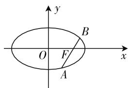
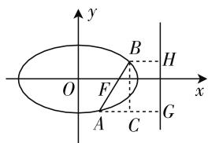

# 基于思想方法导向的解析几何课堂教学研究

# ● 江苏省江阴市青阳中学 邵炎清

解析几何是高中数学的重要内容,综合考查学生的几何与代数应用能力.传统的教学中重在习题训练,耗时较多但效果有限,一方面是由于学生在解决解析几何问题时方法单一,思路不灵活,拘泥于常规解法,增加了计算难度;另一方面是部分教师将重点放在解题上,没有引导学生深入思考解决解析几何问题的规律,也没有总结问题特征以及相应的思路方法.解析几何对学生的几何分析与代数运算综合能力要求较高,因此在教学时需要注重学生科学思想方法以及数学学科能力素养的培养.

# 一、数形结合思想方法

数形结合思想的本质就是将抽象的数学符号语言与直观的图形信息有机融合,实现复杂问题的简单化、抽象问题的形象化,优化求解过程.一方面,数形结合思想方法可以通过几何图形辅助代数运算,借助图形的直观性确定运算方法;另一方面,数形结合可以将一些几何问题通过构建坐标系、构建方程等方式转化为代数运算,计算后再将结果回归几何问题.

【案例 1】设 F 为椭圆 $C: \frac{x^{2}}{a^{2}} + \frac{y^{2}}{b^{2}} = 1 (a > b > c)$ 的右焦点，过 F 的弦 AB (A 在 x 轴下方，如图 1)，弦 AB 的斜率为 $\sqrt{3}$ ，如果 $\overrightarrow{AF} = 2\overrightarrow{FB}$ ，求椭圆 C 的离心率 e.

text_image

y
B
O F x
A

图 1

text_image

y
O
F
A
C
G
H
B
x

图2

解析:采用常规思路,可以设 $A(x_{1},y_{1}), B(x_{2},y_{2})$ , 利用 $\overrightarrow{AF}=2\overrightarrow{FB}$ , 可以得到 $y_{1}=-2y_{2}$ , 然后将弦 AB 所在直线的方程 $y=\sqrt{3}(x-c)$ 与椭圆方程 $\frac{x^{2}}{a^{2}}+\frac{y^{2}}{b^{2}}=1$ 联立, 整理出关于 y 的二次方程, 结合韦达定理与 $y_{1}=-2y_{2}$ , 可以整理出关于 a, b, c 的等量关系, 进而计算出离心率 e. 这种代数运算思路易理解, 但运算步骤相对较多,技巧运用要求高,学生极易出现计算失误.根据椭圆第二定义的几何特性,可以得到更加优化的解法.

过 A, B 两点分别作右准线的垂线于 H, G, 过 B 作 AG 的垂线于 C (如图 2), 可知 Rt△ABC 中, ∠BAC = 60°, 设 BF = t, 则 AF = 2t, BH = $\frac{t}{e}$ , AG = $\frac{2t}{e}$ , 所以 AC = AG - BH = $\frac{t}{e}$ , 在 Rt△ABC 中, ∠BAC = 60°, AB = 2AC, 可得 3t = 2 $\frac{t}{e}$ , 解得 $e = \frac{2}{3}$ .

总结:数形结合思想即通过计算解析图形的几何关系,通过图形几何特性简化运算,数形合一.利用圆锥曲线定义几何意义,发现直线与圆锥曲线位置的几何特性,构造特殊的三角形与四边形,减少运算量的同时,具体形象,更有助于学生理解图形.

# 二、函数与方程思想方法

函数与方程的概念在高中数学内容体系中占据重要的地位,两者存在密切的联系,可以实现相互转化.在解析几何教学中,利用函数与方程的思想方法可以加深学生对数学问题本质的理解,有效实现“以数解形”的教学目标.

【案例 2】已知圆 C 的圆心 C 位于抛物线 $x^{2}=2y$ 上，与直线 $l:2x+2y+3=0$ 相切，试求解所有满足条件的圆中面积最小的圆的方程.

解析:在解析几何中,处理最值问题时,往往需要借助函数与方程的思想方法,根据函数的最值求解来确定相应的几何要素.假设圆心C的坐标为 $\left(t,\frac{t^{2}}{2}\right)$ ,因为圆C与直线l相切,所以圆C的半径r就是C点到直线l的距离, $r=\frac{\left|2t+t^{2}+3\right|}{\sqrt{2^{2}+2^{2}}}=\frac{\left|(t+1)^{2}+2\right|}{2\sqrt{2}}\geqslant\frac{\sqrt{2}}{2}$ ,因此当t=-1时,圆C的半径r取得最小值 $\frac{\sqrt{2}}{2}$ ,此时圆C的方程为 $(x+1)^{2}+\left(y-\frac{1}{2}\right)^{2}=\frac{1}{2}$ .

总结: 在解析几何问题中, 直线交点、直线与圆锥曲线的公共点等问题都可以通过求解方程组的方式解决. 反之, 也可以通过方程或方程组理解直线与圆锥曲线之间的位置关系. 另一类适用函数与方程方法的问题就是参数范围或者最值问题, 通过已知以及隐含的关系, 构建方程或函数, 将原问题转化为对方程解的计算或函数值域的求解.

# 三、分类讨论思想方法

在解析几何问题的求解过程中,由于对象的复杂性,如果无法对相关对象进行统一研究,就可以通过分类讨论的思想方法,将研究对象划分为不同的层次分别开展研究,针对不同的情况得出相应的结论,最后进行归类.

【案例 3】已知直线 $l_{1}: ax - ky + k = 0, l_{2}: kx - y - 1 = 0, a$ 为常数且不为 0，试求解直线 $l_{1}$ 与 $l_{2}$ 交点的轨迹方程、焦点以及离心率.

解析:这是一个圆锥曲线轨迹求解问题,将直线 $l_{1}$ 与 $l_{2}$ 方程进行联立,消去参数k,得到 $y^{2}-ax^{2}=1$ .很多学生忽略了a的正负问题,导致解答不全面,因此需要针对a的取值范围进行分类讨论.

当 $a > 0$ 时，曲线的轨迹为双曲线，焦点为 $\left(0, -\sqrt{1 + \frac{1}{a}}\right)$ 以及 $\left(0, \sqrt{1 + \frac{1}{a}}\right)$ ，离心率 $e = \sqrt{1 + \frac{1}{a}}$ ；当 $-1 < a < 0$ 时，曲线的轨迹为椭圆，焦点为 $\left(-\sqrt{-1 - \frac{1}{a}}, 0\right)$ 以及 $\left(\sqrt{-1 - \frac{1}{a}}, 0\right)$ ，离心率 $e = \sqrt{1 + a}$ ；当 $a = -1$ 时，曲线的轨迹为圆，圆心为 $(0, 0)$ ，半径为 $1$ ；当 $a < -1$ 时，曲线的轨迹为椭圆，焦点为 $\left(0, -\sqrt{1 + \frac{1}{a}}\right)$ 以及 $\left(0, \sqrt{1 + \frac{1}{a}}\right)$ ，离心率 $e = \sqrt{1 + \frac{1}{a}}$ 。

总结:在高中解析几何中,常见的需要分类讨论的情况主要包括:①关于点、直线、曲线等几何要素之间相互位置关系不确定而进行的分类讨论;②在处理含参数问题时,结果会随着参数的不同而发生变化时,就需要对参数进行分类讨论;③根据圆锥曲线的特点,圆锥曲线上的动点或是变量具备有界性,转化为函数的定义域进行分类讨论.

# 四、化归思想方法

在研究解析几何问题时,如果不能通过常规的思路进行求解,可以借助化归的思想方法,将该问题转化为容易求解或者熟悉的问题,降低求解难度.该思想的实质就是将陌生的问题熟悉化、抽象的问题直观化、复杂的问题简单化、实际的问题模型化.在数学学习与解题时,分析与求解数学问题本质上就属于化归与转化的过程.

【案例4】设椭圆 $x^{2} + \frac{y^{2}}{4} = 1$ 中，左、右顶点分别为 $A$ 与 $B$ ，双曲线 $C$ 的方程为 $x^{2} - \frac{y^{2}}{4} = 1$ ，第一象限双曲线上有一点 $P$ ，已知直线 $AP$ 与椭圆相交于另一点 $T.$ 设 $\triangle TAB$ 与 $\triangle POA$ 的面积分别为 $S_{1}$ 与 $S_{2}$ ，满足 $\overrightarrow{PA}$ · $\overrightarrow{PB}\leqslant 15$ ，试求解 $S_1^2 -S_2^2$ 的取值范围.

解析:设点 P 的坐标为 $(x_{1}, y_{1})$ ，点 T 的坐标为 $(x_{2}, y_{2})$ ，由 $\overrightarrow{PA} \cdot \overrightarrow{PB} \leqslant 15$ 以及 P 点位于第一象限可知 $x_{1} \in (1, 2]$ ，根据三角形的面积公式，可以得到 $S_{1}^{2} - S_{2}^{2} = y_{2}^{2} - \frac{y_{1}^{2}}{4} = 5 - x_{1}^{2} - 4x_{2}^{2}$ ，在这一步的基础上，很多学生会按照 $x_{1}$ 的取值范围以及 $x_{1}$ 与 $x_{2}$ 的关系来求解这一表达式的取值范围，但是由于是双变量，很难求解，因此可以转换思路，采用化归的方法求解。令 $m = x_{1}^{2}$ ，可得 $m \in (1, 4]$ 。设直线 AP 的方程为 $y = k(x + 1)$ ，将其代入椭圆方程，求得 $x_{2}$ ；同理，将直线 AT 的方程代入椭圆方程，求得 $x_{1}$ ，可得 $x_{1} \cdot x_{2} = 1$ ，即 $x_{2} = \frac{1}{x_{1}}$ ，因此 $S_{1}^{2} - S_{2}^{2} = 5 - t - \frac{4}{t}$ ，进而很容易求解得到 $S_{1}^{2} - S_{2}^{2}$ 的取值范围为 [0, 1]。

总结:在双变量取值范围求解难度较大时,将问题转化成一般的函数值域问题,通过求导的方法判断函数单调性,进而确定最值,大大简化了求解难度.本题的难点就在于化归思想的应用,如何将看似复杂的问题进行转化,使其变为简单或熟悉的问题.

# 五、结语

综上所述,通过对典型问题进行整理、总结与深入挖掘,进行有效的思想方法组织,能够将课堂教学转变为多维度的探究空间,加深学生对知识本质的理解,有效训练并提升学生的数学思维,强化学生的数据分析、运算、逻辑推理等数学核心素养.高中数学课程具有较强的整体性,在教学时教师要充分理解课程的性质与理念,把握课程目标,整体认识课程内容结构,科学设计并实施教学活动.对数学课堂进行整体把握可以加强对数学知识脉络的梳理,抓住问题的本质,明确解决问题的思想方法,构建合理、有效的课堂教学路径.F