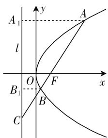

# 巧交汇,妙拓展

—— 对一道抛物线题的探究

● 广西南宁市第四十三中学 青冬华

直线与抛物线的位置关系是直线与圆锥曲线的位置关系中最特殊的场景之一, 是解析几何中交汇融合度大、综合性强、能力要求高的内容之一, 一直是历年高考数学的考查重点和热点, 倍受命题者的青睐.

# 一、问题呈现

问题 （2020 届广西某市高三第一学期期末测试）点 F 为抛物线 $y^{2}=2px (p>0)$ 的焦点，l 为其准线，过 F 的一条直线与抛物线交于 A, B 两点，与 l 交于点 C. 已知点 B 在线段 CF 上， $|BF|$ ， $|AF|$ ， $|BC|$ 可以适当排成一个等差数列，则 $\frac{|BC|}{|BF|}$ 所有可能值的和为（）.

A. 2

B. 3

C. 4

D. 5

此题以直线与抛物线的位置关系构成问题场景,结合等差数列来描述共线线段长度的等量关系,巧妙设置,合理融合,模型基础,结构简单,内涵丰富,是圆锥曲线命题中的上佳之作.破解的关键是巧妙利用抛物线的定义加以转化,再结合三线段可以适当排成一个等差数列加以分类讨论,进而建立相应的关系式,构建数量之间的关系,从而得以确定对应线段的比值.

# 二、问题破解

方法 1:(角参法)

解析:由题意可设直线 AB 与 x 轴所成的锐夹角为 $\theta$ , 如图 1 所示, 又点 B 在线段 CF 上, 则知

$$
\mid A F \mid > \quad \mid B F \mid , \quad \mid B C \mid >
$$

$$
| B F |, \text {而} | A F | = {\frac {p}{1 - \cos \theta}},
$$

$|BF|=\frac{p}{1-\cos(\pi-\theta)}=\frac{p}{1+\cos\theta}$ ，结合定义可得

text_image

A₁
l
O
F
x
B₁
B
C
y
A

图1

$$
| B C | = \frac {| B F |}{\cos \theta} = \frac {p}{(1 + \cos \theta) \cos \theta}.
$$

(1) 若 $\left|AF\right| + \left|BF\right| = 2\left|BC\right|$ ，则有 $\frac{p}{1 - \cos\theta} + \frac{p}{1 + \cos\theta} = \frac{2p}{(1 + \cos\theta)\cos\theta}$ ，整理可得 $\cos\theta = \frac{1}{2}$ ，所以 $\frac{\left|BC\right|}{\left|BF\right|} = \frac{1}{\cos\theta} = 2;$   
(2) 若 $\left|BF\right| + \left|BC\right| = 2\left|AF\right|$ ，则有 $\frac{p}{1 + \cos\theta} + \frac{p}{(1 + \cos\theta)\cos\theta} = \frac{2p}{1 - \cos\theta}$ ，整理可得 $\cos\theta = \frac{1}{3}$ ，所以 $\frac{\left|BC\right|}{\left|BF\right|} = \frac{1}{\cos\theta} = 3.$

综上分析, 可得 $\frac{|BC|}{|BF|}=2$ 或 $\frac{|BC|}{|BF|}=3$ , 那么 $\frac{|BC|}{|BF|}$ 所有可能值的和为 $2+3=5$ , 故选择答案: D.

方法 2:(坐标参数法)

解析: 由于点 B 在线段 CF 上, 则知 $\left|AF\right| > \left|BF\right|$ , $\left|BC\right| > \left|BF\right|$ , 设 $A(x_{1}, y_{1}), B(x_{2}, y_{2})$ , 其中 $x_{1} > x_{2}$ , 结合焦半径的定义可得 $\left|AF\right| = x_{1} + \frac{p}{2}$ , $\left|BF\right| = x_{2} + \frac{p}{2}$ , $\left|AB\right| = \left|AF\right| + \left|BF\right| = x_{1} + x_{2} + p$ , 结合图像以及相似三角形的性质可得 $\frac{\left|BC\right|}{\left|BC\right| + \left|AB\right|} = \frac{\left|BF\right|}{\left|AF\right|}$ , 可得 $\left|BC\right| = \frac{\left|BF\right|}{\left|AF\right| - \left|BF\right|}$

$$
\cdot | A B | = \frac {x _ {2} + \frac {p}{2}}{x _ {1} - x _ {2}} (x _ {1} + x _ {2} + p).
$$

(1) 若 $\left|AF\right| + \left|BF\right| = 2\left|BC\right|$ ，则有 $x_{1} + x_{2} + p = 2 \cdot \frac{x_{2} + \frac{p}{2}}{x_{1} - x_{2}} (x_{1} + x_{2} + p)$ ，整理可得 $x_{1} = 3x_{2} + p$ ，

所以 $\frac{|BC|}{|BF|}=\frac{\frac{x_{2}+\frac{p}{2}}{x_{1}-x_{2}}\cdot(x_{1}+x_{2}+p)}{x_{2}+\frac{p}{2}}=\frac{x_{1}+x_{2}+p}{x_{1}-x_{2}}$ $=\frac{4x_{2}+2p}{2x_{2}+p}=2;$

(2) 若 $\left|BF\right| + \left|BC\right| = 2\left|AF\right|$ ，则有 $x_{2} + \frac{p}{2} + \frac{x_{2} + \frac{p}{2}}{x_{1} - x_{2}} (x_{1} + x_{2} + p) = 2 \left(x_{1} + \frac{p}{2}\right)$ ，整理可得 $x_{1} = 2x_{2} + \frac{p}{2}$ ，所以 $\frac{\left|BC\right|}{\left|BF\right|} = \frac{\frac{x_{2} + \frac{p}{2}}{x_{1} - x_{2}} \cdot (x_{1} + x_{2} + p)}{x_{2} + \frac{p}{2}} = \frac{x_{1} + x_{2} + p}{x_{1} - x_{2}} = \frac{3x_{2} + \frac{3}{2}p}{x_{2} + \frac{p}{2}} = 3.$

综上分析, 可得 $\frac{|BC|}{|BF|}=2$ 或 $\frac{|BC|}{|BF|}=3$ , 那么 $\frac{|BC|}{|BF|}$ 所有可能值的和为 $2+3=5$ , 故选择答案: D.

点评:由于直线过抛物线的焦点,根据抛物线的定义,结合焦点弦问题与焦半径问题,可以多角度切入,多思维处理.或引入角参,借助极坐标来表示焦半径;或引入坐标参数,借助对应点的横坐标来表示焦半径;或引入比例参数,借助比例关系来表示焦半径;再结合三角形的相似关系建立关系式,并利用等差数列的性质来分析,从而得以确定参数的关系,代入即可确定比值.

# 三、变式拓展

探究 1: 保留题目条件, 直接改变原来求解 “ $\frac{|BC|}{|BF|}$ 所有可能值的和” 为 “ $\frac{|BC|}{|BF|}$ 的可能值”, 变原来一个答案为多个答案, 得以简单变式:

变式 1: 点 F 为抛物线 $y^{2}=2px(p>0)$ 的焦点，l 为其准线，过 F 的一条直线与抛物线交于 A, B 两点，与 l 交于点 C. 已知点 B 在线段 CF 上， $|BF|$ ， $|AF|$ ， $|BC|$ 可以适当排成一个等差数列，则 $\frac{|BC|}{|BF|}$ 的可能值为 \_\_\_\_.

解析:根据以上问题的破解过程,可知 $\frac{|BC|}{|BF|}=2$ 或 $\frac{|BC|}{|BF|=3}$ ,故填答案:2或3.

探究 2: 保留题目条件, 直接改变原来求解 “ $\frac{|BC|}{|BF|}$ 所有可能值的和” 为“直线 AB 的倾斜角的余弦值”, 改变问题求解的角度, 从另一个角度加以变式:

变式 2: 点 F 为抛物线 $y^{2}=2px(p>0)$ 的焦点，l 为其准线，过 F 的一条直线与抛物线交于 A, B 两点，与 l 交于点 C. 已知点 B 在线段 CF 上， $|BF|$ ， $|AF|$ ， $|BC|$ 可以适当排成一个等差数列，则直线 AB 的倾斜角的余弦值为 \_\_\_\_.

解析:根据以上问题的方法1中角参法的破解过程,可知 $\cos\theta=\frac{1}{2}$ 或 $\cos\theta=\frac{1}{3}$ , 故填答案: $\frac{1}{2}$ 或 $\frac{1}{3}$ .

探究 3: 保留题目条件, 在变式 2 的基础上, 改变原来求解“直线 AB 的倾斜角的余弦值”为“直线 AB 的斜率”, 更加适合普通问题的设问方式, 从更深层次方面加以变式:

变式 3: 点 F 为抛物线 $y^{2}=2px(p>0)$ 的焦点，l 为其准线，过 F 的一条直线与抛物线交于 A, B 两点，与 l 交于点 C. 已知点 B 在线段 CF 上， $|BF|$ ， $|AF|$ ， $|BC|$ 可以适当排成一个等差数列，则直线 AB 的斜率为 \_\_\_\_.

解析:根据以上问题的方法1中角参法的破解过程,可知 $\cos\theta=\frac{1}{2}$ 或 $\cos\theta=\frac{1}{3}$ , 结合同角三角函数的基本关系式, 可得 $k=\tan\theta=\sqrt{3}$ 或 $k=\tan\theta=2\sqrt{2}$ , 故填答案: $\sqrt{3}$ 或 $2\sqrt{2}$ .

# 四、解后反思

巧妙把“圆锥曲线”这一解析几何知识与“数列”这一代数知识加以合理交汇，有效链接起几何与代数的知识交叉、渗透和综合，利用“ $|BF|$ ， $|AF|$ ， $|BC|$ 可以适当排成一个等差数列”这一开放性的条件为线段长度之间的关系式提供不同的情况，设置巧妙合理，开拓问题角度，是知识交汇与思想方法融合的一个典型的好素材，能很好地考查相关的数学知识，同时注重提高分析问题和解决问题的综合能力，提升数学品质，培养数学核心素养。W