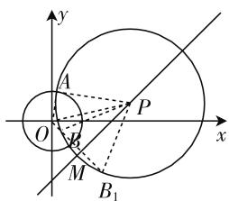
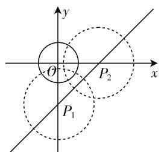

# 开拓思维,变式拓展

—— 一道江苏直线与圆的位置关系题的探究

● 江苏省张家港市乐余高级中学 柳艳秋

直线与圆是解析几何中的最简单的图形,又是平面几何中的基本图形,两者之间的位置关系问题有效链接起初中与高中的相关知识,同时又涵盖函数与方程、数形结合等基本数学思想. 直线与圆的位置关系问题往往可以通过位置关系的判定,参数、弦长、最值的求解,性质的应用,动态问题的分析以及轨迹问题的探究、定点或存在性等开放性问题的应用来设置,一直是各级各类考试的必考内容和热点内容之一,要引起高度重视.

# 一、问题呈现

问题 （2020届江苏省镇江市高三上学期第一次调研考试(期末)数学试题·13）过直线 l: y = x - 2 上任意一点 P 作圆 $C: x^{2} + y^{2} = 1$ 的一条切线，切点为 A，若存在定点 $B(x_{0}, y_{0})$ ，使得 PA = PB 恒成立，则 $x_{0} - y_{0} =$ \_\_\_\_ .

此题以直线与圆的位置关系为问题背景,涉及定点的存在性问题,综合性强,创新度高,难度较大.破解的关键就是求解定点 $B(x_{0},y_{0})$ 的坐标,可以利用点P的坐标的设置,结合方程思维来处理;可以利用几何作图,先确定定点B的位置再求解其坐标,结合几何思维来处理;可以利用定点B的特点,通过特殊点与特殊圆的确定来求解,结合特殊思维来处理;还可以借助“两圆的根轴”的几何意义,通过两直线方程的对比,结合几何意义思维来处理.处理思维方式不唯一,对分析问题的能力,以及解析几何、平面几何的基本知识要求比较高.

# 二、问题破解

# 思维视角一:方程思维

方法 1:(直线性质转化法)

解析:设 $P(x,y)$ ，由 PA=PB，可得 $PA^{2}=PB^{2}$ ，则有 $PO^{2}-1=PB^{2}$ ，那么 $x^{2}+y^{2}-1=(x-x_{0})^{2}+(y-y_{0})^{2}$ ，整理可得 $y=-\frac{x_{0}}{y_{0}}x+\frac{x_{0}^{2}+y_{0}^{2}+1}{2y_{0}}$ ，而点

P 为直线 l: y = x - 2 上任意一点，则有 $\left\{\begin{aligned}-\frac{x_{0}}{y_{0}}&=1,\\ \frac{x_{0}^{2}+y_{0}^{2}+1}{2y_{0}}&=-2,\end{aligned}\right.$ 将 $x_{0}=-y_{0}$ 代入 $\frac{x_{0}^{2}+y_{0}^{2}+1}{2y_{0}}$ $=-2$ ，整理并解得 $y_{0}=\frac{-2\pm\sqrt{2}}{2}$ ，所以 $x_{0}-y_{0}=-2y_{0}=2\pm\sqrt{2}$ ，故填答案： $2\pm\sqrt{2}$ .

方法 2:(恒成立转化法)

解析:由于点P为直线l:y=x-2上任意一点,可设 $P(a,a-2)$ ,由PA=PB,可得 $PA^{2}=PB^{2}$ ,则有 $PO^{2}-1=PB^{2}$ ,那么 $a^{2}+(a-2)^{2}-1=(x_{0}-a)^{2}+(y_{0}-a+2)^{2}$ ,整理可得 $(x_{0}^{2}+y_{0}^{2}+4y_{0}+1)-2a(x_{0}+y_{0})=0$ ,由于点P为直线l:y=x-2上任意一点,则a具有任意性,那么 $\left\{\begin{aligned}x_{0}^{2}+y_{0}^{2}+4y_{0}+1=0,\\ x_{0}+y_{0}=0,\end{aligned}\right.$ 将 $x_{0}=-y_{0}$ 代入 $x_{0}^{2}+y_{0}^{2}+4y_{0}+1=0$ ,整理并解得 $y_{0}=\frac{-2\pm\sqrt{2}}{2}$ ,所以 $x_{0}-y_{0}=-2y_{0}=2\pm\sqrt{2}$ ,故填答案:

$2 \pm \sqrt{2}.$

# 思维视角二:几何思维

方法 3: (几何构造法)

解析:如图1所示,PA为圆C的切线,过原点坐标O作OM⊥直线l,垂足为M,连接OP、OA,可得OA=1,

text_image

y
A
O
P
x
M
B₁

图1

$OM = \sqrt{2}$ , 利用勾股定理可得 $\left\{ \begin{array}{l} PA^2 + OA^2 = OP^2, \\ PM^2 + OM^2 = OP^2, \end{array} \right.$ 即 $\left\{ \begin{array}{l} PA^2 + 1 = OP^2, \\ PM^2 + 2 = OP^2, \end{array} \right.$ 则有 $PA^2 = PM^2 + 1$ , 在 $OM$ 上 (或在其延长线上) 取一点 $B$ , 使得 $BM = 1$ , 则有 $PB^2 = PM^2 + 1$ , 此时满足 $PA = PB$ 恒成立, 即点 $B$ 为所求的定点, 当定点 $B(x_0, y_0)$ 在 $OM$ 上时, 此时 $OB = \sqrt{2}$ -1，且直线 OB 的方程为 y = -x，则有 $\left\{\begin{aligned}x_{0}^{2}+y_{0}^{2}&=(\sqrt{2}-1)^{2},\\ y_{0}&=-x_{0},\end{aligned}\right.$ 解得 $\left\{\begin{aligned}x_{0}&=1-\frac{\sqrt{2}}{2},\\ y_{0}&=-1+\frac{\sqrt{2}}{2},\end{aligned}\right.$ 可得 $x_{0}$ $-y_{0}=2-\sqrt{2}$ ; 当定点 $B(x_{0},y_{0})$ 在 OM 的延长线上时，同理可得 $x_{0}-y_{0}=2+\sqrt{2}$ . 综上分析，所以 $x_{0}-y_{0}=2\pm\sqrt{2}$ ，故填答案： $2\pm\sqrt{2}$ .

# 思维视角三: 特殊思维

方法 4:(特殊点处理法)

解析：由于存在定点 $B(x_{0},y_{0})$ ，使得PA=PB恒成立，则知点B在以点P为圆心，PA为半径的圆上，且是这些圆的公共点，如图2所示，不失一般性，不妨在直线 l: y = x - 2 上取特殊的两点 $P_{1}(0, -2)$ , $P_{2}(2, 0)$ ，此时分别作圆 C 的切线，可得 $PA = \sqrt{2^{2} - 1^{2}} = \sqrt{3}$ ，则可得圆 $P_{1}$ 的方程为 $x^{2} + (y + 2)^{2} = 3$ ，圆 $P_{2}$ 的方程为 $(x - 2)^{2} + y^{2} = 3$ ，联立 $\left\{\begin{aligned} x^{2} + (y + 2)^{2} &= 3, \\ (x - 2)^{2} + y^{2} &= 3, \end{aligned}\right.$ 解得

text_image

y
θ
P₂
x
P₁

图2

$\left\{ \begin{array}{l} x = 1 + \frac{\sqrt{2}}{2}, \\ y = -1 - \frac{\sqrt{2}}{2} \end{array} \right.$ 或 $\left\{ \begin{array}{l} x = 1 - \frac{\sqrt{2}}{2}, \\ y = -1 + \frac{\sqrt{2}}{2}, \end{array} \right.$ 所以 $x_0 - y_0 = 2 \pm$ $\sqrt{2}$ , 故填答案: $2 \pm \sqrt{2}$ .

# 思维视角四:几何意义思维

方法 5: (“两圆的根轴” 法)

解析:设 $P(x,y)$ ，由 PA=PB，可得 $PA^{2}=PB^{2}$ ，则有 $PO^{2}-1=PB^{2}$ ，结合“两圆的根轴”的几何意义知点 P 的轨迹就是两圆的根轴，那么 $x^{2}+y^{2}-1=(x-x_{0})^{2}+(y-y_{0})^{2}$ ，整理可得 $2x_{0}x+2y_{0}y-x_{0}^{2}-y_{0}^{2}-1=0$ ，根据“两圆的根轴”的几何意义知 $2x_{0}x+2y_{0}y-x_{0}^{2}-y_{0}^{2}-1=0$ 即为直线 x-y-2=0 的方程，所以有 $\frac{2x_{0}}{1}=\frac{2y_{0}}{-1}=\frac{-x_{0}^{2}-y_{0}^{2}-1}{-2}$ ，解得$\left\{ \begin{array}{l} x_{0} = 1 - \frac{\sqrt{2}}{2}, \\ y_{0} = -1 + \frac{\sqrt{2}}{2} \end{array} \right.$ 或 $\left\{ \begin{array}{l} x_{0} = 1 + \frac{\sqrt{2}}{2}, \\ y_{0} = -1 - \frac{\sqrt{2}}{2}, \end{array} \right.$ 所以 $x_{0} - y_{0} = 2 \pm$

$\sqrt{2}$ ，故填答案： $2 \pm \sqrt{2}$ .

# 三、变式拓展

探究 1: 以上问题的破解关键就是确定定点 B 的坐标,从而定点 B 的坐标的求解可以作为一个基本的变式拓展题:

变式 1: 过直线 l: y = x - 2 上任意一点 P 作圆 C: $x^{2} + y^{2} = 1$ 的一条切线，切点为 A，若存在定点 B，使得 PA = PB 恒成立，则定点 B 的坐标为 \_\_\_\_.

解析:根据以上问题的破解过程,可知定点 B 的坐标为 $\left(1-\frac{\sqrt{2}}{2},-1+\frac{\sqrt{2}}{2}\right)$ 或 $\left(1+\frac{\sqrt{2}}{2},-1-\frac{\sqrt{2}}{2}\right)$ ，故填答案: $\left(1-\frac{\sqrt{2}}{2},-1+\frac{\sqrt{2}}{2}\right)$ 或 $\left(1+\frac{\sqrt{2}}{2},-1-\frac{\sqrt{2}}{2}\right)$ .

点评: 直接确定定点 B 的坐标时, 经常可以借助特殊思维, 利用特殊点法来处理, 但在求解过程中往往容易遗漏, 缺失当中的一个定点坐标的求解, 因而在求解过程中要加以重视, 数形结合, 正确求解.

探究2:在定点B的坐标确定的基础上,可以进一步对定点加以深入分析与探讨,从而得到相关的变式拓展题:

变式 2: 过直线 l: y = x - 2 上任意一点 P 作圆 C: $x^{2} + y^{2} = 1$ 的一条切线，切点为 A，若存在定点 B，使得 PA = PB 恒成立，则定点 B 之间的距离之和为 \_\_\_\_.

解析:根据以上问题的破解过程,可知定点 B 的坐标为 $\left(1-\frac{\sqrt{2}}{2},-1+\frac{\sqrt{2}}{2}\right)$ 或 $\left(1+\frac{\sqrt{2}}{2},-1-\frac{\sqrt{2}}{2}\right)$ ，那么定点 B 之间的距离之和为 $\sqrt{\left(1-\frac{\sqrt{2}}{2}-1-\frac{\sqrt{2}}{2}\right)^{2}+\left(-1+\frac{\sqrt{2}}{2}+1+\frac{\sqrt{2}}{2}\right)^{2}}=2$ ，故填答案:2.

点评:通过变式题的设置,无法直接确定定点B的个数,因而要加以“定点B之间的距离之和”的叙述,可以是一个定点,此时答案为0;若两个或多个定点,就确定相应的距离之和问题.破解此变式的关键也是确定定点B的坐标,再利用两点间的距离公式来分析与求解.

# 四、解后反思

通过以上直线与圆的位置关系的典型问题的“一题多思”“一题多解”“一题多变”等探究，可以使得我们的解题思维更加开阔，解题思路更加活跃，数学知识的掌握更加熟练，问题的破解更加快速有效。同时不断挖掘问题的本质属性，开拓思维，整合知识，提升解题速度，培养发散思维能力与数学解题能力，有助于激发我们学习的积极性、主动性和趣味性，从而全面提高我们的知识水平和思维能力，养成良好的数学品质，培养数学核心素养。F