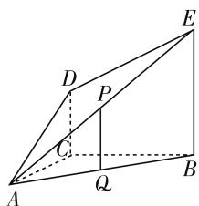
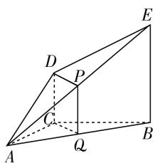
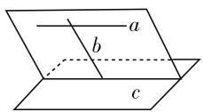
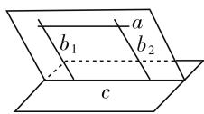

# 探寻几何发散思维本质 提高数学逻辑抽象能力

● 江苏省如东高级中学 杨书峰

相比于初中数学,高中数学更加考验学生的逻辑思维和抽象思维能力,尤其是数学知识中的几何知识内容.对于学生来讲,几何知识尤其考验学生的抽象、空间思维能力,对学生的抽象发散思考能力提出了新的要求.为了让学生学好几何知识,高中教师需要采用多种教学引导方式,促使学生对数学几何知识的兴趣有所提升,并逐渐增强学生对几何知识的理解与掌握能力,提升高中生的数学学习能力,以提升高中数学的教学质量.

高中数学知识涉及的范围及难度相比初中数学有明显拓展和提升. 对此, 学生需要掌握的数学学习能力与技巧也相对较多. 高中几何知识是高中数学的必学内容, 也是高考的必考点. 基于此, 教师需要培养学生几何发散、抽象思考的学习能力, 以进一步促使学生更好掌握此类知识内容. 本文将对此展开教学策略方面的探讨, 为提升高中数学几何知识教学质量提供有益帮助.

# 一、培养多角度思维模式,寻找最佳答题思路

在高中数学几何问题的学习中,学生应该具备发散式的思维,不应该局限于某一种思维与思考模式,这不仅有助于锻炼学生的逻辑推理能力,还能促使学生使用多种办法解决同一类数学问题,并善于从中选择最佳的解题思路.当前,高中阶段的数学教学与学生思维训练,多以题海战术为主要手段,时间一长这种方式会让学生产生惰性思维,慢慢按照解题套路解决问题,一旦学生面对新高考题型可能会找不到解题关键点.这不仅限制了学生的思维能力,还不利于学生快速解题.对此,教学过程中,教师应引导学生采用多种思维模式去解题,站在不同的角度去理解与思考问题,进而在探索中不断发现最佳的解题路径,从而为高效解题提供基础和条件.

以高中数学必修二第二章“点、直线、平面之间的位置关系”课题为例,这部分空间几何知识多涉及直线与平面、平面与平面的位置关系等.在解答这些组合类的几何问题时,教师需要引导学生从不同的思维角度去理解问题,让学生掌握知识之间的联系,不可单一进行分析和思考.例如,要证明一条直线与平面是平行关系,如果直线或平面在较为复杂的几何图形中,教师可引导学生借助角、辅助线等寻找平面内与之相对应的直线来证明.

# 【教学案例 1】

师:如图1所示, $DC\perp$ 平面 $ABC,EB\parallel DC,AC=BC=EB=2DC=2,\angle ACB=120^{\circ},P,Q$ 分别为AE,AB的中点.大家证明一下 $PQ\parallel$ 平面ACD,可以先根据已知条件挨个说下思路.

text_image

Geometric diagram of a parallelogram with labeled vertices and internal points, used for spatial geometry problems.

图1

生1: P、Q都为中点, 由两个中点可以联想到中位线, 恰巧P、Q都在 $\triangle ABE$ 的边上, 因此PQ为 $\triangle ABE$ 的中位线, 所以 $PQ \parallel EB$ .

生 2: 已知条件中 $EB \parallel DC$ ，而且刚刚证明出 $PQ \parallel EB$ ，所以 $PQ \parallel DC$ 。又 $PQ \not\subset$ 平面 ACD， $DC \subset$ 平面 ACD，所以 $PQ \parallel$ 平面 ACD。

师:很好,大家还有其他的思路吗?

生 3: 我觉得还可以作辅助线, 构造出一个平行四边形, 进而找到两直线平行. 连接 DP、CQ, 在 $\triangle ABE$ 中, PQ 为 $\triangle ABE$ 的中位线, 所以 $PQ \parallel \frac{1}{2} BE$ . 又 $DC \parallel \frac{1}{2} BE$ , 所以 $PQ \parallel DC$ , 所

text_image

Geometric diagram of a triangular prism with labeled vertices and internal points, used for spatial geometry problems.

图2

以四边形 PDCQ 为一个平行四边形, 又 PQ ∉ 平面 ACD, DC ⊂ 平面 ACD, 所以 PQ // 平面 ACD.

师:非常好,本题难度较小,虽不需要构造辅助线就可以证明出,但遇到证明时所需条件不能直接得出的情况,运用平行四边形是比较常见的构造辅助线思路.

教学点评:在此教学案例中,教师让学生大胆说出解题思路,不论思路复杂或简单,都要表达清楚想法.这一点在学习新知识初期尤其重要,不仅可以让学生发散思维,多角度考虑解题思路,培养独立自主思考的能力,而且在题型发生变化时,解题思路也能随机应对.

# 二、培养学生逆向思维,学会知识迁移运用

高中数学知识内容中多涉及很多重要的公式与定理,这些与验证类的数学题型有极大的关联.对此,在解题时,学生要懂得使用逆向思维去思考.逆向思维不仅有助于锻炼学生的发散思维能力,还能巩固已学知识,增加其有效知识的储备容量,为解决更多复杂数学问题提供保障.教师在教学过程中,例如某个新章节内容中某个公式和定理的教学,可以先不为学生讲解其来源和构成原理,应试着让学生自己去推理或者借助逆向思维推理得出,这样相比直接将公式、原理告诉学生更有助于学生数学探究兴趣的提升,并在这个过程中获得更高的成就感.

# 【教学案例 2】

师:还是刚才那道例题,若想求 AD 与平面 ABE 所成角的正弦值,应该从哪个条件入手呢?

生 1: 题目中给出了几条边的长度和关系, 还已知 $\angle ACB = 120^{\circ}$ , 因此可以运用正弦值公式或直接找到角所在的直角三角形通过对边比邻边得出.

生2:还要找到边AD在平面ABE内的射影,进而转化到一个三角形中求解.

师:解题思路完全正确,那么如何找到射影呢?

生3: 刚刚求解第一问时, 已经证明了四边形DCQP是平行四边形, 又因为 $\triangle ABC$ 中, AC=BC=2, AQ=BQ, 所以CQ⊥AB, 而DC⊥平面ABC, EB//DC, 所以EB⊥平面ABC, 进而可以证明平面ABE⊥平面ABC, 所以CQ⊥平面ABE, 所以DP//CQ并且DP⊥平面ABE, 所以直线AD在平面ABE内的射影是AP, ∠DAP即是所求角.

通过勾股定理得到 $AD = \sqrt{AC^{2} + DC^{2}} = \sqrt{2^{2} + 1^{2}} = \sqrt{5}$ , DP = CQ = $2\sin\angle CAQ = 1$ ，所以 $\sin\angle DAP = \frac{DP}{AD} = \frac{1}{\sqrt{5}} = \frac{\sqrt{5}}{5}$ .

教学点评:许多几何题型中的第一小问一般是较为简单的,主要考验学生的理解能力.而后续的几个问题着重考验学生的思维发散与知识迁移应用能力,并且大部分题目第二问与第一问有一定的关联.此时,着重考验学生强化知识的迁移与应用能力,要顺利解决这些问题,学生不能依靠盲目记忆公式、定理,而需要利用逆向思维、推理思维来解决.

# 三、提升学生创新解题能力,理解构造辅助线原理

在证明几何关系时,教师需要针对学生的解题方法,多引导学生多角度思考和解决问题,不受限于某一种固定的思维,这就要从基础理解构造辅助线的原理.如证明线面平行的两种方法:面面平行、线线平行,两种方法都是要找到平面内的一条直线与另一直线平行.添加辅助线的过程实质就是在构造完整基本图形的过程,从而揭示图形性质.如图3就是先找到一条都相交的直线,然后过其作个与已知平面相交的平面;图4则是分别过直线上两点作两条平行线,两条平行线与已知平面的交点连线就是要找到的直线.

  
图3

  
图4

许多题型都会涉及添加辅助线才能找到解题线索的情形. 但是对于辅助线的添加, 不同学生处于不同的思维角度, 会出现辅助线增加位置差异的情况. 对此, 教师可针对学生出现的不同情况进行讲解, 引导学生进行解题, 让学生找到不同的解题方法, 这样不仅能锻炼其发散思维, 还可实现创新解题.

# 四、结语

综上所述,高中数学教学相比初中来讲,在知识难度和范围上均有所拓展.高中几何知识是数学的重要学习内容.为了成功解决这类数学问题,高中生必定需要培养一定的发散思维能力.高中数学教师应当结合实际状况,从培育学生多角度思维、分析能力出发,创新性开展教学,并有针对性地锻炼学生一题多解的能力,注重思维的灵活应用,帮助这一阶段的学生顺利学习和解决数学问题,更好地开展高中数学几何知识的高质量教学.W