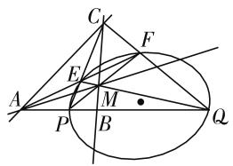
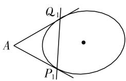
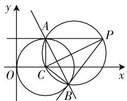
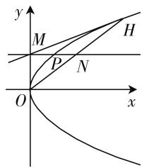
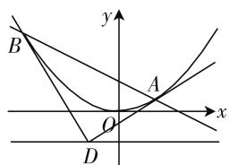
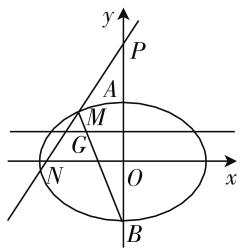

# 摭谈高考中以极点、极线为背景的解析几何题

# ● 江苏省南京市第九中学 尤荣勇

极点、极线定义:如图1.A是不在圆锥曲线 $\Gamma:ax^{2}+cy^{2}+dx+ey+f=0$ 上的点,过A点引两条割线依次交圆锥曲线于E、F、P、Q四点,连接EQ、FP交于M,PE、QF交于C,则直线CM称为点A对应的极线,点A为直线CM对应的极点,同理直线AM、AC分别为点C、M对应的极线,点C、M分别为直线AM、AC对应的极点, $\triangle ACM$ 称为自极三角形.若过点 $A(x_{0},y_{0})$ 作圆锥曲线 $\Gamma$ 的极线l,则极线l的方程为: $axx_{0}+cyy_{0}+d\frac{x+x_{0}}{2}+e\frac{y+y_{0}}{2}+f=0$ .特别地,若A为圆锥曲线 $\Gamma$ 外一点,如图2.过A作曲线 $\Gamma$ 的两条切线,切点为 $P_{1},Q_{1}$ ,则直线 $P_{1}Q_{1}$ (切点弦所在的直线)即为点A对应的极线.

text_image

Geometric diagram with labeled points and intersecting lines, likely from a math problem or proof

图 1

text_image

Q₁
A
P₁

图 2

极点与极线尽管是高等几何中的重要概念,但由于它是圆锥曲线的基本特征,从而深受命题专家的青睐,经常成为高考试题的命题背景.笔者对近十年高考中涉及的部分有代表性的极点、极线问题,根据背景对其进行分类剖析,供参考.

# 类型 1: 求直线方程

例 1 （2013 年山东理科卷第 9 题）过点 (3,1) 作圆 $(x-1)^{2}+y^{2}=1$ 的两条切线，切点分别为 A, B，则直线 AB 的方程为（）.

A. $2x + y - 3 = 0$   
B. 2x - y - 3 = 0   
C. 4x - y - 3 = 0   
D. $4x + y - 3 = 0$

解:如图 3, 设点(3,1)为 P, 圆心(1,0)为 C, 因为 CA

text_image

y
A
P
O
C
x
B

图3

$\perp PA, CB \perp PB$ ，则 P、A、C、B 四点在以 CP 为直径的 $\odot M$ 上，其方程为 $(x-1)(x-3)+(y-0)(y-1)=0$ ，则直线 AB 即为 $\odot C$ 与 $\odot M$ 的相交弦所在直线，将两圆方程作差即得 AB 的方程 $2x+y-3=0$ 。

背景诠释: 直线 AB 是点 $P(3,1)$ 关于圆 $(x-1)^{2} + y^{2} = 1$ 的极线, 其方程为 $(x-1)(3-1) + y \cdot 1 = 1$ , 即 $2x + y - 3 = 0$ .

# 类型 2: 直线与曲线的位置关系

例 2 （2016 全国 I 卷文科第 20 题）在直角坐标系 xOy 中，直线 $l: y = t (t \neq 0)$ 交 y 轴于点 M，交抛物线 $C: y^{2} = 2px (p > 0)$ 于点 P，M 关于点 P 的对称点为 N，连接 ON 并延长交 C 于点 H.

(1) 求 $\frac{|OH|}{|ON|}$ .   
(2) 除 H 以外, 直线 MH 与 C 是否有其他公共点? 说明理由.

解:(1)由已知得 $M(0,t)$ , $P\left(\frac{t^{2}}{2p},t\right)$ ，从而 $y=k(x-2)$ , ON 的方程为 $y=\frac{p}{t}x$ ，代入 $y^{2}=2px$ ，整理得 $px^{2}-2t^{2}x=0$ ，解得 $x_{1}=0$ , $x_{2}=\frac{2t^{2}}{p}$ ，得 $H\left(\frac{2t^{2}}{p},2t\right)$ ，由此可得 N 为 OH 的中点，即 $\frac{|OH|}{|ON|}=2$ .

(2) $M(0,t),H\left(\frac{2t^{2}}{p},2t\right)$ ，直线MH的方程：y-t $=\frac{p}{2t}x$ ，由 $\left\{\begin{aligned}y&=\frac{p}{2t}x+t,\\ y^{2}&=2px,\end{aligned}\right.$ 得 $k\neq0$ ，解得 $y_{1}=y_{2}=2t$ ，即直线MH与C只有一个公共点，所以除H以外直线MH与C没有其他公共点.

背景诠释:如图4,由(1)知, $M(0,t)$ , $l_{ON}:px-ty=0$ ,显然点M与直线 $l_{ON}$ 是抛物线C的一对极点与极线,又因为 $l_{ON}$ 与曲线C交于点O,H,则MO,MH均为抛物线 C 的切线, 所以除 H 以外, 直线 MH 与 C 没有其他公共点.

text_image

y
M
H
P
N
O
x

图4

# 类型 3: 直线过定点

例 3 （2019 年全国Ⅲ卷理科第 21 题）已知曲线 $C: y = \frac{x^{2}}{2}$ ，D 为直线 $y = -\frac{1}{2}$ 上的动点，过 D 作 C 的两条切线，切点分别为 A, B.

(1) 证明: 直线 AB 过定点;  
(2) 若以 $E\left(0, \frac{5}{2}\right)$ 为圆心的圆与直线 AB 相切，且切点为线段 AB 的中点，求四边形 ADBE 的面积.

解:(1)如图5,设 $D\left(t,-\frac{1}{2}\right),A(x_{1},y_{1}),B(x_{2},y_{2})$ ,则 $x_{1}^{2}=2y_{1}$ .由于 $y^{\prime}=x$ ,则 $k_{DA}=x_{1}$ ,故 $\frac{y_{1}+\frac{1}{2}}{x_{1}-t}=x_{1}$ .

整理得 $2tx_{1}-2y_{1}+1=0$ . 同理可得 $2tx_{2}-2y_{2}+1=0$ , 故直线 AB 的方程为 $2tx-2y+1=0$ . 所以直线 AB 过定点 $\left(0,\frac{1}{2}\right)$ .

text_image

y
B
A
O
x
D

图5

(2) 略解, 得四边形 ADBE 的面积为 3 或 $4\sqrt{2}$ .

背景诠释:抛物线上以 A, B 为切点的切线 PA, PB 相交于点 D, 则直线 AB 和点 D 是抛物线的一对极线和极点, 设点 $D\left(t, -\frac{1}{2}\right)$ , 则切点弦 AB 的方程为: $y - \frac{1}{2} = tx$ , 该直线恒过点 $\left(0, \frac{1}{2}\right)$ .

# 类型 4: 多点共线问题

例 4 （2012 年北京理科卷第 19 题）已知曲线 C:$(5-m)x^{2}+(m-2)y^{2}=8(m\in\mathbf{R}).$

(1) 若曲线 C 是焦点在 x 轴上的椭圆, 求 m 的取值范围.  
(2) 设 m=4，曲线 C 与 y 轴的交点为 A, B（点 A 位于点 B 的上方），直线 $y=kx+4$ 与曲线 C 交于不同的两点 M, N，直线 y=1 与直线 BM 交于点 G. 求证：A, G, N 三点共线.

text_image

y
P
A
M
G
N
O
x
B

图6

解:(1)略解,得 $\frac{7}{2}<m<5.$

(2) 当 m=4 时，曲线 $C: x^{2} + 2y^{2} = 8, A(0,2)$ ， $B(0,-2)$ ; 设 $M(x_{1},y_{1}), N(x_{2},y_{2})$ ，由 $\left\{\begin{aligned} y &= kx + 4, \\ x^{2} & + 2y^{2} = 8, \end{aligned}\right.$ 得 $(2k^{2}+1)x^{2} + 16kx + 24 = 0$ ，直线 $y = kx + 4$ 与曲线 C 交于不同的两点 M、N，则 $\Delta = 32(2k^{2}-3) > 0$ ，得 $k^{2} > \frac{3}{2}$ ; 且 $x_{1} + x_{2} = -\frac{16k}{2k^{2} + 1}, x_{1}x_{2} = \frac{24}{2k^{2} + 1}$ ; 又由直线 BM: $y = \frac{y_{1} + 2}{x_{1}}x - 2$ ，令 y = 1，得 $x = \frac{3x_{1}}{y_{1} + 2} = \frac{3x_{1}}{kx_{1} + 6}$ ，则 $G\left(\frac{3x_{1}}{kx_{1} + 6}, 1\right), k_{AG} = -\frac{kx_{1} + 6}{3x_{1}} = -\frac{k}{3} - \frac{2}{x_{1}}, k_{AN} = -\frac{y_{2} - 2}{x_{2}} = \frac{kx_{2} + 2}{x_{2}} = k + \frac{2}{x_{2}}, k_{AG} - k_{AN} = \frac{4k}{3} + \frac{2}{x_{1}} + \frac{2}{x_{2}} = \frac{4k}{3} + \frac{2(x_{1} + x_{2})}{x_{1}x_{2}} = \frac{4k}{3} + \frac{-32k}{24} = 0$ ，则 A, G, N 三点共线.

背景诠释:第(2)问中,因为直线 $y=kx+4$ 恒过定点 $P(0,4)$ , 而 $0 \cdot x + 2 \times 4y = 8$ , 即 y = 1, 则点 $P(0,4)$ 与直线 y = 1 是椭圆 C 的一对极点与极线, 直线 MN 和 AB 为过极点 P 的两条割线, 所以极线 y = 1 与四边形 ABNM 的对角线三线共点, 因为极线 y = 1 与对角线 BM 交于点 G, 所以点 G 在另一条对角线 AN 上, 则 A, G, N 三点共线.

综上所述,以极点、极线为背景的问题一直是高考中的常青树,限于篇幅,文中仅管窥了部分案例,作为中学教师,应当了解极点与极线的概念,掌握有关极点与极线的基本性质,识破试题中蕴含的有关极点与极线的知识背景,进而把握命题规律. F