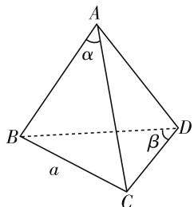
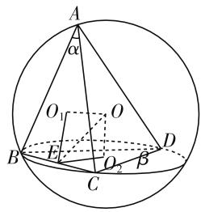
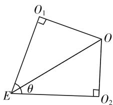
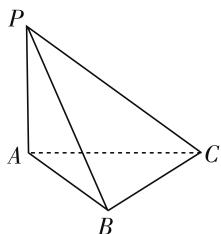
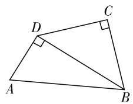
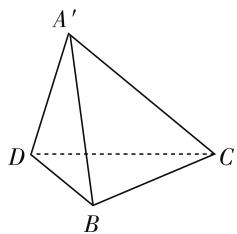
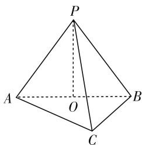
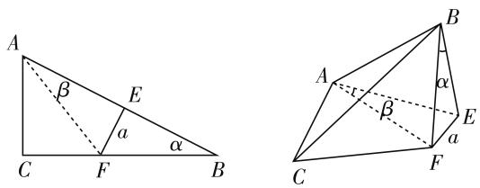
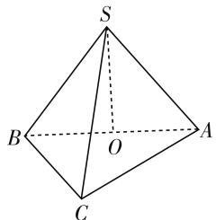

# 用公式巧解立体几何中的多面体外接球问题

● 吉林省实验中学 刘忠秋  
● 吉林省实验中学 张天柱  
● 吉林省实验中学 李松雪

我们知道,在球面上任意选四个不共面的点,两两连接就构成了一个球内接四面体(三棱锥);反之,任何一个四面体也有唯一的外接球.多面体的外接球问题是近几年高考中的热点也是难点问题,解决这类问题的关键就是如何求解外接球的半径,而求多面体的外接球半径问题又可以转化为求四面体的外接球的半径问题得以解决.如何利用四面体有关量去计算它的外接球半径？在高中立体几何中，有“补形法、截面法、性质法、投影法”等方法，但这些方法都是针对特殊多面体而言的，不是统一的方法，为了获得求解四面体外接球半径的统一方法，本文给出以下的计算公式：

text_image

A
α
B
a
β
C
D

图 1

如图 1, 在三棱锥 A-BCD 中, 二面角 A-BC-D 的平面角为 $\theta$ , 棱 BC=a, $\angle BAC=\alpha$ , $\angle BDC=\beta$ , 则三棱锥 A-BCD 的外接球半径计算公式为:

$$
\begin{array}{l} R ^ {2} = \frac {a ^ {2}}{4} + \frac {a ^ {2}}{4 \sin^ {2} \theta} \cdot \left(\frac {1}{\sin^ {2} \alpha} + \frac {1}{\sin^ {2} \beta} - 2\right) - \\ \frac {a ^ {2} \cos \alpha \cos \beta \cos \theta}{2 \sin \alpha \sin \beta \sin^ {2} \theta} \quad ① \\ \end{array}
$$

特别地，当 $\theta = \frac{\pi}{2}$ 时， $R^2 = \frac{a^2}{4}\left(\frac{1}{\sin^2\alpha} + \frac{1}{\sin^2\beta} - 1\right)$ ②

# 一、公式证明

不妨设 $\alpha, \beta$ 均为锐角，如图2所示， $O_{1}, O_{2}$ 分别为 $\triangle ABC$ 及 $\triangle BCD$ 的外接圆圆心，过 $O_{1}, O_{2}$ 分别作 $\triangle ABC$ 及 $\triangle BCD$ 所在平面的垂线，得交点 O，即为三棱椎 A - BCD 的外接球的球心.

设直线 $OO_{1}$ 、 $OO_{2}$ 所确定的平面 $OO_{1}O_{2}$ 与棱 BC交于点 E，因为 $BC \perp$ 平面 $OO_{1}O_{2}$ ，可知 $BC \perp O_{1}E, BC \perp O_{2}E$ ，因此 $\angle O_{1}EO_{2}$ 是二面角 A - BC - D 的平面角.

又因为 $O_{1}$ 是 $\triangle ABC$ 的外接圆的圆心， $O_{1}E \perp BC$ ，可知 E 是 BC 的中点。四边形 $OO_{1}EO_{2}$ 中，因为 $OO_{1} \perp$ $EO_{1}, OO_{2} \perp EO_{2}$ ，所以 $O, O_{1}, E, O_{2}$ 四点共圆.

text_image

A
α
O₁
O
B
E
O₂
β
C
D

图 2

设 $\triangle ABC$ 的外接圆的半径为 $r_{1}$ ， $\triangle BCD$ 的外接圆的半径为 $r_{2}$ ，由 BC=a，得 $BE=\frac{a}{2}$ ，从而有 $O_{1}E^{2}=$

$$
r _ {1} ^ {2} - \frac {a ^ {2}}{4}, O _ {2} E ^ {2} = r _ {2} ^ {2} - \frac {a ^ {2}}{4}.
$$

如图 3 所示, 在圆内接四边形 $OO_{1}EO_{2}$ 中, 因为 $\angle OO_{1}E=\frac{\pi}{2}$ , 可知 OE 为四边形 $OO_{1}EO_{2}$ 的外接圆的直径.

text_image

O₁
O
E
θ
O₂

图3

由余弦定理得：

$$
\begin{array}{l} O _ {1} O _ {2} ^ {2} = O _ {1} E ^ {2} + O _ {2} E ^ {2} - 2 O _ {1} E \cdot O _ {2} E \cos \theta \\ = r _ {1} ^ {2} + r _ {2} ^ {2} - \frac {a ^ {2}}{2} - 2 \sqrt {\left(r _ {1} ^ {2} - \frac {a ^ {2}}{4}\right) \left(r _ {2} ^ {2} - \frac {a ^ {2}}{4}\right)} \cos \theta . \\ \end{array}
$$

又由正弦定理得：

$$
O E ^ {2} = \frac {O _ {1} O _ {2} ^ {2}}{\sin^ {2} \theta} = \frac {1}{\sin^ {2} \theta} \left[ r _ {1} ^ {2} + r _ {2} ^ {2} - \frac {a ^ {2}}{2} - \right.
$$

$$
\left. 2 \sqrt {\left(r _ {1} ^ {2} - \frac {a ^ {2}}{4}\right) \left(r _ {2} ^ {2} - \frac {a ^ {2}}{4}\right)} \cos \theta \right].
$$

设三棱锥 A-BCD 的外接球半径为 R，则 OC=R, $R^{2}=OE^{2}+EC^{2}$ ，所以 $R^{2}=OE^{2}+\frac{a^{2}}{4}=\frac{1}{\sin^{2}\theta}$ .

$$
\left[ r _ {1} ^ {2} + r _ {2} ^ {2} - \frac {a ^ {2}}{2} - 2 \sqrt {\left(r _ {1} ^ {2} - \frac {a ^ {2}}{4}\right) \left(r _ {2} ^ {2} - \frac {a ^ {2}}{4}\right)} \cos \theta \right] + \frac {a ^ {2}}{4}.
$$

而 $r_1 = \frac{a}{2\sin\alpha}, r_2 = \frac{a}{2\sin\beta}$ , 把它们代入上式, 得

$$
R ^ {2} = \frac {1}{\sin^ {2} \theta} \left[ \left(\frac {a}{2 \sin \alpha}\right) ^ {2} + \left(\frac {a}{2 \sin \beta}\right) ^ {2} - \frac {a ^ {2}}{2} - \right.
$$

$2\sqrt{\left(\left(\frac{a}{2\sin\alpha}\right)^{2}-\frac{a^{2}}{4}\right)\left(\left(\frac{a}{2\sin\beta}\right)^{2}-\frac{a^{2}}{4}\right)}\cos\theta\bigg]+\frac{a^{2}}{4}$ ，化
简整理，得 $R^{2}=\frac{a^{2}}{4}+\frac{a^{2}}{4\sin^{2}\theta}\left(\frac{1}{\sin^{2}\alpha}+\frac{1}{\sin^{2}\beta}-2\right)-\frac{a^{2}\cos\alpha\cos\beta\cos\theta}{2\sin\alpha\sin\beta\sin^{2}\theta}.$

当 $\theta=\frac{\pi}{2}$ 时， $\sin\theta=1,\cos\theta=0$ ，代入上式，化简整理，得 $R^{2}=\frac{a^{2}}{4}\left(\frac{1}{\sin^{2}\alpha}+\frac{1}{\sin^{2}\beta}-1\right)$ .

若 $\alpha, \beta$ 不同为锐角时，公式 ① 中的 $\frac{a^2\cos\alpha\cos\beta\cos\theta}{2\sin\alpha\sin\beta\sin^2\theta}$ 变为 $\frac{a^2|\cos\alpha\cos\beta|\cos\theta}{2\sin\alpha\sin\beta\sin^2\theta}$ 仍然成立，留给读者自行证明.

# 二、公式应用

例 已知三棱锥 P-ABC 中, 底面 ABC 是等边三角形, $PA \perp$ 平面 ABC, $BC = 2\sqrt{3}$ , $PC = 2\sqrt{7}$ , 则三棱锥 P-ABC 的外接球的表面积为 \_\_\_\_.

解: 如图 4 所示, 设二面角 P-AB-C 的平面角为 $\theta$ , $\angle APB = \alpha$ , 则 $\angle ACB = \beta = \frac{\pi}{3}$ ,
由已知条件知 $\theta=\frac{\pi}{2},\sin\theta=1,$ $\cos\theta=0,a=AB=2\sqrt{3}$ ，因为PA
⊥平面ABC，所以 PA⊥AC，$PA \perp AB$ ，由勾股定理，得 $PA = 4, PB = 2\sqrt{7}$ ，所以 $\sin\alpha=\frac{2\sqrt{3}}{2\sqrt{7}}=\frac{\sqrt{21}}{7},\sin\beta=\sin\frac{\pi}{3}=\frac{\sqrt{3}}{2}.$

natural_image

Geometric diagram of a tetrahedron with vertices labeled P, A, B, C (no text or symbols beyond labels)

图4

把 $a = 2\sqrt{3}, \sin \alpha = \frac{\sqrt{21}}{7}, \sin \beta = \frac{\sqrt{3}}{2}$ 代入 $R^2 = \frac{a^2}{4} \left( \frac{1}{\sin^2 \alpha} + \frac{1}{\sin^2 \beta} - 1 \right)$ ，得 $R^2 = 8$ ，所以三棱锥 $P - ABC$ 的外接球的表面积为 $32\pi$ .

变式 1: 如图 5, 图 6, 在平面四边形 ABCD 中, BC = CD = AD = 1, $BD = \sqrt{2}$ , $AD \perp BD$ , 将 $\triangle ABD$ 沿着 BD 折起到 $\triangle A'BD$ , 使平面 $A'BD \perp$ 平面 BCD, 则过 $A', B, C, D$ 四点的球的表面积为().

A. $3\pi$

B. $6\pi$

C. $8\pi$

D. $12\pi$

text_image

Geometric diagram of quadrilateral ABCD with right angles at D and C, showing right-angle markings.

图5

text_image

A'
D
B
C

图6

解:如图6,设二面角 $A^{\prime}-BD-C$ 的平面角为 $\theta$ , $\angle BA^{\prime}D=\alpha,\angle BCD=\beta$ ,由已知条件可知 $\theta=\frac{\pi}{2},\sin\alpha=\frac{\sqrt{6}}{3},\sin\beta=\sin\frac{\pi}{2}=1,a=BD=\sqrt{2}$ ,把 $a=\sqrt{2},\sin\alpha=\frac{\sqrt{6}}{3},\sin\beta=1$ 代入 $R^{2}=\frac{a^{2}}{4}\left(\frac{1}{\sin^{2}\alpha}+\frac{1}{\sin^{2}\beta}-1\right)$ ,得 $R^{2}=\frac{3}{4}$ .

所以, 过 $A', B, C, D$ 四点的球的表面积 $S_{球表面积} = 4\pi R^{2} = 3\pi$ , 因此选 A.

变式 2: 已知球 O 表面上的四点 A, B, C, P 满足 $AC = BC = \sqrt{2}$ , AB = 2，若四面体 PABC 的体积最大值为 $\frac{2}{3}$ ，则球 O 的表面积为（）.

A. $\frac{25\pi}{4}$

B. $\frac{25\pi}{9}$

C. $\frac{25}{16}\pi$

D. $8\pi$

解: 由题意可知, $\triangle ABC$ 为直角三角形,且 $\angle ACB$ 为直角,如图7.

取 AB 中点 O，连接 PO，则 O 为 $\triangle ABC$ 的外心，当 PO $\perp$ 平面 ABC 时，四面体 P - ABC 的体积最大，此时 $V_{P-ABC}$ $= \frac{1}{3} S_{\triangle ABC} \cdot PO = \frac{2}{3}$ , 所以 $PO = 2$ , 且面 $PAB \perp$ 面 $ACB$ .

text_image

P
A O B
C

图 7

设二面角 $P - AB - C$ 的平面角为 $\theta$ ，显然 $\theta = \frac{\pi}{2}$ ， $\angle ACB = \alpha, \angle APB = \beta$ ，则 $a = AB = 2, \sin \alpha = 1, \sin \beta = \frac{4}{5}$ ，把 $a = 2, \sin \alpha = 1, \sin \beta = \frac{4}{5}$ ，代入 $R^2 = \frac{a^2}{4} \left( \frac{1}{\sin^2 \alpha} + \frac{1}{\sin^2 \beta} - 1 \right)$ ，得 $R = \frac{5}{4}$ ，所以该球体的表

面积 $S=\frac{25\pi}{4}$ ，因此选 A.

变式 3: 如图 8, 在 $\triangle ABC$ 中, $AC = 6$ , $BC = 8$ , $AB = 10$ , 点 $E, F$ 分别为边 $AB$ , $BC$ 上两点 (不与端点重合), 且 $EF \perp AB$ , 将 $\triangle BEF$ 沿着 $EF$ 折起, 使平面 $BEF \perp$ 平面 $ACFE$ , 得四棱锥 $B - ACFE$ , 若 $BE = 4$ , 则四棱锥 $B - ACFE$ 的外接球表面积为 \_\_\_\_.

text_image

A
β
E
a
α
C
F
B
A
β
E
a
C
F
B

图8

解:由题意知 $AC \perp BC$ ，又因为 $EF \perp AB$ ，因此四边形 AEFC 为圆内接四边形，所以四棱锥 B-ACFE 的外接球也是三棱锥 B-AEF 的外接球.

设二面角 A-EF-B 的平面角为 $\theta$ ，显然 $\theta=\frac{\pi}{2}$ ， $\angle EBF = \alpha, \angle EAF = \beta, EF = a$ ，因为 AC = 6, BC = 8,
AB=10, 得 $\sin\alpha=\frac{3}{5}$ ，又由 BE=4，得 $a=BE\tan\alpha=$ $BE \times \frac{\sin\alpha}{\sqrt{1 - \sin^{2}\alpha}} = 3$ ，从而 $\sin\beta = \frac{1}{\sqrt{5}}$ .

代入 $R^{2}=\frac{a^{2}}{4}\left(\frac{1}{\sin^{2}\alpha}+\frac{1}{\sin^{2}\beta}-1\right)$ ，得 $R^{2}=\frac{61}{4}$ ，所以 $S_{球O表面积}=4\pi R^{2}=61\pi.$

text_image

S
B
O
A
C

图9

变式 4: 如图 9, 已知三棱锥 S-ABC 的各顶点都在同一个球面上, $\triangle ABC$ 所在截面圆的圆心 O 在 AB 上, 且 $SO \perp$ 面 ABC, $AC = 1$ , $BC = \sqrt{3}$ , 若三棱锥的体积是 $\frac{\sqrt{3}}{3}$ , 则该球体的表面积是 \_\_\_\_.

解: 因为 $\triangle ABC$ 所在截面圆的圆心 O 在 AB 上, 所以 O 为 AB 的中点, 且 $AC \perp BC$ , 因此 $AB = \sqrt{AC^{2} + BC^{2}} = 2$ , 又因为 $SO \perp$ 面 ABC, 所以平面 $SAB \perp$ 平面 ABC, 由 $V_{S-ABC} = \frac{1}{3} \times \frac{1}{2} AC \times BC \times SO = \frac{\sqrt{3}}{3}$ , 解得 SO = 2, 所以 SA = SB = $\sqrt{SO^{2} + BO^{2}} = \sqrt{5}$ .

在 $\triangle SAB$ 中，利用余弦定理得 $\cos \angle ASB = \frac{SA^2 + SB^2 - AB^2}{2SA\cdot SB} = \frac{3}{5}$ 所以 $\sin \angle ASB = \frac{4}{5}$ .

设二面角 S-AB-C 的平面角为 $\theta, AB = a, \angle ASB = \alpha, \angle ACB = \beta$ ，显然 $\theta = \frac{\pi}{2}, \beta = \frac{\pi}{2}, a = 2, \sin\alpha = \frac{4}{5}, \sin\beta = 1$ ，代入 $R^{2} = \frac{a^{2}}{4}\left(\frac{1}{\sin^{2}\alpha} + \frac{1}{\sin^{2}\beta} - 1\right)$ ，得 $R = \frac{5}{4}$ ，所以该球体的表面积为 $\frac{25\pi}{4}$ .

# 三、结束语

多面体的外接球问题都可以转化为四面体的外接球问题来进行求解，而任何一个四面体外接球的半径在一定条件下都能用公式①进行运算求解，因此我们能利用公式①来解决所有的多面体外接球的问题，不过有时候计算量会比较大，但如果：(1)当 $\theta=\frac{\pi}{2}$ 时，公式可以化简为 $R^{2}=\frac{a^{2}}{4}\left(\frac{1}{\sin^{2}\alpha}+\frac{1}{\sin^{2}\beta}-1\right)$ ；(2)当 $\alpha=\frac{\pi}{2}$ 或 $\beta=\frac{\pi}{2}$ 时， $R^{2}=\frac{a^{2}}{4}+\frac{a^{2}}{4\sin^{2}\theta}\left(\frac{1}{\sin^{2}\beta}-1\right)$ 或 $R^{2}=\frac{a^{2}}{4}+\frac{a^{2}}{4\sin^{2}\theta}\cdot\left(\frac{1}{\sin^{2}\alpha}-1\right)$ ，此时，计算就相对简单一些.

# 参考文献：

[1] 赵光明, 武建沛. 任意四面体外接球半径的计算公式 [J]. 数学教学, 1988(6). F