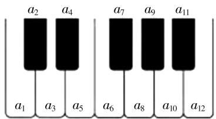

# 跨学科适度融合,多知识高考交汇

——2020年高考数学面面观

江苏省宜兴第一中学 吴继敏

“注重在数学知识网络的交汇点上巧妙设计试题”是近年新课标高考数学试题的创新特色之一，也是深度契合高考数学课标的指导思想之一。特别是，近两年高考试题在数学与艺术、数学与物理、数学与化学、数学与医药卫生、数学与信息技术等跨学科适度融合方面作了有效的尝试，巧妙设置在数学与其他相关学科的共振点上，进行学科间的交汇与融合。此类问题借助其他学科知识为问题背景，以概念、定义、公式等形式展开，结合数学知识来切入，以实际问题为场景，合理把数学知识、相关学科知识与生活实际加以有机组合，考查相关数学知识与数学能力，是创新意识与应用意识的重要体现之一。2020年高考中数学与其他学科的巧妙融合与交汇就得以很好地贯彻落实，下面结合真题实例加以剖析。

# 一、艺术学科与数学的交汇

例 1 （2020 年高考数学全国卷 Ⅱ 文科第 3 题）如图 1，将钢琴上的 12 个键依次记为 $a_{1}, a_{2}, \cdots, a_{12}$ . 设 $1 \leqslant i < j < k \leqslant 12$ ，若 k-j=3 且 j-i=4，则称 $a_{i}, a_{j}, a_{k}$ 为原位大三和弦；若 k-j=4 且 j-i=3，则称 $a_{i}, a_{j}, a_{k}$ 为原位小三和弦. 用这 12 个键可以构成的原位大三和弦与原位小三和弦的个数之和为（）.

A. 5

B. 8

C. 10

D. 15

text_image

a₂ a₄
a₁ a₃ a₅
a₆ a₈ a₁₀ a₁₁
a₁₂

图1

分析:结合钢琴中专用名词——原位大三和弦与原位小三和弦的定义,结合具体不等式条件与函数关系式,直接通过罗列法列举并确定对应i,j,k的值,进而得以确定二者的个数之和.

解析:由于 k-j=3 且 j-i=4, 则原位大三和弦分别有: i=1, j=5, k=8; i=2, j=6, k=9; i=3, j=7, k=10; i=4, j=8, k=11; i=5, j=9, k=12. 共5个.

由于 k-j=4 且 j-i=3，则原位小三和弦分别有：i=1,j=4,k=8；i=2,j=5,k=9；i=3,j=6,k=10；i=4,j=7,k=11；i=5,j=8,k=12。共 5 个。

所以用这 12 个键可以构成的原位大三和弦与原位小三和弦的个数之和为 $5 + 5 = 10$ ，故选择答案：C.

点评: 直接以艺术学科中的基本乐器之一——钢琴中的相关名词(原位大三和弦与原位小三和弦)来展开, 结合具体不等式条件与函数关系式, 利用艺术学科中的相关专业性的定义来合理创新与应用设置, 通过罗列法来列举出满足条件的参数值, 进而得以直观分析, 列举数字, 实际应用.

# 二、医疗卫生学科与数学的交汇

例 2 （2020 年高考数学全国卷 Ⅲ 文、理科第 4 题）Logistic 模型是常用数学模型之一，可应用于流行病学领域。有学者根据公布数据建立了某地区新冠肺炎累计确诊病例数 $I(t)$ (t 的单位：天) 的 Logistic 模型: $I(t)=\frac{K}{1+\mathrm{e}^{-0.23(t-53)}}$ ，其中 K 为最大确诊病例数。当 $I(t^{*})=0.95K$ 时，标志着已初步遏制疫情，则 $t^{*}$ 约为 $(\ln19\approx3)$ ( ).

A. 60

B. 63

C. 66

D. 69

分析:结合某地区新冠肺炎累计确诊病例数 $I(t)$ 的 Logistic 模型的函数关系式,并利用已初步遏制疫情时函数值来建立关系式,通过代数恒等变形以及对数运算等来确定相应的参数的值.

解析:由题可知 $\frac{K}{1+\mathrm{e}^{-0.23(t-53)}}=0.95K$ ，整理可得 $e^{-0.23(t-53)}=\frac{1}{19}$ ，两边取自然对数，有 $-0.23(t-53)=-\ln19\approx-3$ ，解得 $t\approx66$ ，故选择答案:C.

点评: 正确阅读并理解题目条件中的 Logistic 模型及其应用, 根据医疗卫生学科中流行病学领域的相关知识以及对应的函数关系式,结合已初步遏制疫情这一确定的函数值,综合起来建立满足条件的方程,利用方程的转化、对数的运算与方程的求解,进而得以解决相应的数学应用问题.

# 三、公共卫生学科与数学的交汇

例 3 （2020 年高考数学新高考山东卷第 6 题）基本再生数 $R_{0}$ 与世代间隔 T 是新冠肺炎的流行病学基本参数。基本再生数指一个感染者传染的平均人数，世代间隔指相邻两代间传染所需的平均时间。在新冠肺炎疫情初始阶段，可以用指数模型： $I(t)=\mathrm{e}^{rt}$ 描述累计感染病例数 $I(t)$ 随时间 t（单位：天）的变化规律，指数增长率 r 与 $R_{0}, T$ 近似满足 $R_{0}=1+rT$ 。有学者基于已有数据估计出 $R_{0}=3.28, T=6$ 。据此，在新冠肺炎疫情初始阶段，累计感染病例数增加 1 倍需要的时间约为 $(\ln2\approx0.69)$ （）。

A. 1.2 天

B. 1.8 天

C.2.5天

D. 3.5 天

分析:结合指数增长率 r 与 $R_{0}$ , T 近似满足的关系式, 并结合已有数据来确定参数 r 的值, 结合指数模型建立方程, 通过代数恒等变形以及对数运算等来确定相应的参数的值, 进而作出对应的预测.

解析: 将 $R_{0}=3.28, T=6$ 代入 $R_{0}=1+rT$ ，可得 $3.28=1+6r$ ，解得 r=0.38，根据条件可知 $e^{0.38t}=2$ ，两边取自然对数，有 $0.38t=\ln2\approx0.69$ ，所以 $t\approx1.8$ 天，故选择答案：B.

点评:结合题目条件中相关的阅读材料,结合公共卫生学科中有关新冠肺炎疫情的累计感染病例数 $I(t)$ 随时间t的变化规律的指数模型以及相应的近似关系式的建立,通过已有数据的估计加以分析与预测,为进一步的判断与决策提供理论依据,有效服务社会的公共卫生领域.

# 四、信息技术学科与数学的交汇

例 4 （2020年高考数学全国卷Ⅱ理科第12题）0-1周期序列在通信技术中有着重要应用. 若序列 $a_{1}a_{2}\cdots a_{n}\cdots$ 满足 $a_{i}\in\{0,1\}(i=1,2,\cdots)$ ，且存在正整数m，使得 $a_{i+m}=a_{i}(i=1,2,\cdots)$ 成立，则称其为0-1周期序列，并称满足 $a_{i+m}=a_{i}(i=1,2,\cdots)$ 的最小正整数m为这个序列的周期. 对于周期为m的0-1序列 $a_{1}a_{2}\cdots a_{n}\cdots,C(k)=\frac{1}{m}\sum_{i=1}^{m}a_{i}a_{i+k}(k=1,2,\cdots,m-1)$

是描述其性质的重要指标. 下列周期为 5 的 0-1 序列中, 满足 $C(k) \leqslant \frac{1}{5} (k = 1,2,3,4)$ 的序列是( ).

A. 11010…

B. 11011…

C. 10001…

D. 11001…

分析:结合各选项中周期为5的0-1周期序列的给出,利用特殊值法,在各选项条件下的已知序列中确定相关的 $C(1)$ 与 $C(2)$ 的值,与不等式 $C(k)\leqslant\frac{1}{5}$ 加以对比,从而得以排除来得到正确的答案.

解析:选项 B 中, $C(1)=\frac{1}{5}\sum_{i=1}^{5}a_{i}a_{i+1}=\frac{1}{5}(a_{1}a_{2}+a_{2}a_{3}+a_{3}a_{4}+a_{4}a_{5}+a_{5}a_{1})=\frac{3}{5}>\frac{1}{5}$ ，不满足 $C(k)\leqslant\frac{1}{5}$ ，排除；

选项 D 中, $C(1)=\frac{1}{5}\sum_{i=1}^{5}a_{i}a_{i+1}=\frac{1}{5}(a_{1}a_{2}+a_{2}a_{3}+a_{3}a_{4}+a_{4}a_{5}+a_{5}a_{1})=\frac{2}{5}>\frac{1}{5}$ ，不满足 $C(k)\leqslant\frac{1}{5}$ ，排除；

选项 A 中， $C(2)=\frac{1}{5}\sum_{i=1}^{5}a_{i}a_{i+1}=\frac{1}{5}(a_{1}a_{3}+a_{2}a_{4}+a_{3}a_{5}+a_{4}a_{1}+a_{5}a_{2})=\frac{2}{5}>\frac{1}{5}$ ，不满足 $C(k)\leqslant\frac{1}{5}$ ，排除；

故选择答案:C.

点评:根据信息技术学科中通信技术的0—1周期序列及其相关的定义,结合已知选项中序列的给出,进行合理验证,从而确定满足条件的序列,得到正确的答案.本题的题干较长,信息点多,公式复杂,要能静心读题,并能明确复杂式子的内涵,正确理解题意,加以正确运算与应用,从而得以合理判断.

数学与其他相关学科知识间的跨学科适度融合问题具有非常好的阅读性、趣味性、交汇性、创新性、应用性，是很好考查学生全面知识与能力的一个好场所，具有较好的选拔性与区分度，是高考数学试卷命题者比较青睐的命题方向之一。解决此类涉及数学的跨学科适度融合问题，通过材料阅读，理解题目内涵，结合模型建立，数学概念、定义、公式的应用来建立起与之对应的有效的数学模型，转化为解决相关的数学问题，进而达到破解问题的目的。因此，在日常数学教学与学习中，应重视数学课本，重视学科基础，重视基础知识，强调数学基本技能与基本方法的训练，通过对所学的数学知识有一个系统的认识，为知识交汇、学科融合的应用与解决奠定基础。F