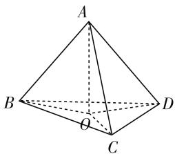
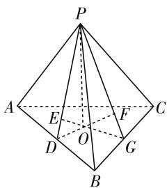
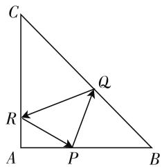
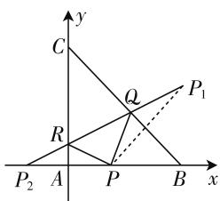

# 高中知识背景下的三角形“四心”问题

# 江苏省灌云高级中学 朱磊磊

三角形是一个重要的基本几何模型，它的相关性质可以被广泛地应用于解决多种问题，也经常作为重要考察点出现在各大考试中。除了最常用的边长和差不等式及内角和关系，三角形四心（指三角形的重心、外心、内心、垂心）的相关性质也是高中三角形问题中的高频考点。高中阶段，相关考题常常在平面向量、立体几何和解析几何的背景下考察三角形“四心”的性质，要求学生在深入理解四心概念的基础上灵活运用其性质进行转化和化归，学生在这类考题的表现上往往不甚理想，主要在两个方面存在较大问题：其一，混淆基本概念，部分学生由于不理解“四心”的来历而对四心的基本概念没有足够清晰的认知，常常在遇到具体问题时将四者混淆，例如部分学生会将重心（中线的交点）、垂心（高的交点）、内心（角平分线的交点）与外心（垂直平分线的交点）混淆起来；其二，不能灵活地将四心的性质与新知识结合起来，学生可能清楚四心的基本概念和性质，却不能灵活地将其与问题背景知识（如向量）结合起来。

因此,笔者对向量、立体几何和解析几何背景下的三角形四心的常用结论和经典例题进行汇总整理,望能给各位读者一定的帮助.

# 一、平面向量背景下的三角形“四心”问题

# 常用结论小结

结论 1: 若 $\triangle ABC$ 内一点 G 满足 $\overrightarrow{GA} + \overrightarrow{GB} + \overrightarrow{GC} = 0$ ，则可判定点 G 为 $\triangle ABC$ 的重心；

结论 2: 若点 O 在 $\triangle ABC$ 内部且满足 $|\overrightarrow{OA}| = |\overrightarrow{OB}| = |\overrightarrow{OC}|$ ，则可判定点 O 为 $\triangle ABC$ 的外心；

结论 3: 若点 H 在 $\triangle ABC$ 内部且满足 $\overrightarrow{HA} \cdot \overrightarrow{HB} = \overrightarrow{HA} \cdot \overrightarrow{HC} = \overrightarrow{HB} \cdot \overrightarrow{HC}$ ，则可判定点 H 为 $\triangle ABC$ 的垂心；

结论 4:三角形内一点 O 是 $\triangle ABC$ 内心的充要条件为 $\overrightarrow{OA} \cdot \left( \frac{\overrightarrow{AB}}{|\overrightarrow{AB}|} - \frac{\overrightarrow{AC}}{|\overrightarrow{AC}|} \right) = \overrightarrow{OB} \cdot \left( \frac{\overrightarrow{BA}}{|\overrightarrow{BA}|} - \right.$

$$
\left. \frac {\overrightarrow {B C}}{| \overrightarrow {B C} |}\right) = \overrightarrow {O C} \cdot \left(\frac {\overrightarrow {C A}}{| \overrightarrow {C A} |} - \frac {\overrightarrow {C B}}{| \overrightarrow {C B} |}\right) = 0;
$$

结论4变式:记单位向量 $e_{1}=\frac{\overrightarrow{AB}}{|\overrightarrow{AB}|},e_{2}=\frac{\overrightarrow{BC}}{|\overrightarrow{BC}|}$ ， $e_{3}=\frac{\overrightarrow{CA}}{|\overrightarrow{CA}|}$ ，则三角形内一点O是其内心的充要条件为 $\overrightarrow{OA}\cdot(e_{1}+e_{3})=\overrightarrow{OB}\cdot(e_{1}+e_{2})=\overrightarrow{OC}\cdot(e_{2}+e_{3})=0;$

结论5:已知点 O 是 $\triangle ABC$ 的外心, 则点 G 为 $\triangle ABC$ 重心的充分必要条件为 $\overrightarrow{OG} = \frac{1}{3} (\overrightarrow{OA} + \overrightarrow{OB} + \overrightarrow{OC})$ , 点 H 为垂心的充分必要条件为 $\overrightarrow{OH} = 3\overrightarrow{OG}$ .

# 典型例题小结

已知点 O 与三角形 ABC 共面:

例 1 若 $(\overrightarrow{OA} + OB) \cdot \overrightarrow{BA} = (\overrightarrow{OB} + \overrightarrow{OC}) \cdot \overrightarrow{CB} = (\overrightarrow{OC} + \overrightarrow{OA}) \cdot \overrightarrow{AC}$ ，则可以判定点 O 是 $\triangle ABC$ 的（）.

A. 外心 B. 内心 C. 重心 D. 垂心

例题解答: $\overrightarrow{BA}=\overrightarrow{OA}-\overrightarrow{OB},(\overrightarrow{OA}+\overrightarrow{OB})\cdot\overrightarrow{BA}=(\overrightarrow{OA}+\overrightarrow{OB})\cdot(\overrightarrow{OA}-\overrightarrow{OB})=\overrightarrow{OA}^{2}-\overrightarrow{OB}^{2}.$

同理可得， $(\overrightarrow{OB} +\overrightarrow{OC})\cdot \overrightarrow{CB} = \overrightarrow{OB^2} -\overrightarrow{OC^2},(\overrightarrow{OC}$ $+\overrightarrow{OA})\cdot \overrightarrow{AC} = \overrightarrow{OC^2} -\overrightarrow{OA^2}.$

所以 $\overrightarrow{OA^{2}} - \overrightarrow{OB^{2}} = \overrightarrow{OB^{2}} - \overrightarrow{OC^{2}} = \overrightarrow{OC^{2}} - \overrightarrow{OA^{2}}$ ，则 $|\overrightarrow{OA}| = |\overrightarrow{OB}| = |\overrightarrow{OC}|$ ，因此可判定点 O 为 $\triangle ABC$ 的外心，答案为 A.

例 2 动点 P 满足 $\overrightarrow{OP} = \overrightarrow{OA} + \lambda \left[ \frac{\overrightarrow{AB}}{|\overrightarrow{AB}| \sin B} + \frac{\overrightarrow{AC}}{|\overrightarrow{AC}| \sin C} \right]$ ， $\lambda > 0$ ，则该三角形的（）一定落在动点 P 的轨迹上.

A. 外心 B. 垂心 C. D. 内心

例题解答: 在 $\triangle ABC$ 中根据三角形的正弦定理可知, 在 $\triangle ABC$ 中, $|\overrightarrow{AB}| \sin B = |\overrightarrow{AC}| \sin C$ , 即 $\overrightarrow{OP}$

$$
= \overrightarrow {O A} + \frac {\lambda}{| \overrightarrow {A B} | \sin B} (\overrightarrow {A B} + \overrightarrow {A C}), \overrightarrow {A P} = \frac {\lambda}{| \overrightarrow {A B} | \sin B} (\overrightarrow {A B}
$$

$+\overrightarrow{AC}$ ), 又因为 $\overrightarrow{AB} + \overrightarrow{AC}$ 与 BC 边上的中线共线, 所以三角形的重心一定落在点 P 的运动轨迹上.

# 二、立体几何背景下的三角形“四心”问题

例 3 如图 1 所示, 若已知四面体 ABCD 的三条棱 AB, AC, AD 与底面 BCD 所成的角相等, 则可知顶点 A 在底面上的投影是 $\triangle BCD$ 的().

A. 外心

B. 垂心

C. 重心

D. 内心

例题解答: 设点 A 在底面 BCD 上的投影为点 O, 连接 OB, OC, OD, 则易知线段 OB, OC, OD 分别为棱 AB, AC, AD 的投影, 因为 $AO \perp$ 平面 BCD, 所以可得 $\angle AOB = \angle AOC = \angle AOD = \frac{\pi}{2}$ , 又 $\angle ABO = \angle ACO = \angle ADO$ , 所以可判断 $\triangle ABO \sim \triangle ACO \sim \triangle ADO$ , 又三个三角形共用 AO, 所以三个三角形全等, 即 OB = OC = OD, 所以顶点 A 的投影为 $\triangle BCD$ 的外心.

text_image

A
B
O
C
D

图 1

例 4 若已知三棱锥 P-ABC 的顶点在底面的投影 O 到三个侧面的距离相等, 则投影点 O 是 $\triangle ABC$ 的().

A. 外心

B. 垂心

C. 重心

D. 内心

例题解答:如图2所示,作 $OD \perp AB$ ,连接PD,则OD是PD在底面ABC上的投影,又 $PO \perp$ 平面ABC,AB在平面ABC上,所以 $PO \perp AB$ ,所以 $AB \perp$ 平面POD,又AB在平面 PAB 上, 所以平面 PAB 和平面 POD 垂直且交线为 PD.

text_image

P
A	E	F	C
D	O	G
B

图2

在平面 POD 上过点 O 作 $OE \perp PD$ ，则 OE 垂直于平面 PAB，则 OE 的长度即为点 O 到平面 PAB 的距离，同理可得 $|OF|$ 为 O 到平面 PBC 的距离，则可知 $|OE|=|OF|$ ，则 $\triangle POE \cong \triangle POF$ ，所以 $\angle OPE = \angle OPG$ ，故 $\triangle POD \cong \triangle POG$ ，因此 OG = OD，同理可知点 O 到 $\triangle ABC$ 三边的距离相等，因此可判断投影点 O 是 $\triangle ABC$ 的内心.

# 三、解析几何背景下的三角形“四心”问题

已知平面直角坐标系 $xOy$ 上的双曲线 $C$ 及其两个焦点 $F_{1}, F_{2}$ , 设任意点 $P$ 在双曲线的右支上且不是顶点:

例 5 C: $\frac{x^{2}}{a^{2}} - \frac{y^{2}}{b^{2}} = 1 (a > 0, b > 0)$ ，试证明 $\triangle PF_{1}F_{2}$ 内心的横坐标是一个定值.

例题解答:设三角形的内心为点C,内切圆C与三角形三边 $PF_{1},PF_{2},F_{1}F_{2}$ 分别相切于点M,N,D,已知 $x_{C}=x_{D},|PM|=|PN|,|F_{1}M|=|F_{1}D|,|F_{2}N|=|F_{2}D|$ ,又因为 $|PF_{1}|-|PF_{2}|=2a$ ,则 $|PM|+|MF_{1}|-(|PN|+|NF_{2}|)=2a$ ,即可得 $|MF_{1}|-|NF_{2}|=2a$ ,则 $|F_{1}D|-|F_{2}D|=2a$ ,设 $x_{C}=x_{0}$ ,则 $D(x_{0},0)$ ,所以 $x_{0}+c-(c-x_{0})=2a$ ,所以 $x_{0}=a$ 为定值.

例 6 如图 3 所示, 在等腰 Rt△ABC 中, AB = AC = 4, P 在 AB 上且不与左、右两顶点重合, 现若用激光笔从点 P 处射出一道光线, 该光线在经过 BC, AC 的反射后仍然能够回到点 P, 且三角形的重心落在光线 QR 上, 试求满足条件的 AP 的值.

text_image

C
R
A
P
B
Q

图3

text_image

y
C
Q
P₁
R
P₂ A P B x

图 4

例题解答:如图4所示建立平面直角坐标系,可得 $B(4,0)$ , $C(0,4)$ , 所以 $l_{BC}: x + y = 4$ , 故 $\triangle ABC$ 的重心为 $G\left(\frac{4}{3}, \frac{4}{3}\right)$ , 设 $P(a,0)(0 < a < 4)$ , 则点 P 关于直线 BC 的对称点 $P_{1}$ 的坐标为 $(4,4 - a)$ , 关于直线 AC 的对称点为 $P_{2}(-a,0)$ , 易知点 $P_{1}, Q, R, P_{2}$ 共线, 又重心 G 落在 QR 上, 所以 $k_{P_{1}G} = k_{P_{2}G}$ , 即 $\frac{\frac{4}{3} - (4 - a)}{\frac{4}{3} - 4} = \frac{\frac{4}{3} - 0}{\frac{4}{3} - (-a)}$ , 则 $a = \frac{4}{3}$ , 故 AP = 4.

总而言之,教师要引导学生在熟悉四心基本定义的基础上尝试在多种知识背景下应用其性质. W