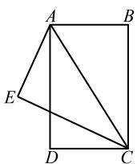
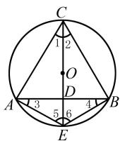
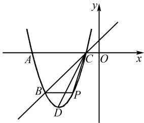
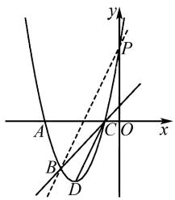
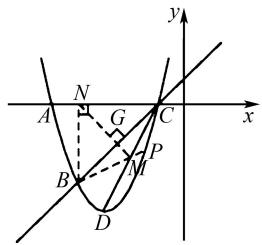

# 初中数学教学中开放性问题的求解策略

邢晓云

(山西省太原市第三十八中学校, 山西 太原 030006)

摘 要:与传统的封闭式问题相比,开放性试题以其问题的非唯一性、答案的多样性及解题过程的探索性而倍受命题者的青睐,近年来在中考试题中的比例有所增加,是中考数学的热点问题.基于此,文章结合具体实例,从条件开放、结论开放、存在探索性三个方面入手,阐释初中数学教学中求解放放性问题的有效策略,以此提高学生分析问题和解决问题的能力.

关键词: 初中数学; 开放性问题; 求解策略

中图分类号：G632

文献标识码：A

随着数学教育改革的不断深入,中考数学命题越来越注重对学生综合能力的考查 $^{[1]}$ .开放性问题具有较强的综合性和探索性,不仅能够考查学生的知识掌握程度,而且能够引导学生在解决问题的过程中展示其观察、分析、概括、比较及发散性思维等多方面的能力,成为近年来中考数学命题的热点 $^{[2]}$ .在初中数学教学中,研究开放探究性问题的求解策略,不仅能够提升数学课堂教学质量,帮助学生形成多元化的思维方式,而且有助于教师更好地应对中考数学题型的变化,以此提高学生的应变能力,提升学生的数学核心素养 $^{[3]}$ .

# 1 条件开放性问题

# 1.1 问题的条件不完备

例 1 如图 1 所示, 已知 $\triangle DCA \cong \triangle EAC, BA = AE = DC, AD = EC, CE \perp AE$ , 垂足为点 E. 只需添加一个条件, 即 \_\_\_\_, 可使四边形 ABCD 为矩形, 请加以证明.

分析 由已知条件可以看出,本题主要考查全等三角形的性质、矩形的判定等知识. 结合已有条件,可从不同角度寻找应该添加的条件.

文章编号:1008-0333(2025)11-0053-03

text_image

Geometric diagram of a square with internal triangle ABC and point D on base DC, labeled with vertices A, B, C, D, E.

图1 例1图

解法 1 添加条件 AD = BC, 可使四边形 ABCD 为矩形. 理由如下:

因为 AB = DC, AD = BC, 所以四边形 ABCD 是平行四边形. 因为 $CE \perp AE$ , 所以 $\angle E = 90^{\circ}$ . 因为 $\triangle DCA \cong \triangle EAC$ , 所以 $\angle D = \angle E = 90^{\circ}$ , 所以四边形 ABCD 为矩形.

解法 2 添加条件 $AB \parallel CD$ ，可使四边形 ABCD 为矩形。理由如下：

因为 $AB = DC, AB \parallel CD$ , 所以四边形 $ABCD$ 是平行四边形. 因为 $CE \perp AE$ , 所以 $\angle E = 90^{\circ}$ . 因为 $\triangle DCA \cong \triangle EAC$ , 所以 $\angle D = \angle E = 90^{\circ}$ , 所以四边形 $ABCD$ 为矩形.

点评 此题的条件不完备,需要添加条件,才能使结论成立.根据图形结构特征,此题添加的条件不唯一,要求学生根据已知条件和示意图进行逆向分

收稿日期:2025-01-15

作者简介:邢晓云,本科,副高级教师,从事初中数学教学研究.

析推理,条件不固定,则对应的证明方法不固定.

# 1.2 满足结论的条件不唯一

例 2 已知一元二次方程 $x^{2} + bx + c = 0 (a \neq 0)$ ，在下面的四组条件中选择其中一组 b, c 的值，使这个方程有两个不相等的实数根，并解这个方程.

①b=2,c=1;②b=3,c=1;   
③b=3,c=-1;④b=2,c=2.

分析 一元二次方程 $ax^2 + bx + c = 0$ 有两个不相等的实数根, 则 $b^2 - 4ac > 0$ . 对于方程 $x^2 + bx + c = 0$ 而言, 有 $b^2 > 4c$ . 经验证, ② 和 ③ 均符合题意.

解法 1 选择②, 则方程为 $x^{2} + 3x + 1 = 0$ , 所以 $x = \frac{-3 \pm \sqrt{5}}{2}$ , 则 $x_{1} = \frac{-3 + \sqrt{5}}{2}$ , $x_{2} = \frac{-3 - \sqrt{5}}{2}$ .

解法 2 选择③, 则方程为 $x^{2} + 3x - 1 = 0$ , 所以 $x = \frac{-3 \pm \sqrt{13}}{2}$ , 则 $x_{1} = \frac{-3 + \sqrt{13}}{2}$ , $x_{2} = \frac{-3 - \sqrt{13}}{2}$ .

点评 在初中数学教学中,围绕一元二次方程有关知识设计开放性试题,试题的完成需要经过选择、判定、解方程等过程,对学生的综合能力有一定要求.题目的结论为“有两个不相等的实数根”,条件设置为开放性,要求学生从4个条件中进行选择,并完成方程的求解过程.根据选取条件的不同,学生的解题路径和答案均不固定.

在初中数学教学中,对于条件开放性问题,教师要引导学生从结论出发逆向思考,结合已有的条件,对未知条件进行倒推,从而找到问题的解决路径.

# 2 结论开放性问题

例 3 如图 2 所示, 已知 O 是等边三角形 ABC 的外接圆, 连接 CO 并延长交 AB 于点 D, 交 O 于点 E 连接 EA, EB. 图中大小为 $30^{\circ}$ 的角是 \_\_\_\_. (只写一个即可)

text_image

C
1 2
O
D
A 3 5 6 4 B
E

图 2 例 3 图

解析 因为 $\odot O$ 是等边三角形 ABC 的外接圆，则点 O 为等边三角形 ABC 的外心, 所以 $CE \perp AB$ . 则 $\angle1 = \angle2 = 30^{\circ}$ . 又因为同弧所对的圆周角相等, 所以 $\angle4 = \angle1 = 30^{\circ}, \angle3 = \angle2 = 30^{\circ}$ .

点评 此题要求依据圆的相关性质写出图中一个大小为 $30^{\circ}$ 的角, 答案不唯一, 有多种正确的结果可以满足题目的要求, 体现了结论的开放性. 在解题过程中, 学生可以从不同角度、不同层次展开思考, 思维过程呈现发散性, 能够培养学生的创新能力.

在初中数学教学中,对于结论开放性问题,教师需要引导学生根据题目提供的条件推理分析,从条件出发寻找逻辑关系,探索可能的答案.这类题型的核心在于通过严谨的逻辑推理和灵活的数学思维,找到符合条件的多种解答方案,能够全面体现学生的综合能力和创新思维.

# 3 存在探索性问题

例 4 如图 3 所示, 已知抛物线 $y = ax^{2} + bx + 5$ 经过 A(-5,0), B(-4,-3) 两点, 与 x 轴的另一个交点为 C, 顶点为 D, 连接 CD.

text_image

A
B
C
O
x
y
P
D

图3 例4图

(1) 求该抛物线的解析式;   
(2) 点 P 为该抛物线上一动点 (与点 B, C 不重合), 设点 P 的横坐标为 t.  
①当点 P 在直线 BC 的下方运动时, 求 $\triangle PBC$ 的面积的最大值;  
②该抛物线上是否存在点 P, 使得 $\angle PBC = \angle BCD$ ? 若存在, 求出所有点 P 的坐标; 若不存在, 请说明理由.

分析 对于问题(1),需利用待定系数法求解;对于问题(2),其中问题①需借助辅助线转化为二次函数的最值问题,问题②是问存在性问题,先假设存在,然后进行分析推理,若结论正确,则假设正确.

解析 (1) 利用待定系数法易求得抛物线的解

析式为 $y = x^{2} + 6x + 5$ .

(2)对于问题①,利用二次函数的性质易求得 $\triangle PBC$ 的面积的最大值为 $\frac{27}{8}$ .

对于问题②,根据已知条件可知抛物线上存在点 P,使得 $\angle PBC = \angle BCD$ . 理由如下: 因为 $y = x^{2} + 6x + 5 = (x + 3)^{2} - 4$ , 所以抛物线的顶点 D 的坐标为 $(-3, -4)$ . 由点 C $(-1, 0)$ 和 D $(-3, -4)$ 可得直线 CD 的解析式为 $y = 2x + 2$ . 分两种情况讨论:

当点 $P$ 在直线 $BC$ 上方时, 如图 4 所示. 若 $\angle PBC = \angle BCD$ , 则 $PB \parallel CD$ . 设直线 $PB$ 的解析式为 $y = 2x + b$ . 将 $B(-4, -3)$ 代入 $y = 2x + b$ , 得 $b = 5$ . 由此可知直线 $PB$ 的解析式为 $y = 2x + 5$ . 由 $x^2 + 6x + 5 = 2x + 5$ , 解得 $x_1 = 0, x_2 = -4$ (舍去), 所以点 $P$ 的坐标为 $(0, 5)$ .

text_image

y
P
A
C
O
x
B
D

图4 点 $P$ 在直线 $BC$ 上方示意图

当点 $P$ 在直线 $BC$ 下方时, 如图5所示. 设直线 $BP$ 与 $CD$ 交于点 $M$ . 若 $\angle PBC = \angle BCD$ , 则 $MB = MC$ . 过点 $B$ 作 $BN \perp x$ 轴于点 $N$ , 则点 $N(-4,0)$ . 从而可知 $NB = NC = 3$ , 所以 $MN$ 垂直平分线段 $BC$ . 设直线 $MN$ 与 $BC$ 交于点 $G$ , 则线段 $BC$ 的中点 $G$ 的坐标为 $\left(-\frac{5}{2}, -\frac{3}{2}\right)$ . 由点 $N(-4,0)$ 和 $G\left(-\frac{5}{2}, -\frac{3}{2}\right)$ , 可得直线 $NG$ 的解析式为 $y = -x - 4$ . 因为直线 $y = 2x + 2$ 与直线 $y = -x - 4$ 交于点 $M$ , 由 $2x + 2 = -x - 4$ , 解得 $x = -2$ , 所以点 $M$ 的坐标为 $(-2, -2)$ . 由 $B(-4, -3)$ 和 $M(-2, -2)$ , 可得直线 $BM$ 的解析式为 $y = \frac{1}{2}x - 1$ . 由 $x^2 + 6x + 5 = \frac{1}{2}x - 1$ , 解得 $x_1 = -\frac{3}{2}, x_2 = -4$ (舍去), 从而可得点 $P$ 的坐标为 $\left(-\frac{3}{2}, -\frac{7}{4}\right)$ .

综上所述,存在满足条件的点 P 存在,其坐标为(0,5)和 $\left(-\frac{3}{2},-\frac{7}{4}\right)$ .

text_image

y
N
A
G
C
x
B
M
P
D

图5 点 $P$ 在直线 $BC$ 下方示意图

点评 存在探索性问题常常作为压轴题的形式出现,具有较高的难度.本题需要根据 P 点的位置分类讨论.求解的核心思路是求出含有 P 点的直线解析式,然后联立方程组,通过解方程即可完成求解过程.

在初中数学教学中,对于存在探索性问题,要先假设问题成立,然后结合已知的条件进行演绎推理,若结论合理,则假设正确;若结论和条件有冲突,则不成立.这类题型的难点在于演绎推理过程具有较高难度,需要综合运用多个知识.

# 4 结束语

在初中数学教学中,设计开放性问题已经成为一种发展趋势,其不仅仅是数学知识的综合应用,更是对学生思维能力、创新能力以及问题解决能力的全面考验.笔者着重探讨了条件开放、结论开放、存在探索性三种问题的求解策略,希望能够为教师的教学实践提供一些指导和借鉴.在未来的教学中,教师需要更加灵活地设计开放性问题,引导学生深入思考和探索,培养学生的创造力和解决问题的能力,提升其数学核心素养.

# 参考文献：

[1] 王允, 秦淑娟. 基于新课标的中考试题综合难度比较研究: 以 2020—2023 年河南省中考数学试卷为例 [J]. 理科考试研究, 2024(10): 2-7.  
[2] 夏鸣. 初中数学开放性试题的解题策略研究 [J]. 数学之友, 2022(5): 76-78.  
[3] 赵诚慧. 利用开放性试题提高学生的数学素养 [J]. 数理化解题研究, 2019(29): 8-9.

[责任编辑:李慧娇]