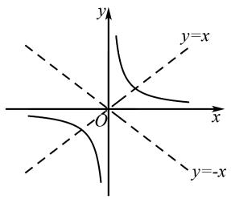
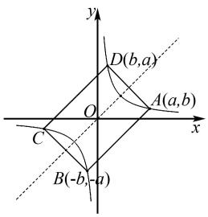
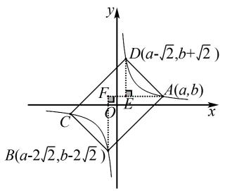
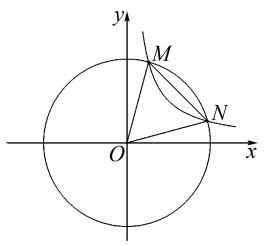
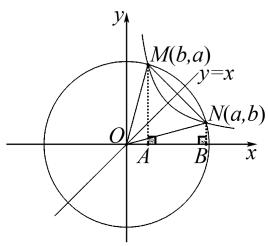

# 反比例函数图象的对称性在解题中的应用

郑伟超

(福建省漳州市第三中学, 福建 漳州 363000)

摘 要: 反比例函数图象的对称性是一个非常重要的性质, 在解题中发挥着重要作用. 为此, 笔者基于反比例函数图象的对称性, 分析该性质在解题中的应用, 并巧妙运用对称性快速求出点的坐标, 找到解题的突破口. 在教学过程中, 教师应重视培养学生的数形结合思想, 提高其解题能力.

关键词: 反比例函数; 对称性; 数形结合思想; 解题方法

中图分类号：G632

文献标识码: A

文章编号:1008-0333(2025)11-0059-03

反比例函数是初中数学中非常重要的内容,在初中数学解题中扮演着重要的角色. 反比例函数比一次函数更加抽象,学好反比例函数有助于学生建立数学思维,并为以后的学习奠定基础. 反比例函数图象是双曲线,而双曲线的对称性是反比例函数的教学重点. 在历年中考中,对反比例函数对称性的考查越来越多,题型越来越灵活. 因此,在反比例函数的解题教学过程中,教师应该适当渗透数形结合思想,通过图象直观理解对称性并学会应用,由此可以提高学生的解题能力 $^{[1]}$ . 笔者基于教学经验,探索反比例函数图象对称性的几点应用.

# 1 反比例函数图象的对称性

形如 $y = \frac{k}{x} (x \neq 0, k \neq 0)$ 的函数称为反比例函数. 通过反比例函数的学习, 易发现反比例函数的图象是双曲线, 如图1所示. 通过观察反比例函数图象以及列表数据, 可以直观地发现反比例函数的图象具有对称的性质. 对称性有两种, 一是中心对称性, 二是轴对称性, 而反比例函数图象正好拥有这两种对称性. 反比例函数图象的对称性: 一是关于原点对称, 即若有一点 $P(m, n)$ 在函数 $y = k / x$ 图象的一支上, 那么 $Q(-m, -n)$ 也在双曲线另一支上; 二是关

于直线 y = x 和直线 y = -x 对称, 即若有一点 $P(m, n)$ 在函数 $y = \frac{k}{x}$ 图象上, 那么点 $Q(n, m)$ 和 $(-n, -m)$ 也在该函数的图象上.

text_image

y
y=x
O
x
y=-x

图 1 反比例函数图象对称性示意图

在解题过程中,反比例函数的对称性应用非常广泛,对于“反比例函数与正比例函数结合问题”“反比例函数与对称图形结合”等相关问题可以利用对称性求解,从而使复杂问题简单化,抽象问题具体化,达到优化解题过程的目的 $^{[2]}$ .

# 2 反比例函数对称性在解题中的应用

反比例函数的图象较为抽象. 在初中数学教学中, 对于反比例函数问题, 如果只利用代数计算的方法求值解题, 那么学生的数学综合素质发展将会受到限制. 在初中数学解题中, 反比例函数图象的对称性体现了数形结合的思想方法, 能够使不同知识点之间融会贯通, 是全国各地历年中考的热点. 为此,教师应该采用多种教学方法培养学生的数学思维能力,指导学生在分析问题、解决问题中结合反比例函数图象的对称性解题.

例 1 在平面直角坐标系中, 直线 y = kx 与双曲线 $y = \frac{m}{x} (km > 0)$ 交于 A、B 两点. 若点 A、B 的纵坐标分别为 $y_{1}, y_{2}$ , 则 $y_{1} + y_{2}$ 的值为 \_\_\_\_.

解法1 已知点 $A, B$ 是直线 $y = kx$ 与双曲线 $y = \frac{m}{x}$ 的交点，则交点坐标即为方程组 $\left\{ \begin{array}{l} y = kx, \\ y = \frac{m}{x} \end{array} \right.$ 的解. 易得 $y^2 = km$ ，即 $y = \pm \sqrt{km}$ ，所以 $y_1 + y_2 = 0$ .

解法 2 直线 y = kx 和双曲线 $y = \frac{m}{x}$ 都关于原点对称, 因此它们的交点 A、B 即关于原点对称, 所以点 A、B 的纵坐标互为相反数, 即 $y_{1} + y_{2} = 0$ .

点评 本题的难度并不大,解法1是代数方法,通过联立方程组求出交点的坐标,然后计算 $y_{1}+y_{2}$ 的值.解法2根据正比例函数图象和反比例函数图象都关于原点对称的性质,得到这两个函数图象的交点坐标也关于原点对称,此方法省略了计算,更快地得到了结果.通常来说,当两个函数图象都关于原点对称时,那么这两个函数的交点也关于原点对称.利用这个结论可以实现“数”与“形”的转换,从而省略计算过程,使抽象的问题变得简单.

例 2 如图 2, 已知矩形 ABCD 的四个顶点在反比例函数 $y = \frac{k}{x} (k > 0)$ 的图象上, 且 AB = 4, AD = 2, 则 k 的值为 \_\_\_\_.

text_image

y
D(b,a)
O
A(a,b)
x
C
B(-b,a)

图2 例2图

解法 1 如图 2 所示, 因为矩形和双曲线图象既是轴对称图形又是中心对称图形, 矩形的四个顶点都在双曲线上, 所以它们的对称中心都是原点, 对称轴都是直线 y = x 和直线 y = -x，由此可得到点 A 和点 D 关于直线 y = x 对称，点 A 和点 B 关于直线 y = -x 对称。假设点 A 的坐标为 $(a, b)$ ，则 D 的坐标为 $(b, a)$ ，B 的坐标为 $(-b, -a)$ 。已知 AB = 4，AD = 2，由两点间的距离公式可以列出方程组 $\left\{\begin{aligned}\sqrt{(a + b)^{2} + (b + a)^{2}} &= 4, \\ \sqrt{(a - b)^{2} + (b - a)^{2}} &= 2,\end{aligned}\right.$ 即 $\left\{\begin{aligned}a^{2} + b^{2} + 2ab &= 8, \\ a^{2} + b^{2} - 2ab &= 2,\end{aligned}\right.$ 解得 $ab = \frac{3}{2}$ ，即 $k = \frac{3}{2}$ 。

解法2 如图3, 因为点 $A$ 和点 $D$ 关于直线 $y = x$ 对称, 点 $A$ 和点 $B$ 关于直线 $y = -x$ 对称, 所以直线 $y = x$ 垂直平分 $AD$ , 直线 $y = -x$ 垂直平分 $AB$ , 由此可以构造出两个分别以 $AD$ 和 $AB$ 为斜边的等腰直角三角形 $\triangle ADE$ 和 $\triangle ABF$ . 已知 $AB = 4, AD = 2$ , 所以 $AE = DE = \sqrt{2}, AF = BF = 2\sqrt{2}$ , 假设点 $A$ 的坐标为 $(a, b)$ , 则 $D$ 的坐标为 $(a - \sqrt{2}, b + \sqrt{2})$ , $B$ 的坐标为 $(a - 2\sqrt{2}, b - 2\sqrt{2})$ . 由点 $B$ 和点 $D$ 关于原点对称, 可以列出方程组 $\left\{ \begin{array}{l} (a - \sqrt{2}) + (a - 2\sqrt{2}) = 0, \\ (b + \sqrt{2}) + (b - 2\sqrt{2}) = 0, \end{array} \right.$ 解得 $\left\{ \begin{array}{l} a = \frac{3}{2}\sqrt{2}, \\ b = \frac{1}{2}\sqrt{2}, \end{array} \right.$ 所以 $k = ab = \frac{3}{2}$ .

text_image

y
D(a-√2,b+√2)
F
O
E
A(a,b)
x
C
B(a-2√2,b-2√2)

图 3 例 2 解法 2 示意图

点评 本题是典型的数形结合问题,其综合性强,需要学生从代数和几何角度出发综合分析.本题的突破点在于灵活应用矩形和反比例函数图象的轴对称及中心对称性.解法1先假设点A的坐标,再通过对称性推出点B和点D的坐标,巧妙地利用对称性得到点的坐标之间的数量关系,实现了几何性质代数化,最后计算得出结果.解法2从几何角度出发,在对称性的基础上,利用直线y=x与x轴的夹角为 $45^{\circ}$ 构造等腰直角三角形,然后借助等腰直角三角形边长关系设出三个点的坐标,最后利用点B、D关于原点对称列方程求解.

例 3 如图 4, 反比例函数 $y = \frac{k}{x} (k > 0)$ 图象与以原点 O 为圆心半径为 5 的圆交于 M、N 两点, 若 $\triangle MON$ 的面积为 3.5, 则 k = \_\_\_\_.

解析 如图 5, 因为 $\odot O$ 和双曲线都关于直线 y = x 对称, 则它们的交点 M、N 也关于直线 y = x 对称, 假设点 N 坐标为 $(a, b)$ , 则 M 坐标为 $(b, a)$ . 分别过点 M、N 作 x 轴的垂线, 垂足分别为 A、B, 则 $S_{\triangle MON} = S_{梯形MABN}$ , 从而可以列出方程 $(a - b)(a + b) = 7$ , 化简可得 $a^{2} - b^{2} = 7$ . 因为点 N 在半径为 5 的圆上, 所以 ON = 5, 所以可得 $\sqrt{a^{2} + b^{2}} = 5$ , 化简可得 $a^{2} + b^{2} = 25$ . 由此可得 $\left\{\begin{aligned}a^{2} - b^{2} &= 7, \\ a^{2} + b^{2} &= 25,\end{aligned}\right.$ 解得 a = 4, b = 3 或 a = 3, b = 4. 所以 k = ab = 12.

text_image

y
M
N
O
x

图4 例3图

text_image

y
M(b,a)
y=x
O
A
B
N(a,b)
x

图 5 例 3 解析示意图

点评 本题主要考查圆和反比例函数的有关知识. 圆是一个特殊图形, 它有无数条对称轴, 又是中心对称图形. 因此, 得到圆和双曲线的交点关于直线 y = x 对称, 根据对称性设出点 M、N 的坐标, 再巧妙利用与双曲线相关的面积性质和圆的半径列出方程组, 计算即可得出结果.

# 3 教学建议

# 3.1 经历作图过程,探索反比例函数图象对称性

在初中数学教学中,许多学生对反比例函数性质的学习停留在表面,通过“背”的形式记住它的性质,而不是通过函数图象理解性质,在解题过程中,学生又不能熟练地运用这些性质,长此以往,学生逐渐会对数学失去兴趣.在学习反比例函数图象时,教师应该让学生经历动手画反比例函数图象的过程,

直观感受其图象具有对称性,再鼓励学生用多种方法验证对称性.例如,学生可以参照列表数据,发现当横坐标互为相反数时,纵坐标也互为相反数,说明双曲线关于原点对称.假设点 $(a,b)$ 在反比例函数图象上,通过计算得到点 $(b,a)$ 也在此函数的图象上,说明双曲线关于直线y=x对称.借助几何画板,在反比例函数图象上任意找一个点P,连接OP,将线段OP绕点O旋转180°得到 $P'$ ,发现 $P'$ 也落在反比例函数的图象上.经过此过程,学生能够深刻理解反比例函数图象的对称性.

# 3.2 课堂训练由易到难,渗透数形结合思想

数形结合思想是一种重要的数学解题方法,它通过将抽象的数学语言与直观的图形结合起来,使抽象思维和形象思维相结合,用“图形”呈现“数量”关系.在函数教学中,数形结合思想的渗透具有深远影响.在课堂教学中,教师可先从简单的反比例函数对称性例题入手,培养学生的数形结合思想.其实,对于这类问题,学生通过观察图象就能得出答案.例如,在求解反比例函数与正比例函数图象交点问题时,图象能帮助学生快速地找出两个交点的坐标,并发现它们关于原点对称.与代数方法相比,这种数形结合的思想方法更高效.在处理反比例函数图象与常见的对称图形相结合的复杂问题时,教师需引导学生利用对称性寻找解题的突破口,帮助学生快速准确地把握问题的关键,从而提高解题效率.

# 4 结束语

对称性作为反比例函数最重要的性质之一,它可以帮助学生更直观、深入地理解反比例函数的图象.在初中数学教学中,让学生掌握并灵活运用反比例函数的对称性,对深化学生学习认知、提高学生数学思维水平、提升其解题能力具有积极意义.

# 参考文献：

[1] 郝志国. 数形结合思想在初中数学教学实践中的应用对策分析[J]. 考试周刊, 2021(69): 64-66.  
[2] 王小雨. 反比例函数图象的对称性在解题中的应用研究 [J]. 新课程导学, 2023(32): 91-94.

[责任编辑:李慧娇]