# 构思一题多解 实现深度学习

——以一道与圆有关的中考试题为例

# 张晓雷 陈 晨

(太仓市第一中学, 江苏 苏州 215400)

摘 要:在初中数学习题教学中,教师不仅要指导学生解决问题,更要引导学生尝试一题多解.这样不仅能够帮助学生厘清知识本质,使学生综合运用所学知识分析问题和解决问题,而且能够使学生突破思维常规,从不同视角解决问题,从而实现深度学习.

关键词: 初中数学; 一题多解; 深度学习

中图分类号：G632 文献标识码：A

文章编号:1008-0333(2025)11-0056-03

在初中数学中,一题多解是指从不同的视角出发分析问题,用多种方法解决问题.对学生而言,这不仅能促进其理解问题本质,还能发展其数学思维,更能激发其解题兴趣 $^{[1]}$ .笔者以一道与圆有关的中考试题为例,从不同视角展示问题的解法,帮助学生构思一题多解,实现深度学习.

# 1 原题再现

如图1,半圆 O 的直径 AB = 10, 弦 AC = 6, AD 平分 $\angle BAC$ , 则 AD 的长为 \_\_\_\_.

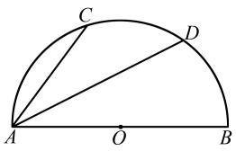

text_image

Geometric diagram of a semicircle with points A, B, C, D and center O, showing chords and radii

图 1 中考试题图

# 2 试题分析

本题是一道典型的圆的综合题,虽然难度不大,但是解法多种多样,能够激发学生的数学学习兴趣,培养学生的数学思维能力. 笔者从图形结构特征和所学知识两方面对此题进行简要分析.

# 2.1 从图形结构特征分析

从图形结构来看,图1由一个半圆和三条弦组成,一条弦AB是半圆的直径,一条弦AD是另外两条弦组成的圆周角的角平分线.直径可能用到的结论是“直径所对的圆周角是直角”,因而可能需要构造的辅助线是“连接BC,BD”,从而出现直角三角形,然后利用勾股定理解决问题.角平分线可能会应用的结论是“在同圆或等圆中,相等的圆周角所对的弧相等”,“在同圆或等圆中,相等的弧所对的弧相等”.因而可能需要构造的辅助线是“连接CD,BD”.角平分线和垂直同时出现,可能会遇到等腰三角形的“三线合一”基本模型.

# 2.2 从所学知识分析

如图 2, 连接 CD, BD, OD, BC, OD 交 BC 于点 N, AD 交 BC 于点 M. 根据垂径定理的逆定理, 因为 $\widehat{CD} = \widehat{BD}$ , 所以 $OD \perp BC$ . 根据角平分线的性质定理,

收稿日期:2025-01-15

作者简介: 张晓雷, 中学一级教师, 从事初中数学教学研究;

陈晨,中学高级教师,从事初中数学教学研究.

基金项目:苏州市教育科学院“十四五”教育规划2024年度课题“让学习真正发生的初中数学结构化教学的实践研究”(主持人:陈晨);苏州市教育科学“十四五”规划2021年度课题“深度学习视角下初中数学微专题设计的实践研究”(课题编号:2021/C/02/019/03).

因为 $\angle CAD = \angle BAD$ ，所以 $\frac{CM}{BM} = \frac{AC}{AB}$ 。根据图形结构特征，延长 AC, BD 可以得到等腰三角形。根据题目中的相等条件，可以得到全等三角形。

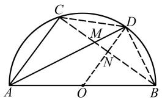

text_image

Geometric diagram of a semicircle with inscribed points and lines, labeled with letters A, B, C, D, O, M, N.

图 2 中考试题分析图

# 3 问题解决

# 3.1 视角 1: 结合“垂径定理的逆定理”

解法 1 如图 3, 连接 BC 交 AD 于 M 点, 连接 BD, 连接 OD 交 BC 于 N 点.

因为 AD 平分 $\angle BAC$ ，所以 $\angle CAD = \angle BAD$ ，所以 $\widehat{CD} = \widehat{BD}$ ，所以 $OD \perp BC$ ，所以 CN = BN。因为 O 是线段 AB 的中点，AC = 6，所以 $ON = \frac{1}{2} AC = 3$ 。因为 AB 为直径，所以 $\angle C = \angle D = 90^{\circ}$ 。因为 AC = 6，AB = 10，所以 BC = 8。因为 BN = 4，DN = 2，所以 BD = $\sqrt{4^{2} + 2^{2}} = 2\sqrt{5}$ ，所以 $AD = \sqrt{10^{2} - (2\sqrt{5})^{2}} = 4\sqrt{5}$ 。

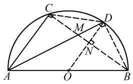

text_image

Geometric diagram of a semicircle with inscribed points and lines, labeled with letters A, B, C, D, O, M, N.

图3 解法1示意图

点评 这种解法利用垂径定理的逆定理得到半径 $OD \perp BC$ ，根据垂径定理得到线段 ON 是 $\triangle ABC$ 的中位线，最后在 $\triangle ABD$ 中利用勾股定理求得线段 AD 的长度.

# 3.2 视角 2: 结合“角平分线定理”

解法2 如图4, 连接 $BC$ 交 $AD$ 于 $M$ 点, 连接 $BD$ , 过点 $M$ 作 $MN \perp AB$ . 因为 $AD$ 平分 $\angle BAC$ , 所以 $\angle CAD = \angle BAD$ , 所以 $\frac{CM}{BM} = \frac{AC}{AB}$ . 因为 $AC = 6$ , $AB = 10$ , 所以 $BC = 8$ , 所以 $CM = 3$ , $BM = 5$ , 所以 $AM = \sqrt{3^2 + 6^2} = 3\sqrt{5}$ . 因为 $AB$ 为直径, 所以 $\angle C = \angle D = 90^\circ$ . 因为 $MN \perp AB$ , 所以 $CM = MN = 3$ . 因为 $S_{\triangle ABM} = S_{\triangle ABM}$ , 所以 $\frac{1}{2} MN \cdot AB = \frac{1}{2} AM \cdot BD$ , 所以 $BD = 2$

$\sqrt{5}$ , 所以 $AD = \sqrt{10^2 - (2\sqrt{5})^2} = 4\sqrt{5}$ .

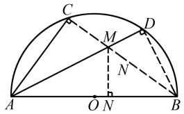

text_image

C
M
D
N
A
O N
B

图 4 解法 2 示意图

解法3 如图5, 连接 $BC$ 交 $AD$ 于 $M$ 点, 连接 $BD$ . 因为 $AD$ 平分 $\angle BAC$ , 所以 $\angle CAD = \angle BAD$ , 所以 $\frac{CM}{BM} = \frac{AC}{AB}$ . 因为 $AC = 6, AB = 10$ , 所以 $BC = 8$ , 所以 $CM = 3, BM = 5$ , 所以 $AM = 3\sqrt{5}$ . 因为 $AB$ 为直径, 所以 $\angle C = \angle D = 90^\circ$ . 因为 $\angle AMC = \angle BMD$ , 所以 $\triangle ACM \sim \triangle BDM$ , 所以 $\frac{CM}{DM} = \frac{AM}{BM}$ , 所以 $\frac{3}{DM} = \frac{3\sqrt{5}}{5}$ , 所以 $DM = \sqrt{5}$ , 所以 $AD = 3\sqrt{5} + \sqrt{5} = 4\sqrt{5}$ .

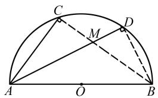

text_image

Geometric diagram of a semicircle with points A, B, C, D, M, O and labeled line segments and angles

图5 解法3示意图

解法 4 如图 6, 连接 CD, 连接 BC 交 AD 于 M 点. 因为 AD 平分 $\angle BAC$ , 所以 $\angle CAD = \angle BAD$ , 所以 $\frac{CM}{BM} = \frac{AC}{AB}$ . 因为 AC = 6, AB = 10, 所以 BC = 8, 所以 CM = 3, BM = 5, 所以 $\triangle ADC \sim \triangle ABM$ , 所以 $\frac{AC}{AM} = \frac{AD}{AB}$ , 所以 $\frac{6}{6\sqrt{5}} = \frac{AD}{10}$ , 所以 $AD = 4\sqrt{5}$ .

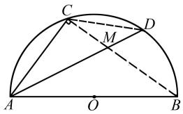

text_image

Geometric diagram of a semicircle with inscribed points and lines, labeled with points A, B, C, D, M, O

图 6 解法 4 示意图

点评 这种解法根据“等弧对等角”和角平分线性质得到等角,再根据角平分线定理得到 CM 和 BM 的长度,最后借助相似三角形的性质求得线段 AD 的长度.

# 3.3 视角 3: 构造“等腰三角形”

解法 5 如图 7, 连接 BC 交 AD 于 M 点, 延长 AC、BD 交于 N 点. 因为 AB 为直径, 所以 $\angle C = \angle D = 90^{\circ}$ .

因为 AD 平分 $\angle BAC$ ，所以 $\angle CAD = \angle BAD$ ，所以 $\angle N = \angle ABN$ ，所以 AB = AN = 10，所以 DN = BD。因为 AC = 6，所以 CN = 4, BC = 8，所以 $BN = \sqrt{4^{2} + 8^{2}} = 4\sqrt{5}$ ，所以 $BD = 2\sqrt{5}$ ，所以 $AD = \sqrt{10^{2} - (2\sqrt{5})^{2}} = 4\sqrt{5}$ 。

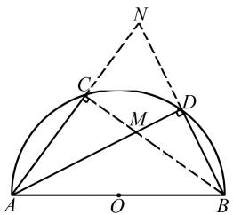

text_image

Geometric diagram of a semicircle with points A, B, C, D, M, N and labeled lines and right-angle markers

图 7 解法 5 示意图

解法6 如图8, 连接 $CD, BD$ , 连接 $BC$ 交 $AD$ 于 $M$ 点, 延长 $AC, BD$ 交于 $N$ 点, 过点 $D$ 作 $DP \perp CN$ . 因为 $AB$ 为直径, 所以 $\angle C = \angle D = 90^{\circ}$ . 因为 $AD$ 平分 $\angle BAC$ , 所以 $\angle CAD = \angle BAD$ , 所以 $\angle N = \angle ABN$ , 所以 $AB = AN = 10$ , 所以 $DN = BD$ . 因为 $AC = 6$ , 所以 $CN = 4, BC = 8$ , 所以 $BN = 4\sqrt{5}$ , 所以 $CD = 2\sqrt{5}$ . 因为 $DP \perp CN$ , 所以 $CP = PN = \frac{1}{2}CN = 2$ , 所以 $AP = 8, DP = 4$ , 所以 $AD = \sqrt{4^{2} + 8^{2}} = 4\sqrt{5}$ .

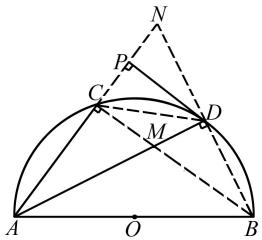

text_image

Geometric diagram with labeled points and lines, including a semicircle and triangles

图8 解法6示意图

点评 这种解法根据角平分线和垂直得到等腰三角形,再推得 $\triangle CDN$ 也是等腰三角形,结合“三线合一”,得到CP=PN=2,最后在 $\triangle AND$ 中利用勾股定理求得线段AD的长度.

# 3.4 视角 4: 构造“全等三角形”

解法 7 如图9, 在直径 AB 上截取 $AC' = AC$ , 连接 $C'D, DB$ , 连接 BC 交 AD 于 M 点, 过点 D 作 $DN \perp AB$ . 因为 AB 为直径, 所以 $\angle ACB = \angle ADB = 90^{\circ}$ . 因为 AD 平分 $\angle BAC$ , 所以 $\angle CAD = \angle BAD$ , 所以 CD = BD. 因为 $AC = AC', AD = AD$ , 所以 $\triangle ACD \cong \triangle AC'D$ , 所以 $CD = C'D$ , 所以 $C'D = BD$ , 所以 $C'N = BN = 2$ . 因为 $\triangle AND \sim \triangle DNB$ , 所以 $DN^{2} = AN \cdot BN$ , 所

以 DN=4，所以 $AD=\sqrt{4^{2}+8^{2}}=4\sqrt{5}$ .

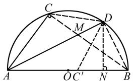

text_image

Geometric diagram of a semicircle with inscribed points and auxiliary lines, labeled with letters A, B, C, D, M, N, O, and C'.

图9 解法7示意图

解法 8 如图 10, 过 O 点作 $OM \perp AC$ , 连接 OD, 过点 D 作 $DN \perp AB$ . 因为 AD 平分 $\angle BAC$ , 所以 $\angle CAD = \angle BAD$ , 所以 $\angle CAB = \angle BOD$ . 因为 $DN \perp AB, OM \perp AC$ , 所以 $\angle AMO = \angle OND = 90^{\circ}$ . 因为 OA = OD, 所以 $\triangle AOM \cong \triangle DON$ , 所以 AN = ON, OM = DN. 因为 AC = 6, $OM \perp AC$ , 所以 AM = 3, 所以 OM = 4, 所以 ON = 3, DN = 4, 所以 $AD = \sqrt{4^{2} + 8^{2}} = 4\sqrt{5}$ .

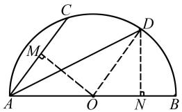

text_image

Geometric diagram of a semicircle with inscribed points and perpendicular lines, labeled with letters A, B, C, D, M, N, O.

图 10 解法 8 示意图

解法9 如图11,延长AB到M,使得BM=AC,连接CD,DB,DM,过点D作DN⊥AB.因为CD=BD, $\angle C=\angle DBM$ ,BM=AC,所以 $\triangle ACD\cong\triangle MBD$ ,所以AD=DM.因为AC=6,AB=10,所以AN=MN=8,所以BN=2,所以 $\triangle ADN\sim\triangle DBN$ ,所以DN=4,所以 $AD=\sqrt{4^{2}+8^{2}}=4\sqrt{5}$ .

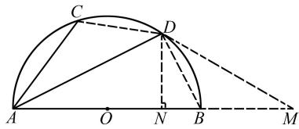

text_image

Geometric diagram showing a semicircle with points A, B, C, D, M, N and auxiliary lines, including right-angle markers.

图 11 解法 9 示意图

# 4 结束语

在初中数学解题过程中,问题的每一种解法都像是一扇等待开启的大门,学生要用心地多思考、多研究、多交流通过一题多解,实现深度学习.

# 参考文献：

[1] 彭亚, 高明. 着手特殊角度, 一题多解 [J]. 中学数学, 2022(17): 67-68.

[责任编辑:李慧娇]