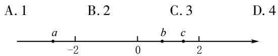
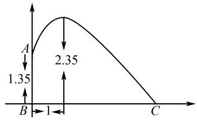
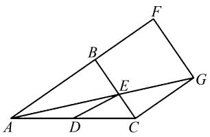

# 浅谈数形结合思想在初中数学解题中的运用

康丽玉

(漳州第一中学, 福建 漳州 363000)

摘 要:数学作为初中阶段核心课程之一,其内容主要涵盖“数”与“形”两个方面,两者之间存在着紧密的内在联系,这种联系体现为数形结合思想.在初中数学教学过程中,数形结合思想不仅适用于理论知识的传授,而且在解题方面也具有重要作用.因此,教师应引导学生在解题中运用数形结合思想,以此提升分析问题和解决数学问题的能力,促进其全面发展.

关键词: 数形结合思想; 初中数学; 解题; 运用

中图分类号：G632

文献标识码：A

文章编号:1008-0333(2025)11-0023-03

在数学的世界里,数形结合思想扮演着极其重要的角色,这种方法不仅因其广泛的适用性而倍受推崇,更因其强大的实用性成为解决数学问题的有效手段之一.在初中数学教学过程中,教师应当引导学生根据具体的问题情境,灵活运用数形结合思想,通过这种方法将复杂抽象的数学问题转化为更加简洁明了的形式,从而降低问题的难度.这不仅能够帮助学生轻松破解难题,还能够提升其思维的敏锐性和灵活性.通过数形结合,学生能够更好地理解数学概念,提高分析问题和解决问题的能力,这对于学生数学学习和未来发展具有重要的现实意义.

# 1 数形结合思想的含义

在数学应用实践中,数形结合思想既是一种逻辑思维方式,也是解决数学问题的基础策略.从其内涵分析,它涵盖“数”与“形”两个核心要素.“数”指的是数学领域的专业术语,包括理论框架、基本定义及定理等,它们构成了数学的基础;“形”则代表几何学中的图形表达,在教材中通常以图象与数字的融合形式展现,反映出数学学科的本质.通过将两者交融整合,构建“数推形”“数释形”“形辅数”“形译数”等多维互动机制,进而简化数学问题的复杂性,将理论抽象转化为具体形象 $^{[1]}$ .

# 2 数学解题中运用数形结合思想的意义

# 2.1 增强数学解题教学的趣味性

在初中阶段,数学课程的核心在于探讨数量之间的抽象联系及空间概念之间的相互关系.因此,在此阶段应优先培养学生的逻辑推理及空间想象能力,这对于其梳理解题思路极为关键.然而,观察当前学生学习情况发现,许多学生在这两种能力上存在短板,其在处理抽象的数量关系和空间结构时,往往找不到解决问题的着手之处,导致解题迷茫,这无疑会打击其学习数学的自信心.在数学解题教学中,引入数形结合思想,有助于指导学生从多个维度审视“数”与“形”之间的关联,探寻正确的解题方法.这种思维模式不仅使得解题过程变得更加有趣和富有探索性,还能让学生在运用数形结合解决复杂问题时,感受到学习的成就感 $^{[2]}$ .

# 2.2 增强数学解题思维的灵活性

数形结合思想在数学解题中的应用,主要体现在两个方面:一是通过“形辅数”的方式,借助图形的直观性阐述数量关系的抽象概念,进而转变思维方式,拓宽解题思路;二是采用“数助形”的方法,运用严谨的数学关系简化复杂的几何形状,能够减少解题的复杂性.将“数”与“形”巧妙结合,不仅能够使解题思路变得更加灵活,而且可以使学生从多个角度审视各类题型,实现举一反三、多角度解答问题的目的.同时,这种数学与几何相结合的思维模式,不仅能够提高学生解决问题的效率,也有助于锻炼其逻辑推理能力,增加思维的灵活性和创造性.

# 3 数形结合思想在数学解题中的运用路径

# 3.1 利用数形结合思想解决数轴问题

在探索解决数轴相关问题时,学生应当深入理解数轴的基本概念,并能够灵活运用数形结合思想解决问题.依据数轴的基本特性,可以发现数轴上各点所代表的数自左向右递增.由此可推断,位于数轴右侧的点所代表的数与左侧点所代表数值之差必然为正数.实数的绝对值反映的是该数在数轴上对应点到原点的距离,若数轴上表示实数的点与原点的位置关系不明确,则需借助图形分类探讨.

例 1 在数轴上,有理数 a, b, c 三点的位置如图 1 所示, 给出下列结论: ① abc < 0; ② $\left|a - b\right| + \left|b - c\right| = \left|a - c\right|$ ; ③ $(a - b)(b - c)(c - a) > 0$ ; ④ $\left|a\right| < 2 - bc$ . 这些结论中, 正确的有( )个.

text_image

A. 1
B. 2
C. 3
D. 4
a
-2
0
b
c
2

图1 例1图

解析 从图1中可推断出 $a < -2 < 0 < b < c < 2$ ，因此 $abc < 0$ ，从而确定①正确；进一步分析可得 $|a - b| + |b - c| = -a + b - b + c = c - a$ ，同时 $|a - c| = -(a - c) = c - a$ ，由此证明 $|a - b| + |b - c| = |a - c|$ ，即命题②正确；由于 $a - b < 0, b - c < 0, c - a > 0$ ，可以推出 $(a - b)(b - c)(c - a) > 0$ ，故命题③正确；因为 $|a| > 2$ ，且 $2 - bc < 2$ ，得出 $|a| > 2 - bc$ ，所以命题③错误。所以正确的结论命题为①②③，故选择C。在知识点方面分析，基于有理数 $a, b, c$ 在数轴上的位置关系，可以得出 $a < -2 < 0 < b < c < 2$ ，进而推出 $a - b < 0, b - c < 0, c - a$

>0, $|a| > 2, 2 - bc < 2$ . 利用有理数的乘法法则可验证命题①③的正确性; 对于命题②, 通过绝对值性质, 对等式两边进行化简并比较即可得出结论; 对于命题④, 则可通过有理数大小比较得出结论.

# 3.2 用数形结合思想解决不等式(组)的问题

在初中数学教学中,不等式是基础知识框架的重要组成部分,也是培养数学逻辑思维的重要载体.若教师仅以文字形式解释不等式的基本含义与定义,则难以激发学生深入思考,从而使学生学习停留在表面层次 $^{[3]}$ .鉴于此,在不等式问题教学中,教师应引导学生借助数形结合思想探寻解题策略,增强学生的学习深度,提高学习效果.

例 2 若不等式组 $0 \leqslant x^{2} + ax + 4 \leqslant 2$ 有唯一解，求 a 的值.

分析 在缺乏图形信息的情况下,大多数学生倾向于直接计算而非借助图形分析问题.实际上,利用代数方法分析此类问题,不仅过程繁琐,而且容易引起思维上的混乱.因此,教师应该引导学生运用数形结合的思维方式分析此不等式组.具体来说,可以将不等式组分解成三个方程,分别是 $y=x^{2}+ax+4$ ,y=0和y=2,通过这一转化,学生可以考虑利用图形揭示这三个方程的关系.在图形绘制过程中,学生能够发现只要抛物线与直线恰好有一个交点,即可满足题目所述的“唯一解”条件.

利用数形结合的方法,学生不仅能够深入理解图形与方程之间的转换关系,而且在绘制图形的过程中,学生的解题思路也会变得更加明确.

# 3.3 用数形结合思想解决函数的问题

在解决实际函数问题时,学生经常难以迅速构建解题思路,其根源在于学生未能有效识别空间形式与数量关系之间的相互作用点. 函数问题本质上融合了代数与几何知识,构成了一种综合性的数学问题. 因此,针对此类问题,教师应当指导学生采用数形结合的思维方式,借助“形”辅助“数”的方法分析问题,从而迅速定位解题的关键点 $^{[4]}$ .

例 3 在羽毛球训练中,已知运动员小辉身高为 1.35 m, 将其标记为 AB, 在羽毛球被击出后, 其飞行的最高点达到了 2.35 m, 如图 2 所示. 若羽毛球与小辉之间的水平距离恰好为 1 m, 那羽毛球的落点 C 与小辉站立点 B 之间的水平距离约是多少?

解析 由图2可知，B点到C点的距离实际上是线段BC的长，显然需确定点C的坐标.通过观察图象，学生能够更快地对此问题形成直观的理解.显然，抛物线的顶点坐标为(1,2.35)，点A的坐标为(0,1.35)，故可采用待定系数法求抛物线的表达式.设 $y=a(x-1)^{2}+2.35$ ，将 $A(0,1.35)$ 代入此表达式即可求得a的值，从而可得到抛物线的表达式.然后令y=0，得到关于x的一元二次方程，通过解方程可得到点C的横坐标，进而求得线段BC的长.

在利用数形结合法解题时,教师需指导学生借助图象精确地判定数量关系,培养其解题能力.

line

| Point | Value |
|---|---|
| A | 1.35 |
| B | 1 |
| C | 2.35 |

图 2 羽毛球运动轨迹图

# 3.4 用数形结合思想解决几何的问题

在数形结合解题策略中,不等式与函数问题常需采用“形辅数”的思路解析,而综合问题的解决则需借助“数助形”的思维方式.几何问题本质上是依据几何定理,在给定条件与信息的基础上,通过逻辑分析推导出结论.此类问题的主要难点在于,即便学生熟悉相关几何定理,也不一定能够准确地写出证明过程.针对这一情况,教师需指导学生细致审视题目中所给出的条件与结论,将数量关系转化为空间关系,并通过逆向思维进行验证,以此理清解题思路.在具体解题过程中,学生在面对复杂的综合图形时,经常会感到无从下手,针对此类情形,教师应引导学生将错综复杂的图形分解为若干个简单图形,从而提炼出关键信息,简化问题本质.通过这种方式,学生可以体会到如何将数学问题图形化,从而找出解题思路.例如,在几何证明中,通过对数量关系的深入分析,可以确立三角形之间的相似性.在初中数学学习中,利用数形结合的思维方式,有助于高效且合理地完成几何问题的证明过程.

例 4 如图 3 所示, 四边形 BCGF 是正方形, 在 $\triangle ABC$ 中, $\angle ABC$ 为直角, 线段 AG 与 BC 相交于点E, 点 D 在线段 AC 上, 且 $DE \parallel AB$ . 求证: BE = DE.

text_image

Geometric diagram with labeled points A, B, C, D, E, F, G forming triangles and intersecting lines

图3 例4图

解析 由图3可知,线段BE是△ABE的边,线段DE是△ADE的边,图形较为复杂,教师可以引导学生将这个复杂图形拆分为两个简单的三角形,然后利用图中丰富的平行线关系构建有关线段之间的等量关系.在证明BE=DE的过程中,可以利用比例线段的特性进行逻辑推演和验证.具体思路如下:首先证明 $\triangle ACG\sim\triangle ADE$ ,由此可导出DE:CG=AE:AG.其次,证明 $\triangle AEB\sim\triangle AGF$ ,从而得出BE:FG=AE:AG,进而推出DE:CG=BF:FG.在正方形BCGF中,CG=FG,由此可得出BE=DE.

# 4 结束语

在初中数学题中,数形结合是一种非常实用且高效的思考方式,这种思想的核心在于将“数”与“形”这两个基本要素融合在一起.教师应当指导学生针对不同题目的特点,恰当运用“数”“形”转化或“形”“数”互证的技巧,利用“数”“形”间的转换与互动探寻解题的入手点,进而构建出清晰的解题思路,从而提升解题效率和解题的准确性.

# 参考文献：

[1] 秦佑春. 初中数学解题中数形结合思想的应用 [J]. 数理天地(初中版), 2024(23): 33-34.  
[2] 张晓莉. 数形结合思想在初中数学教学中的应用 [J]. 学周刊, 2024(18): 91-93.  
[3] 沙俊娥. 关于数形结合思想在初中数学解题中的应用探究 [J]. 数理天地 (初中版), 2024(14): 33-34.  
[4] 王文明. 数形结合思想在初中数学解题中的运用: 以初中函数问题为例 [J]. 数理天地 (初中版), 2024(15): 22-23.

[责任编辑:李慧娇]