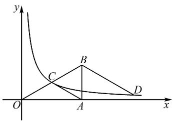
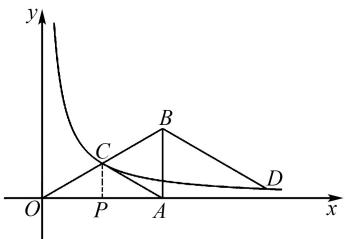
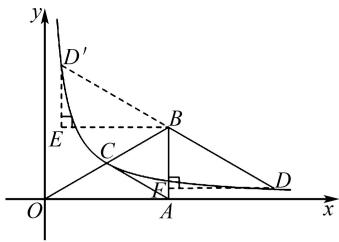

# 立足基本图形 聚焦核心素养

——2023年安徽省中考数学第14题解法探究

# 管月梅 张新全

(合肥师范学院数学与统计学院, 安徽 合肥 230601)

摘 要:2023年安徽中考数学第14题是填空题中的一道压轴题,其综合性较强,特别是问题(2)有一定难度,对学生的核心素养要求较高.基于此,文章利用勾股定理、相似三角形的判定与性质、三角函数等知识和方法,给出此题问题(2)的4种解法,以此提高学生运用所学知识分析问题和解决问题的能力,提升学生的数学核心素养.

关键词: 基本图形; 核心素养; 反比例函数; 解法探究

中图分类号：G632

文献标识码：A

文章编号:1008-0333(2025)11-0017-03

数学核心素养是育人价值的集中彰显,是学生经由数学学习逐步塑造而成的正确价值观念、必备品格与关键能力.《义务教育数学课程标准(2022年版)》明确指出,初中数学教学需以核心素养培养为目标,不断提升学生分析问题、解决问题和数学综合运用的能力.基于此,笔者立足基本图形,对2023年安徽省中考数学第14题的解法展开探究,供读者参考.

# 1 试题呈现

(2023 年安徽省中考数学试卷第 14 题) 如图 1, O 是坐标原点, Rt△OAB 的直角顶点 A 在 x 轴的正半轴上, AB = 2, ∠AOB = 30°, 反比例函数 $y = \frac{k}{x}$ (k > 0) 的图象经过斜边 OB 的中点 C.

(1) $k =$ \_\_\_\_;

(2) D 为该反比例函数图象上的一点, 若 $DB \parallel AC$ , 则 $OB^{2} - BD^{2}$ 的值为 \_\_\_\_.

本题是一道以反比例函数为背景的综合题,全

text_image

y
C
B
D
O
A
x

图 1 中考题图

面考查反比例函数图象与性质、直角三角形的性质、待定系数法求函数解析式及勾股定理的应用等知识与方法 $^{[1]}$ . 本题构思巧妙, 将反比例函数的图象与三角形巧妙融合, 深入考查学生的推理能力、运算能力和几何直观等数学核心素养, 可以从不同角度采用不同的方法探究问题的不同解法. 问题(1)较为简单, 笔者主要探究问题(2)的解法. 对于问题(1), 根据特殊直角三角形的边角关系, 可求得 A、B 两点坐标, 再求出点 C 的坐标, 代入解析式即可求得 k 的值. 解决问题(2)的关键是求点 D 的坐标, 需要分两种情况讨论求解, 其求解方法具有多样性, 体现了解题思路的发散性, 能够全面考查学生的数学核心素养.

# 2 解法探究

# 2.1 第(1)问的解答

在 Rt△OAB 中, 因为 AB = 2, ∠AOB = 30°, 所以 OB = 4, OA = 2√3, 故 A(2√3, 0), B(2√3, 2). 因为 C 是 OB 的中点, 所以 OC = BC = AC = 2. 如图 2, 过点 C 作 CP⊥OA 于点 P, 易知 △OPC ≅ △APC(HL), 所以 OP = AP = $\frac{1}{2}$ OA = √3. 在 Rt △OPC 中, PC = $\sqrt{OC^{2} - OP^{2}} = \sqrt{4 - 3} = 1$ , 所以 C(√3, 1). 因为反比例函数 $y = \frac{k}{x} (k > 0)$ 的图象经过斜边 OB 的中点 C, 所以 $1 = \frac{k}{\sqrt{3}}$ , 故 $k = \sqrt{3}$ .

text_image

y
C
B
O
P
A
x
D

图 2 第(1)问解法示意图

解决本小题的关键是求出点 C 的坐标, 也可利用 PC 是 Rt△OAB 的中位线求得点 C 的坐标. 不作辅助线 PC, 还可以利用中点坐标公式求点 C 的坐标, 但是中点坐标公式不是初中数学的基本公式.

# 2.2 第(2)问的解法探究

解法1 设直线 $AC$ 的解析式为 $y = kx + b (k \neq 0)$ , 则 $\left\{ \begin{array}{l} 2\sqrt{3}k + b = 0, \\ \sqrt{3}k + b = 1. \end{array} \right.$ 解得 $\left\{ \begin{array}{l} k = -\frac{\sqrt{3}}{3}, \\ b = 2. \end{array} \right.$ 从而可知直线 $AC$ 的解析式为 $y = -\frac{\sqrt{3}}{3}x + 2$ . 因为 $AC // BD$ , 所以可得直线 $BD$ 的解析式为 $y = -\frac{\sqrt{3}}{3}x + 4$ . 因为点 $D$ 既在反比例函数的图象上, 又在直线 $BD$ 上, 所以联立 $\left\{ \begin{array}{l} y = \frac{\sqrt{3}}{x}, \\ y = \frac{\sqrt{3}}{3}x + 4. \end{array} \right.$ 解得 $\left\{ \begin{array}{l} x_1 = 2\sqrt{3} + 2, \\ y_1 = 2 - \sqrt{3}; \end{array} \right.$ 故点

$D$ 的坐标为 $(2\sqrt{3} + 2, 2 - \sqrt{3})$ 或 $(2\sqrt{3} - 2, 2 + \sqrt{3})$ .

① 当 D 的坐标为 $(2\sqrt{3} + 2, 2 - \sqrt{3})$ 时， $BD^{2} = (2\sqrt{3} + 3 - 2\sqrt{3})^{2} + (2 - 2 + \sqrt{3})^{2} = 9 + 3 = 12$ ，所以 $OB^{2} - BD^{2} = 16 - 12 = 4$ .

② 当 D 的坐标为 $(2\sqrt{3}-2,2+\sqrt{3})$ 时， $BD^{2}=(2\sqrt{3}-2\sqrt{3}+3)^{2}+(2+\sqrt{3}-2)^{2}=9+3=12$ ，所以 $OB^{2}-BD^{2}=16-12=4$ .

综上可得, $OB^{2}-BD^{2}=4.$

解法 2 前面同解法 1, 求得点 D 的坐标为 $(2\sqrt{3} + 2, 2 - \sqrt{3})$ 或 $(2\sqrt{3} - 2, 2 + \sqrt{3})$ .

①当 $D$ 的坐标为 $(2\sqrt{3} + 2, 2 - \sqrt{3})$ 时，作 $DF \perp BA$ 于点 $F$ ，如图3所示.由(1)可知 $\angle BOA = \angle CAO = 30^{\circ}$ ， $\triangle ABC$ 是正三角形，因为 $DB \parallel AC$ ，所以 $\angle BDF = \angle BOA = 30^{\circ}$ .因为 $DF \perp BA$ ，所以 $\angle BFD = \angle BAO = 90^{\circ}$ ，所以 $\triangle BFD \sim \triangle ABO$ ，所以 $\frac{BD}{BO} = \frac{DF}{OA}$ 即 $\frac{BD}{4} = \frac{3}{2\sqrt{3}}$ 即 $BD = 2\sqrt{3}$ .又 $OB = 4$ ，所以 $OB^{2} - BD^{2} = 16 - 12 = 4.$

text_image

y
D'
E
C
B
F
O
A
x
D

图3 第(2)问解法图

②当 D 的坐标为 $(2\sqrt{3}-2,2+\sqrt{3})$ 时，同理可得， $OB^{2}-BD^{2}=16-12=4$ .

综上可得, $OB^{2}-BD^{2}=4.$

解法 3 前面同解法 1, 求得点 D 的坐标为 $(2\sqrt{3} + 2, 2 - \sqrt{3})$ 或 $(2\sqrt{3} - 2, 2 + \sqrt{3})$ .

①当 D 的坐标为 $(2\sqrt{3} + 2, 2 - \sqrt{3})$ 时，易知 $\angle BDF = 30^{\circ}, BF = \sqrt{3}$ . 在 Rt $\triangle BDF$ 中，根据三角函数的定义可知 $\sin \angle BDF = \frac{BF}{BD}$ ，即 $\frac{\sqrt{3}}{BD} = \frac{1}{2}$ ，所以 BD = $2\sqrt{3}$ . 又 OB = 4，所以 $OB^{2} - BD^{2} = 16 - 12 = 4$ .

②当 D 的坐标为 $(2\sqrt{3}-2,2+\sqrt{3})$ 时，同理可得， $OB^{2}-BD^{2}=16-12=4$ .

综上可得, $OB^{2}-BD^{2}=4.$

解法 4 设 $BD = m (m > 0)$ ，则 $DF = \frac{\sqrt{3}}{2}m$ ， $BF=\frac{1}{2}m$ ，所以 $D\left(2\sqrt{3}+\frac{\sqrt{3}}{2}m,2-\frac{m}{2}\right)$ 。因为点 D 在反比例函数图象上，所以 $(2\sqrt{3}+\frac{\sqrt{3}}{2}m)\times(2-\frac{m}{2})=\sqrt{3}$ ，解得 $m=2\sqrt{3}$ ，所以 $OB^{2}-BD^{2}=4^{2}-m^{2}=4$ 。

另外一种情况, 点 D 在 AB 的左侧, 如图 3 所示, 可得同样答案, 此处从略.

# 3 教学启示

# 3.1 聚焦核心素养,提升运算能力

运算能力主要是指根据法则和运算律进行正确运算的能力. 根据《义务教育数学课程标准(2022年版)》要求, 认真分析问题的条件, 选择恰当的运算途径, 是培养初中生运算能力的关键. 本题的两问均是计算题, 需要通过一系列的推理与计算方能完成. 从本质上来说, 初中数学的学习离不开计算. 计算是一项基础能力, 也是初中教学中的重点与难点. 运算能力有助于学生形成规范化思考问题的品质, 养成一丝不苟、严谨求实的科学态度. 首先, 教师要重视数学运算, 使学生牢固掌握运算所需要的定义、公式、法则和一些常用数据, 并能够灵活运用. 在解决本题的过程中, 如果学生熟练掌握勾股定理、相似三角形、三角函数等知识点, 则有利于问题的解决. 其次, 教师要注意对学生进行推理训练, 强化学生运算能力. 最后, 教师要帮助学生克服思维定式, 灵活进行运算.

# 3.2 聚焦核心素养,渗透推理观念

推理能力主要是指从一些事实和命题出发,依据规则推出其他命题或结论的能力.推理能力有助于学生养成重论据、合乎逻辑的思维习惯,形成实事求是的科学态度.在解决本题第(2)问时,学生需利用方程的思想求出点D的坐标,进而借助相似三角形的性质构造辅助线,从而突破解决问题的关键.在现代数学教学论中,数学教学被强调为思维活动的教学,而数学思维活动的核心又是数学推理,因此,在数学教学中培养学生推理能力是不可忽视的.首先,教师要帮助学生在课前做好学习有关知识的准备;其次,教师要为学生创设问题情境,提高学生学习的积极性;最后,教师要有目的、有计划地对学生进行推理训练,提高学生的逻辑推理能力.

# 3.3 聚焦核心素养,培养抽象能力

抽象能力主要是指通过对现实世界中数量关系与空间形式的抽象,得到数学研究对象,形成数学概念、性质、法则和方法的能力. 感悟数学抽象对于数学产生与发展的作用,感悟用数学的眼光观察现实世界的意义,有助于形成数学想象力,提高学习数学的兴趣. 初中数学中涉及一些较为复杂的概念,需要学生具备良好的抽象能力. 首先,教师要利用生活实例,促使学生理解抽象知识;其次,教师要引导学生通过自主实践将抽象的数学概念具体化;最后,教师要能借助信息技术将抽象的数学概念直观展现出来.

# 3.4 聚焦核心素养,注重模型观念

模型观念主要是指对运用数学模型解决实际问题有清晰的认识. 在 2023 年安徽省中考数学第 14 题中, 学生对相似三角形模型和全等三角形模型的建构, 有利于拓宽学生解决问题的眼界. 在作答此类问题时, 要善于利用辅助线转化已知边, 有效利用题中所给的条件解答. 模型观念有助于学生开展跨学科主题学习, 促使学生感悟数学应用的普遍性.

# 4 结束语

在初中数学教学过程中,需进一步提升学生的几何直观与空间想象能力,强化学生运用图形和空间想象思考问题的意识 $^{[2]}$ .不但要让学生借助运算推动数学思维发展,养成程序化思考问题的习惯,切实提高学生解决实际问题的能力,而且应让学生针对问题构建数学模型,运用数学知识求解模型,进而增强创新意识,培育学生的数学模型观念.

# 参考文献：

[1] 金奎, 章昀. 立足素养重思维减负提质重基础: 2023 年安徽省中考数学试卷评析 [J]. 中学数学教学, 2023(5): 70-73.  
[2] 李亚文, 张新全, 邹守文. 2022 年安徽中考数学试卷第 14 题解法探究 [J]. 中学数学, 2023 (6): 73-75.

[责任编辑:李慧娇]