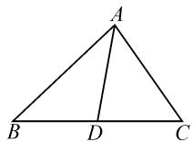
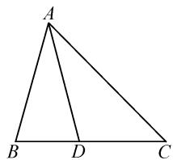
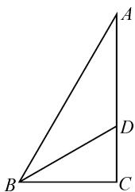

# “爪”型三角形重要结论的证明及其应用

# ● 安徽省巢湖市第一中学 范光龙

摘要:通过证明揭示“爪”型三角形的三个重要结论,并以两道例题为例,探究“爪”型三角形的三个重要结论的具体应用,以培养学生的直观想象、数学运算等核心素养.

关键词: 爪型三角形; 三个结论; 解三角形

如图 1 所示,给出的是“爪”型三角形示意图(其中点 D 在边 BC 上,且与端点不重合).由于此类解三角形问题在教材例习题以及模拟题、高考题中比较常见,且又能较好地考查学生的数形结合能力及运算求解能力,所以关注“爪”型三角形对应的几个重要结论,有助于相关问题的顺利求解 $^{[1]}$ .

  
图1

# 1 “爪”型三角形重要结论及其证明

重要结论 1: 在 $\triangle ABC$ 中, 已知点 D 在边 BC 上, 且与端点不重合, 连接 AD, 若 $\angle BAD = \alpha, \angle DAC = \beta$ , 则有 $\frac{\sin \alpha}{AC} + \frac{\sin \beta}{AB} = \frac{\sin (\alpha + \beta)}{AD}$ .

证明:由图1知 $S_{\triangle ABC}=S_{\triangle ABD}+S_{\triangle ADC}$ ，所以结合三角形的面积公式可得 $\frac{1}{2}AB\cdot AC\sin(\alpha+\beta)=\frac{1}{2}AB\cdot AD\sin\alpha+\frac{1}{2}AC\cdot AD\sin\beta.$ 于是，对上式两边同除以 $\frac{1}{2}AB\cdot AC\cdot AD$ ，即得 $\frac{\sin\alpha}{AC}+\frac{\sin\beta}{AB}=\frac{\sin(\alpha+\beta)}{AD}.$ 故等式得证.

重要结论 2: 在 $\triangle ABC$ 中, 若 AD 是 BC 边上的中线, 则有 $AD^{2} = \frac{1}{2} AB^{2} + \frac{1}{2} AC^{2} - \frac{1}{4} BC^{2}$ .

证明: 注意到 $\angle ADB$ 和 $\angle ADC$ 是邻补角, 所以必有 $\cos\angle ADC = -\cos\angle ADB$ , 从而在 $\triangle ACD$ 中, 根据余弦定理可得 $AC^{2} = AD^{2} + DC^{2} - 2AD \cdot DC \cdot \cos\angle ADC = AD^{2} + DC^{2} + 2AD \cdot DC \cos\angle ADB$ . 又由 AD 是 BC 边上的中线, 得 BD = DC, 所以可得

$$
A C ^ {2} = A D ^ {2} + B D ^ {2} + 2 A D \cdot B D \cos \angle A D B. \tag {①}
$$

又在 $\triangle ABD$ 中,根据余弦定理,得

$$
A B ^ {2} = A D ^ {2} + B D ^ {2} - 2 A D \cdot B D \cdot \cos \angle A D B. \tag {②}
$$

由①②式相加，得 $AC^{2} + AB^{2} = 2AD^{2} + 2BD^{2}$ . 即

$$
A D ^ {2} = \frac {1}{2} A B ^ {2} + \frac {1}{2} A C ^ {2} - B D ^ {2}.
$$

又 $BD=\frac{1}{2}BC$ ，所以 $AD^{2}=\frac{1}{2}AB^{2}+\frac{1}{2}AC^{2}-\frac{1}{4}BC^{2}$ . 故得证.

重要结论 3: 在 $\triangle ABC$ 中, 若 AD 是 $\angle BAC$ 的角平分线, 则有 $AD^{2} = AB \cdot AC - BD \cdot DC$ .

证明: 因为 AD 是 $\angle BAC$ 的角平分线, 所以 $\frac{BD}{DC} = \frac{AB}{AC}$ , 即 $BD \cdot AC = AB \cdot DC$ , 于是可得

$$
B D \cdot A C \cdot (D C - B D) = A B \cdot D C \cdot (D C - B D).
$$

整理, 得 $AC \cdot BD^{2} + AB \cdot DC^{2} = (AB + AC) \cdot BD \cdot DC$ , 即

$$
\frac {A C \cdot B D ^ {2} + A B \cdot D C ^ {2}}{A B + A C} = B D \cdot D C.
$$

因为 $\angle ADB$ 和 $\angle ADC$ 是邻补角，所以可以得到 $\cos \angle ADB = -\cos \angle ADC$ ，即

$$
\frac {A D ^ {2} + B D ^ {2} - A B ^ {2}}{2 A D \cdot B D} = - \frac {A D ^ {2} + D C ^ {2} - A C ^ {2}}{2 A D \cdot D C}.
$$

结合 $\frac{BD}{DC}=\frac{AB}{AC}$ 可得

$$
\frac {A D ^ {2} + B D ^ {2} - A B ^ {2}}{A B} = - \frac {A D ^ {2} + D C ^ {2} - A C ^ {2}}{A C},
$$

再进行整理变形,得

$$
\begin{array}{c} (A B + A C) A D ^ {2} = A B \cdot A C (A B + A C) - A C \cdot \\ B D ^ {2} - A B \cdot D C ^ {2}. \end{array}
$$

所以，可得

$$
A D ^ {2} = A B \cdot A C - \frac {A C \cdot B D ^ {2} + A B \cdot D C ^ {2}}{A B + A C}.
$$

故 $AD^{2}=AB\cdot AC-BD\cdot DC$ , 得证.

# 2 “爪”型三角形重要结论应用举例

例 1 在 $\triangle ABC$ 中, $AB=2,\angle BAC=60^{\circ},BC=$ $\sqrt{6}$ , D 为 BC 上一点, AD 为 $\angle BAC$ 的平分线, 则 AD = \_\_\_\_.

解法 1: 在 $\triangle ABC$ 中, 由余弦定理, 得 $BC^{2} = AB^{2} + AC^{2} - 2AB \cdot AC \cdot \cos \angle BAC$ , 即

$$
(\sqrt {6}) ^ {2} = 2 ^ {2} + A C ^ {2} - 4 A C \cdot \cos 6 0 ^ {\circ},
$$

解得 $AC=\sqrt{3}+1$ （负值已舍）.

如图 2, 因为 AD 为 $\angle BAC$ 的平分线, 所以 $\frac{CD}{DB} = \frac{AC}{AB} = \frac{\sqrt{3} + 1}{2}$ .

于是可以得到 $CD=\frac{\sqrt{3}+1}{\sqrt{3}+3}$ $BC=\frac{\sqrt{3}+1}{\sqrt{3}+3}\times\sqrt{6}=\sqrt{2}.$

text_image

A
B D C

图2

所以 $BD = BC - CD = \sqrt{6} -\sqrt{2}$

于是，由重要结论3可得 $AD^2 = AB\cdot AC - BD\cdot CD = 2(\sqrt{3} +1) - (\sqrt{6} -\sqrt{2})\sqrt{2} = 4.$

故 AD=2.

解法 2: 同方法 1 先求得 $AC = \sqrt{3} + 1$ . 又易知 $\angle BAD = 30^{\circ}, \angle DAC = 30^{\circ}$ ，从而根据重要结论 1 可得 $\frac{\sin\angle BAD}{AC} + \frac{\sin\angle DAC}{AB} = \frac{\sin\angle BAC}{AD}$ ，即 $\frac{\sin 30^{\circ}}{\sqrt{3} + 1} + \frac{\sin 30^{\circ}}{2} = \frac{\sin 60^{\circ}}{AD}$ ，解得 AD = 2.

评注: 解法 1 为了运用重要结论 3 求解 AD 的长, 需要先根据余弦定理求出 AC 的长, 再根据三角形角平分线性质定理求出 CD, BD 的长. 而解法 2, 先根据余弦定理求解 AC 的长, 再根据重要结论 1 即可迅速获解. 对比可知, 解法 2 比较简单!

例 2 已知在 $\triangle ABC$ 中，角 A, B, C 所对的边分别为 a, b, c，且 $a = b \cos C + \frac{\sqrt{3}}{3} c \sin B, c = 4, a = 2$ .

(1) 若 D 为 AC 边的中点, 求 BD 的长;

(2) 若 BD 为 $\angle ABC$ 的平分线, 求 BD 的长.

解析: 因为 $a=b\cos C+\frac{\sqrt{3}}{3}c\sin B$ ，所以由正弦定理得 $\sin A=\sin B\cos C+\frac{\sqrt{3}}{3}\sin C\sin B$ .

又注意到 $\sin A = \sin (B + C) = \sin B\cos C+$ $\cos B\sin C$ ，所以 $\cos B\sin C = \frac{\sqrt{3}}{3}\sin C\sin B.$

于是，可得 $\tan B=\sqrt{3}$ .

又 $0 < B < \pi$ ，所以 $B = \frac{\pi}{3}$

在 $\triangle ABC$ 中，由余弦定理，得 $b^{2} = 2^{2} + 4^{2} - 2\times$ $2\times 4\cos \frac{\pi}{3} = 12$ ，所以 $b = 2\sqrt{3}$

(1)根据重要结论2,得 $BD^{2}=\frac{1}{2}BA^{2}+\frac{1}{2}BC^{2}-\frac{1}{4}AC^{2}=\frac{1}{2}\times4^{2}+\frac{1}{2}\times2^{2}-\frac{1}{4}\times(2\sqrt{3})^{2}=7$ ,所以可得 $BD=\sqrt{7}$ .  
(2) 方法 1: 如图 3, BD 为 $\angle ABC$ 的平分线, 所以 $\frac{AD}{DC} = \frac{AB}{BC} = \frac{4}{2} = 2$ , 于

是 $AD = \frac{2}{3} AC = \frac{2}{3}\times 2\sqrt{3} = \frac{4\sqrt{3}}{3},$

$$
C D = A C - A D = 2 \sqrt {3} - \frac {4 \sqrt {3}}{3} = \frac {2 \sqrt {3}}{3}.
$$

text_image

Geometric diagram of triangle ABC with point D on side BC and line segment BD drawn

图3

所以,根据重要结论 3, 得 $BD^{2}=BA \cdot BC - AD \cdot CD = 4 \times 2 - \frac{4\sqrt{3}}{3} \times \frac{2\sqrt{3}}{3} = \frac{16}{3}$ , 故 $BD = \frac{4\sqrt{3}}{3}$ .

方法 2: 因为 BD 为 $\angle ABC$ 的平分线, 且 $B = \frac{\pi}{3}$ ,
所以 $\angle CBD=\frac{\pi}{6},\angle DBA=\frac{\pi}{6}.$

于是,根据重要结论1,可得

$$
\frac {\sin \angle C B D}{B A} + \frac {\sin \angle D B A}{B C} = \frac {\sin \angle A B C}{B D},
$$

即 $\frac{\sin\frac{\pi}{6}}{4} +\frac{\sin\frac{\pi}{6}}{2} = \frac{\sin\frac{\pi}{3}}{BD}$ ，解得 $BD = \frac{4\sqrt{3}}{3}$

评注:本题侧重考查解三角形与三角函数知识的综合运用.其中第(1)问由于是求中线长,因此可运用重要结论2求解;第(2)问由于是求角平分线长,因此可运用重要结论3求解,亦可运用重要结论1求解.其实,如果能够观察到 $\triangle ABC$ 为直角三角形,则可以迅速求解.

总之，关注“爪”型三角形对应的几个重要结论，有利于帮助我们提高对于解三角形中有关常用知识、方法的灵活运用能力，进一步加深对“爪”型三角形的理解与认识。另一方面，从解题能力视角来看，有利于帮助学生较好地培养直观想象思维能力、逻辑推理能力以及数学运算求解等能力 $^{[2]}$ 。

# 参考文献：

[1] 曹亚奇, 吴凯. 论“爪型三角形”的归类与突破 [J]. 中学生数理化 (高考数学), 2023(1): 38-40, 2.  
[2]邓成兵.研究高考真题 提升核心素养——以一道“爪型”三角形的变式探究为例[J].教学考试,2022(47):64-68.Z