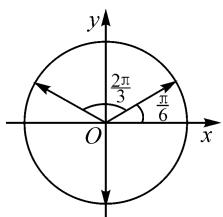

# 一道优美的三角恒等变换试题引发的思考

# ● 广西柳州高级中学 尹樱桦

《普通高中数学课程标准(2017年版2020年修订)》(以下简称“课标”)指出,通过高中数学课程的学习,学生能进一步发展数学运算能力;通过运算促进数学思维发展,形成规范化思考问题的品质,养成一丝不苟、严谨求实的科学精神.在数学竞赛和强基计划的试题中,有不少优美的三角恒等式题的相关数学运算,运算是促进数学思维发展的沃土,在它的教学中,教师引导学生站在学科整体和审美价值的高度上,对三角恒等变换做好探究和实践,既可以培养学生的大局观,又能让学生更好地把握数学本质,提升数学学科核心素养,还可为学生的可持续发展创造条件.

# 1 试题呈现

引例 已知 $\sin A + \sin B + \sin C = 0, \cos A + \cos B + \cos C = 0$ ，求证： $\cos^2 A + \cos^2 B + \cos^2 C = \frac{3}{2}$ .

思考:基于已知条件呈对偶形式,可考虑用对偶式的通法求解,移项后两式平方相加以及平方相减.

证明: $\sin A+\sin B=-\sin C,$ ①

$$
\cos A + \cos B = - \cos C. \tag {②}
$$

① $^{2}$ +② $^{2}$ ，得 $2+2\cos(A-B)=1$ .

所以 $\cos(A-B)=-\frac{1}{2}.$

② $^{2}$ -① $^{2}$ ，得 $\cos 2A + \cos 2B + 2\cos(A + B) = \cos 2C$ ，则 $2\cos(A + B)\cos(A - B) + 2\cos(A + B) = \cos 2C$ ，即 $\cos(A + B) = \cos 2C$ .

所以， $\cos^2 A + \cos^2 B + \cos^2 C = \frac{1}{2} (3 + \cos 2A + \cos 2B + \cos 2C) = \frac{3}{2} + \frac{1}{2} [2\cos (A + B)\cos (A - B) + \cos 2C] = \frac{3}{2} + \frac{1}{2} [2\cos 2C \times \left(-\frac{1}{2}\right) + \cos 2C] = \frac{3}{2}$ .

此题证法较多,这里先提供对偶式的常用处理方法,在两式平方相加变形的过程中得到 $\cos(A-B)=-\frac{1}{2}$ , 自然会联想到是 $\frac{2\pi}{3}$ 的余弦值. 结合图形思考, 如图 1, 利用单位圆中三角函数的定义, 三个角 A, B, C 之间构成等差数列, 公差 $d=\frac{2\pi}{3}$ , 由对称性不难理解为什么角 A, B, C 的正弦和与余弦和为 0 了. 但也引发了进一步的思考: 当角成等差数列时, 其正弦函数值的和、余弦函数值的和与公差的关系是什么?

text_image

y
2π/3
π/6
O
x

图1

# 2 结论

若等差数列的首项为 a，公差为 d，则

$$
\begin{array}{l} \sin a + \sin (a + d) + \dots + \sin [ a + (n - 1) d ] = \\ \frac {\sin \frac {n d}{2}}{\sin \frac {d}{2}} \sin \left(a + \frac {n - 1}{2} d\right); \\ \cos a + \cos (a + d) + \dots + \cos [ a + (n - 1) d ] = \\ \frac {\sin \frac {n d}{2}}{\sin \frac {d}{2}} \cos \left(a + \frac {n - 1}{2} d\right). \\ \end{array}
$$

# 3 结论的两种常见证明方法

结论中正、余弦函数式子是对偶式，选择与正、余弦函数相关且有对称结构的定理，所以关于它的证明通常有两种通法，一种是利用积化和差与和差化积公式，一种是利用欧拉定理.

证法 1: 所求式子 $\sin a + \sin(a + d) + \cdots + \sin[a + (n - 1)d]$ 记为 $S_{n}$ ，将其每一项都乘 $\sin\frac{d}{2}$ ，这样每一项都可以积化和差，则有

$$
\sin a \sin \frac {d}{2} = \frac {1}{2} \left[ \cos \left(a - \frac {d}{2}\right) - \cos \left(a + \frac {d}{2}\right) \right],
$$

$$
\sin (a + d) \sin \frac {d}{2} = \frac {1}{2} \left[ \cos \left(a + \frac {d}{2}\right) - \cos \left(a + \frac {3 d}{2}\right) \right],
$$

$$
\sin (a + 2 d) \sin \frac {d}{2} = \frac {1}{2} \left[ \cos \left(a + \frac {3 d}{2}\right) - \cos \left(a + \frac {5 d}{2}\right) \right],
$$

$$
\dots\dots
$$

$$
\sin [ a + (n - 1) d ] \sin \frac {d}{2} = \frac {1}{2} \left[ \cos \left(a + \frac {2 n - 3}{2} d\right) - \right.
$$

$$
\left. \cos \left(a + \frac {2 n - 1}{2}\right) d \right].
$$

将以上 n 个等式累加, 得

$$
\begin{array}{l} S _ {n} \cdot \sin \frac {d}{2} = \frac {1}{2} \left[ \cos \left(a - \frac {d}{2}\right) - \cos \left(a + \frac {2 n - 1}{2} d\right) \right] = \\ \sin \left(a + \frac {n - 1}{2} d\right) \sin \frac {n d}{2}. \\ \end{array}
$$

所以， $S_{n}=\frac{\sin\frac{nd}{2}}{\sin\frac{d}{2}}\sin\left(a+\frac{n-1}{2}d\right)$ ，即

$$
\sin a + \sin (a + d) + \dots + \sin [ a + (n - 1) d ] =
$$

$$
\frac {\sin \frac {n d}{2}}{\sin \frac {d}{2}} \sin \Bigl (a + \frac {n - 1}{2} d \Bigr).
$$

同样的方法也可以证明余弦的求和公式,即

$$
\cos a + \cos (a + d) + \dots + \cos [ a + (n - 1) d ] =
$$

$$
\frac {\sin \frac {n d}{2}}{\sin \frac {d}{2}} \cos \left(a + \frac {n - 1}{2} d\right).
$$

由于定理中正、余弦形式是对称的，联想到复数的三角形式，故可以利用欧拉定理，通过复数相等证明，这里为了更简洁表示角，选用 $\theta, 2\theta, 3\theta, \cdots, n\theta$ 这组构成等差数列的角。下面用欧拉公式分别求数列 $\cos \theta, \cos 2\theta, \cdots, \cos n\theta$ 及数列 $\sin \theta, \sin 2\theta, \cdots, \sin n\theta$ 的前 n 项和。（其中 $\theta \neq 2k\pi, k$ 为整数。）

证法 2: 由欧拉公式 $e^{ix} = \cos x + i \sin x$ ，得

$$
\begin{array}{l} (\cos \theta + \cos 2 \theta + \dots + \cos n \theta) + i (\sin \theta + \sin 2 \theta + \\ \dots + \sin n \theta) = (\cos \theta + \mathrm{i} \sin \theta) + (\cos 2 \theta + \mathrm{i} \sin 2 \theta) + \\ \dots + (\cos n \theta + \mathrm{i} \sin n \theta) = \mathrm{e} ^ {\mathrm{i} \theta} + \mathrm{e} ^ {\mathrm{i} 2 \theta} + \mathrm{e} ^ {\mathrm{i} 3 \theta} + \dots + \mathrm{e} ^ {\mathrm{i} n \theta} = \\ \mathrm{e} ^ {\mathrm{i} \theta} \frac {\mathrm{e} ^ {\mathrm{i} n \theta} - 1}{\mathrm{e} ^ {\mathrm{i} \theta} - 1} = \mathrm{e} ^ {\mathrm{i} \theta} \cdot \mathrm{e} ^ {- \mathrm{i} \frac {\theta}{2}} \frac {\mathrm{e} ^ {\mathrm{i} n \theta} - 1}{(\mathrm{e} ^ {\mathrm{i} \theta} - 1) \mathrm{e} ^ {- \mathrm{i} \frac {\theta}{2}}} = \mathrm{e} ^ {\mathrm{i} \frac {\theta}{2}} \frac {\mathrm{e} ^ {\mathrm{i} n \theta} - 1}{\mathrm{e} ^ {\mathrm{i} \frac {\theta}{2}} - \mathrm{e} ^ {- \mathrm{i} \frac {\theta}{2}}} = \\ \end{array}
$$

$$
\mathrm{e} ^ {\frac {\theta}{\mathrm{i} \frac {\theta}{2}}} \frac {\mathrm{e} ^ {\mathrm{i} n \theta - \frac {n}{2} \theta} - \mathrm{e} ^ {\mathrm{i} \frac {n \theta}{2}}}{\mathrm{e} ^ {\mathrm{i} \frac {\theta}{2}} - \mathrm{e} ^ {- \mathrm{i} \frac {\theta}{2}}} \cdot \mathrm{e} ^ {\mathrm{i} \frac {n \theta}{2}} = \frac {\mathrm{e} ^ {\mathrm{i} \frac {n \theta}{2}} - \mathrm{e} ^ {- \mathrm{i} \frac {n \theta}{2}}}{\mathrm{e} ^ {\mathrm{i} \frac {\theta}{2}} - \mathrm{e} ^ {\mathrm{i} \frac {\theta}{2}}} \cdot \mathrm{e} ^ {\mathrm{i} \frac {(n + 1) \theta}{2}} = \frac {\sin \frac {n \theta}{2}}{\sin \frac {\theta}{2}}.
$$

$$
\left[ \cos \frac {(n + 1) \theta}{2} + \mathrm{i} \sin \frac {(n + 1) \theta}{2} \right].
$$

由复数相等的条件,得

$$
\cos \theta + \cos 2 \theta + \dots + \cos n \theta = \frac {\sin \frac {n \theta}{2}}{\sin \frac {\theta}{2}} \cos \frac {(n + 1) \theta}{2};
$$

$$
\sin \theta + \sin 2 \theta + \dots + \sin n \theta = \frac {\sin \frac {n \theta}{2}}{\sin \frac {\theta}{2}} \sin \frac {(n + 1) \theta}{2}.
$$

# 4 结论的应用

学生在结论的证明过程中,对角间关系的理解会更深刻,更能领悟通过乘一个常量构建积化和差的化归思想,养成在三角函数运算中首先观察角间关系的习惯,有助于学生数学运算素养的培养.借助角构成等差数列后,其正弦函数值的和、余弦函数值的和与公差的关系,可以跳过和差化积与积化和差公式的应用处理,代入公式直接求和即可,使解题过程得到优化.

# 4.1 求和的应用问题

例1 求 $\cos \frac{2\pi}{7} + \cos \frac{4\pi}{7} + \cos \frac{6\pi}{7}$ 的值.

解: 角 $\frac{2\pi}{7}$ , $\frac{4\pi}{7}$ , $\frac{6\pi}{7}$ 构成公差为 $\frac{2\pi}{7}$ 的等差数列, 则

$$
\cos \frac {2 \pi}{7} + \cos \frac {4 \pi}{7} + \cos \frac {6 \pi}{7} = \frac {\sin \frac {3 \pi}{7}}{\sin \frac {\pi}{7}} \cos \frac {4 \pi}{7} =
$$

$$
\frac {\sin \frac {3 \pi}{7} \left(- \cos \frac {3 \pi}{7}\right)}{\sin \frac {\pi}{7}} = \frac {- \frac {1}{2} \sin \frac {6 \pi}{7}}{\sin \frac {\pi}{7}} = - \frac {1}{2}.
$$

应用结论易求得此题中余弦函数值的和,并且这个值是定值,自然会想到公差取某个特值时可以实现从特殊到一般的推广,因而进一步得到:

$$
\cos \frac {2 \pi}{2 n + 1} + \cos \frac {4 \pi}{2 n + 1} + \dots + \cos \frac {2 n \pi}{2 n + 1} = - \frac {1}{2};
$$

$$
\cos \frac {\pi}{2 n + 1} + \cos \frac {3 \pi}{2 n + 1} + \dots + \cos \frac {(2 n - 1) \pi}{2 n + 1} = \frac {1}{2}.
$$

对结论的不断探求让我们看到,当角的公差 $d=\frac{2\pi}{2n+1}$ 时,这 n 个余弦函数值的和为定值.迷人的构成等差数列的角,使得这种有对称性的求和变得容易了,因此如果题目中隐约有等差数列的角但又不够,我们可以给它对称配凑好,这就是下面例 2 这道强基题目解法思考的由来.

例 2 求 $\cos\frac{\pi}{13}+\cos\frac{3\pi}{13}+\cos\frac{9\pi}{13}$ 的值.

解: 先求 $\cos\frac{\pi}{13}+\cos\frac{3\pi}{13}+\cos\frac{5\pi}{13}+\cos\frac{7\pi}{13}+\cos\frac{9\pi}{13}+\cos\frac{11\pi}{13}$ 的值.

令 $x = \cos \frac{\pi}{13} +\cos \frac{3\pi}{13} +\cos \frac{9\pi}{13},y = \cos \frac{5\pi}{13} +$ $\cos \frac{7\pi}{13} +\cos \frac{11\pi}{13}$ ，则

$$
x + y = \frac {\cos \left(\frac {\pi}{1 3} + \frac {5}{2} \times \frac {2 \pi}{1 3}\right) \sin \left(\frac {6}{2} \times \frac {2 \pi}{1 3}\right)}{\sin \frac {\pi}{1 3}} =
$$

$$
\frac {\cos \frac {6 \pi}{1 3} \sin \frac {6 \pi}{1 3}}{\sin \frac {\pi}{1 3}} = \frac {\frac {1}{2} \sin \frac {1 2 \pi}{1 3}}{\sin \frac {\pi}{1 3}} = \frac {1}{2}.
$$

不好求 x-y 可先求 xy. 由积化和差公式, 得

$$
x \cdot \cos \frac {5 \pi}{1 3} = \cos \frac {\pi}{1 3} \cos \frac {5 \pi}{1 3} + \cos \frac {3 \pi}{1 3} \cos \frac {5 \pi}{1 3} + \cos \frac {9 \pi}{1 3} \cdot
$$

$$
\cos \frac {5 \pi}{1 3} = \frac {1}{2} \left[ \cos \frac {6 \pi}{1 3} + \cos \frac {4 \pi}{1 3} + \cos \frac {8 \pi}{1 3} + \cos \frac {2 \pi}{1 3} + \right.
$$

$$
\left. \cos \frac {1 4 \pi}{1 3} + \cos \frac {4 \pi}{1 3} \right],
$$

$$
x \cdot \cos \frac {7 \pi}{1 3} = \cos \frac {\pi}{1 3} \cos \frac {7 \pi}{1 3} + \cos \frac {3 \pi}{1 3} \cos \frac {7 \pi}{1 3} + \cos \frac {9 \pi}{1 3} \cdot
$$

$$
\cos {\frac {7 \pi}{1 3}} = \frac {1}{2} \left[ \cos {\frac {8 \pi}{1 3}} + \cos {\frac {6 \pi}{1 3}} + \cos {\frac {1 0 \pi}{1 3}} + \cos {\frac {4 \pi}{1 3}} + \right.
$$

$$
\left. \cos \frac {1 6 \pi}{1 3} + \cos \frac {2 \pi}{1 3} \right],
$$

$$
x \cdot \cos \frac {1 1 \pi}{1 3} = \cos \frac {\pi}{1 3} \cos \frac {1 1 \pi}{1 3} + \cos \frac {3 \pi}{1 3} \cos \frac {1 1 \pi}{1 3} +
$$

$$
\cos \frac {9 \pi}{1 3} \cos \frac {1 1 \pi}{1 3} = \frac {1}{2} \left[ \cos \frac {1 2 \pi}{1 3} + \cos \frac {1 0 \pi}{1 3} + \cos \frac {1 4 \pi}{1 3} + \right.
$$

$$
\left. \cos \frac {8 \pi}{1 3} + \cos \frac {2 0 \pi}{1 3} + \cos \frac {2 \pi}{1 3} \right].
$$

所以 $xy = \frac{1}{2}\left(3\cos \frac{2\pi}{13} + 3\cos \frac{4\pi}{13} + 2\cos \frac{6\pi}{13} + \right.$

$$
3 \cos {\frac {8 \pi}{1 3}} + 2 \cos {\frac {1 0 \pi}{1 3}} + \cos {\frac {1 2 \pi}{1 3}} + 2 \cos {\frac {1 4 \pi}{1 3}} + \cos {\frac {1 6 \pi}{1 3}} +
$$

$$
\left. \cos \frac {2 0 \pi}{1 3}\right) = \frac {1}{2} \left(3 \cos \frac {2 \pi}{1 3} + 3 \cos \frac {4 \pi}{1 3} + 2 \cos \frac {6 \pi}{1 3} - 3 \cos \frac {5 \pi}{1 3} - \right.
$$

$$
2 \cos \frac {3 \pi}{1 3} - \cos \frac {\pi}{1 3} - \cos \frac {3 \pi}{1 3} - \cos \frac {7 \pi}{1 3}) = \frac {1}{2} (- 3 \cos \frac {\pi}{1 3} +
$$

$$
3 \cos {\frac {2 \pi}{1 3}} - 3 \cos {\frac {3 \pi}{1 3}} + 3 \cos {\frac {4 \pi}{1 3}} - 3 \cos {\frac {5 \pi}{1 3}} + 3 \cos {\frac {6 \pi}{1 3}}) =
$$

$$
\frac {1}{2} \left[ - 3 \left(\cos \frac {\pi}{1 3} + \cos \frac {3 \pi}{1 3} + \cos \frac {5 \pi}{1 3}\right) + 3 \left(\cos \frac {2 \pi}{1 3} + \cos \frac {4 \pi}{1 3} + \right. \right.
$$

$$
\left. \cos \frac {6 \pi}{1 3}\right) ] = \frac {1}{2} \left[ - 3 \left(\cos \frac {\pi}{1 3} + \cos \frac {3 \pi}{1 3} - \cos \frac {4 \pi}{1 3}\right) + \right.
$$

$$
\left. 3 \left(- \cos \frac {1 1 \pi}{1 3} - \cos \frac {7 \pi}{1 3} - \cos \frac {5 \pi}{1 3}\right) \right] = \frac {1}{2} (- 3 x - 3 y) =
$$

$$
- \frac {3}{2} (x + y) = - \frac {3}{4}.
$$

又 x>0，所以由 $\left\{\begin{aligned}x+y&=\frac{1}{2},\\ xy&=-\frac{3}{4},\end{aligned}\right.$ 解得 $\left\{\begin{aligned}x&=\frac{1+\sqrt{13}}{4},\\ y&=\frac{1-\sqrt{13}}{4}.\end{aligned}\right.$

故 $\cos\frac{\pi}{13}+\cos\frac{3\pi}{13}+\cos\frac{9\pi}{13}=\frac{1+\sqrt{3}}{4}.$

# 4.2 由结论引申的一些二级结论及其应用

我们会求角构成等差数列时,其正弦函数值的和与余弦函数值的和,自然也能求可以转化成这样结构的式子的和.当公差 $d=\frac{2\pi}{n}$ 时,正弦函数值的平方和与余弦函数值的平方和的三角恒等式也非常优美.

若等差数列的首项为 $a$ ，公差为 $d = \frac{2\pi}{n}$ ，则

$$
\cos^ {2} a + \cos^ {2} \left(a + \frac {2 \pi}{n}\right) + \cos^ {2} \left(a + \frac {4 \pi}{n}\right) + \dots \dots +
$$

$$
\cos^ {2} \left[ a + \frac {2 (n - 1) \pi}{n} \right] = \frac {n}{2};
$$

$$
\sin^ {2} a + \sin^ {2} \left(a + \frac {2 \pi}{n}\right) + \sin^ {2} \left(a + \frac {4 \pi}{n}\right) + \dots \dots +
$$

$$
\sin^ {2} \left[ a + \frac {2 (n - 1) \pi}{n} \right] = \frac {n}{2}.
$$

证明: 设 $X=\cos^{2}a+\cos^{2}\left(a+\frac{2\pi}{n}\right)+\cos^{2}\left(a+\frac{4\pi}{n}\right)+$

$$
\dots + \cos^ {2} \left[ a + \frac {2 (k - 1) \pi}{n} \right], Y = \sin^ {2} a + \sin^ {2} \left(a + \frac {2 \pi}{n}\right) +
$$

$$
\sin^ {2} \left(a + \frac {4 \pi}{n}\right) + \dots + \sin^ {2} \left[ a + \frac {2 (k - 1) \pi}{n} \right].
$$

于是，可得 $X - Y = \sum_{k=1}^{n}\left\{\cos^2\left[a + \frac{2(k-1)\pi}{n}\right] - \right.$

$$
\left. \sin^ {2} \left[ a + \frac {2 (k - 1) \pi}{n} \right] \right\} = \sum_ {k = 1} ^ {n} \cos \left[ 2 a + \frac {4 (k - 1) \pi}{n} \right] = M.
$$

根据积化和差公式,可得

$$
2 \sin \frac {2 \pi}{n} \cos \left[ 2 a + \frac {4 (k - 1) \pi}{n} \right] = \sin \left(2 a + \frac {4 k - 2}{n} \pi\right) -
$$

$$
\sin \left(2 a + \frac {4 k - 6}{n} \pi\right).
$$

那么所求 $M$ 乘 $2\sin \frac{2\pi}{n}$ ，得

$$
2 \sin \frac {2 \pi}{n} \cdot M = 2 \sin \frac {2 \pi}{n} \sum_ {k = 1} ^ {n} \cos \left[ 2 a + \frac {4 (k - 1) \pi}{n} \right] =
$$

$$
\sum_ {k = 1} ^ {n} \left[ \sin \left(2 a + \frac {4 k - 2}{n} \pi\right) - \sin \left(2 a + \frac {4 k - 6}{n} \pi\right) \right] =
$$

$$
\sin \left(2 a + \frac {4 n - 2}{n} \pi\right) - \sin \left(2 a - \frac {2}{n} \pi\right) = \sin \left(2 a - \frac {2}{n} \pi + 4 \pi\right) -
$$

$$
\sin \left(2 a - \frac {2}{n} \pi\right) = 0.
$$

所以 M=0. 又 $X+Y=n$ ，所以 $X=Y=\frac{n}{2}$ .

(下转第127页)

法求数列通项与数列的和.作为高考复习课,在学生全面学习了高中数学内容的基础上,帮助学生体会知识间的内在联系,形成数学的整体观;巩固并应用相应的数学解题方法,解决相关的数学问题,形成一定的方法和技能.同时还引导学生更全面、深刻地领会数学思想,促进学生的数学理解,从而进一步发展学生的数学核心素养,挖掘数学潜能.

# 3 教学反思

# 3.1 重视问题引导

数学学科核心素养在学生与情境、问题的有效互动中得到提升。在教学活动中，应结合教学任务及其蕴含的数学学科核心素养设计合适的情境和问题，引导学生用数学的眼光观察现象、发现问题，使用恰当的数学语言描述问题，用数学的思想、方法解决问题。在问题解决的过程中，理解数学内容的本质，促进学生数学学科核心素养的形成和发展。

高三复习教学要注意因材施教、启发引导、师生互动，以及对学生思维能力的培养，要注重以问题引导来设计教学活动。用层层递进的提问，引导学生独立思考、合作探究，促使学生开阔解题思路，提高思维能力和逻辑推理能力.同时,要注意问题的设置及问题解决后的反思与总结.

# 3.2 重视教材回归

数学教材为“教”与“学”活动提供学习主题、基本线索和具体内容，是实现数学课程目标、发展学生数学学科核心素养重要的教学资源。

高考试题大多是在教材的基础上改编而来,无论它怎么变化,其根源都在教材中.高三复习课教学中,要确保学生熟悉教材,对教材中的定理、公式、例题等做到融会贯通、举一反三.复习中要以教材为主,教辅为次.

# 3.3 重视知识融合

高考作为选拔性考试,聚焦了学生对重要数学概念、定理、方法、思想的理解和应用,强调基础性、综合性,注重数学本质、通性通法,淡化解题技巧;融入数学文化.如本课引入的高考题,就是将概率和数列融合在一起.因此,高三复习教学不应该是单一知识点或问题的教学,应成为多知识点、多技能、多思维联系的教学.教学时应该注重引导学生对教材内容建立数学理论框架,整理知识的内部联系.Z

# (上接第111页)

将此结论应用到引例中，三个角 A, B, C 满足 $\sin A + \sin B + \sin C = 0, \cos A + \cos B + \cos C = 0$ ，变形得 $\cos(A - B) = -\frac{1}{2}$ ，进一步得到角 A, B, C 是公差为 $\frac{2\pi}{3}$ 的等差数列，又 n = 3，所以 $\cos^{2}A + \cos^{2}B + \cos^{2}C = \frac{3}{2}$ .

# 5 教学和育人启示

# 5.1 落实常规,夯实基础

这样的探究需要一定的恒心和代数功底才能实现,代数功底离不开日常教学中潜移默化的练习.数学学科核心素养是"四基"的继承与发展.教学中要引导学生理解基础知识,掌握基本技能,感悟数学基本思想,积累数学基本活动经验,促进学生数学学科核心素养的不断提升.

落实常规体现在运算中,肯定包括踏实地把通法应用到解题中,算完整,算到不能再算为止.这也就要求教师要有意识引导学生熟练掌握代数式的常规变形方法,总结一些通性通法,比如在三角函数恒等变换中关于对偶式的构造和变形等,进而拓展到更一般的情况,层次鲜明地逐步提升学生的运算能力,只有这样才能做到夯实基础.

# 5.2 开拓创新,提升美育

创新是推动人类社会发展的第一动力,数学学科是培养创新人才的沃土.课标指出数学学科可以促进学生思维能力、实践能力和创新意识的发展.就像学生经历上述这道题的不断探求的过程中,自然会体会到数学运算的简洁美和对称美,感悟数学学科的审美价值,他们看到不一样的“风景”同时也会激发他们去创造这样的“美”,不知不觉中数学学科素养和能力就得到进一步提升.所以教师在教学时,引导学生从特殊到一般,基于运算特征,对偶构造等多维度尝试变形实现以简驭繁,有利于培养学生发散和创新思维,也会拓宽他们的解题视野和思路,提升审美能力,奠定终身学习的基础.

“罗马不是一天建成的”，欣赏美、享受美也需要教师在数学课堂上进行潜移默化的渗透。这些有思维层次的强基计划和数学竞赛的题目更是把数学的简洁美和对称美体现得淋漓尽致，引导学生站在数学学科审美的高度上，把握知识本源，不断思考钻研，精益求精，能更好地培养学生坚韧的意志品质和求真求实的科学精神，为其终身学习创造条件。Z